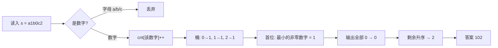

# T1 痛车车牌 / plate（CSP-J 第二轮模拟 · 第 1 套）

> 题面唯一来源：[`../problem.txt`](../problem.txt)（`== T1 痛车车牌 / plate ==` 一节）；整卷可读版 [`../paper.md`](../paper.md)。
> 本题知识点对齐真题 **CSP-J 2025 T1 拼数（洛谷 P14357）**，但那题拼**最大**数，本题拼**最小**数。

## 元信息

| 项目 | 内容 |
| --- | --- |
| 难度 | 入门（模拟卷 T1，对应 100 分） |
| 来源 | 自编仿真题（非真题），对齐 CSP-J 2025 T1 |
| 标签 | 贪心、计数（值域只有 10 个桶）、字符串处理 |
| 时间复杂度 | O(\|s\| + 答案长度) = O(\|s\|) |
| 空间复杂度 | O(\|s\|)（存输入串 + 10 格计数桶） |
| 评测状态 | 未本地评测（模拟卷无 OJ）；本机与 `brute.cpp` 随机对拍 5000 组全部一致，样例与极限数据见下 |

## 题目大意

一串混乱字符里混着小写字母和数字，把**所有数字字符**各用一次，重排成一个**没有前导零**的正整数，要求这个数**尽可能小**。

- 输入：一行字符串 $s$，只含小写字母和数字
- 输出：一行一个正整数（按字符串输出，不能当整数存）
- 数据范围：$1 \le |s| \le 10^6$，保证至少含一个 `1`—`9` 的数字（所以答案一定存在）
- 术语先解释一遍：**前导零**指一个数的最高位是 0，例如 `012`，它实际等于 `12`，不算合法的正整数写法。

本机实测（`g++ -static -O2 -std=c++14 solution.cpp -o /tmp/s1t1.exe`，输入用文件喂）：

| 输入 | `solution.cpp` 输出 | `brute.cpp` 输出 |
| --- | --- | --- |
| `a1b0c2` | `102` | `102` |
| `x000y5` | `5000` | `5000` |
| `9z8k7` | `789` | `789` |
| `0000007` | `7000000` | — |
| `zzz1` | `1` | — |

## 思路推导

### 1. 暴力想法与瓶颈

最直觉的做法：把数字全挑出来，枚举所有排列，跳过首位是 `0` 的，取最小的那个。`brute.cpp` 就是这么写的（`sort` 之后反复 `next_permutation`）。

排列数是**阶乘**级别的，实测很能说明问题（同一台机器，同一份 `brute.cpp`）：

| 数字串 | 不同排列数 | 暴力耗时 | 正解耗时 |
| --- | --- | --- | --- |
| `0123456789` | 3 628 800 | 0.095 s | 0.044 s |
| `112233445566` | 7 484 400 | 0.095 s | 0.031 s |
| `11223344556677` | 681 080 400 | 6.738 s | 0.046 s |
| `102030405060708090` | 17 643 225 600 | 跑满 25 s 未结束（被 `timeout` 杀掉，退出码 124） | 0.046 s 内出解 `100000000023456789` |

瓶颈有两层：一是**枚举手无寸功**，本题数字个数最多可达 $10^6$；二是**存不下**，$10^6$ 位的数远超 `long long` 的 19 位，必须当字符串处理。

### 2. 关键观察

比较两个正整数只有两步：先看位数，位数少的更小；位数相同才逐位比。本题**必须把所有数字都用上**，所以位数已经定死了（等于数字个数），于是只剩一件事：把小的数字往高位放。

- **观察 A（首位特殊）**：首位不能是 `0`，为了让数最小，首位应取**存在的最小非零数字**。题目保证 `1`—`9` 至少出现一次，所以这一步总能做。
- **观察 B（其余位升序，且 0 紧跟首位）**：首位定下后，剩下的位越小越好，于是先放完所有的 `0`，再按 $1 \to 9$ 升序放。
- **观察 C（值域极小 → 不必真排序）**：数字只有 $0 \sim 9$ 十个种类，用 10 个计数器统计出现次数即可，一遍扫描就够，这招叫**计数排序**（不比较元素，只统计每个值出现几次再按值域输出）。

### 3. 算法设计

1. 按字符串读入 $s$（**不要**读成整数）。
2. 扫一遍，凡是数字就 `cnt[c - '0']++`；字母直接丢掉。
3. 从 $d=1$ 到 $9$ 找到第一个 `cnt[d] > 0$ 的 $d$，输出它，并 `cnt[d]--`（这用掉了那个最小非零数字）。
4. 输出 `cnt[0]` 个 `0`。
5. 对 $d=1 \dots 9$，依次输出 `cnt[d]` 个字符 $d$，最后换行。

`贪心`（每个位置只问一句"当前放什么最小"，且不回头改）在这里之所以安全，是因为位长固定、每一位的权重互不相同，见下面第 4 节。

### 4. 正确性说明

**引理 1（必须用满所有数字）**：题面要求"把所有数字各用一次"，任何合法答案的位数都是固定的 $D$ 个，所以不用比较"少用几个数字是否更小"这种分支——本题不存在"位数取舍"，只在同位数内排序。

**引理 2（首位取最小非零数字）**：设两种合法拼法首位分别为 $a < b$，其余位无论怎么排，第一个数的值 $\le a \cdot 10^{D-1} + (10^{D-1} - 1) < b \cdot 10^{D-1} \le$ 第二个数，故首位越小整体越小，$a$ 必须取可用的最小非零数字。

**引理 3（其余位升序）**：固定首位后，考虑第 $i, i+1$ 位（权重 $10^{D-i}$、$10^{D-i-1}$）。若前面比后面大（记作 $x > y$），交换这两位：原来贡献 $x \cdot 10^{D-i} + y \cdot 10^{D-i-1}$，交换后贡献 $y \cdot 10^{D-i} + x \cdot 10^{D-i-1}$，差为 $(x-y)\cdot 9 \cdot 10^{D-i-1} > 0$，即交换后更小，其余位不变。反复消除"前大后小"的相邻对（这种对数每次严格减少，所以一定会停），终态就是不降序列，即 $0$ 全部紧跟首位、其后 $1 \to 9$ 升序。$\blacksquare$

引理 2 + 引理 3 就是算法第 3—5 步，故输出即最小合法车牌号。

### 5. 复杂度分析

- 时间：扫描 $O(|s|)$，找首位 $O(10)$，输出 $O(D) \le O(|s|)$，合计 $O(|s|)$。本机满规模（$|s| = 10^6$）实测 **0.102 s**，`verify/RESULTS.md` 同一份数据记的是 106 ms；里面大部分是进程启动和 I/O，纯计算在 0.1 s 内。
- 空间：输入串 $O(|s|)$ + `cnt[10]`。

极限数据实测细节（数据就是 `../../verify.js` 里 set1/t1-plate 的 `perf` 生成器：固定种子 `rng(7)`，$10^6$ 个字符、其中数字个数在 $[5\times10^5,\ 9\times10^5]$ 里随机，末尾再补一个 `1`，最后 shuffle）：$|s| = 1000001$，数字共 **771 408** 个，`0…9` 各自出现 77 194、77 212、77 131、77 315、77 213、77 124、76 984、77 199、77 159、76 877 次；输出长度 **771 408** 位，开头是 `1`（最小的非零数字）后紧跟 77 194 个 `0`，结尾是 `…999`。同一份输入再用一份独立写法（另数一遍桶、按桶重拼整个答案串）逐字符比对，**与程序输出完全一致**。

## 可视化讲解



分步演示见同目录 [`visualization.html`](visualization.html)：逐字符看字母被剔除、10 个计数桶涨起来，再看"首位 → 零 → 升序"三段输出如何拼出答案，可以改输入串自己试。

## 讲解代码

完整逐段注释版见 [`solution.cpp`](./solution.cpp)，关键片段（讲课时只写这三段）：

```cpp
for (char c : s) {
    if (c >= '0' && c <= '9') cnt[c - '0']++;   // 过滤字母：少了这句就是本题第一大坑
}
int first = -1;
for (int d = 1; d <= 9; d++) if (cnt[d]) { first = d; break; }  // 首位取最小非零数字
putchar('0' + first); cnt[first]--;
for (int i = 0; i < cnt[0]; i++) putchar('0');  // 零必须紧跟首位，不能排在最前
for (int d = 1; d <= 9; d++)
    for (int i = 0; i < cnt[d]; i++) putchar('0' + d);
```

## 易错点与坑

- **忘过滤字母**：`s[i] - '0'` 对字母同样能算出数（`'e'-'0' = 53`），直接当下标就是越界写，属于未定义行为——可能"碰巧对"，也可能 RE 或输出乱码。
- **把答案当整数存**：$10^6$ 位，`long long` 只有 19 位，必须逐字符输出或存成字符串。
- **零放错位置**：拼**最大**数时零在末尾（真题 P14357 的做法），拼**最小**数时零要紧跟首位。两处方向相反，是最常见的混淆点。
- **首位找错**：应从 `1` 往 `9` 找最小的非零数字，而不是"随便第一个非零"，也不是全局最小（全局最小可能是 0）。
- **`putchar` / `cout` 与换行**：$10^6$ 次输出别用 `endl`（每次都 flush）；`'\n'` 即可。
- **题目保证帮了大忙**：至少一个 `1`—`9`，所以 `first` 一定不是 `-1`；若自己改数据去掉这个保证，`putchar('0' + (-1))` 会输出垃圾字符。

## 常见变式

| 变式 | 差异 | 对应题号 |
| --- | --- | --- |
| 拼最大数（真题原型） | 位数优先用满 + 全部降序，零落末尾，不需要"首位特殊处理" | P14357（CSP-J 2025 T1） |
| 拼最小数（本题） | 首位取最小非零数字，其余升序、零紧跟首位 | 本题 |
| 只允许用 k 个数字拼最小数 | 出现"位数取舍"，需先证明位数少一定更小，再决定丢哪些 | 讨论课练习 |
| 网格/座位定位类 | 同样"先定名次再算位置"的两步拆分思路 | P14358（CSP-J 2025 T2） |

## 一句话提炼（板书）

**位数固定时，"最小"就是"每一位都尽量小"：先在 1—9 里挑一个最小的当首位，再把所有 0 全部倒进第二位起，其余数字升序——值域只有 10 个桶，用计数代替排序。**
