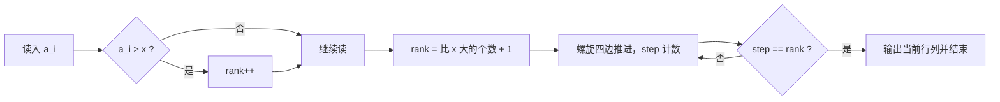

# T2 吧唧墙 / badge（CSP-J 第二轮模拟 · 第 1 套）

> 题面唯一来源：[`../problem.txt`](../problem.txt)（`== T2 吧唧墙 / badge ==` 一节）；整卷可读版 [`../paper.md`](../paper.md)。
> 知识点对齐真题 **CSP-J 2025 T2 座位（洛谷 P14358）**：都是"先定名次，再由名次算位置"的网格模拟题。

## 元信息

| 项目 | 内容 |
| --- | --- |
| 难度 | 普及-（模拟卷 T2） |
| 来源 | 自编仿真题（非真题），对齐 CSP-J 2025 T2 |
| 标签 | 网格模拟、顺时针螺旋、排序与定位 |
| 时间复杂度 | $O(nm)$ |
| 空间复杂度 | $O(1)$（边读边数，不存数组） |
| 评测状态 | 未本地评测（模拟卷无 OJ）；本机与 `brute.cpp` 随机对拍 5000 组全部一致 |

## 题目大意

$n$ 行 $m$ 列的墙，$n \times m$ 枚吧唧按**喜爱度从大到小**依次上墙，摆放位置沿**顺时针螺旋**（右→下→左→上，撞边界或已放过的格子就右转）一圈圈往里走。给定喜爱度 $x$，问它最终落在第几行第几列。

- 输入：第一行 $n, m, x$；第二行 $n \times m$ 个整数 $a_i$（第 $i$ 枚吧唧的喜爱度，互不相同，$x$ 一定出现）
- 输出：两个整数 $r, c$
- 数据范围：$1 \le n, m \le 30$，$1 \le a_i, x \le 10^9$
- 术语：**顺时针螺旋**就是从左上角出发，先贴着上边向右走满，再贴右边向下、下边向左、左边向上，走完一圈后边界各缩一格，继续同样的动作。

本机实测（`g++ -static -O2 -std=c++14 solution.cpp -o /tmp/s1t2.exe`）：

| 输入 | `solution.cpp` | `brute.cpp` |
| --- | --- | --- |
| `3 3 40` + `50 60 70 80 90 10 20 30 40` | `3 2` | `3 2` |
| `2 3 8` + `5 6 7 8 9 10` | `1 3` | `1 3` |
| `1 1 7` + `7` | `1 1` | — |
| `1 5 1` + `1 2 3 4 5` | `1 5` | — |
| `5 1 1` + `1 2 3 4 5` | `5 1` | — |
| `2 2 1` + `1 2 3 4` | `2 1` | `2 1` |
| `3 3 90` + `1 2 3 4 5 6 7 8 90` | `1 1` | — |

## 思路推导

### 1. 暴力想法与瓶颈

完全照题面做两件事（`brute.cpp`）：

1. 把 $(a_i, i)$ 按喜爱度**排序**，得到"第几名上墙"；
2. 拿一只隐形的笔在格子上走，`pos[r][c]` 记录第几步走过，撞墙或踩到走过的格子就**右转**，走到第 `rank` 步就输出。

这题 $nm \le 900$，所以暴力**并不会超时**：本机 30×30 随机数据实测 `solution.cpp` 0.033 s、`brute.cpp` 0.052 s（含进程启动）。瓶颈不在时间，而在**容易写错**：排序要开数组、方向数组要维护、"撞墙"和"已走过"两个条件要同时判、走过的格子要占空间。任何一步漏掉都是 WA，而且很难查。

于是本体的优化目标是：**少写、少存、少判**。

### 2. 关键观察

- **观察 A（只要名次，不要排序）**：我们只问喜爱度为 $x$ 的那一枚。因为所有喜爱度**互不相同**，"$x$ 是第几名"就等于"**比 $x$ 大的有几个** $+ 1$"。读入时一个 `if (a > x) rank++` 就够，数组都不用存。
- **观察 B（位置只跟 $n, m, k$ 有关）**：螺旋的第 $k$ 个格子和数据内容无关，所以可以"边走边数"，数到第 `rank` 个立刻输出并 `return`，**不需要铺满整面墙**，也不需要 `pos` 数组。
- **观察 C（按圈收缩最好写）**：用四条边界 `top / bot / lft / rgt` 表示"还没填的矩形"，每圈依次走 上边→右边→下边→左边，走完一条就把对应边界往里挪一格。
- **观察 D（退化情形）**：$n = 1$ 或 $m = 1$（子任务 1—4，20 分）时螺旋退化成一条直线，第 $k$ 个位置就是 $(1, k)$ 或 $(k, 1)$，实测 `1 5 1` → `1 5`、`5 1 1` → `5 1`，与直觉一致。

### 3. 算法设计

```
rank = 1
读 n, m, x；读 nm 个数，每读一个 a：若 a > x 则 rank++
top = 1, bot = n, lft = 1, rgt = m, step = 0
while 还有格子没走 (top <= bot && lft <= rgt):
    走第 top 行 lft..rgt（向右）：step++，命中 rank 就输出 top, j
    top++
    走第 rgt 列 top..bot（向下）：step++，命中就输出 i, rgt
    rgt--
    if top <= bot:  走第 bot 行 rgt..lft（向左）；bot--
    if lft <= rgt:  走第 lft 列 bot..top（向上）；lft++
```

后两条边前的 `if` 是关键：矩形只剩一行或一列时，走完上边/右边就已经把这一圈吃光了，不再判就会把同一行/列**再数一遍**。

### 4. 正确性说明

**引理 1（名次公式）**：摆放顺序是喜爱度严格降序，且喜爱度两两不同，所以"喜爱度为 $x$ 的吧唧第几个上墙"= $1 + |\{i : a_i > x\}|$。没有并列，不需要讨论稳定顺序。

**引理 2（螺旋枚举正确）**：对 while 循环归纳，维护不变式——每轮循环开始时，未填格子恰是矩形 $[top..bot] \times [lft..rgt]$，且下一个该填的格子是 $(top, lft)$。四条边依次覆盖该矩形的整条上边、整条右边、整条下边、整条左边，顺序正是"右→下→左→上"；覆盖后对应边界内缩一格，剩下的仍是矩形，且下一圈的起点 $(top, lft)$ 未被填过。当矩形退化成一行时，上边已把它走完，`top++` 使 `top > bot`，后续三条边被循环条件和 `if` 全部挡掉；退化成一行时同理。因此 `step` 每次恰好加一，按题面顺序**不重不漏**地枚举所有 $nm$ 个格子，第 $k$ 次自增时所在的格子就是螺旋第 $k$ 个位置。$\blacksquare$

由引理 1、2，程序在 `step == rank` 时打印的 $(r, c)$ 即所求。

### 5. 复杂度分析

- 时间：读入 $O(nm)$，螺旋最多走到第 `rank` $\le nm$ 步，合计 $O(nm) \le 900$ 次操作。
- 空间：只用了 6 个整型变量，$O(1)$；暴力版需要 $O(nm)$ 的 `pos` 数组。

## 可视化讲解



分步演示见同目录 [`visualization.html`](visualization.html)：默认载入样例 1，格子按螺旋顺序逐个点亮，右侧同时显示"名次 → 位置"的对照与当前四条边界 `top/bot/lft/rgt` 的收缩过程。

## 讲解代码

完整逐段注释版见 [`solution.cpp`](./solution.cpp)，关键片段：

```cpp
long long rank = 1;                       // 观察 A：只数比 x 大的个数
for (int i = 1, tot = n * m; i <= tot; i++) {
    long long a; scanf("%lld", &a);       // 不存数组，边读边数
    if (a > x) rank++;
}
int top = 1, bot = n, lft = 1, rgt = m, step = 0;
while (top <= bot && lft <= rgt) {
    for (int j = lft; j <= rgt; j++) if (++step == rank) { printf("%d %d\n", top, j); return 0; }
    top++;
    for (int i = top; i <= bot; i++) if (++step == rank) { printf("%d %d\n", i, rgt); return 0; }
    rgt--;
    if (top <= bot) { /* 下边：从 rgt 走到 lft */ bot--; }   // 这两个 if 防重复
    if (lft <= rgt) { /* 左边：从 bot 走到 top */ lft++; }
}
```

## 易错点与坑

- **白白排序**：把 $(a_i, i)$ 存进数组再 `sort`，本题能过，但多写十几行还容易在"名次对应哪一枚"上出错。抓准"只要名次"就能整段省掉。
- **后两条边忘记判空**：只剩一行时走完上边就该收工，不判 `top <= bot` 会把这一行重复数一遍，输出的位置偏到上一圈去。
- **转向条件少一半**：`brute.cpp` 里判断的是"越界 **或** 已走过"，只写越界会在圈与圈之间撞进已填的格子。
- **下标从 0 还是从 1**：题面问"第几行第几列"，输出必须 1 起；`pos` 数组若从 0 起要记得 $+1$。
- **数据别当小整数**：$a_i, x \le 10^9$，用 `int` 勉强够（$2.1\times10^9$），但 $n \times m$ 与名次建议 `long long` 或至少确认 $900$ 内不溢出。
- **$a_i$ 顺序 ≠ 位置**：第二行第 $i$ 个数是"第 $i$ 枚吧唧"的喜爱度，与它在墙上的位置无关，位置完全由喜爱度大小决定。

## 常见变式

| 变式 | 差异 | 对应题号 |
| --- | --- | --- |
| 座位（真题原型） | 按成绩降序沿**列**蛇形填充，名次 → (列, 行) 用整除与奇偶直接算，不用模拟 | P14358（CSP-J 2025 T2） |
| 本题 | 名次 → 位置走**顺时针螺旋**，用边界收缩模拟 | 本题 |
| 只问第 $k$ 名的格子（不给 $x$） | 省掉数名次这一步，直接走 $k$ 步 | 本题简化版 |
| 拼数 / 排序定位类 | 同样是"先确定次序，再算贡献"的两步拆分 | P14357（CSP-J 2025 T1） |

## 一句话提炼（板书）

**问的是"某一个人坐哪儿"，就不要真的排序铺桌子：先数出他第几名（比它大的个数 + 1），再让螺旋只走到第几名就停——模拟题省下的每一步存储，都是少写的一处 bug。**
