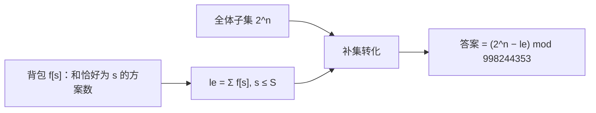

# T4 二创投稿 / clip（CSP-J 第二轮模拟 · 第 1 套）

> 题面唯一来源：[`../problem.txt`](../problem.txt)（`== T4 二创投稿 / clip ==` 一节）；整卷可读版 [`../paper.md`](../paper.md)。
> 知识点对齐真题 **CSP-J 2025 T4 多边形（洛谷 P14360）**：补集转化 + 计数型 01 背包。

## 元信息

| 项目 | 内容 |
| --- | --- |
| 难度 | 提高-（模拟卷 T4） |
| 来源 | 自编仿真题（非真题），对齐 CSP-J 2025 T4 |
| 标签 | 计数型 01 背包、补集转化、取模运算 |
| 时间复杂度 | $O(n \cdot \min(S, sum))$，最坏 $300 \times 90000 = 2.7 \times 10^7$ |
| 空间复杂度 | $O(\min(S, sum))$ |
| 评测状态 | 未本地评测（模拟卷无 OJ）；本机与 `brute.cpp` 随机对拍 5000 组一致，另用 Python 精确大数 DP 独立核对 3 组中等数据 |

## 题目大意

$n$ 段素材，第 $i$ 段长 $a_i$ 秒，每段最多用一次；两个方案不同 ⇔ 选出的**集合**不同（拼接顺序不算）。问总时长**严格大于** $S$ 的方案数，对 $998244353$ 取模。

- 输入：第一行 $n, S$；第二行 $n$ 个正整数 $a_i$
- 输出：一个整数（模 $998244353$）
- 数据范围：$1 \le n \le 300$，$1 \le a_i \le 300$，$0 \le S \le 90000$，记 $sum = \sum a_i \le 90000$
- 术语：**01 背包**指每件物品只有"选/不选"两种状态的背包问题；这里是**计数型**（求方案数而不是最值）。**补集转化**指"要求的集合不好数，就先数全集，再减掉不要求的部分"。

本机实测（`g++ -static -O2 -std=c++14 solution.cpp -o /tmp/s1t4.exe`）：

| 输入 | `solution.cpp` | `brute.cpp` |
| --- | --- | --- |
| `3 3` + `1 2 3` | `3` | `3` |
| `4 5` + `2 2 2 2` | `5` | `5` |
| `3 0` + `1 2 3` | `7` | `7` |
| `2 0` + `1 1` | `3` | `3` |
| `1 5` + `3` | `0` | — |
| `300 89999` + 300 个 `300` | `1` | — |
| `300 90000` + 300 个 `300` | `0` | — |

## 思路推导

### 1. 暴力想法与瓶颈

$n \le 20$ 时可以直接枚举 $2^n$ 个二进制掩码（`brute.cpp` 的写法）。本机实测它的**指数墙**：

| $n$（$a_i \equiv 1$，$S = \lfloor n/2 \rfloor$） | 暴力耗时 |
| --- | --- |
| 20 | 0.111 s |
| 22 | 0.247 s |
| 24 | 0.941 s |
| 25 | 1.853 s |

每多一段素材时间**翻倍**，$n = 300$ 时是 $2^{300} \approx 2 \times 10^{90}$，永远跑不完。顺带说清两个实现事实：`brute.cpp` 的数组只开到 `a[25]`、掩码是 `int`，所以它**最多只能吃 $n \le 25$ 的数据**，喂 $n = 300$ 会越界；它输出的是"精确值取模"，只适合小数据对拍。

### 2. 关键观察

- **观察 A（数反面）**：直接数"和 $> S$"要把背包开到 $sum$ 那么大；而"和 $\le S$"只需要开到 $S$。全集大小是现成的 $2^n$（每段素材独立地选或不选），于是
  $$\text{答案} = 2^n - \bigl|\{\text{子集：和} \le S\}\bigr|$$
  这就是补集转化。$S \ge sum$ 时答案直接是 0（题面子任务 12—14，15 分白送）。
- **观察 B（计数型背包）**：设 $f[s]$ = 凑出总时长**恰好** $s$ 秒的方案数。逐段素材转移：$f[s] \mathrel{+}= f[s - a_i]$，**内层 $s$ 从大到小**——倒序保证 $f[s - a_i]$ 还是"没考虑第 $i$ 段"的旧值，一段素材不会被重复使用（正序就变成"每段可以用无数次"的完全背包了）。初值 $f[0] = 1$（一段都不选）。
- **观察 C（上界取小）**：背包只需开到 $\lim = \min(S, sum)$，超过 $sum$ 的和根本凑不出来。
- **观察 D（模数）**：$998244353$ 是质数（约 $10^9$），全程只有加法与减法：加法用 `if (x >= MOD) x -= MOD` 一次即可（两个小于模数的数相加不超过 $2 \times 10^9$，仍在 `int`/`long long` 安全范围内）；最后的减法要 `(all - le + MOD) % MOD` 防负数。本题**不需要**逆元或快速幂（$n \le 300$，循环乘 2 即可）。

### 3. 算法设计

1. 读入并累加出 $sum$。若 $S \ge sum$：输出 `0` 结束。
2. $\lim = \min(S, sum)$，$f[0] = 1$，其余为 0。
3. 对每段素材 $i$：`for s = lim down to a[i]: f[s] = (f[s] + f[s - a[i]]) % MOD`。
4. $le = \sum_{s=0}^{\lim} f[s]$（这就是"和 $\le S$"的方案数，含空集）。
5. $all = 2^n \bmod MOD$（循环乘 2）。输出 $(all - le + MOD) \bmod MOD$。

样例 1（`3 3 / 1 2 3`）手推一遍，和程序输出对得上：

| 处理完 | $f[0]$ | $f[1]$ | $f[2]$ | $f[3]$ |
| --- | --- | --- | --- | --- |
| 起点 | 1 | 0 | 0 | 0 |
| $a_1 = 1$ | 1 | 1 | 0 | 0 |
| $a_2 = 2$ | 1 | 1 | 1 | 1 |
| $a_3 = 3$ | 1 | 1 | 1 | 2 |

$le = 1+1+1+2 = 5$，$all = 2^3 = 8$，答案 $= 8 - 5 = 3$ ✓（即 $\{1,3\}, \{2,3\}, \{1,2,3\}$）。

### 4. 正确性说明

**引理 1（补集划分）**：对任意子集 $T$，$\sum_{i \in T} a_i$ 与 $S$ 的关系只有"$\le S$"和"$> S$"两种，互斥且完备，故 $|\{>S\}| = 2^n - |\{\le S\}|$。空集的和为 $0 \le S$（$S \ge 0$），它同时属于全集与补集，相减后被完整剔除，符合"选 0 段素材进不了推荐池"。

**引理 2（背包计数不重不漏）**：对 $i$ 归纳。设 $f_i[s]$ 为只用前 $i$ 段素材、和恰为 $s$ 的子集数。按"第 $i$ 段选不选"把这类子集分成两半：不选的有 $f_{i-1}[s]$ 个，选的有 $f_{i-1}[s - a_i]$ 个（去掉第 $i$ 段后是前 $i-1$ 段中和为 $s - a_i$ 的子集，一一对应）。两半不相交且覆盖全部，故 $f_i[s] = f_{i-1}[s] + f_{i-1}[s - a_i]$。程序里 $s$ **倒序**枚举，使得计算 $f[s]$ 时 $f[s - a_i]$ 尚未被本轮更新，即仍等于 $f_{i-1}[s - a_i]$，因此一维数组精确实现了二维转移。$\blacksquare$

由引理 1、2，输出的 $(2^n - \sum_{s \le \lim} f[s]) \bmod MOD$ 即所求方案数。

### 5. 复杂度分析

- 时间：背包 $O(n \cdot \lim)$，$\lim = \min(S, sum) \le 90000$，最坏 $300 \times 90000 = 2.7 \times 10^7$ 次加法。本机实测最坏数据（$n=300$，$a_i \equiv 300$，$S = 89999$，$\lim = 89999$）**0.081 s**（另一次 0.065 s）；$S = 45000$ 时 0.064 s。求和与算 $2^n$ 各 $O(n + \lim)$，可忽略。
- 空间：$f[0..\lim]$，最坏 $90005$ 个 `int` 约 360 KB。

## 可视化讲解



分步演示见同目录 [`visualization.html`](visualization.html)，页面默认载入样例 1（`3 3` / `1 2 3`），也可以改上面两个输入框自己载入。**第一步**看 $f$ 表如何倒序更新：第 1 段素材逐格演示（紫色 = 正在写的 $s$，金色 = 被读的旧值 $s-a_i$），后面几段合并成"整行更新"一步，避免上百步；**第二步**把 $2^n$ 与 $le$ 并排相减得到答案，两步分开、互不混淆。右下角还有一块独立枚举 $2^n$ 个子集的互验面板，改数据后会立刻告诉你两种算法是否一致。

## 讲解代码

完整逐段注释版见 [`solution.cpp`](./solution.cpp)，关键片段：

```cpp
if (S >= sum) { puts("0"); return 0; }        // 观察 A：连全选都不够长
int lim = (int)min(S, sum);
f[0] = 1;                                     // 空集
for (int i = 1; i <= n; i++)
    for (int s = lim; s >= a[i]; s--) {       // 倒序！一段素材只能用一次
        f[s] += f[s - a[i]];
        if (f[s] >= MOD) f[s] -= MOD;
    }
long long le = 0;
for (int s = 0; s <= lim; s++) { le += f[s]; if (le >= MOD) le -= MOD; }
long long all = 1;
for (int i = 1; i <= n; i++) all = all * 2 % MOD;   // 2^n mod MOD
printf("%lld\n", (all - le + MOD) % MOD);
```

## 易错点与坑

- **把"严格大于"写成"大于等于"**：样例 1 里 $\{3\}$ 和 $\{1,2\}$ 的和正好是 3，不能算进答案；$S = 3$ 时若用 $\ge$ 会多数 2 个。程序里补集取到 $s \le S$（含 $s = S$）正是为此。
- **内层正序**：变成完全背包，同一段素材被用多次，答案偏大。
- **$f[0] = 1$ 忘了**：所有"恰好等于某段长度"的方案都会丢。
- **数组开小**：$\lim$ 可到 90000，`f` 至少开到 90005；`sum` 用 `long long` 累加更稳（$300 \times 300 = 90000$ 本身不溢出，但改成 $a_i \le 10^9$ 就炸）。
- **减法取模出负数**：`all - le` 可能为负，必须 `(all - le + MOD) % MOD`。本机实测 $n=300, a_i \equiv 300, S=45000$：$2^{300} \equiv 465147789$，$le \equiv 903759174$，差为负，加模后得 **559632968**。
- **提前返回不是可有可无的装饰**：$S \ge sum$ 时 $\lim = sum$，$le$ 会把所有 $f[s]$ 加完，结果同样是 0，但白跑一遍背包；判掉正好拿满子任务 12—14 的 15 分。

## 常见变式

| 变式 | 差异 | 对应题号 |
| --- | --- | --- |
| 多边形（真题原型） | 锚定最长边后，坏方案 = "另外两边之和 ≤ 最长边"，同样是补集 + 计数背包，只是要枚举锚点 | P14360（CSP-J 2025 T4） |
| 和恰好等于 $S$ 的方案数 | 直接输出 $f[S]$，不需要补集 | 本题退化版 |
| 和 $\le S$ 的方案数 | 输出 $le$ 本身 | 本题中间量 |
| $n \le 20$ 的子集计数 | 状压枚举 $2^n$，不需要背包 | `brute.cpp` 思路 |
| 前缀和/区间计数 | 也是"数反面"，但用尺取或哈希而非背包 | P14359（CSP-J 2025 T3） |

## 一句话提炼（板书）

**"严格大于 S"不好数就数它的反面：答案 = 2^n −（和 ≤ S 的方案数），后者是一维倒序的计数型 01 背包，最后别忘了减完要加回模数。**
