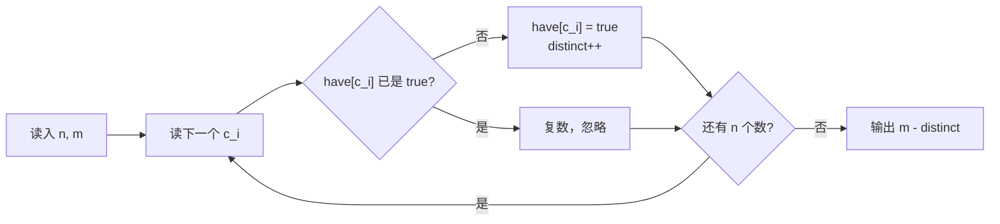

# T1 角色图鉴 / codex —— 去重统计

> 对齐真题：CSP-J 2024 第二轮 T1 扑克牌 <https://www.luogu.com.cn/problem/P11227>
> 本卷题面唯一来源：[`../problem.txt`](../problem.txt) 的 `== T1 角色图鉴 / codex ==` 段

## 元信息

| 项目 | 内容 |
| --- | --- |
| 难度 | 入门（本模拟卷 T1，满分 100） |
| 来源 | 自编 CSP-J 第二轮模拟卷第 2 套，非真题 |
| 标签 | 模拟、标记数组、去重统计 |
| 时间复杂度 | O(n + m) |
| 空间复杂度 | O(m) |
| 评测状态 | 未本地评测（无网络评测环境）；本机 2 组样例全对，与暴力版随机对拍 5000 组完全一致 |

## 题目大意

把题面翻译成人话，只剩一句：**数一数 `n` 次抽卡一共抽到过几种不同角色，用 `m` 减掉它。**

- 输入：第一行两个整数 `n`、`m`；第二行 `n` 个整数 `c_1 … c_n`，每个都在 `1..m`。
- 输出：一行一个整数 = 还缺几种角色。
- 数据范围：`1 ≤ n ≤ 10^6`，`1 ≤ m ≤ 10^6`，`1 ≤ c_i ≤ m`。
- 「运气假设成最好」这句话的作用：以后每次都能精准抽到缺的角色，所以"还缺几种"就等于"还要抽几次"，不用考虑重复。

**去重**（第一次出现的值才计入，后面再出现同值就不算）就是本题唯一要做的操作。

样例实测（本机 `g++ -static -O2 -std=c++14` 编译后运行）：

| 输入 | 程序输出 | 说明 |
| --- | --- | --- |
| `5 8` / `1 2 2 3 1` | `5` | 出现过 `{1,2,3}` 共 3 种，`8-3=5` |
| `3 3` / `1 2 3` | `0` | 3 种全齐 |
| `1 1` / `1` | `0` | 边界：只有一个角色且已抽到 |
| `7 3` / `1 1 1 1 1 1 1` | `2` | 抽 7 次只点亮 1 种，`3-1=2` |
| `1 1000000` / `500000` | `999999` | 边界：`m` 很大但只抽到 1 种 |

## 思路推导

### 1. 暴力想法与它的瓶颈

**暴力 A（最直觉）**：逐个检查"角色 `1`、角色 `2`、……、角色 `m`"有没有在序列里出现过。
做法是对每个角色 `r` 把整条序列从头扫一遍，找到就停。这需要 `m` 轮、每轮最多 `n` 次比较，即 `O(n·m)`。
**去重**在这里体现为"只问存在性，不问出现几次"。

本机实测这一版（临时写的 `t1naive.cpp`，答案与正解完全一致，只是慢）。
注意随机数据里大部分角色很早就被 `break` 掉，看不出真实增长，所以**故意构造最坏数据**：`n = m`，且 `c_i` 全部等于 `1`。这样角色 `2..m` 一个都没出现，每个都要把整条序列扫到底，正好打满 `n·m` 次比较。
计时取 bash 内置 `time` 的 `real`：

| `n = m` | 比较次数 `≈ n·m` | 暴力 A 耗时 | 正解耗时 | 两者输出 |
| --- | --- | --- | --- | --- |
| 8 000 | 6.4×10^7 | 0.135 s | 0.06 s 量级 | `7999` |
| 16 000 | 2.6×10^8 | 0.216 s | 0.06 s 量级 | `15999` |
| 32 000 | 1.0×10^9 | 0.542 s | 0.06 s 量级 | `31999` |
| 100 000 | 1.0×10^10 | **4.022 s** | **0.171 s** | `99999` |

`32000 → 100000` 规模涨 `3.125` 倍，暴力 A 的耗时涨 `4.022/0.542 ≈ 7.4` 倍；扣掉本机约 `0.09 s` 的进程启动开销后是 `8.5` 倍，而 `3.125² = 9.8`——**这就是 `O(n²)` 的斜率**。
外推到题面最坏情况 `n = m = 10^6`（规模再 ×10）：`10^12` 次比较，**要跑上千秒，必定超时**。瓶颈很清楚：同一条序列被反复扫了 `m` 遍。
正解在同一份 `n = m = 10^6` 最坏数据上仍是 `O(n)` 一遍扫，从不卡住。

**暴力 B（仓库里的 `brute.cpp`）**：先把 `n` 个数读进数组，`sort` 排序后用 `unique` 去掉相邻重复，剩下的个数就是"出现过的种类数"。
复杂度 `O(n log n)`。本机在同一份 `n = m = 10^6` 数据（`verify.js` 的 `rng(17)` 生成器）上实测 `0.583 s / 0.541 s / 0.596 s`，输出 `368068`，和正解一致。
**这一版其实也不会超时**，它只是慢一个 `log` 常数、写法更绕。所以本题的真正教学价值不在"卡掉暴力"，而在体会**标记数组**这一手有多直接。

### 2. 关键观察

- **观察 A：值域很小且已知。** `1 ≤ c_i ≤ m ≤ 10^6`，角色的编号正好是 `1..m` 的连续整数，可以直接当数组下标用。
- **观察 B：只关心"有没有"，不关心"几次"。** 于是每个角色只需一个 `true/false`，这就是**标记数组**：开一个 `bool have[m+1]`，`have[x]` 表示"角色 `x` 抽到过没有"。
- **观察 C：一次扫描就够。** 读入第 `i` 个数时，若 `have[c_i]` 还是 `false`，就把它置 `true` 并把"种类数"加一。已经 `true` 的直接忽略——这正是"复数不算"。
- **观察 D：答案不用搜索。** 缺的种数 `= m - 已有种数`，一次减法。

**时间复杂度**（第一次出现，解释一句）：指程序里基本操作的次数随输入规模怎么增长，`O(n)` 表示规模翻倍耗时约翻倍。

### 3. 算法设计

1. 开全局数组 `bool have[1000005]`。放**全局**是为了初始值自动全 `false`，不用手写清零；放在函数里则是一堆随机值，会算错。
2. 读 `n`、`m`。`distinct = 0`（记录已点亮的种类数）。
3. 循环 `n` 次读入 `c`：
   - `have[c] == false` → `have[c] = true`，`distinct++`；
   - 否则什么都不做。
4. 输出 `m - distinct`。

**对拍**（第一次出现，解释一句）：另外写一个思路完全不同的"暴力版"程序，用随机数据比较两者的输出，一致就认为正解可信。本题 `solution.cpp` 用标记数组，`brute.cpp` 用排序去重，思路互不相同，是标准的对拍组合。

### 4. 正确性说明

**引理 1（`distinct` 恰好等于不同角色数）**：循环不变量——处理完前 `i` 次抽卡后，`have[x]` 为 `true` 当且仅当 `x` 在 `c_1..c_i` 中出现过，且 `distinct` 等于这样的 `x` 的个数。
*归纳证明*：`i = 0` 时全 `false`、`distinct = 0`，成立。加入 `c_{i+1}`：若原本未出现过，则 `have` 翻真、`distinct` 加一，两边同时 +1；若已出现过，两边都不变。不变量保持。$\blacksquare$

**引理 2（输出即最优抽取次数）**：由引理 1，还缺 `m - distinct` 种。每抽一次最多点亮一种，所以至少要抽这么多次；而题面允许假设运气最好——每次都正好抽到缺的那种，`m - distinct` 次即可全部补齐。下界可达，故它就是答案。$\blacksquare$

### 5. 复杂度分析

- 时间：读入 `n` 次，每次 `O(1)`；输出 `O(1)`。共 `O(n)`（写 `O(n + m)` 是为了体现数组大小，实际遍历只到 `n`）。
- 空间：`bool have[10^6+5]` ≈ 1 MB，`O(m)`。
- 本机实测最大数据 `n = m = 10^6`（就是 `../../verify.js` 里 set2/t1-codex 的 `perf` 生成器：固定种子 `rng(17)`，`c_i` 在 `[1, m]` 均匀随机）：连续三次跑 `0.525 s / 0.499 s / 0.591 s`，输出 `368068`（`verify/RESULTS.md` 同一份数据记 532 ms）。其中绝大部分时间花在 `scanf` 读 `10^6` 个整数上，纯算法部分远小于此。
  用一份完全独立的统计（JS `Set` 直接去重，再按 `sort + unique` 复算一遍，两遍同为 `631932`）核对：`1000000 - 631932 = 368068`，与程序一致。

## 可视化讲解



交互式分步演示见同级目录 [`visualization.html`](visualization.html)（浏览器直接打开）。
默认载入样例 `5 8 / 1 2 2 3 1`，可以在输入框改成自己的数据：上方逐字符显示"第一次 / 复数"，中间是 `have[1..m]` 图鉴格子的点亮过程，下方是 `distinct` 与 `m - distinct` 的实时条形对比和代码行高亮。

## 讲解代码

完整带注释版见同目录 [`solution.cpp`](solution.cpp)，正文只贴核心：

```cpp
const int M = 1000005;
bool have[M];                       // 全局：自动初始化为 false，have[x] = 角色 x 是否已拥有

int distinct = 0;
for (int i = 1; i <= n; i++) {
    int c;
    scanf("%d", &c);
    if (!have[c]) {                 // 关键：只有第一次见到才计数
        have[c] = true;
        distinct++;
    }
}
printf("%d\n", m - distinct);
```

`if (!have[c])` 这一行是整道题的灵魂。写成 `have[c] = true; distinct++;`（不加判断）就会把"复数"也当成新角色，样例 1 会得到 `8-5=3` 而不是 `5`。

## 易错点与坑

- **忘记 `if (!have[c])` 判断**：最常见错误，等于没去重。
- **数组开在 `main` 里面**：局部 `bool have[M];` 不会自动清零，读到的是脏内存，结果随机。放全局（或手动 `memset(have, 0, sizeof have)`）。
- **下标越界**：`c_i` 可以到 `m = 10^6`，数组必须开到 `m + 1`（`10^6 + 5`），写成 `bool have[1000000]` 会在 `c_i = 10^6` 时越界。
- **`n` 和 `m` 谁减谁**：答案是 `m - distinct`，别写成 `n - distinct`。
- **`scanf` 与换行**：`n` 个数可能跨行，`scanf("%d")` 自动跳过空白，不用特殊处理；若改用 `cin` 记得 `ios::sync_with_stdio(false); cin.tie(nullptr);`，否则 `10^6` 次读入会明显变慢。
- **误以为要"模拟抽卡过程"**：题面里"运气最好"的假设已经把过程抹平了，只剩一次减法。

## 常见变式

| 变式 | 差异 | 对应题号 |
| --- | --- | --- |
| 扑克牌（本题对齐的真题） | 数"至少有几张牌能凑成一套"，同样靠标记/计数数组 | [P11227](https://www.luogu.com.cn/problem/P11227) |
| 出现次数最多的值 | 把 `bool have[]` 换成 `int cnt[]`，需要再扫一遍找最大值 | 同型改动 |
| 不同元素个数（区间查询版） | 单次询问变成区间询问，标记数组不再够用，需离线/树状数组 | 提高型改动 |
| 排序 + `unique` 去重 | 本题 `brute.cpp` 的写法，`O(n log n)`，值域未知时更通用 | 同型改动 |

## 一句话提炼

**值域小且只问"有没有"时，开一个标记数组一遍扫过去——去重的代价就是一次 `if`。**
