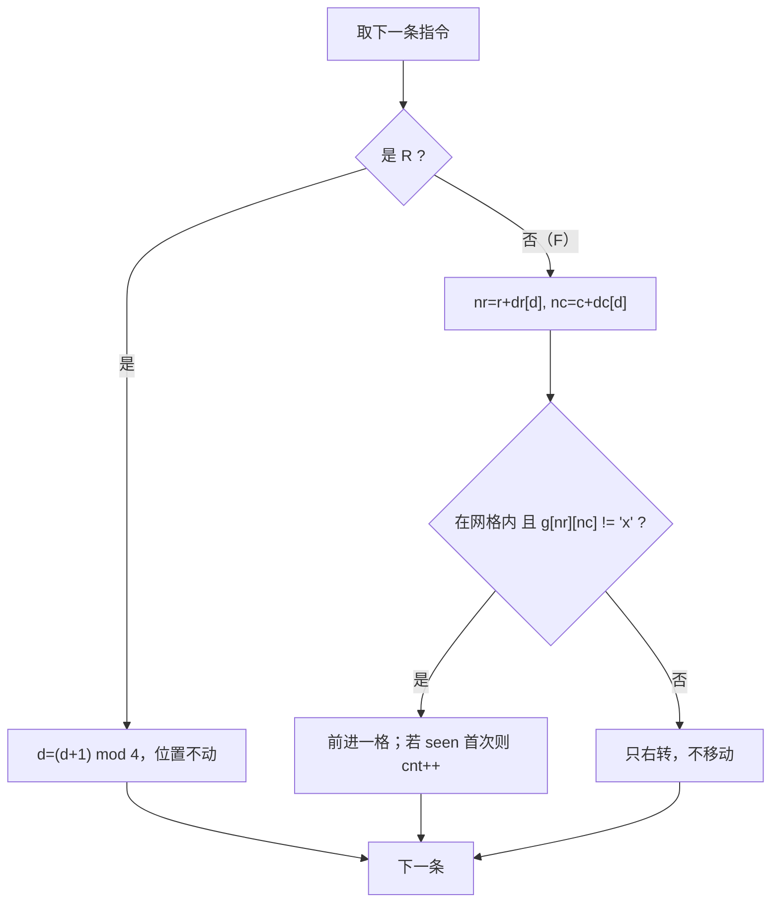

# T2 谷仓机器人 / robot —— 撞墙就右转的网格模拟

> 对齐真题：CSP-J 2024 第二轮 T2 地图探险 <https://www.luogu.com.cn/problem/P11228>
> 本卷题面唯一来源：[`../problem.txt`](../problem.txt) 的 `== T2 谷仓机器人 / robot ==` 段

## 元信息

| 项目 | 内容 |
| --- | --- |
| 难度 | 普及-（本模拟卷 T2，满分 100） |
| 来源 | 自编 CSP-J 第二轮模拟卷第 2 套，非真题 |
| 标签 | 模拟、网格、方向编码、标记数组 |
| 时间复杂度 | O(n·m + k) |
| 空间复杂度 | O(n·m) |
| 评测状态 | 未本地评测（无网络评测环境）；本机 2 组样例全对，与暴力版随机对拍 5000 组完全一致 |

## 题目大意

机器人在 `n × m` 的网格里照着一串指令走，**撞墙或撞货架就原地右转、这一步不走**。走完 `k` 条指令后，报出它的行、列、朝向，以及一路上踩过多少种不同的格子。

- 输入：`n m k`；`n` 行地图（`.` 空地、`x` 货架）；`r0 c0 d0` 出发位置与朝向；一行长度 `k` 的指令串（只有 `F` 和 `R`）。
- 输出：`r c d s` 四个整数。
- 朝向编码：`0` 东（列 +1）、`1` 南（行 +1）、`2` 西（列 -1）、`3` 北（行 -1）。
- 数据范围：`1 ≤ n, m ≤ 1000`，`1 ≤ k ≤ 10^6`，地图至少一个空格。
- 注意两个细节：**出发格也算走过**；同一个格子走多次只算一次。

**模拟**（第一次出现，解释一句）：不找任何数学规律，就按题目说的规则一步一步照做，程序里的状态和题目的状态严格同步。

### 样例实测（本机 `g++ -static -O2 -std=c++14` 编译运行，并用临时插桩版逐行打印）

样例 1 `3 3 5 / ... / .x. / ... / 1 1 0 / FFFRF` → 输出 `1 2 2 3`：

| 步 | 指令 | 发生了什么 | 位置 | 朝向 | 不同格子数 |
| --- | --- | --- | --- | --- | --- |
| — | 出发 | 出发格直接计入 | (1,1) | 0 东 | 1 |
| 1 | F | 走到 (1,2)，新格子 | (1,2) | 0 东 | 2 |
| 2 | F | 走到 (1,3)，新格子 | (1,3) | 0 东 | 3 |
| 3 | F | 目标 (1,4) 出界 → 右转不走 | (1,3) | 1 南 | 3 |
| 4 | R | 主动右转 | (1,3) | 2 西 | 3 |
| 5 | F | 回到 (1,2)，**老格子不加** | (1,2) | 2 西 | 3 |

样例 2 `3 3 6 / ..x / ... / x.. / 1 1 0 / FFFFFF` → 输出 `3 2 3 4`：
第 1 步到 (1,2)；第 2 步撞货架 (1,3) 右转成南；第 3、4 步走到 (3,2)；第 5 步目标 (4,2) 出界右转成西；第 6 步撞货架 (3,1) 右转成北。共踩 `(1,1)(1,2)(2,2)(3,2)` 四个不同格子。

## 思路推导

### 1. 暴力想法与它的瓶颈

本题**没有更聪明的算法**，正解本身就是模拟。真正的瓶颈只有一个：**"这个格子是不是走过" 这件事用什么容器判重。**

| 做法 | 判重容器 | 单次判重代价 | 本机在 `n=m=1000, k=10^6` 上的实测 | 输出 |
| --- | --- | --- | --- | --- |
| 暴力 A | `vector` 存所有走过的格子，每次线性扫 | O(s) | **5.651 s** | `275 436 1 74929` |
| 暴力 B（`brute.cpp`） | `set<pair<int,int>>`（红黑树，自动排序的集合） | O(log s) | 0.286 / 0.294 / 0.269 s | `275 436 1 74929` |
| 正解 | `bool seen[1005][1005]`（标记数组，下标即坐标） | O(1) | 0.192 / 0.167 / 0.160 s | `275 436 1 74929` |

三份代码答案完全相同，只有快慢差别。暴力 A 最慢是因为最后 `s ≈ 7.5 万` 个格子每次都要从头比一遍，`10^6 × 7.5×10^4 ≈ 7.5×10^10` 次比较。
另一个常见误区是"想去找指令串的周期"——`k` 只有 `10^6`，直接模拟完全够，**不要为了优化而优化**。

### 2. 关键观察

- **观察 A：`k` 就是循环次数。** `10^6` 次 `O(1)` 操作，一秒内轻松跑完，所以"照着做"是合法算法而不是暴力。
- **观察 B：朝向是一个 4 循环的量。** 右转一次就是 `d → (d+1) mod 4`，`3 → 0` 自然回到东。代码里写成 `(d + 1) & 3`（按位与 3，等价于 `% 4`，前提是 `d` 非负且只有 0~3 四个值）。
- **观察 C：位移查表。** 把四个朝向的行列增量按 `0,1,2,3` 的顺序排好：
  `dr[4] = {0, 1, 0, -1}`、`dc[4] = {1, 0, -1, 0}`，于是要往哪走就是 `(r + dr[d], c + dc[d])`，一行搞定，省掉四个 `if`。
- **观察 D：撞墙和撞货架是同一种情况。** 都归为"目标格不合法"，合法条件三件事同时成立：`1 ≤ nr ≤ n`、`1 ≤ nc ≤ m`、`g[nr][nc] != 'x'`。
- **观察 E：地图能整张开一张标记表。** `n·m ≤ 10^6`，`bool seen[1005][1005]` 约占 1 MB，判重降到 `O(1)`。
- **观察 F：撞了不移动。** 所以"位置"只被合法移动改变，"方向"被 `R`、`F` 撞墙两种情况改变——这两个必须分开写，不能合并成一个分支。

### 3. 算法设计

1. 读地图到 `g[1..n][1..m]`（下标从 1 开始，少写一堆 `-1`）。
2. 读 `r, c, d` 和指令串 `op`。
3. `seen[r][c] = true; cnt = 1;`（**出发格算走过**）。
4. 对 `t = 0 .. k-1`：
   - `op[t] == 'R'`：`d = (d + 1) & 3`，位置不变。
   - `op[t] == 'F'`：算 `nr = r + dr[d]`、`nc = c + dc[d]`。
     - 合法 → `r = nr; c = nc;` 若 `!seen[r][c]` 则置 `true` 且 `cnt++`。
     - 不合法 → 只 `d = (d + 1) & 3`，**位置保持不动**。
5. 输出 `r c d cnt`。

### 4. 正确性说明

用**循环不变量**（每次循环开始前断言一次性质，证明它每一步都保持）。

**不变量**：进入第 `t` 条指令前，`(r, c, d)` 与题目中机器人真实状态完全一致；`seen[x][y]` 为 `true` 当且仅当格子 `(x,y)` 是出发格或曾经到达过；`cnt` 等于 `seen` 里 `true` 的个数。

*基础*：`t = 0` 时按题面把机器人放在 `(r0,c0)`、朝向 `d0`，并把出发格标为已走、`cnt = 1`，成立。

*归纳*：设第 `t` 步前成立，看三种分支。
1. `R`：题目要求原地右转，代码只做 `d ← (d+1) mod 4`，`seen`/`cnt` 不动。右转是双射，`d` 仍与真实朝向一致。
2. `F` 且目标合法：题目要求前进一格，代码把 `(r,c)` 更新为 `(nr,nc)`；若该格首次到达才 `cnt++`，与"不同格子数"的定义一致。
3. `F` 且目标不合法（出界或货架）：题目要求"原地右转、这一步不移动"，代码正是只改 `d`、不碰 `r,c,seen,cnt`。

三种情况都保持不变量，故循环结束后 `(r,c,d)` 即最终状态、`cnt` 即走过的不同格子数。$\blacksquare$

**方向数组的正确性**：`d=0` 给 `(0,+1)` 是列 +1 即东；`d=1` 给 `(+1,0)` 是行 +1，而题面把行 +1 定义为南；`d=2` 给 `(0,-1)` 西；`d=3` 给 `(-1,0)` 北。与题面编码逐项对应。

### 5. 复杂度分析

- 时间：读地图 `O(n·m)`，模拟 `O(k)`，合计 `O(n·m + k)` ≤ `10^6 + 10^6`。
- 空间：`g` 与 `seen` 各 `O(n·m)`，约 2 MB。
- 本机实测最大数据（`n = m = 1000` 随机地图、`k = 10^6` 随机指令）：`0.192 / 0.167 / 0.160 s`，输出 `275 436 1 74929`（最终在第 275 行 436 列、朝南、走过 74929 个不同格子）。
- 边界实测：`1 1 3 / . / 1 1 0 / FFF` → `1 1 3 1`（一格都出不去，方向被右转三次：0→1→2→3，格子数始终是 1）。

## 可视化讲解



交互式分步演示见同级目录 [`visualization.html`](visualization.html)：画出整张网格、货架、机器人朝向箭头与已走过格子的编号顺序，下方是 `r / c / d / cnt` 的变量状态表和代码行高亮，默认载入样例 1，也可以自己改地图与指令串。

## 讲解代码

完整逐段注释版见同目录 [`solution.cpp`](solution.cpp)，正文只贴核心：

```cpp
int dr[4] = {0, 1, 0, -1}, dc[4] = {1, 0, -1, 0};  // 0 东 1 南 2 西 3 北，顺序必须和 d 的编码一致

seen[r][c] = true;              // 出发格也算走过
cnt = 1;
for (int t = 0; t < k; t++) {
    if (op[t] == 'R') {
        d = (d + 1) & 3;        // 原地右转，位置不动
    } else {
        int nr = r + dr[d], nc = c + dc[d];
        if (nr >= 1 && nr <= n && nc >= 1 && nc <= m && g[nr][nc] != 'x') {
            r = nr; c = nc;                       // 合法才真的走
            if (!seen[r][c]) { seen[r][c] = true; cnt++; }  // 新格子才 +1
        } else {
            d = (d + 1) & 3;                      // 撞了：只转向，不移动
        }
    }
}
printf("%d %d %d %d\n", r, c, d, cnt);
```

## 易错点与坑

- **漏掉出发格**：不写 `seen[r][c] = true; cnt = 1;`，样例 1 会得 `2` 而不是 `3`。
- **撞墙时误移动**：`else` 分支里只改 `d`，千万别顺手 `r = nr; c = nc;`，那样机器人会穿墙出界。
- **方向数组与编码对不上**：本题"行 +1"是南（`d=1`）。若把数组写成 `{0,-1,0,1}` 就上下颠倒，样例 1 的第 3 步会走错。
- **先访问再判越界**：必须写成 `nr >= 1 && nr <= n && ... && g[nr][nc] != 'x'`，`&&` 从左到右短路求值，越界时后面根本不会执行；把 `g[nr][nc] != 'x'` 放最前面就是越界读。
- **`(d+1)&3` 的适用前提**：`d` 必须始终落在 `0..3`。若某处写成 `d = d - 1` 之类，`-1 & 3` 在补码下等于 `3`（碰巧对），但语义不清，建议用 `% 4` 更稳。
- **下标从 0 还是从 1**：本代码地图与 `seen` 都从 1 开始，读入用 `scanf("%s", g[i] + 1)`（把字符串塞进 `g[i][1..m]`）。改成 0 开始要整体平移，混用必错。
- **指令串长度**：`k` 可达 `10^6`，用 `string op; cin >> op;` 一次读入；别用 `getchar` 手写，也别开 `char op[1000]`。
- **输出顺序**：`r c d s`，第四个是"不同格子数"，不是步数。

## 常见变式

| 变式 | 差异 | 对应题号 |
| --- | --- | --- |
| 地图探险（本题对齐的真题） | 同样是转向模拟，只是判重与输出目标换了包装 | [P11228](https://www.luogu.com.cn/problem/P11228) |
| 指令串极长（`k ≤ 10^9`） | 逐条模拟会超时，要先找"位置+朝向"的循环周期再取模 | 提高型改动 |
| 只问最终位置，不问走过几格 | 去掉 `seen` 数组，空间降到 `O(n·m)` 的地图本身 | 简化型改动 |
| 撞墙改为"停下不再动" | 把 `else` 分支的右转删掉即可，注意别漏 `break` | 同型改动 |

## 一句话提炼

**模拟类题的分数不藏在算法里，藏在"三个分支是否逐字照抄题面"和"判重用 bool 数组而不是集合"这两件事上。**
