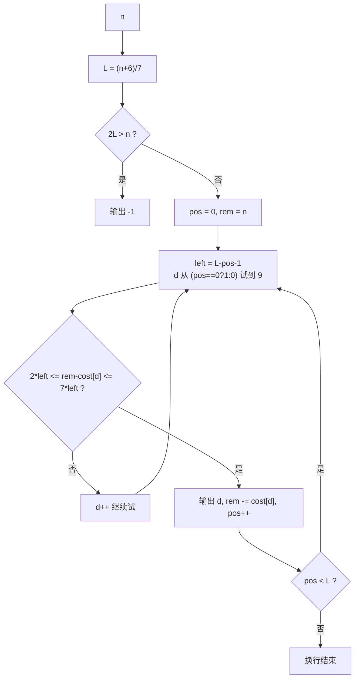

# T3 应援灯牌 / light —— 恰好用完 LED 拼最小正整数

> 对齐真题：CSP-J 2024 第二轮 T3 小木棍 <https://www.luogu.com.cn/problem/P11229>
> 本卷题面唯一来源：[`../problem.txt`](../problem.txt) 的 `== T3 应援灯牌 / light ==` 段

## 元信息

| 项目 | 内容 |
| --- | --- |
| 难度 | 普及（本模拟卷 T3，满分 100） |
| 来源 | 自编 CSP-J 第二轮模拟卷第 2 套，非真题 |
| 标签 | 贪心、构造、七段数码管、可行性判定 |
| 时间复杂度 | O(n)（准确说 O(L·10)，L = 答案位数） |
| 空间复杂度 | O(1)（边算边输出，不存答案串） |
| 评测状态 | 未本地评测（无网络评测环境）；本机 3 组样例全对，与暴力 DP 版随机对拍 5000 组完全一致（写作时另按 $n = 1..150$ 逐个全量对过一遍，同样一致） |

## 题目大意

每一位数字要烧掉固定数量的 LED（七段数码管），给定 `n` 颗，要求**一颗不剩**地拼出一个**没有前导零**的**最小**正整数；拼不出来输出 `-1`。

- 输入：一行一个整数 `n`。
- 输出：一个正整数（可能很长，按字符串输出）或 `-1`。
- 数据范围：`1 ≤ n ≤ 10^5`。
- 每位消耗：`0→6, 1→2, 2→5, 3→5, 4→4, 5→5, 6→6, 7→3, 8→7, 9→6`。

**七段数码管**（第一次出现，解释一句）：就是电子表上那种由上、中、下三横和左上、左下、右上、右下四竖共 7 段拼出数字的显示方式，每点亮一段烧掉一颗 LED。
**前导零**：像 `0012` 这种开头写 0 的形式，它表示的其实是 12，不算四位数；题面禁止它，意思是首位不能选 `0`。

### 样例实测（本机 `g++ -static -O2 -std=c++14` 编译运行）

| `n` | 输出 | 手算核对 |
| --- | --- | --- |
| 5 | `2` | 一位数里烧 5 颗的有 `2/3/5`，最小是 `2`；两位数虽也能烧 5 颗（`17` = 2+3）但一定更大 |
| 8 | `10` | 一位最多烧 7 颗 → 必须两位；首位选 `1`(2 颗)，剩 6 颗正好是 `0` |
| 1 | `-1` | 最便宜的数字 `1` 也要 2 颗 |

`n = 1..40` 的完整输出（本机逐个跑出来的，可直接当查分表用）：

| n | 1 | 2 | 3 | 4 | 5 | 6 | 7 | 8 | 9 | 10 | 11 | 12 | 13 | 14 | 15 |
| --- | --- | --- | --- | --- | --- | --- | --- | --- | --- | --- | --- | --- | --- | --- | --- |
| 答案 | -1 | 1 | 7 | 4 | 2 | 6 | 8 | 10 | 18 | 22 | 20 | 28 | 68 | 88 | 108 |

| n | 16 | 17 | 18 | 19 | 20 | 21 | 22 | 23 | 24 | 25 | 26 | 27 | 28 | 29 | 30 |
| --- | --- | --- | --- | --- | --- | --- | --- | --- | --- | --- | --- | --- | --- | --- | --- |
| 答案 | 188 | 200 | 208 | 288 | 688 | 888 | 1088 | 1888 | 2008 | 2088 | 2888 | 6888 | 8888 | 10888 | 18888 |

到 31~40 依次是 `20088, 20888, 28888, 68888, 88888, 108888, 188888, 200888, 208888, 288888`。
两个容易看错的点：`n = 11` 的答案是 `20`（`2` 烧 5 颗 + `0` 烧 6 颗 = 11），看着更小的 `11`（只烧 4 颗）和 `10`（只烧 8 颗）**根本用不完 LED**，不合法；`n = 15` 的答案跳到三位数 `108`（2+6+7 = 15），因为两位数最多只能烧 `7 × 2 = 14` 颗。

## 思路推导

### 1. 暴力想法与它的瓶颈

**暴力 A**：枚举所有位数不超过某上限的正整数，逐个检查它的十进制表示烧掉的 LED 是否恰好 `n`，取最小者。`n = 10^5` 时答案可达 `10^14285` 量级，枚举根本写不完。

**暴力 B（仓库里的 `brute.cpp`，思路完全不同，用来对拍）**：做**动态规划**（把大问题拆成小问题、把小问题的答案存表里反复利用的做法）。
`g[s]` = 恰好烧掉 `s` 颗 LED 能拼出的"数字串"（允许开头是 0），比较时**先比长度、长度相同再比字典序**（字典序就是"字符串按字母表排的先后"）。转移是枚举这一位放哪个数字：`g[s] = min over d of ('d' + g[s - cost[d]])`。
复杂度 `O(n · 10 · L)`（每次比较要拷贝长度 `O(L)` 的串）。本机实测 `n = 10^5`：耗时 `0.806 / 0.799 / 0.865 s`（贪心是 `0.044 ~ 0.055 s`），答案与贪心**逐字节相同**，但 `string g[100005]` 要同时存下 10 万条平均长度几千的串，**实测峰值内存 705.3 MB**，直接超出评测机常见的 128 MB / 256 MB 限制——**它挂在一个字都写不出来之前，先死在内存上**。
它的价值是：思路与贪心毫无重叠，是理想的对拍参照物（把 `n` 限制在几百以内时非常好用）。

### 2. 关键观察

- **观察 A：位数越少，数一定越小。** 没有前导零时，任何 `L` 位数都小于任何 `L+1` 位数（最小的 `L+1` 位数是 `10^L`，最大的 `L` 位数是 `10^L - 1`）。
  所以"最小"的第一优先级是**位数最少**，第二才是同位数下字典序最小。这一条决定了贪心的方向：**先定 `L`，再从高位到低位逐位取尽量小的数字**。
- **观察 B：一位数字最少烧 2 颗（`1`），最多烧 7 颗（`8`）。** 于是 `L` 位数能表示的 LED 总数恰好是区间 `[2L, 7L]`。
- **观察 C：最少位数 `L = ceil(n / 7)`。** 每位最多 7 颗，`L-1` 位最多只能烧 `7(L-1)` 颗，不够 `n`；取 `L = ⌈n/7⌉` 时 `n ≤ 7L` 自动成立。整数写法是 `(n + 6) / 7`（向下取整除法）。
- **观察 D：区间 `[2L, 7L]` 里的每个整数都能被填满。** 先给每位分配 2 颗（都放 `1`），多余 `e = n - 2L ≤ 5L` 颗，每次挑一位多加 1~5 颗即可——因为消耗值 `2,3,4,5,6,7` **一个不缺**（分别对应数字 `1,7,4,2/3/5,0/6/9,8`）。
  并且首位不许是 `0` 也不影响：`2..7` 这些消耗值全都能由非零数字提供（`1,7,4,2,6,8`）。
- **观察 E：于是"能不能拼"只有一句话。** `2L ≤ n` 就能拼，否则 `-1`。`L = ⌈n/7⌉` 时上界自动满足，只需检查下界。

### 3. 算法设计

先算 `L = (n + 6) / 7`；若 `2 * L > n` 输出 `-1`。
否则从最高位到最低位逐位确定，维护 `rem` = 还剩多少颗 LED 没安排：

```
for pos = 0 .. L-1:
    left = L - pos - 1            # 后面还剩几个空位
    for d = (pos == 0 ? 1 : 0) .. 9:      # 首位不许是 0，所以从 1 试起
        if 2*left <= rem - cost[d] <= 7*left:
            输出 d; rem -= cost[d]; break  # 找到最小的可行数字就走人
```

内层的判据是**精确**的（观察 D）：剩下的 `rem - cost[d]` 颗 LED 能被后面 `left` 个位置恰好用完，当且仅当它落在 `[2·left, 7·left]` 里。
因为判据精确，所以"这一位选最小可行值"永远不会把后面逼进死路，也不需要回溯。

### 4. 正确性说明

**引理 1（位数最优）**：任何合法答案的位数 `≥ L = ⌈n/7⌉`，且 `L` 位确实可拼（当 `2L ≤ n`）。
*证明*：`L'` 位数最多烧 `7L'` 颗，要烧完 `n` 颗必须 `7L' ≥ n`，即 `L' ≥ ⌈n/7⌉`。反过来 `2L ≤ n ≤ 7L` 时由观察 D 可拼。$\blacksquare$

**引理 2（判据精确）**：设还剩 `left` 个空位、`x` 颗 LED，则"存在填法恰好用完"当且仅当 `2·left ≤ x ≤ 7·left`。
*证明*：必要性显然（每位 2~7 颗）。充分性用构造：每位先放 `1`（各 2 颗），余 `x - 2·left ≤ 5·left` 颗待分配；从第一位起依次给每位最多加 5 颗（加到消耗 `c` 就换成对应数字，`2..7` 都有数字可用），`5·left` 的容量足够装下所有剩余，故一定能分完。$\blacksquare$

**引理 3（逐位最小即整体最小）**：由引理 1，最优解位数就是 `L`。同位数比较整数大小等价于比较字典序。设算法在第 `pos` 位选了最小的可行数字 `d`，而某个最优解这一位是 `d' > d`。由引理 2，选 `d` 之后剩下的 `rem - cost[d]` 落在 `[2·left, 7·left]` 内，所以**存在**将后面 `left` 位填满的合法填法，于是"前缀取 `d`"的方案一定合法，它比取 `d'` 的任何方案都小，与最优解矛盾。故算法每一位都等于最优解的对应位。$\blacksquare$

**终止性**：引理 2 保证 `rem` 始终满足 `2·(剩余位数) ≤ rem ≤ 7·(剩余位数)`，所以内层循环每轮至少能命中一个 `d`，不会空转；最后 `rem` 归零（本机对 `n = 2..100000` 全部逐位检查过：没有任何一位找不到数字，结束时 `rem` 全为 0）。

### 5. 复杂度分析

- 时间：`L` 位，每位试 10 个数字，`O(10L) = O(n/7·10)`。`n = 10^5` 时 `L = 14286`，约 14 万次判断。
- 空间：只用 `rem / pos / left`，`O(1)`；逐位 `putchar` 输出，不存整串。
- 本机实测 `n = 100000`：`0.046 / 0.044 / 0.055 s`，峰值内存约 4 MB，输出 **14286 位**，形如 `2` 后面跟 14285 个 `8`；用脚本回算 `cost[2] + 14285 × cost[8] = 5 + 99995 = 100000`，恰好用完。
- 同一份 `n = 100000`，暴力 B 跑出**完全相同**的输出，耗时 `0.806 s`、峰值内存 705.3 MB。

## 可视化讲解



交互式分步演示见同级目录 [`visualization.html`](visualization.html)：把每一位"从 0/1 开始试数字、被哪一条判据卡住、为什么选中它"全过程摊开，配上 `rem` 的消耗进度条、`[2·left, 7·left]` 可行区间的高亮数轴，以及变量状态表与代码行高亮。默认载入样例 `n = 8`。

## 讲解代码

完整逐段注释版见同目录 [`solution.cpp`](solution.cpp)，正文只贴核心：

```cpp
int cost[10] = {6, 2, 5, 5, 4, 5, 6, 3, 7, 6};
int L = (n + 6) / 7;          // ceil(n/7)：一位最多 7 颗，所以至少要 L 位
if (2 * L > n) { puts("-1"); return 0; }   // 一位最少 2 颗，装不下就无解
int rem = n;
for (int pos = 0; pos < L; pos++) {
    int left = L - pos - 1;                  // 后面还欠几个位置
    for (int d = (pos == 0 ? 1 : 0); d <= 9; d++) {   // 首位跳过 0
        int r2 = rem - cost[d];
        if (r2 >= 2 * left && r2 <= 7 * left) {   // 剩下的还能不能填满后面
            putchar('0' + d);
            rem = r2;
            break;                                  // 取最小可行值，立刻走
        }
    }
}
```

## 易错点与坑

- **`ceil` 写成向下取整**：`n / 7` 会少算一位，必须 `(n + 6) / 7`。
- **判据里的 `left` 用错**：是 `L - pos - 1`（**当前位之后**还剩几格），写成 `L - pos` 会把当前位自己也算进去，样例 `n = 8` 会输出 `11` 而不是 `10`。
- **忘了首位不能为 0**：`for (int d = 0; ...)` 会让 `n = 8` 输出 `01`。用 `pos == 0 ? 1 : 0` 区分。
- **想拿整数变量存答案**：`n = 10^5` 时答案 14286 位，`long long` 只有 19 位，必须边算边 `putchar`。
- **以为 `0` 很省**：`0` 要 6 颗，最省的是 `1`（2 颗）。反过来"最费"的是 `8`（7 颗），所以位数最少时高位常常是被迫选大的。
- **贪心方向搞反**：拼**最大**数是"低位尽量省、高位尽量花"；本题拼**最小**数是"位数先最少，然后高位尽量小、把 LED 堆到后面去"。方向相反，判据形式相同。
- **`-1` 的判断**：本题数据下只有 `n = 1` 无解（本机把 `n = 1..3000` 全跑了一遍，输出 `-1` 的恰好 1 个）。但一定要写通用的 `2*L > n` 判断，别特判 `n == 1`。
- **输出结尾换行**：`putchar('\n')` 别漏，部分评测机会因缺换行判错。

## 常见变式

| 变式 | 差异 | 对应题号 |
| --- | --- | --- |
| 小木棍（本题对齐的真题） | 同样是"恰好用完 + 构造"，只是目标与合法性换了包装 | [P11229](https://www.luogu.com.cn/problem/P11229) |
| 拼**最大**数 | 贪心方向相反：先让位数尽量多，再高位尽量大 | 同型改动（本仓库 `solutions/greedy/p14357-number/`） |
| 允许前导零 / 允许不用完 | 判据区间和终止条件都要改 | 简化型改动 |
| 每位消耗值不连续（比如缺 5） | 引理 2 的"区间全覆盖"不再成立，必须回到 DP 判可行性 | 提高型改动 |

## 一句话提炼

**"拼最小的数"先把位数压到 `⌈n/7⌉`，再逐位取"能让剩余 LED 落进 `[2·剩余位数, 7·剩余位数]`"的最小数字——判据精确，所以贪心不需要回头。**
