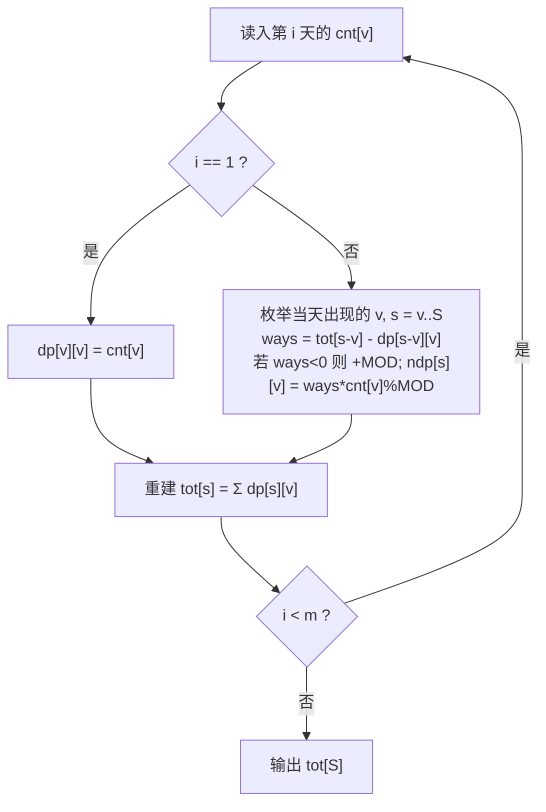

# T4 总选打投 / vote —— 分层 DP 数方案（相邻不许同值）

> 对齐真题：CSP-J 2024 第二轮 T4 接龙 <https://www.luogu.com.cn/problem/P11230>
> 本卷题面唯一来源：[`../problem.txt`](../problem.txt) 的 `== T4 总选打投 / vote ==` 段

## 元信息

| 项目 | 内容 |
| --- | --- |
| 难度 | 普及（本模拟卷 T4，满分 100） |
| 来源 | 自编 CSP-J 第二轮模拟卷第 2 套，非真题 |
| 标签 | 动态规划、分层/滚动数组、计数、容斥、取模 |
| 时间复杂度 | O(m · S · min(S,100) + m · S · 100)，本机最大数据实测内层转移 **31,086,513** 次 |
| 空间复杂度 | O(S · V)，V = 105；`dp` 与 `ndp` 两张表共 4.01 MB，实测峰值内存 7.3 MB |
| 评测状态 | 未本地评测（无网络评测环境）；本机 3 组样例全对，与 DFS 暴力随机对拍 5000 组一致，另用结构完全不同的字典 DP 交叉核对过 |

## 题目大意

`m` 天打投，第 `i` 天从当天的 `k_i` 个项目里**选一个**（同一个热度值出现两次就算两种不同的选法），要求 `m` 天选出的热度值**加起来正好等于 `S`**，并且**相邻两天选到的热度值不能相同**。求方案数对 `998244353` 取模。

- 输入：第一行 `m S`；接下来 `m` 行，每行先给 `k_i`，再给 `k_i` 个热度值。
- 输出：一行一个整数。
- 数据范围：`1 ≤ m ≤ 100`，`1 ≤ S ≤ 5000`，`1 ≤ k_i ≤ 100` 且 `Σk_i ≤ 10000`，`1 ≤ v ≤ 100`。

**动态规划**（第一次出现，解释一句）：把"前 `i` 天凑出总和 `s`"这种小问题的答案先存进表里，后面遇到更大的问题时直接查表复用，而不是重新算一遍。**取模**：只保留除以 `998244353` 的余数，防止方案数爆炸到整数装不下。

### 样例实测（本机 `g++ -static -O2 -std=c++14` 编译运行）

| 输入 | 输出 | 说明 |
| --- | --- | --- |
| `3 6` / `2 1 2` / `2 2 3` / `1 3` | `1` | 唯一方案 `1 → 2 → 3` |
| `2 4` / `2 1 3` / `2 1 3` | `2` | `1 → 3` 和 `3 → 1`；`2 → 2` 凑不出来 |
| `1 5` / `3 5 5 2` | `2` | 只有一天，两份"热度 5"是**两个不同项目**（`cnt[5] = 2`，故 `dp[5][5] = 2`） |

## 思路推导

### 1. 暴力想法与它的瓶颈

**暴力（仓库里的 `brute.cpp`）**：`dfs(第几天, 当前总和, 上次的值)`，每天枚举选哪个项目，超过 `S` 就剪枝，走到第 `m+1` 天且和为 `S` 就 `ans++`。它连"取模"都可以先不做（小数据下 `long long` 够用）。

本机用 `k_i = 3`、值域 `1..3`、`S = 2m`（正好让合法方案最多、剪枝最弱）实测增长：

| m | S | DFS 暴力耗时 | 分层 DP 耗时 | 方案数 |
| --- | --- | --- | --- | --- |
| 10 | 20 | 0.121 s | 0.09 s | 972 |
| 24 | 48 | 0.290 s | 0.086 s | 5,202,144 |
| 28 | 56 | 1.385 s | 0.107 s | 35,131,968 |
| 32 | 64 | **18.585 s** | 0.120 s | 577,997,856 |

`m` 每加 2，暴力时间约乘 2.7~3.7，而 DP 一直贴着进程启动开销的地板（本机静态链接的 exe 冷启动约 0.09~0.12 秒，上表耗时含这一固定开销）。真到 `m = 100` 时暴力要枚举 `100^100` 量级的序列，**永远跑不完**；它只够拿子任务 1（`m ≤ 10`）的 12 分。

### 2. 关键观察

- **观察 A：必须把"上次选了什么"记进状态。** 只记 `dp[s]` = 凑出 `s` 的方案数是不够的——转移时要知道上一天的值才能判断"不相等"，而 `dp[s]` 已经把不同末尾混在一起了。所以状态要加一维：`dp[s][v]`。
- **观察 B：天数是一层一层推进的。** 第 `i` 天只能从第 `i-1` 天的表算出来，算完就把旧表整张丢掉。这就是**滚动数组**（只保留最近一层，用两版 `dp`/`ndp` 交替，或就地覆盖）。
- **观察 C：同值排除可以用"总数减一类"完成。** 设 `tot[s] = Σ_u dp[s][u]`，那么"前一天末尾不是 `v`"的方案数就是 `tot[s-v] - dp[s-v][v]`。这样**不必**枚举 `u`，转移从 `O(V)` 降到 `O(1)`。
- **观察 D：同一天里重复值合并成系数。** 第 `i` 天出现 `cnt[v]` 个热度 `v`，选哪个都是同一个 `v`，方案数只差 `cnt[v]` 倍，所以转移乘 `cnt[v]` 即可，内层循环只需遍历**当天出现过的** `v`。
- **观察 E：值域只有 1..100。** 第二维开 105 就够，`S` 才是第一维（最大 5000）。

### 3. 算法设计

`dp[s][v]`：**处理完前 `i` 天后**，热度总和正好是 `s`、且第 `i` 天选的热度值是 `v` 的方案数（对 MOD 取模）。

```
第 1 天：dp[v][v] = cnt[v]                       # 只有一天，没有相邻限制
第 i 天（i ≥ 2）：
    ndp[s][v] = cnt[v] × ( tot[s-v] − dp[s-v][v] )   # 前一天末尾 ≠ v
    dp ← ndp
每天算完后重建 tot[s] = Σ_v dp[s][v]
答案 = tot[S]
```

`tot[s-v]` 是"前一天总和为 `s-v`"的全部方案，`dp[s-v][v]` 是其中"前一天末尾恰好也是 `v`"的那部分——**这一项就是相邻限制要挖掉的洞**。减完再乘 `cnt[v]`（当天有 `cnt[v]` 个可选项目）。

### 4. 正确性说明

**循环不变量**：处理完第 `i` 天后，对每个 `(s, v)`，`dp[s][v]` 恰好等于"前 `i` 天构成一条合法（相邻互异）且总和为 `s`、第 `i` 天值为 `v` 的选法"的方案数（模 MOD）。

*初始化*：`i = 1` 时序列只有一个元素，和为 `v`、末尾为 `v`，选法数就是当天热度 `v` 的项目个数 `cnt[v]`，即 `dp[v][v] = cnt[v]`，其余为 0。成立。

*保持*：`i ≥ 2` 时，一条长度为 `i`、总和 `s`、末尾 `v` 的合法序列，去掉最后一项就得到一条长度为 `i-1`、总和 `s-v`、末尾 `u ≠ v` 的合法序列；反过来任意这样的序列接上 `v` 也仍合法。这是**双射**，所以方案数
`Σ_{u ≠ v} dp[s-v][u] = (Σ_u dp[s-v][u]) − dp[s-v][v] = tot[s-v] − dp[s-v][v]`，再乘上当天 `cnt[v]` 种可选项目，正好是转移式。不变量保持。

*终止*：`i = m` 后答案 = `Σ_v dp[S][v] = tot[S]`，即"恰好 `m` 天、总和 `S`、相邻互异"的全部方案数。$\blacksquare$

**取模下的减法**：`tot` 与 `dp` 存的都是余数，`tot[s-v]` 的余数可能**小于** `dp[s-v][v]` 的余数，减出负数必须 `+ MOD`。本机最大数据实测：`31,086,513` 次转移里有 **`7,039,679` 次（约 22.6%）减法结果为负**，这一行不是摆设。

### 5. 复杂度分析

- 时间：每天转移 `O(S × 当天不同值数)`，`tot` 重建 `O(S × V)`。最大数据 `m=100, S=5000, V=105` 下实测内层转移 `3.11 × 10^7` 次，加上 `tot` 重建约 `5.2 × 10^7` 次加法，总量 `10^8` 以内。
- 空间：`dp`、`ndp` 各 `5005 × 105` 个 `int` = 各 2.0 MB，合计 4.01 MB；`tot` 与 `cnt` 约 20 KB。
- 本机实测最大数据（`m=100, S=5000, Σk_i=10000`）：`0.255 / 0.215 / 0.256 s`，峰值内存 **7.3 MB**，输出 **`704599713`**。用一份结构完全不同的 Python 字典 DP（逐条枚举 `(总和, 末尾值)`、遇 `v == u` 直接 `continue`，不做"总数减一类"）在 `m=40, S=800, k_i=20` 上核对，两边同为 `557730993`。

## 可视化讲解



交互式分步演示见同级目录 [`visualization.html`](visualization.html)：按天推进，把 `dp` 状态表画成"行 = 总和 `s`、列 = 末尾值 `v`"的网格，**每一步都高亮 `tot[s-v]` 那一行、被减掉的 `dp[s-v][v]` 那一格、以及正在写入的 `ndp[s][v]`**，配转移算式、变量状态表和代码行高亮。默认载入样例 1。

## 讲解代码

完整逐段注释版见同目录 [`solution.cpp`](solution.cpp)，正文只贴核心：

```cpp
const int MOD = 998244353, N = 5005, V = 105;
int dp[N][V], ndp[N][V], tot[N], cnt[V];   // 全局，别开在 main 里（4 MB 会爆栈）

for (int i = 1; i <= m; i++) {
    memset(cnt, 0, sizeof cnt);
    for (int j = 0; j < k; j++) { int v; scanf("%d", &v); if (v <= S) cnt[v]++; }
    if (i == 1) {                                   // 第一天没有相邻限制
        memset(dp, 0, sizeof dp);
        for (int v = 1; v <= S && v < V; v++) dp[v][v] = cnt[v];
    } else {
        memset(ndp, 0, sizeof ndp);
        for (int v = 1; v <= S && v < V; v++) {
            if (!cnt[v]) continue;                  // 只枚举当天出现过的值
            for (int s = v; s <= S; s++) {
                long long ways = tot[s - v] - dp[s - v][v];  // 挖掉"昨天也是 v"
                if (ways < 0) ways += MOD;          // 余数相减可能为负
                ndp[s][v] = ways * cnt[v] % MOD;    // 乘 cnt[v]：同值有多个项目
            }
        }
        memcpy(dp, ndp, sizeof dp);                 // 滚动到下一层
    }
    memset(tot, 0, sizeof tot);
    for (int s = 1; s <= S; s++) {
        long long t = 0;
        for (int v = 1; v < V; v++) t += dp[s][v];
        tot[s] = t % MOD;
    }
}
printf("%d\n", tot[S]);
```

## 易错点与坑

- **漏掉 `- dp[s-v][v]`**：这是本题最容易写错的一行。本机实测：样例 1 和样例 2 **都查不出这个 bug**（去掉减项后仍然输出 `1` 和 `2`，因为被误加进来的非法序列总和是 2，不落在 `S = 4` 上）。能查出来的最小数据是 `2 2 / 1 1 / 1 1`：正确答案 `0`，漏减项的程序输出 `1`。最大数据下正确答案 `704599713`，漏减项是 `16141876`。**必须自己造这种"只有一种值可选"的数据来验算。**
- **忘了 `if (ways < 0) ways += MOD;`**：取模之后余数相减会为负，负数再乘 `% MOD` 得到负答案。最大数据实测约 22.6% 的转移触发这一支。
- **把 `dp[s][v]` 的 `v` 当成"第几天"**：`v` 是**末尾值**不是天数，天数体现在外层循环的层上。
- **二维数组开在 `main` 里**：`int dp[5005][105]` 是 2 MB，两张就是 4 MB，栈一般只有 1~8 MB，可能直接 RE。放全局。
- **第二维按 `S` 开**：`dp[5005][5005]` 是 1 亿个 `int` = 400 MB，爆内存。值域上限是 100，开 105 就够；反过来说，代码里 `cnt[v]++` 也**依赖** `v ≤ 100` 这个条件，如果哪天值域改成 `v ≤ S`，第二维和 `cnt` 都得跟着放大。
- **`tot` 忘了每天重建**：`tot` 必须反映**刚算完的这一层**的 `dp`。少重建一次，下一天用的就是上上层的总数，全错。
- **同一天重复值只记一次**：用 `bool` 或 `set` 去重会让样例 3 从 `2` 变成 `1`。重复项目是**不同**的方案，要 `cnt[v]++`。
- **中间乘积溢出 / `s` 的起点**：`ways * cnt[v]` 最大约 `998244353 × 100 ≈ 10^11`，`int` 装不下，`ways` 必须是 `long long`；内层要写 `for (int s = v; s <= S; s++)`，从 `0` 开始会让 `s - v` 变成负数越界读。

## 常见变式

| 变式 | 差异 | 对应题号 |
| --- | --- | --- |
| 接龙（本题对齐的真题） | 同样是"分层 DP + 同值排除"，包装成骨牌/字符串接龙 | [P11230](https://www.luogu.com.cn/problem/P11230) |
| 只要求总和 = S，不限制相邻 | 一维 `dp[s]` 即可，`O(m·S)`，是本题去掉第二维的退化版 | 简化型改动 |
| 相邻可以同值但同值要额外扣分 | 保留 `dp[s][v]`，转移时不减那一格，改成加权累加 | 提高型改动 |
| 求"方案数 ≥ K 的最小 S" | 计数改成可行性/二分，判据换方向 | 提高型改动 |
| 值域放大到 `v ≤ S` | 第二维要开到 `S`，`O(m·S²)` 撑不住，要换成前缀和优化 | 提高型改动 |

## 一句话提炼

**计数题一旦带上"和上一个不同"的限制，就给状态加一维"上一个是什么"；再用 `tot[s] = Σ_v dp[s][v]` 做"总数减掉不允许的那一类"，就把 `O(V)` 的枚举压成了 `O(1)` 的转移。**
