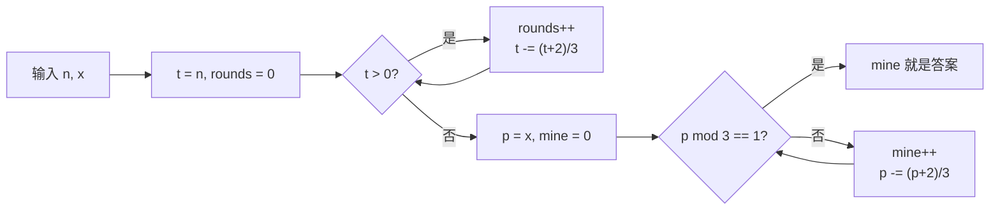

# T1 无料排队 / lineup（CSP-J 第二轮模拟 · 第 3 套）

> 题面唯一来源：[`../problem.txt`](../problem.txt)（`== T1 无料排队 / lineup ==` 一节）；整卷可读版 [`../paper.md`](../paper.md)。
> 本题知识点对齐真题 **CSP-J 2023 T1 小苹果（洛谷 P9748）**：都是"一轮取走若干人、剩下的人重新排队"的**递推压缩**型模拟题，纯模拟拿不到满分。

## 元信息

| 项目 | 内容 |
| --- | --- |
| 难度 | 普及-（模拟卷 T1，对应 100 分） |
| 来源 | 自编仿真题（非真题），对齐 CSP-J 2023 T1 |
| 标签 | 数学递推、模拟、对数级收敛 |
| 时间复杂度 | O(log n)（轮数上限约 50） |
| 空间复杂度 | O(1) |
| 评测状态 | 未本地评测（模拟卷无 OJ）；本机与 `brute.cpp` 随机对拍 5000 组全部一致，样例与极限数据见下 |

## 题目大意

`n` 个人站成一排，编号 `1…n`。每一轮把**本轮队伍里位置是 1、4、7、…** 的人全部取走（即位置除以 3 余 1），剩下的人按原顺序重新编号成一支新队伍，如此重复直到队伍空。问：一共多少轮，以及**编号 `x`** 的人第几轮被取走。

- 输入：一行两个整数 `n`、`x`，$1 \le x \le n$
- 输出：一行两个整数：总轮数、编号 $x$ 被取走的轮数
- 数据范围：$n \le 10^9$（**注意：一支 10^9 人的队伍是存不下的**）
- 术语：**位置**指"本轮队伍里排第几"，每轮重排后会变；**编号**是入队时就定死、不再变的原始序号。本题唯一的坑就在这两个词的区别上。

本机实测（编译命令 `g++ -static -O2 -std=c++14 solution.cpp -o /tmp/s3t1.exe`，输入用文件喂给）：

| 输入 | `solution.cpp` | `brute.cpp` | 题面给的期望输出 |
| --- | --- | --- | --- |
| `6 1` | `4 1` | `4 1` | `4 1` |
| `6 5` | `4 4` | `4 4` | `4 4` |
| `1 1` | `1 1` | `1 1` | `1 1` |

## 思路推导

### 1. 暴力想法与瓶颈

`brute.cpp` 就是题面直译：开一个 `vector<int>` 存队伍，每轮扫一遍，下标 `i % 3 == 0` 的人出列，其余 `push_back` 到新数组。

它对 $n \le 10^6$ 完全够用，实测很干脆（同一台机器）：

| n | 暴力耗时 | 暴力输出 | 正解耗时 |
| --- | --- | --- | --- |
| $10^4$ | 0.012 s | `22 1` | 0.006 s |
| $10^6$ | 0.023 s | `33 1` | 0.006 s |
| $10^7$ | 0.161 s | `39 1` | 0.006 s |
| $10^8$ | 1.851 s | `45 1` | 0.006 s |
| $10^9$ | **27.031 s** | `50 1` | 0.006 s |

瓶颈有两条，而且**内存先炸**：$10^9$ 个 `int` 是 3.7 GB，常见 128/256 MB 限制下第一发就 MLE；本机靠虚拟内存硬扛下来，也要 27 秒。正解全程只用了 0.006 秒（含进程启动），因为**它从头到尾没有真的存过这支队伍**。

### 2. 关键观察

- **观察 A（人数每轮乘 2/3）**：一轮取走 $\lceil t/3 \rceil$ 人，剩 $t - \lceil t/3 \rceil = \lfloor 2t/3 \rfloor$ 人。人数每轮至少缩到 $\tfrac23$，所以轮数是**对数级**：$10^9$ 只要 50 轮（实测 `1000000000 1` → `50 1`）。
- **观察 B（出列判据只看位置）**：某人本轮被取走 $\iff$ 他本轮的位置 $p \equiv 1 \pmod 3$（即 $p \bmod 3 == 1$，位置 1、4、7…）。
- **观察 C（位置可以单独递推）**：若本轮位置 $p$ 不被取走（$p \bmod 3 \in \{0,2\}$），那么在 $p$ 之前（含 $p$）一共有 $\lceil p/3 \rceil = (p+2)/3$ 个位置被取走，且 $p$ 自己不在其中，所以它在下一轮的新位置是
  $$p' = p - \lfloor (p+2)/3 \rfloor$$
  手算一条链（编号 5，$n \ge 6$）：位置 $5 \xrightarrow{-2} 3 \xrightarrow{-1} 2 \xrightarrow{-1} 1$，第 4 轮位置变成 1，被取走 ⇒ 答案 4，与样例 2 完全吻合。
- 于是**只需要 O(1) 的变量**：一个 `t` 数轮数，一个 `p` 追踪编号 $x$ 的位置。

### 3. 算法设计

两条互相独立的递推，各自跑到停：

1. **总轮数**：`t = n; rounds = 0;` 反复 `rounds++; t -= (t + 2) / 3;` 直到 `t == 0`。
2. **编号 x 的轮数**：`p = x; mine = 0;` 反复 `mine++`，若 `p % 3 == 1` 就 break（说明本轮被取走），否则 `p -= (p + 2) / 3`（换到下一轮的位置）。

`mine` 一定不超过 `rounds`：$n = 10^9$ 时两者都是 50 以内，`x = 10^9` 输出 `50 1`（因为 $10^9 \equiv 1 \pmod 3$，首轮就走），而 `n = 999999999, x = 123456789` 输出 `50 15`。

### 4. 正确性说明

**引理 1（人数递推正确）**：本轮 $t$ 人，出列位置为 $1,4,\dots$，不超过 $t$ 的这样的位置恰有 $\lceil t/3 \rceil$ 个（$t = 3m, 3m+1, 3m+2$ 时分别为 $m, m+1, m+1$，都等于 $(t+2)/3$ 的整数商）。故剩下 $\lfloor 2t/3 \rfloor$ 人，且 $t \ge 1 \Rightarrow \lfloor 2t/3 \rfloor < t$，循环严格递减必停在 0，步数即总轮数。

**引理 2（位置递推正确）**：设某人本轮位置为 $p$ 且 $p \bmod 3 \ne 1$（未被取走）。位置 $1 \dots p$ 中被取走的是 $1, 4, 7, \dots \le p$，共 $\lceil p/3 \rceil = (p+2)/3$ 个（与引理 1 同一次数），且这些都比 $p$ 小或等于 $p$；$p \equiv 1 \pmod 3$ 不成立所以 $p$ 本身不在其中，故严格有 $(p+2)/3$ 个人排在 $p$ 前面且本轮出列。重排保持相对顺序 ⇒ 他的新位置 $p' = p - (p+2)/3$。

**引理 3（一定会停）**：$p \equiv 2 \pmod 3$ 时 $p = 3m+2 \to p' = 2m+1 \le p - 1$；$p \equiv 0$ 时 $p = 3m \to p' = 2m \le p - 1$。$p$ 每轮至少减 1，且 $p = 1$ 时立刻满足 $p \bmod 3 = 1$ 而 break，故循环有限步结束。

**定理**：算法输出的 `mine` 等于编号 $x$ 被取走的轮数。*证明*：对轮数归纳——第 $r$ 轮开始时，模拟队伍中编号 $x$ 的位置与算法变量 $p$ 相同（$r=1$ 时都是 $x$；由引理 2，一轮重排后两边都按同一公式更新）。于是"$x$ 第 $r$ 轮被取走" $\iff$ 第 $r$ 轮 $p \equiv 1 \pmod 3$ $\iff$ 算法在第 $r$ 步 break。$\blacksquare$

### 5. 复杂度分析

- 时间：两条循环各自 $O(\log_{3/2} n)$。人数每轮 $\times \tfrac23$，$10^9 \to 1$ 需 $\log_{1.5} 10^9 \approx 51$ 步，实测 50 步；位置每轮 $\times \tfrac23$ 同阶。合计 $O(\log n)$。
- 空间：两个 `long long`，$O(1)$。
- 本机实测 $n = 10^9$ 各种 $x$ 都在 **0.005—0.006 s**（含进程启动），改成 $n = 10^{18}$ 也只是多 20 轮。

## 可视化讲解



交互式演示见同目录 [`visualization.html`](visualization.html)：默认载入样例 1（`6 1`），上半屏用真队列看清"位置 1、4 被取走 → 剩下的人重新编号"，下半屏并排显示 `t` 与 `p` 两条递推的每一步，可以自己改 `n`、`x`。

## 讲解代码

完整逐段注释版见 [`solution.cpp`](./solution.cpp)，讲课时只写这两段：

```cpp
long long t = n, rounds = 0;
while (t > 0) { rounds++; t -= (t + 2) / 3; }   // (t+2)/3 = 本轮出列人数 = ceil(t/3)

long long p = x, mine = 0;
while (true) {
    mine++;
    if (p % 3 == 1) break;      // 本轮位置是 1、4、7…，被取走
    p -= (p + 2) / 3;           // 否则换成下一轮的新位置
}
printf("%lld %lld\n", rounds, mine);
```

## 易错点与坑

- **把编号当位置**：首轮两者相同，第二轮起就分家了。`x = 5` 在样例 1 里第 4 轮才走，不是第 5 轮。
- **取整写成 `p / 3`**：$\lceil p/3 \rceil$ 在整数运算里是 `(p + 2) / 3`。写 `p / 3` 时 $p = 2$ 会算成"前面走 0 人"，位置永远不动 → **死循环**。
- **`while (t--)` 之类把轮数和人数搅在一起**：轮数递推只看人数 $t$，位置递推只看 $p$，两条互不相干，别合并。
- **`break` 前忘了 `mine++`**：首轮就被取走的人会输出 0 轮。
- **`int` 存 `n`**：$n \le 10^9$ 勉强不溢出，但 `(t + 2)` 之类再乘一下就越界了；统一 `long long` + `%lld`。
- **`x = 1` 子任务（20 分）白送**：位置 1 永远首轮被取走，直接输出"轮数 1"，但轮数仍要 $O(\log n)$ 算，不能模拟。

## 常见变式

| 变式 | 差异 | 对应题号 |
| --- | --- | --- |
| 原型真题：每轮取走队首 1 人，问第几轮 + 谁在队首 | 同样"人数按比例减少 → 对数轮"，递推对象换成"第几个被吃掉" | P9748（CSP-J 2023 T1 小苹果） |
| 只求总轮数（子任务 10—13） | 不需要位置递推，只跑 `t -= (t+2)/3` | 本题 20 分档 |
| 推广：每轮取走位置 $\equiv 1 \pmod m$ | 递推变成 $p \mathrel{-}= \lceil p/m \rceil$，仍是 $O(\log n)$ | 讨论课练习 |
| 约瑟夫环（每轮固定步长 $m$ 只出列 1 人） | 一次只走 1 人 → 人数线性减少，只能 $O(n)$ 倒推递推 | 讨论课练习（注意与本题的对数收敛对比） |

## 一句话提炼（板书）

**别真的去排队：人数每轮乘 2/3、位置每轮减去"排在我前面出列的人数"，两条 O(1) 递推 50 步到底 —— 模拟题只要问"某一个人的命运"，就能把整支队伍压成一个下标。**
