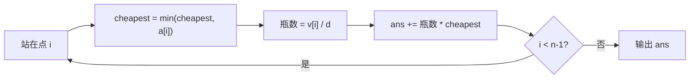

# T2 体力药水 / potion（CSP-J 第二轮模拟 · 第 3 套）

> 题面唯一来源：[`../problem.txt`](../problem.txt)（`== T2 体力药水 / potion ==` 一节）；整卷可读版 [`../paper.md`](../paper.md)。
> 本题知识点对齐真题 **CSP-J 2023 T2 公路（洛谷 P9749）**：同样是"一路走一路记历史最小值"的贪心，把"耗油量"换成了"药水单价"。

## 元信息

| 项目 | 内容 |
| --- | --- |
| 难度 | 普及-（模拟卷 T2，对应 100 分） |
| 来源 | 自编仿真题（非真题），对齐 CSP-J 2023 T2 |
| 标签 | 贪心、前缀最小值、模拟 |
| 时间复杂度 | O(n) |
| 空间复杂度 | O(n)（边读边算可降到 O(1)，但要先读完 $v$ 才能读 $a$） |
| 评测状态 | 未本地评测（模拟卷无 OJ）；本机与 `brute.cpp` 随机对拍 5000 组全部一致，样例与极限数据见下 |

## 题目大意

一条直路上依次有 $n$ 个点，第 $i$ 段路长 $v_i$ 公里；每个点卖药水，第 $i$ 点单价 $a_i$ 元，一瓶恰好跑 $d$ 公里，**只能整瓶买**、买了可以带着以后用，出发时一瓶没有。求走完全部 $n-1$ 段的最小花费。

- 输入：第一行 `n d`；第二行 `n-1` 个 `v_i`；第三行 `n` 个 `a_i`
- 输出：一行一个整数（最小花费）
- 数据范围：$2 \le n \le 10^5$，$1 \le d, v_i, a_i \le 10^5$，且保证 $d \mid v_i$
- 术语：**前缀最小值**指"从头到当前位置为止见过的最小值"，记 $m_i = \min(a_1, \dots, a_i)$，本题的全部诀窍就在这一个数组上。

本机实测（编译命令 `g++ -static -O2 -std=c++14 solution.cpp -o /tmp/s3t2.exe`）：

| 输入 | `solution.cpp` | `brute.cpp` | 题面期望输出 |
| --- | --- | --- | --- |
| `5 10 / 10 10 10 10 / 9 8 9 6 5` | `31` | `31` | `31` |
| `3 5 / 10 5 / 3 10 2` | `9` | `9` | `9` |

## 思路推导

### 1. 暴力想法与瓶颈

最直白的想法：对每一段路 $i$，回头扫一遍 $1 \dots i$ 找最便宜的点。`brute.cpp` 就是这个双重循环。

它**答案是对的**，只是慢——$O(n^2)$。本机实测（$d = 1$、$v_i \equiv 10^5$、$a_i \equiv 10^5$，也就是"每段都要买 10 万瓶"的满规模情形；每档跑 3～5 次取最快）：

| n | `brute.cpp` | `solution.cpp` | 输出 |
| --- | --- | --- | --- |
| $10^3$ | 0.015 s | 0.009 s | `9990000000000` |
| $10^4$ | 0.067 s | 0.030 s | `99990000000000` |
| $3 \times 10^4$ | 0.329 s | 0.053 s | `299990000000000` |
| $10^5$（满数据） | **3.442 s** | **0.116 s** | `999990000000000` |

`brute.cpp` 的内层循环次数只由 $n$ 决定（和价格的具体数值无关），所以这条曲线的形状是稳定的：$n$ 从 $3 \times 10^4$ 到 $10^5$ 变 3.3 倍，耗时从 0.329 s 涨到 3.442 s，约 10 倍——正是 $O(n^2)$ 的样子。前面两档数字太小不必当真，本机跑一个空进程也有接近 0.01 s 的启动开销，而且这台机器单次抖动能到 ±50%，所以只比量级。

满数据下暴力要 3.4 秒，时限一般 1 秒 → 直接 TLE。瓶颈在于**每段路都把前缀重新扫了一遍**，而"从头到 $i$ 的最小值"这件事本来是可以**边走边维护**的。

### 2. 关键观察

- **观察 A（一段路要几瓶是定死的）**：$d \mid v_i$，所以第 $i$ 段恰好要 $v_i / d$ 瓶，没有"凑整"的余地。于是问题变成：给每段路**指定**一个不晚于它的买点，使总花费最小。
- **观察 B（第 $i$ 段只能在点 $1 \dots i$ 买）**：人只能往前走，走过 $i$ 之后再买就救不了第 $i$ 段。所以第 $i$ 段的合法购买点是前缀 $[1, i]$。
- **观察 C（各段互不干扰）**：背包无限大、药水可以提前囤、单价与买多少无关 ⇒ 给第 $i$ 段挑最便宜的点，不会影响第 $j$ 段的选择。于是**逐段独立取前缀最小值**就是全局最优：
  $$\text{ans} = \sum_{i=1}^{n-1} \frac{v_i}{d} \cdot \min(a_1, \dots, a_i)$$
- **观察 D（注意 $a_n$ 用不上）**：到了终点不需要再走路，所以最后一个点的价格永远不参与决策（公式里 $i$ 只到 $n-1$）。

样例 1 代进去：$m = (9, 8, 8, 6)$，各段瓶数都是 1 ⇒ $9 + 8 + 8 + 6 = 31$，与题面说明一致。

### 3. 算法设计

一个变量 `cheapest` 边走边更新即可：

1. 读入 $n, d$，读 $v_1 \dots v_{n-1}$，读 $a_1 \dots a_n$（必须先存 $v$，因为输入把 $v$ 全给完才给 $a$）。
2. `cheapest = a[1]`，`ans = 0`。
3. 对 $i = 1 \dots n-1$：先 `cheapest = min(cheapest, a[i])`，再 `ans += (v[i] / d) * cheapest`。

顺序很关键：**先并入 $a_i$ 再结算第 $i$ 段**，因为站在第 $i$ 个点上是可以买药的。

### 4. 正确性说明

**引理 1（下界）**：任一合法方案中，第 $i$ 段所消耗的 $v_i/d$ 瓶必然购自某个点 $j \le i$，单价 $\ge m_i$，故该段花费 $\ge \frac{v_i}{d} \cdot m_i$，总花费 $\ge \sum_i \frac{v_i}{d} m_i$。

**引理 2（下界可达）**：构造方案——在第 $i$ 个点买 $\big(\sum_{j \ge i,\; m_j = a_i} \frac{v_j}{d}\big)$ 瓶（即"所有以 $i$ 为最优点的路段"所需的瓶数，同一 $m_j$ 有多个点取到时固定取最靠前的那个）。由于每段的需求都在**该段起点之前**买好，且第 $i$ 点买的瓶数只在经过点 $i$ 之后才被消耗，方案物理可行（背包无限大）。它的花费恰为 $\sum_i \frac{v_i}{d} m_i$。

引理 1 + 引理 2 ⇒ 该和式就是最小花费，算法按定义逐项累加，故输出正确。$\blacksquare$

（用交换论证讲也一样：若某方案让第 $i$ 段用了单价 $> m_i$ 的点，把这几瓶改到前缀里那个最便宜的点买，花费严格变小且仍合法，矛盾。）

### 5. 复杂度分析

- 时间：一次循环 $O(n)$；$n = 10^5$ 本机 **0.116 s**（5 次取最快，含进程启动与读入 2×10^5 个整数），纯计算部分远小于 I/O。
- 空间：`v[]`、`a[]` 各 $n$ 个 `int`，$O(n)$；若改成"读 $v$ 时先累加瓶数、读 $a$ 时再结算"可做到 $O(1)$ 额外空间。
- **溢出**：最坏 $\sum \frac{v_i}{d} \cdot a_i \le 10^5 \times 10^5 \times 10^5 = 10^{15}$，实测满数据输出 `999990000000000`，`int`（上限约 $2.1\times 10^9$）**必然爆**：`ans` 要是 `long long`，乘法还得写成 `1LL * (v[i] / d) * cheapest`（先转成 `long long` 再乘）。单价 `cheapest` 本身 $\le 10^5$，`int` 够用。

## 可视化讲解



交互式演示见同目录 [`visualization.html`](visualization.html)：默认载入样例 1，上方是马路与各段长度，中间是价格柱状图（**金色 = 当前历史最低价，绿色 = 本段实际付钱的那一档**），下方逐步显示 `cheapest`、瓶数、`ans` 的累加，并给出"每个点实际买几瓶"的回溯方案。

## 讲解代码

完整逐段注释版见 [`solution.cpp`](./solution.cpp)，讲课时只写这一段：

```cpp
long long ans = 0;
int cheapest = a[1];                      // 历史最低价，起点先垫上
for (int i = 1; i < n; i++) {
    cheapest = min(cheapest, a[i]);       // 先并入本站价格（本站可以买药）
    ans += 1LL * (v[i] / d) * cheapest;   // 1LL 把 int 乘法提升成 long long
}
printf("%lld\n", ans);
```

## 易错点与坑

- **`int` 存答案**：$10^{15}$ 级别，样例测得 `999990000000000`，用 `int` 会输出负数或错值；`v[i] / d * cheapest` 整体也要先转 `long long`。
- **顺序反了**：把两行写成"先 `ans += ...` 再 `cheapest = min(...)`"，等于漏掉了"就在本点买"这个选项。本机实测这份错码在样例 1 上输出 `34`（正确 `31`），但在样例 2 上照样输出 `9` —— **样例 2 抓不出这个 bug**，必须自己造 $a_2 < a_1$ 的数据。
- **忘了 $d \mid v_i$ 是题目保证**：不要自己写 `(v[i] + d - 1) / d` 去向上取整，那会把"最后一瓶用不完"这种不存在的情形引进来，样例照样过但思路错。
- **把 $a_n$ 也算进去**：终点不走路，$a_n$ 再便宜也没用；循环写到 `i < n` 而不是 `i <= n`。
- **读入顺序**：$v$ 一整行读完才轮到 $a$，所以想 $O(1)$ 空间必须先把 $v_i/d$ 累加到一个数组里，边读边算是做不到的。
- **`scanf` 格式符**：`%lld` 配 `long long`、`%d` 配 `int`，混用是未定义行为。

## 常见变式

| 变式 | 差异 | 对应题号 |
| --- | --- | --- |
| 原型真题：公路（每升油跑 1 公里，各城市油价不同） | 完全同构：$v_i$ 是相邻城市距离、$a_i$ 是油价，答案 $= \sum v_i \cdot \min_{j \le i} a_j$ | P9749（CSP-J 2023 T2 公路） |
| 子任务 4—7：$a_1$ 全局最小 | 前缀最小值恒为 $a_1$，答案 $= a_1 \cdot \sum v_i / d$，一行公式 | 本题 20 分档 |
| 子任务 12—14：$a_i$ 单调不升 | 每段都在自己起点买，$\min$ 可以省掉 | 本题 15 分档 |
| 背包容量有限（最多带 C 瓶） | 各段不再独立，需要 DP 或"最近 C 段的最小值"（单调队列） | 讨论课练习 |
| 需要输出"每个点买几瓶"的方案 | 前缀最小值 + 记录取到最小值的下标，回溯分配 | 讨论课练习 |

## 一句话提炼（板书）

**能提前囤、又能往后带，那么每一段路的钱只由"走到这里之前见过的最低价"决定：一路维护一个前缀最小值，O(n) 结算完 —— 记住先并入本站价格，再付这一段的路费。**
