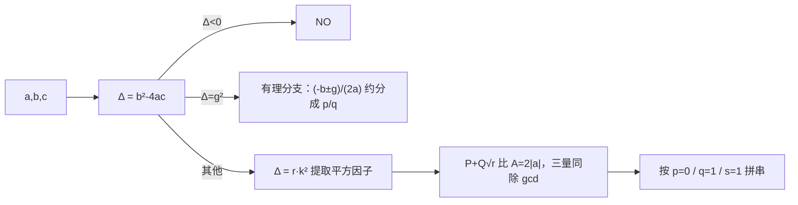

# T3 暴击阈值 / dmg（CSP-J 第二轮模拟 · 第 3 套）

> 题面唯一来源：[`../problem.txt`](../problem.txt)（`== T3 暴击阈值 / dmg ==` 一节）；整卷可读版 [`../paper.md`](../paper.md)。
> 本题知识点对齐真题 **CSP-J 2023 T3 一元二次方程（洛谷 P9750）**：难点不在解方程，而在**根式化简 + 输出格式控制**。

## 元信息

| 项目 | 内容 |
| --- | --- |
| 难度 | 普及/提高-（模拟卷 T3，对应 100 分） |
| 来源 | 自编仿真题（非真题），对齐 CSP-J 2023 T3 |
| 标签 | 数论（gcd、平方因子）、模拟、字符串格式控制 |
| 时间复杂度 | O(T·√Δ)，Δ ≤ 5×10^6 ⇒ 每组至多约 2236 次试除 |
| 空间复杂度 | O(1) |
| 评测状态 | 未本地评测（模拟卷无 OJ）；本机与 `brute.cpp` 在小系数范围（$|a|,|b|,|c| \le 20$）随机对拍 5000 组全部一致，写作时另用一份独立校验器在全值域上验证过输出串，0 处不符 |

## 题目大意

给 $T$ 组整数 $a, b, c$（$a \ne 0$），解 $at^2 + bt + c = 0$，输出**较大实根**的**精确值字符串**：无实根输出 `NO`；有理根输出最简分数 `p` 或 `p/q`；无理根输出 $(p + q\sqrt r)/s$ 的最简形，并按一整套省略规则拼串。

- 输入：第一行 $T$，接下来 $T$ 行每行 `a b c`
- 输出：$T$ 行字符串，**不许出现小数、不许有空格**
- 数据范围：$T \le 5000$，$|a|, |b|, |c| \le 1000$，$a \ne 0$
- 术语：**平方因子**指能整除 $r$ 的、大于 1 的完全平方数（如 $12 = 3 \cdot 2^2$ 含平方因子 4；$18 = 2 \cdot 3^2$ 含 9）。"不含平方因子"又叫**无平方因子数**。

本机实测（编译命令 `g++ -static -O2 -std=c++14 solution.cpp -o /tmp/s3t3.exe`）：样例 1 的 8 行输出 `√2 / (-1+√5)/2 / (3+√5)/2 / 1+√2 / 2 / NO / (1+√5)/2 / 0`，样例 2 的 4 行输出 `2√3 / -1+√2 / (3+√6)/3 / √2/2`，**与题面给的期望输出逐字符一致**，`brute.cpp` 也一致。

## 思路推导

### 1. 暴力想法与瓶颈

两个"看起来能行"的暴力都不行：

- **浮点暴力** `printf("%.10f", (-b+sqrt(D))/(2*a))`：题面要求精确值，输出里出现小数点直接 0 分，而且 $\sqrt{\Delta}$ 的浮点误差会让"整数根"打成 `1.9999999999`。
- **猜答案反验**（随卷 `brute.cpp` 的写法）：枚举 $s \le 2000$、$r \le 5000$，用整数恒等式 $2ap + bs = 0$ 与 $a(p^2 + q^2 r) + bps + cs^2 = 0$ 反查。思路很妙，但**上界是硬伤**：本机实测 `824 0 -590`（真答案 `√30385/206`）和 `1000 999 1`（真答案 `(-999+√994001)/2000`）它都输出 `BUG`，因为 $r = 30385$、$s = 2000$ 已经顶到/超出枚举范围。它只能在 $|a|,|b|,|c| \le 6$ 的小范围里当对拍工具。

真正的瓶颈是：**必须走公式，把"化简"和"格式"当成算法的一部分。**

### 2. 关键观察

记 $\Delta = b^2 - 4ac$。

- **观察 A（先判符号，再分有理无理）**：$\Delta < 0 \Rightarrow$ `NO`；$\Delta \ge 0$ 且 $\Delta$ 是完全平方数 $\Rightarrow$ 有理根；否则无理根。$\Delta = 0$ 落在"完全平方"这一支，重根 $-b/(2a)$ 是有理数。
- **观察 B（"较大根"要看 $a$ 的符号）**：$t = \dfrac{-b \pm \sqrt{\Delta}}{2a}$。除以**正数**时取 $+$ 更大；除以**负数**时不等号翻向，取 $-$ 才更大。所以
  $$t_{\max} = \frac{-b + \operatorname{sign}(a)\sqrt{\Delta}}{2a}$$
  题面样例 1 第 7 行 `-1 1 1` → $(1+\sqrt5)/2$ 正是考这一点。实现上更稳的写法是**先把分母变正**：$A = 2|a|$，分子常数项 $P = (a>0 ? -b : b)$，根号项系数 $Q > 0$。
- **观察 C（提取平方因子）**：把 $\Delta$ 写成 $\Delta = r \cdot k^2$，其中 $r$ 无平方因子，则 $\sqrt{\Delta} = k\sqrt r$。做法：$t = 2, 3, \dots$ 试除，只要 $t^2 \mid \Delta$ 就除掉并把 $t$ 乘进 $k$（注意要 `while` 内循环，$\Delta = 16 r$ 时 $t=2$ 要连除两次）。
- **观察 D（三个量一起约分）**：得到 $\dfrac{P + Q\sqrt r}{A}$ 后，只能除以 $\gcd(|P|, Q, A)$ **三者共同的因子**。因为 $\sqrt r$ 是无理数，"有理部分"和"根号部分"不能互相通分，$r$ 也不参与约分。
- **观察 E（值域很小）**：$|\Delta| \le 1000^2 + 4 \cdot 1000 \cdot 1000 = 5 \times 10^6$，$\sqrt{5\times10^6} \approx 2236$，试除完全够快；全程 `long long` 绰绰有余。

### 3. 算法设计

每组数据四步流水线（可视化就是按这四步分屏演示的）：

1. **算 Δ 并分支**：$\Delta < 0 \to$ `NO`；$\Delta$ 为完全平方 $\to$ 走有理分支（分子 $-b \pm g$、分母 $2a$，把分母化正后除以 $\gcd$，分母为 1 只印分子）。
2. **提取平方因子**：$\Delta = r k^2$（$r$ 无平方因子）。
3. **约分**：$P = (a>0?-b:b)$，$Q = k$，$A = 2|a|$，$h = \gcd(\gcd(|P|, Q), A)$，三者同除 $h$，得 $s = A/h$。
4. **拼串**：先拼根号项 `root = (q==1 ? "" : q) + "√" + r`；再按 $p$ 与 $s$ 决定外壳：
   - $p = 0$：`root`（$s=1$）或 `root/s`，**不加括号**；
   - $p \ne 0$：`p+root`（$s=1$）或 `(p+root)/s`。

### 4. 正确性说明

**引理 1（分支选择）**：$a > 0$ 时 $\sqrt\Delta \ge 0$ 且分母 $2a > 0$，故 $-b + \sqrt\Delta \ge -b - \sqrt\Delta$，较大根取 $+$；$a < 0$ 时分母为负，同一个分子除以负数后大小关系反转，故较大根取 $-$。把分母统一取 $A = 2|a| > 0$、分子常数项取 $P = -b \cdot \operatorname{sign}(a)$ 后，两支合并成 $\dfrac{P + Q\sqrt r}{A}$（$Q > 0$），与观察 B 一致。

**引理 2（提取平方因子保持数值）**：每次 `while (r % (t*t) == 0) { r /= t*t; k *= t; }` 都满足 $\Delta = r \cdot k^2$ 这一不变式（两边同除 $t^2$ / 同乘 $t^2$）。循环结束时任意 $t \ge 2$ 有 $t^2 \nmid r$：因为若 $r$ 含平方因子，取最小的素数 $p \mid \sqrt{\ }$ 使 $p^2 \mid r$，则 $p \le \sqrt r \le \sqrt{\Delta}$，而循环试除上界正是 $\sqrt{\Delta}$（$t^2 \le r$ 时才继续，$r$ 单调变小，故试过的 $t$ 覆盖到 $\sqrt{r_{\text{final}}}$），矛盾。故终态 $r$ 无平方因子。

**引理 3（最简性）**：设 $g = \gcd(|P|, Q, A)$，同除 $g$ 后 $\gcd(|p|, q, s) = 1$，满足题面要求；且 $r$ 不变（仍无平方因子）、$q > 0$、$s > 0$。反过来，若存在另一种 $(p', q', r', s')$ 表示同一个无理数且 $r'$ 无平方因子，则由 $\{1, \sqrt r\}$ 在 $\mathbb{Q}$ 上线性无关可得 $r' = r$ 且 $p'/s' = p/s$、$q'/s' = q/s$，即两组三元组成比例，最简形唯一。所以程序输出就是题面要求的那个唯一写法。

**定理**：算法输出与题面三条规则（NO / 最简分数 / 最简根式 + 省略规则）逐条对应，格式分支由 $p = 0$、$q = 1$、$s = 1$ 三个判据完全决定，无遗漏。$\blacksquare$

### 5. 复杂度分析

- 时间：每组一次整数开方 + 一次试除循环 $O(\sqrt{\Delta}) \le O(2236)$，gcd 与拼串 $O(\log)$。$T = 5000$ 时约 $1.1 \times 10^7$ 次操作。本机实测满数据（$T = 5000$、系数取满 $\pm 1000$）**0.038 s**。
- 空间：$O(1)$。
- 5000 组全值域随机数据的输出形态实测：`NO` 1846 行、整数 4 行、`p/q` 21 行、`p+q√r`（$s=1$）3 行、`(p+q√r)/s` 3126 行 —— **五种格式都会大量出现，一个分支漏了就大面积失分**。

## 可视化讲解



交互式演示见同目录 [`visualization.html`](visualization.html)：默认载入样例 1 第一行 `1 0 -2`，四个卡片分别对应**① Δ ② 提取平方因子 ③ 约分 ④ 拼串**，每一步只推进一个阶段；顶部有五个按钮把 **整数 / p/q / √r / (p+q√r)/s / NO** 五种格式各演示一遍，也可以自己改 $a, b, c$。

## 讲解代码

完整逐段注释版见 [`solution.cpp`](./solution.cpp)，讲课时只写这三段：

```cpp
ll D = b * b - 4 * a * c;
if (D < 0) { puts("NO"); continue; }
ll g = isqrt(D);
if (g * g == D) { /* 有理分支：N = -b + (a>0 ? g : -g), Den = 2a 化正后约分 */ }

ll k = 1, r = D;                                   // √D = k·√r
for (ll t = 2; t * t <= r; t++)
    while (r % (t * t) == 0) { r /= t * t; k *= t; }   // while：同一个因子可能提两次

ll A = absll(2 * a), P = (a > 0 ? -b : b), Q = k;
ll h = gcdll(gcdll(P, Q), A);                      // 三个量一起约
P /= h; Q /= h; ll S = A / h;
```

拼串（省略规则全在这 5 行）：

```cpp
string root = (Q == 1 ? "" : to_string(Q)) + "√" + to_string(r);
if (P == 0) return S == 1 ? root : root + "/" + to_string(S);   // p=0：不写常数项、不加括号
string body = to_string(P) + "+" + root;
return S == 1 ? body : "(" + body + ")/" + to_string(S);        // s>1 且 p≠0 才加括号
```

## 易错点与坑

- **输出小数**：题面明确"不许输出小数"，`printf("%f")` 这一行就判 0 分。
- **$a < 0$ 忘了换支**：写成 `(-b+sqrt(D))/(2*a)` 直接算，`-1 1 1` 会给出较小根（实测正确输出 `(1+√5)/2`）。
- **约分只约两个量**：只约 $(P, A)$ 或只约 $(Q, A)$ 都会留下公因子。必须 $h = \gcd(\gcd(|P|, Q), A)$。$\gcd(0, Q) = Q$，所以 $p = 0$ 时也不会出错。
- **提取平方因子写成 `if`**：$\Delta = 72 = 2 \cdot 6^2$，$t = 2$ 要连除两次才轮到 $t = 3$，写成 `if` 会剩 $r = 18$（含平方因子 9）。
- **括号规则**：$s > 1$ **且** $p \ne 0$ 才加括号。`√2/2`（$p=0$）不加，`(-2+√6)/2`（$q=1$ 但 $p \ne 0$）要加。
- **$q = 1$ 还要写系数**：`1√2` 是错的，必须写 `√2`；但 $q > 1$ 时照写（`2√3`）。
- **`√` 的字符**：必须是 U+221A 这一个字符（UTF-8 占 3 字节），写成 `sqrt(2)` 或 `v2` 都是 0 分；源文件要存成 UTF-8。
- **整数开方用 `(ll)sqrt(x)`**：浮点误差会差 1。`solution.cpp` 里的 `isqrt` 先取近似值再用两个 `while` 前后校正，这是必须的。
- **负号位置**：分母恒正，负号只能出现在分子（`-1+√2`、`-85+2√5662`）或分数分子上（`-31/56` 这种形态）。

## 常见变式

| 变式 | 差异 | 对应题号 |
| --- | --- | --- |
| 原型真题：一元二次方程（判定根的情况 + 输出最小根/根不存在） | 同样"精确输出 + 格式控制"，但要的是**较小**根，且多了"两个根相等"的输出约定 | P9750（CSP-J 2023 T3 一元二次方程） |
| 子任务 1—3：$b = 0$ | 直接 $t^2 = -c/a$，只需提取平方因子，$p = 0$ 分支 | 本题 15 分档 |
| 子任务 7—10：全部有有理根 | 只走有理分支，根式部分可跳过 | 本题 20 分档 |
| 同时输出两个根 | 多一个 $q < 0$ 的形态，要处理"减号"与括号的组合 | 讨论课练习 |
| 要求 $r$ 可以含平方因子（不化简） | 少掉试除循环，但约分仍要做 | 讨论课练习 |

## 一句话提炼（板书）

**解方程只要一行，难的是"精确输出"：先按 $a$ 的符号定哪支是较大根，再把 Δ 的平方因子提干净，然后三个量一起约，最后照着 p=0 / q=1 / s=1 三个开关拼串 —— 格式题的分数是"分支覆盖"换来的。**
