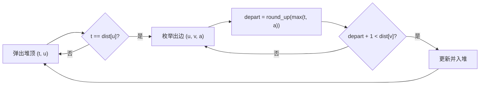

# T4 漫展通勤 / expo（CSP-J 第二轮模拟 · 第 3 套）

> 题面唯一来源：[`../problem.txt`](../problem.txt)（`== T4 漫展通勤 / expo ==` 一节）；整卷可读版 [`../paper.md`](../paper.md)。
> 本题知识点对齐真题 **CSP-J 2023 T4 旅游巴士（洛谷 P9751）**：那年的 T4，J 组最难的"带等待约束的最短路"。

## 元信息

| 项目 | 内容 |
| --- | --- |
| 难度 | 普及+/提高-（模拟卷 T4，对应 100 分） |
| 来源 | 自编仿真题（非真题），对齐 CSP-J 2023 T4 |
| 标签 | 图论、最短路、Dijkstra、时间相关边权 |
| 时间复杂度 | O((n + m) log n)，本机满数据随机图 0.039 s（最快一次） |
| 空间复杂度 | O(n + m) |
| 评测状态 | 未本地评测（模拟卷无 OJ）；本机与 `brute.cpp` 随机对拍 5000 组全部一致，样例与极限数据见下 |

## 题目大意

$n$ 个路口、$m$ 条**单向**马路，走任何一条都恰好 1 分钟；第 $i$ 条从 $u_i$ 通向 $v_i$，且在 $a_i$ 时刻才开通（上路那一刻的时刻 $\ge a_i$ 才能走）。小 K 在 0 时刻从路口 1 出发，怪癖是**每次站在路口准备上路时，时刻必须正好是 $k$ 的倍数**；等待不额外计成本，也不许在马路上停留。到达路口 $n$ 后立刻结束（不用再等）。求最早到达时刻，到不了输出 `-1`。

- 输入：第一行 `n m k`；接下来 $m$ 行每行 `u v a`
- 输出：一行一个整数
- 数据范围：$2 \le n \le 10^4$，$1 \le m \le 2\times 10^4$，$2 \le k \le 100$，$0 \le a_i \le 10^6$，$u_i \ne v_i$，**允许重边**
- 术语：**松弛**指"用已知的点去更新邻居的答案"；**dist[u]** 指从 1 号路口到 $u$ 的**最早到达时刻**；**round_up(x)** 指"不小于 $x$ 的第一个 $k$ 的倍数"，代码里就是 `(x + k - 1) / k * k`。

本机实测（编译命令 `g++ -static -O2 -std=c++14 solution.cpp -o /tmp/s3t4.exe`）：

| 输入 | `solution.cpp` | `brute.cpp` | 题面期望输出 |
| --- | --- | --- | --- |
| 样例 1（`3 3 2`，边 `1 2 0 / 2 3 1 / 1 3 5`） | `3` | `3` | `3` |
| 样例 2（`2 1 3`，边 `1 2 1`） | `4` | `4` | `4` |
| 样例 3（`4 2 2`，终点 4 没有入边） | `-1` | `-1` | `-1` |

## 思路推导

### 1. 暴力想法与瓶颈

这题的"想法"有四个坑，本机各写了一份错码，跑三个样例的结果全都在下表里（**注意它们错得有多像对的**）：

| 错误写法 | 样例 1 | 样例 2 | 样例 3 | 错在哪 |
| --- | --- | --- | --- | --- |
| ① 忽略 $a_i$ 和 $k$，直接 BFS 数边数 | `1` | `1` | `-1` | 边权不是 1，是"1 + 等待" |
| ② 只等 $k$ 的倍数，忘了马路要 $a_i$ 才开通 | `1` | `1` | `-1` | 少了 `max(t, a)` |
| ③ 只等到开通时刻，忘了 $k$ 的倍数 | `2` | `2` | `-1` | 少了 round_up |
| ④ round_up 写成向下取整 `x / k * k` | `1` | `1` | `-1` | "等到过去"，等于没等 |
| 正解 | `3` | `4` | `-1` | — |

真正"正确但慢"的暴力是把**时刻当成图的一层**做 BFS：状态 $(u, t)$，转移是"等 1 分钟"或"$t \bmod k = 0$ 且 $t \ge a_i$ 时走边"。随卷 `brute.cpp` 就是这么写的，但它把数组开死成 `N = 12`、`B = 400`。本机实测输入 `3 2 2 / 1 2 0 / 2 3 500`（正确答案 `501`）时它输出 `-1` —— 时间维一越界就废了。而 $a_i$ 最大 $10^6$、$n$ 最大 $10^4$，状态数上限是 $10^4 \times 10^6 = 10^{10}$，这条路根本走不通。

瓶颈：**能不能不给"时刻"开一维，只在每个路口存一个数？**

### 2. 关键观察

记站在 $u$ 的时刻为 $t$，走边 $(u, v, a)$：

$$\text{depart} = \text{round\_up}(\max(t, a)), \qquad \text{arrive} = \text{depart} + 1$$

- **观察 A（等待是"往上取整"，不是额外代价）**：$\text{round\_up}(x) - x \in [0, k-1]$，所以一条边的实际耗时在 $[1, k]$ 之间，**恒正**。恒正就还能用 Dijkstra，只是不能用 BFS。
- **观察 B（早到永远不亏 —— 这是本题能省掉时间维的唯一理由）**：$\max(t,a)$ 和 round_up 都对 $t$ **单调不减**，所以"更早到达 $u$"能模仿"更晚到达 $u$"的一切后续走法（晚到的那次等待，早到的那次站着等就行）。于是每个路口只需保留一个最早时刻 `dist[u]`，不需要 `dist[u][t mod k]`。
- **观察 C（$k$ 的倍数只在"上路那一刻"检查）**：到达 $v$ 的时刻 $\text{depart}+1$ 完全可以是任意数，下一段再 round_up 即可。样例 1 的 $1 \to 2 \to 3$ 就是 1 时刻到路口 2、等到 2 时刻才上路。
- **观察 D（到达终点不用再等）**：答案是 `dist[n]` 本身，**不要**对它 round_up，否则会多算最多 $k-1$ 分钟。
- **观察 E（值域）**：最优路径是简单路径（绕环只会更晚），至多 $n-1$ 条边，每边至多贡献 $k$ 分钟 ⇒ 答案 $\le 10^6 + 10^4 \times 100 \approx 2\times 10^6$，`int` 放得下；本机最坏链式数据实测 `1999801`。用 `long long` 只是省心。

### 3. 算法设计

标准 Dijkstra，只把"边权 1"换成"按当前时刻现算的到达时刻"：

1. 建图：`e[u].push_back({v, a})`，重边全部保留（同一对点取 $a$ 最小的那条其实也安全，但没必要冒险）。
2. `dist[1] = 0`，其余 $+\infty$；最小堆里放 `(时刻, 路口)`。
3. 弹出堆顶 $(t, u)$：
   - 若 `t != dist[u]`，这是**旧记录**，直接 `continue`；
   - 否则对每个出边 $(u, v, a)$ 算 `depart = round_up(max(t, a))`，`nd = depart + 1`，若 `nd < dist[v]` 就更新并把 `(nd, v)` 压堆。
4. 堆空后输出 `dist[n] == INF ? -1 : dist[n]`。

### 4. 正确性说明

**引理 1（FIFO / 早到不亏）**：边到达函数 $g(t) = \text{round\_up}(\max(t,a)) + 1$ 在 $t$ 上单调不减。设某条完整路线在时刻 $t_2$ 到 $u$ 并最终 $A$ 分钟到终点；若存在另一条更早到 $u$ 的走法（$t_1 \le t_2$），把 $u$ 之后的走法原样照抄，每一步的出发时刻都不晚于原方案（$g$ 单调），到终点时刻 $\le A$。故"到 $u$ 的最早时刻"支配所有更晚时刻，`dist[u]` 一维足够。

**引理 2（贪心可定）**：由观察 A，每条边实际权 $\ge 1 > 0$。Dijkstra 弹出 $u$ 时，任何"还没定下来"的到 $u$ 的路径都要先经过某个仍在堆里的点 $x$，其 $\text{dist}[x] \ge \text{dist}[u]$，再走正权边只会更大 ⇒ 弹出即最优，`dist[u]` 从此不再变化。

**引理 3（旧记录跳过是必需的）**：同一个点会被多次压堆（每次改进一次）。若跳过 `continue`，一条被更新的旧记录还会被完整扩展一遍，最坏情况退化成 $O(nm)$ 次扩展。本机构造数据实测（$5000$ 条 $1 \to 2$ 的重边，$a$ 依次变小，保证每一条都能把 `dist[2]` 改进一次；2 号点再连 $9998$ 条出边）：**留着这行 0.034 s，去掉这行 0.619 s**（各取多次运行的最快值），答案同为 `301`。

**定理**：由引理 1 状态压缩合法，由引理 2 弹出顺序正确，由松弛定义 $\text{dist}[v] = \min_{(u,v)} g_{u,v}(\text{dist}[u])$ 恰是"最早到达时刻"的递推式，故输出即答案；`dist[n]` 保持 $+\infty$ 当且仅当 1 到 $n$ 无可达路径，此时输出 `-1`。$\blacksquare$

### 5. 复杂度分析

- 时间：每条边至多引起一次成功松弛、一次压堆 ⇒ 堆操作 $O(m \log m)$，扩展 $O(n + m)$，合计 $O((n+m)\log n)$。本机满数据（$n = 10^4$、$m = 2\times 10^4$、$k = 100$、$a_i$ 取满 $10^6$）三组数据各跑 7 次取最快：随机图 **0.039 s**、链式数据 **0.036 s**、不可达数据（$m$ 条边全是自环）**0.033 s**。对照参考：同机喂一个近乎空的输入（`1 0 1`）也要 0.009～0.019 s，那是进程启动加运行时链接的固定开销（同一台机器换时间测量，这个地板能从 0.01 s 漂到 0.1 s，别把它当常数）——所以上面三档的差别其实都在噪声里，能得出的结论是"满数据稳在 0.06 s 以内，比 1 s 时限宽裕得多"。
- 空间：邻接表 $O(n + m)$，`dist` 与堆 $O(n + m)$。
- 对拍：本机随机 5000 组（$n \in [2,6]$、$m \in [1,10]$、$k \in [2,4]$、$a \in [0,20]$，生成器写在 `../../verify.js` 的 SPEC 里）与 `brute.cpp` **0 处不一致**；超出 `brute.cpp` 的 `B = 400` 时间维之后，改用上面第 1 节的构造例逐条核对。

## 可视化讲解



交互式演示见同目录 [`visualization.html`](visualization.html)：默认载入样例 1。图上每条边都标了"$a_i$ 开通 + 本步要等到几"，**等待的那几分钟用橙色加粗段单独画出来**，旁边是 `dist` 表与堆的内容，每一步只推进"弹一个点 / 松弛一条边"。

## 讲解代码

完整逐段注释版见 [`solution.cpp`](./solution.cpp)，讲课时只写这两段：

```cpp
inline ll round_up(ll x) { return (x + k - 1) / k * k; }   // 不小于 x 的第一个 k 倍数

while (!pq.empty()) {
    PLI cur = pq.top(); pq.pop();
    int u = cur.second;
    if (cur.first != dist[u]) continue;                    // 旧记录，跳过
    for (int i = 0; i < (int)e[u].size(); i++) {
        int v = e[u][i].first, a = e[u][i].second;
        ll depart = round_up(max(cur.first, (ll)a));       // 先等到开通，再等到 k 的倍数
        ll nd = depart + 1;                                // 走 1 分钟
        if (nd < dist[v]) { dist[v] = nd; pq.push(make_pair(nd, v)); }
    }
}
printf("%lld\n", dist[n] == INF ? -1 : dist[n]);           // 到终点不用再等
```

## 易错点与坑

- **`max(t, a)` 与 round_up 少一个都不行**：见第 1 节表格，四种错法在样例上分别输出 `1 1 -1`、`1 1 -1`、`2 2 -1`、`1 1 -1`，**样例 3 谁都过**，所以务必自己造"能区分"的小数据。
- **round_up 写成 `x / k * k`**：这是向下取整，等于"把等待时间变成负数"，实测样例 1 输出 `1`。向上取整的写法只有 `(x + k - 1) / k * k`（或 `((x + k - 1) / k) * k`），别写成 `(x + k) / k * k`（会让 $x$ 恰为倍数时多等一整轮 $k$）。
- **忘了跳过旧记录**：答案仍然对，但复杂度失去保证；本机构造数据实测 0.034 s → 0.619 s（见引理 3）。
- **给答案再 round_up 一次**：题面说"到达 $n$ 之后就结束了，不需要再等"，多这一步最多亏 $k-1$ 分钟。
- **想开 `dist[u][t % k]` 的分层图**：观察 B 已经证明不需要；真开了反而 $10^4 \times 100 = 10^6$ 个状态、边也要复制 $k$ 份，容易写崩。
- **重边**：$m$ 条边里同一对点可能有多条且 $a$ 不同，邻接表要全存；用"只留 $a$ 最小的一条"虽然本题恰好安全（$g$ 对 $a$ 单调），但别在别的题上手滑这么优化。
- **`INF` 与 `-1` 的判定**：`dist[n] == INF` 才输出 `-1`；写 `dist[n] >= INF/2` 也行，但别写 `dist[n] == -1`（初值不是 -1）。
- **`max` 的两个参数类型要一致**：`max(cur.first, (ll)a)`，漏掉 `(ll)` 在某些编译器下直接编译报错（`std::max` 要求同类型）。

## 常见变式

| 变式 | 差异 | 对应题号 |
| --- | --- | --- |
| 原型真题：旅游巴士（每 $k$ 分钟一班，问最少等车时间） | 同样是"出发时刻受整除约束"，只是把 1 分钟车程换成班次 | P9751（CSP-J 2023 T4 旅游巴士） |
| 子任务 1—3：$n \le 10$、$a_i = 0$ | 直接搜索/状压枚举路径即可 | 本题 15 分档 |
| 子任务 8—11：每个路口出边 $\le 1$（图退化成链） | 沿链模拟一次即可，$O(n)$；不写特判也行，完整 Dijkstra 在链式满数据上本机 0.036 s | 本题 20 分档 |
| 子任务 12—15：$a_i \le 100$ | 把时刻当一层的 BFS 能过（状态 $n \times 10^3$），也就是随卷 `brute.cpp` 的思路 | 本题 15 分档 |
| 需要输出具体走哪几条路 | 松弛时记 `pre[v] = u`，最后从 $n$ 回溯 | 讨论课练习 |
| 边权不再是 1，而是 $w_i$ 分钟 | 公式改成 `depart + w`，只要 $w > 0$ 结论不变 | 讨论课练习 |

## 一句话提炼（板书）

**"要等到 k 的倍数才能走"不破坏 Dijkstra：把边权写成 `round_up(max(t, a)) + 1`，只要"早到永远不亏"（FIFO），每个路口就只需要一个最早时刻 —— 时间相关的最短路，先证单调性，再谈算法。**
