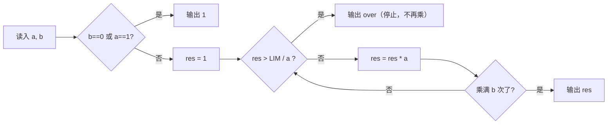

# T1 伤害溢出 / power（CSP-J 第二轮模拟 · 第 4 套）

> 题面唯一来源：[`../problem.txt`](../problem.txt)（`== T1 伤害溢出 / power ==` 一节）；整卷可读版 [`../paper.md`](../paper.md)。
> 本题知识点对齐真题 **CSP-J 2022 T1 乘方（洛谷 P8813）**：那题判 $a^b$ 是否超过 $10^9$，本题把"存档字段"换成伤害倍率，判定线一样是 $10^9$。

## 元信息

| 项目 | 内容 |
| --- | --- |
| 难度 | 入门（模拟卷 T1，对应 100 分） |
| 来源 | 自编仿真题（非真题），对齐 CSP-J 2022 T1 |
| 标签 | 模拟、贪心式提前终止、溢出判定、整数除法 |
| 时间复杂度 | $O(\min(b,\ \log_a 10^9))$，实际最多 30 次乘法 |
| 空间复杂度 | $O(1)$ |
| 评测状态 | 未本地评测（模拟卷无 OJ）；本机与 `brute.cpp` 随机对拍 5000 组 + 14 组边界数据，0 处不一致 |

## 题目大意

给攻击力 $a$ 和叠层数 $b$，要算 $a^b$。存档字段只能存到 $10^9$，所以 $a^b$ **严格大于** $10^9$ 时输出 `over`，否则输出这个数。

- 输入：一行两个整数 $a$、$b$
- 输出：$a^b$ 的值，或字符串 `over`
- 数据范围：$1 \le a \le 10^9$，$0 \le b \le 10^9$；约定 $b=0$ 时 $a^b = 1$
- 术语：**溢出**指算出来的数超出了变量能装的范围。`long long` 能装到约 $9.22 \times 10^{18}$，再大就会"绕回去"变成别的数甚至负数（见第 2 节实测）。

本机实测（`g++ -static -O2 -std=c++14 solution.cpp -o /tmp/s4t1.exe`，用 stdin 重定向喂数据）：

| 输入 | `solution.cpp` | `brute.cpp` | 备注 |
| --- | --- | --- | --- |
| `10 9` | `1000000000` | `1000000000` | 恰好等于 $10^9$，**不算** over |
| `10 10` | `over` | `over` | |
| `2 29` | `536870912` | `536870912` | |
| `1 1000000000` | `1` | `1` | 正解 0.047 s，暴力 1.607 s |

## 思路推导

### 1. 暴力想法与瓶颈

最直觉的做法：老老实实乘 $b$ 次，最后和 $10^9$ 比。本机把 `long long` 的硬算结果直接打印出来（一份 7 行的对照程序，跑完退出码 0）：

| $a$ | $b$ | 硬算 $b$ 次得到的 `long long` 值 | 真实 $a^b$ | 后果 |
| --- | --- | --- | --- | --- |
| 10 | 20 | `7766279631452241920` | $10^{20}$ | 已经是个"假数"，碰巧还大于 $10^9$ |
| 2 | 70 | `0` | $\approx 1.18 \times 10^{21}$ | 绕回 0，会被判成"值等于 0"，**答案错** |
| 3 | 40 | `-6289078614652622815` | $\approx 1.22 \times 10^{19}$ | 绕成**负数**，**答案错** |

第二个瓶颈是**次数**：$b$ 可达 $10^9$，硬要乘 $b$ 次就是 $10^9$ 次循环。实测 `brute.cpp` 处理 `1 1000000000`（$1$ 乘一亿亿次次都是 1，永远不会超）花 **1.607 s**，而正解 **0.047 s**（其中大部分还是进程启动开销）。

### 2. 关键观察

- **观察 A（根本不用乘出来）**：题目只问"$a^b$ 是否 $> 10^9$"，是一句**比较**，不是一个**值**。比较可以在乘之前做。
- **观察 B（除法版本最稳）**：想判断"再乘一次 $a$ 会不会超过 `LIM`"，等价于判断 $\text{res} \cdot a > \text{LIM}$。把 $a$ 除到右边变成 $\text{res} > \lfloor \text{LIM}/a \rfloor$，这个式子**左边是已有的 res，右边是常数除法，两边都不会溢出**。整数除法是**下取整**，所以 $\text{res} \cdot a > \text{LIM} \iff \text{res} > \lfloor \text{LIM}/a \rfloor$ 对 $a \ge 1$ 完全等价（第 4 节证明）。
- **观察 C（最多 30 次）**：一旦 $a \ge 2$，$2^{30} = 1073741824 > 10^9$，所以循环顶多 30 次就会被观察 B 拦下。实测 `2 1000000000` 只循环 **30** 次、`1000000000 1000000000` 只循环 **2** 次。
- **观察 D（两个必须特判的入口）**：$a = 1$ 时乘多少次都是 1，永远不会 over，但循环要跑 $b$ 次 → 特判；$b = 0$ 时按约定是 1 → 也走同一句特判。

### 3. 算法设计

1. 若 `b == 0 || a == 1`，直接输出 `1` 结束。
2. `res = 1`，重复 $b$ 次：先判 `res > LIM / a`，成立就输出 `over` 结束；否则 `res *= a`。
3. 循环正常跑完说明 $a^b \le 10^9$，输出 `res`。

`LIM = 1000000000LL` 必须写 `LL` 后缀；`a`、`b`、`res` 全部用 `long long`。

### 4. 正确性说明

**引理 1（判定等价）**：设 $a \ge 2$、$\text{res} \ge 1$、$a \cdot \text{res}$ 是下一步要做的乘法。记 $q = \lfloor \text{LIM}/a \rfloor$，则 $\text{LIM} - aq \in [0, a-1]$。
若 $\text{res} > q$，即 $\text{res} \ge q+1$，则 $a\,\text{res} \ge aq + a > \text{LIM}$；
若 $\text{res} \le q$，则 $a\,\text{res} \le aq \le \text{LIM}$。
所以"循环里恰好在这一刻输出 over"与"$a^b$ 第一次真正超过 $\text{LIM}$"是同一件事，且过程中 $\text{res} \le \text{LIM}$ 恒成立（不会先溢出再比较）。$\blacksquare$

**引理 2（边界取不取等）**：题面要求"**严格**大于 $10^9$ 才算溢出"。当 $\text{res} = q$ 且 $a \mid \text{LIM}$ 时 $a\,\text{res} = \text{LIM}$，引理 1 的第二种情形取到等号，此时**不该**报 over。这正是必须写 `>` 而不能写 `>=` 的原因：本机实测把判定改成 `res >= LIM / a` 后，`10 9` 输出 `over`（正确应为 `1000000000`），`1000 3` 也输出 `over`（应为 `1000000000`）。

**引理 3（特判不漏）**：$b=0$ 时 $a^0 = 1 \le 10^9$；$a=1$ 时 $1^b = 1 \le 10^9$。两者都输出 1，与循环版本（0 次乘法 → res 仍是 1）一致，特判只是省掉 $10^9$ 次空转。

其余情形由引理 1 保证循环在第 $b$ 次之前或恰好第 $b$ 次给出正确结论。

### 5. 复杂度分析

- 时间：特判 $O(1)$；否则循环 $\min(b,\ \lceil \log_a 10^9 \rceil + 1)$ 次，$a \ge 2$ 时不超过 31 次，即 $O(\log \text{LIM})$ 的常数级。
- 空间：只用 $a, b, res$ 三个变量，$O(1)$。
- 随机对拍：5000 组与 `brute.cpp` 全一致（`verify/RESULTS.md`），另在写作时手工加过 $a=1$、$b=0$、$a=10^9$、恰好 $10^9$ 边界等 14 组；`brute.cpp` 用 `__int128` 真的乘到底再比，所以它只能验证正确性，不能当"更快"的参考——它同样没有特判 $a=1$。

## 可视化讲解



分步演示见同目录 [`visualization.html`](visualization.html)：**两条轨道并排跑**——左轨"硬算"每次都真的乘、按 `long long` 的 64 位回绕规则显示结果（能看到它什么时候变成负数、什么时候绕成 0），右轨"提前判"显示 $\lfloor \text{LIM}/a \rfloor$ 与当次判定，两边一起停。可以改 $a$、$b$，也可以一键载入 `3 40`、`2 70` 这两个翻车样例。

## 讲解代码

完整逐段注释版见 [`solution.cpp`](./solution.cpp)，关键片段（讲课时只写这两段）：

```cpp
const ll LIM = 1000000000LL;
if (b == 0 || a == 1) { printf("1\n"); return 0; }   // 不特判就要空转 b 次，b=1e9 直接 TLE
ll res = 1;
for (ll i = 0; i < b; i++) {
    if (res > LIM / a) { puts("over"); return 0; }    // 溢出前判定：除法在乘之前
    res *= a;                                         // 走到这里 a*res <= LIM，绝对不会绕
}
printf("%lld\n", res);
```

## 易错点与坑

- **先乘再判**：`if (res * a > LIM)`。本机实测用 `int` 存 `res` 的这种写法：`6 13` 输出 `175792128`（真值 $6^{13}=13060694016$，应报 over），`1000000000 2` 输出 `-1486618624`。判定发生在伤害已经造成之后。
- **硬算完再比**：见第 1 节表，$2^{70}$ 绕成 `0`、$3^{40}$ 绕成负数。这是本题最贵的一类错，样例往往测不到（样例最大才 $10^{10}$）。
- **`>` 写成 `>=`**：引理 2，$10^9$ 这个边界值恰好属于"不溢出"，实测 `10 9`、`1000 3` 会错。
- **忘记特判 $a=1$**：$b$ 可达 $10^9$，实测这份暴力要 1.607 s；换成 $10^9$ 规模的评测时限就没了。
- **`LIM` 写成 `1e9`**：`1e9` 是 `double`，比较会走浮点；常数要写 `1000000000LL`。
- **$a$ 可能整除 $10^9$，也可能不整除**：判定用整数除法下取整，别改成 `double` 除法（$10^{9}$ 级别还能忍，再大就丢精度）。
- **`for` 的计数变量**：和 $b \le 10^9$ 比，$b$ 用 `int` 勉强够（$<2^{31}$），但和 $a$ 相乘的一律 `long long`。

## 常见变式

| 变式 | 差异 | 对应题号 |
| --- | --- | --- |
| 乘方（真题原型） | 判定线同样是 $10^9$，$a,b$ 范围一致；官方期望写法就是"除法提前判" | P8813（CSP-J 2022 T1） |
| 本题伤害溢出 | 换个背景，多出"$b=0$ 约定为 1"这句说明 | 本题 |
| 求 $a^b \bmod p$ | 真的要值，用**快速幂**；这时溢出靠"每步取模"而不是除法 | P1226（快速幂） |
| 判 $a^b$ 是否 $> 10^{18}$ | 除法判定依然有效，但 `LIM / a` 要写成 `long long` 常数，且 $a$ 更要注意 $a=1$ | 讨论课练习 |

## 一句话提炼（板书）

**要判"a^b 超没超过 LIM"，别乘出来再比——把 a 除到右边判 `res > LIM / a`：乘法还没发生，溢出就无处发生；再特判 a=1 和 b=0，否则一亿次空转。**
