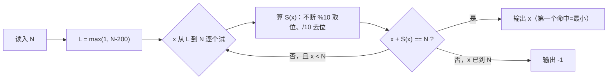

# T2 暗号解码 / decode（CSP-J 第二轮模拟 · 第 4 套）

> 题面唯一来源：[`../problem.txt`](../problem.txt)（`== T2 暗号解码 / decode ==` 一节）；整卷可读版 [`../paper.md`](../paper.md)。
> 本题知识点对齐真题 **CSP-J 2022 T2 解密（洛谷 P8814）**：那题是"已知 $x$ 求 $x+S(x)$ 的逆问题"，本题把背景换成群聊暗号，问法一致。

## 元信息

| 项目 | 内容 |
| --- | --- |
| 难度 | 普及-（模拟卷 T2，对应 100 分） |
| 来源 | 自编仿真题（非真题），对齐 CSP-J 2022 T2 |
| 标签 | 枚举、数位和、值域收缩（剪枝式暴力） |
| 时间复杂度 | $O(200 \times \log_{10} N)$，即常数级 |
| 空间复杂度 | $O(1)$ |
| 评测状态 | 未本地评测（模拟卷无 OJ）；本机与 `brute.cpp` 随机对拍 5000 组（$N \in [1,3000]$），另把 $N \le 20000$ 全量与"窗口 200"实现逐一对过，0 处不一致 |

## 题目大意

定义"暗号"为 $x + S(x)$，其中 $S(x)$ 是 $x$ 的**十进制数位之和**（例：$S(123) = 1+2+3 = 6$）。给暗号值 $N$，求**最小**的正整数 $x$ 使 $x + S(x) = N$，不存在则输出 `-1`。

- 输入：一行一个整数 $N$，$1 \le N \le 10^9$
- 输出：最小的 $x$，或 `-1`
- 术语：**数位和**就是把一个数写成十进制后把每一位数字加起来，0 不算进去也不影响结果。

本机实测（`g++ -static -O2 -std=c++14 solution.cpp -o /tmp/s4t2.exe`，stdin 重定向喂数据）：

| 输入 $N$ | `solution.cpp` | `brute.cpp` | 手算核对 |
| --- | --- | --- | --- |
| 8 | `4` | `4` | $4 + 4 = 8$ |
| 100 | `86` | `86` | $86 + 8 + 6 = 100$ |
| 1 | `-1` | `-1` | 最小的 $x=1$ 已经给出 $1+1=2 > 1$ |
| 1000000000 | `999999932` | 同值（暴力 11.41 s） | $999999932 + 68 = 10^9$ |
| 999999937 | `-1` | 同值（暴力 11.39 s） | 窗口内 201 个候选全灭 |

## 思路推导

### 1. 暴力想法与瓶颈

`brute.cpp` 写的是最诚实的做法：$x$ 从 $1$ 枚举到 $N$，第一个满足 $x + S(x) = N$ 的就是最小解。逻辑完全正确，问题是**试的次数**：本机实测 $N = 10^9$ 时暴力要 **11.41 s**（跑到 $x = 999999932$ 才命中），无解的 $N = 999999937$ 要 **11.39 s**（把 $1 \dots N$ 全试完）；正解同一份数据 **0.005 s**，只试 201 个候选。

瓶颈不是"每次算得慢"，而是"范围根本没必要开这么大"。

### 2. 关键观察

- **观察 A（$x$ 一定紧贴 $N$）**：$x + S(x) = N$ 且 $x \ge 1 \Rightarrow S(x) \ge 1$，所以 $x < N$。又 $N \le 10^9 \Rightarrow x \le 999999999$，最多 9 位，每一位最大是 9，于是
  $$S(x) \le 9 \times 9 = 81 \quad\Longrightarrow\quad x = N - S(x) \ge N - 81 .$$
  候选只剩 $[N-81,\ N]$ 这一段，共 82 个数。代码里枚举 $[\,N-200,\ N\,]$，200 是故意留的余量（注释写的 $9 \times 10 = 90$ 是按 10 位算的更松的界，同样正确）。
- **观察 B（要"最小"，所以从左往右扫）**：$x \mapsto x + S(x)$ **不单调**。本机实测 $f(99) = 99 + 18 = 117$，而 $f(100) = 100 + 1 = 101$，进位让数位和突然变小，函数值反而掉了。所以不能二分，只能从小到大扫，第一个命中即最小。
- **观察 C（无解很常见）**：本机把 $N \le 200000$ 全部扫一遍（`x` 从 1 到 200000 反推 $N = x + S(x)$，再查每个 $N$ 有没有原像），结果：**19562 个 $N$ 无解**（约 9.8%），**19524 个 $N$ 有两个以上原像**（"取最小"这句不是废话），有解的 $N$ 里最大间隔 $N - x = 45$（出现在 $N = 100044$）。
- **观察 D（界是紧的）**：$N = 999999979$ 时本机解出 $x = 999999899$，间隔 $80$，逼近理论上界 81。全量扫描也印证了这个界不是摆设：$N \le 20000$ 里最大间隔 36（$N = 10035$），$N \le 200000$ 里最大间隔 45，越接近 $10^9$ 数位越多，间隔就越是往 81 靠。所以窗口取 82 才刚好够，取 200 更保险，取 10 一定漏解。

### 3. 算法设计

1. 写一个 $S(x)$：`while (x) { s += x % 10; x /= 10; }`（注意传值，别改坏外面的变量）。
2. `for (x = max(1, N-200); x <= N; x++)`，从小到大，第一个使 `x + S(x) == N` 的 $x$ 直接输出并结束。
3. 循环走完还没命中 → 输出 `-1`。

$201$ 次循环，每次至多 10 步取位，总操作数约两千，常数级。

### 4. 正确性说明

**引理 1（解不越界）**：若 $x$ 是解，则 $1 \le x \le N - 1$，且 $x \le 999999999$（9 位以内），故 $S(x) \le 81$，于是 $x = N - S(x) \ge N - 81 \ge N - 200$。同时 $x \le N$。所以**任何解都落在枚举区间里**，缩小窗口不丢解。

**引理 2（第一个命中就是最小解）**：枚举按 $x$ 严格递增进行，命中的集合是解集 $\cap [N-200, N]$。由引理 1 这个交集等于整个解集，故其中最小者即全局最小解，"从小到大 + 立刻 return"给出的正是它。

**引理 3（无解判定正确）**：若区间内无 $x$ 满足等式，由引理 1 区间外也不可能有解，故答案确实是 `-1`。$\blacksquare$

**为什么不能用二分**：观察 B 给了反例 $f(99) = 117 > 101 = f(100)$，函数不单调，二分的前提不成立。

### 5. 复杂度分析

- 时间：$O(W \log N)$，窗口 $W = 201$ 是常数 → 实测 $N = 10^9$ 时 **0.005 s**（5 次取最快，含进程启动），$N = 999999937$（无解，要把 201 个候选全试完）同样 **0.005 s**。
- 空间：$O(1)$。
- 对照：暴力 $O(N \log N)$，$N = 10^9$ 实测 **11.4 s**。
- 对拍：随机 5000 组（$N \in [1,3000]$，生成器在 `../../verify.js`）与 `brute.cpp` 全一致；另外把 $N \le 20000$ **全量**用两份独立实现对撞（一份按 $x$ 升序反推 $N = x + S(x)$ 得到最小原像表，一份就是代码里的窗口扫 $[N-200, N]$），0 处不一致——这个范围里有 1961 个 $N$ 无解（约 9.8%），1931 个 $N$ 有两个以上原像。

## 可视化讲解



分步演示见同目录 [`visualization.html`](visualization.html)：上面一条**候选带**把 $[N-200, N]$ 画成一排格子，其中 $[N-81, N]$ 用绿色底标出"唯一可能有解的地方"；下面一排条形图是 $f(x) = x + S(x)$，红色虚线是目标 $N$，第一个顶到虚线的格子就是答案；旁边同步显示数位和的逐位拆解。默认载入样例 $N = 100$，可改输入，也给了 `8 / 1 / 999999979 / 999999937` 等预设。

## 讲解代码

完整逐段注释版见 [`solution.cpp`](./solution.cpp)，关键片段：

```cpp
ll S(ll x) {                      // 数位和：传值，x 在函数里被除光也不影响外面
    ll s = 0;
    while (x) { s += x % 10; x /= 10; }
    return s;
}
for (ll x = max(1LL, N - 200); x <= N; x++) {   // 从小到大 ⇒ 第一个命中就是最小解
    if (x + S(x) == N) { printf("%lld\n", x); return 0; }
}
puts("-1");                                     // 窗口内没有 ⇒ 全局没有（引理 1）
```

## 易错点与坑

- **窗口开太小**：只枚举 $[N-10, N]$ 会漏解。本机实测 $N = 999999979$ 的最小解是 $999999899$，间隔 **80**；$N \le 200000$ 全量扫描的最大间隔是 45。理论上界 81，取 200 才安心。
- **忘了 `max(1, ...)`**：$N \le 200$ 时 $N - 200$ 是负数或 0，$S(0) = 0$ 会让 $x = 0$ 满足 $0 + 0 = 0$，$N = 0$ 不在数据范围内，但 $x$ 取 0 或负数没有任何意义，还会白跑循环。
- **想用二分**：见观察 B，$f$ 不单调，实测 $f(99) = 117 > f(100) = 101$。
- **从右往左扫**：这样找到的是**最大**的 $x$，不是最小。题目要最小，必须从左往右。
- **$S(x)$ 用 `x` 的引用或全局变量**：算完数位和 $x$ 变成 0，循环条件立刻失效。
- **数据类型**：$N$ 到 $10^9$，`int` 勉强装得下（$< 2^{31}$），但 `N - 200` 为负时 `unsigned` 会绕成天文数字；统一 `long long` 最省事。
- **输出 `-1` 的位置**：必须在循环**外面**，写在循环里会在第一个不匹配的 $x$ 就输出。

## 常见变式

| 变式 | 差异 | 对应题号 |
| --- | --- | --- |
| 解密（真题原型） | 同样求 $x + S(x) = N$ 的最小 $x$，值域到 $10^9$ | P8814（CSP-J 2022 T2） |
| 自数（Self Number） | 反过来：给定区间，找出所有**没有**原像的 $N$，用筛法 $O(N)$ 标记 | 洛谷 P1719 类"生成数"题 |
| $x + S(x) + S(S(x)) = N$ | 窗口上界变大，但仍是"减去的量有界 ⇒ 只搜尾部" | 讨论课练习 |
| 判 $a^b$ 是否越界 | 同一种"不真算，先估范围"的思路 | P8813（CSP-J 2022 T1，本卷 T1） |

## 一句话提炼（板书）

**$x+S(x)=N$ 里 $S(x)$ 最多 81，所以 $x$ 只能躲在 $N$ 前面 81 个格子里：从 $N-200$ 往右扫，第一个命中的就是最小解，扫完没有就是 -1。**
