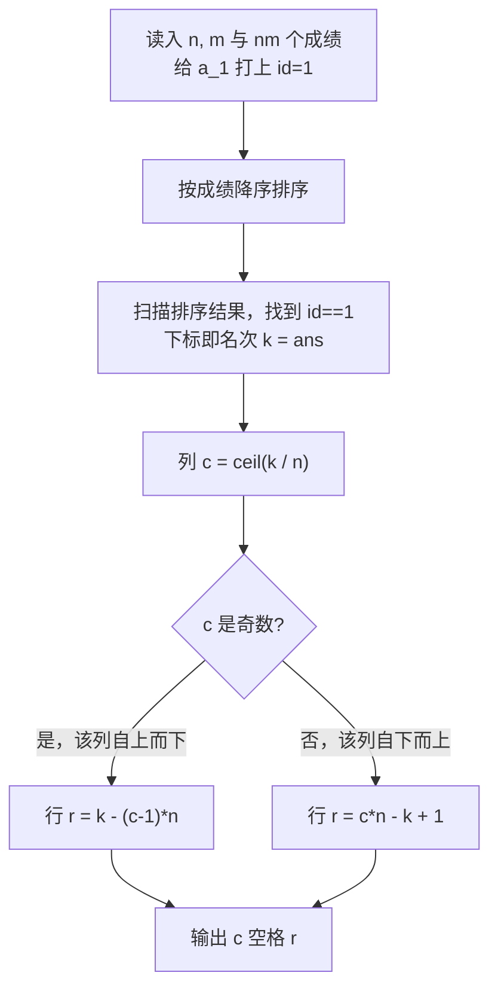

# P14358 [CSP-J 2025] 座位

> 原题链接：<https://www.luogu.com.cn/problem/P14358>

## 元信息

| 项目 | 内容 |
| --- | --- |
| 难度 | 洛谷难度等级 2（普及-/入门），满分 100 |
| 来源 | CSP-J 2025 第二轮 T1 |
| 标签 | 模拟、排序、下标推导（官方标签 ID：1, 5, 62, 108, 113, 343） |
| 时间复杂度 | $O(nm \log(nm))$（排序主导） |
| 空间复杂度 | $O(nm)$ |
| 评测状态 | 逻辑经对拍验证正确（见下文"验证结论"） |

## 题目大意

考场有 $n$ 行 $m$ 列，共 $n \times m$ 名考生，第一轮成绩**两两不同**。按成绩从高到低**蛇形就座**，但蛇形是**沿列方向**走的：

- 第 $1$ 列从上往下填满（第 $1$ 行 → 第 $n$ 行）；
- 第 $2$ 列从下往上填（第 $n$ 行 → 第 $1$ 行）；
- 第 $3$ 列再从上往下，如此交替。

已知所有成绩 $a_1, a_2, \dots, a_{nm}$，其中 $a_1$ 是小 R 的成绩，求小 R 的**第几列 第几行**（输出顺序是先列后行）。

数据范围：$1 \le n, m \le 10$，$1 \le a_i \le 100$ 且互不相同。

以 $n=2, m=2$ 为例，若成绩从高到低为 $100, 99, 98, 97$：

| | 第 1 列 | 第 2 列 |
| --- | --- | --- |
| **第 1 行** | 100 | 98 |
| **第 2 行** | 99 | 97 |

## 思路推导

### 1. 暴力想法

直接模拟：把成绩降序排序，然后拿着一个指针在网格里按"下→上→下→上"的顺序走 $nm$ 步，边走边记录每个人落在哪个格子，最后找到小 R 的位置。$n, m \le 10$，格子最多 100 个，怎么模拟都来得及。

这条路完全正确，但代码要维护方向变量，容易写错。

### 2. 关键观察

**不需要真的建网格，只需要"名次"这一个量。**

设小 R 的成绩在全部 $nm$ 人中排第 $k$ 名（降序，$1 \le k \le nm$）。由于每一列恰好放 $n$ 个人，蛇形只是"每列内部方向交替"，于是：

- **列号**只由名次决定：$c = \lceil k / n \rceil$；
- **行号**看该列是正向还是反向：
  - $c$ 为奇数（自上而下）：$r = k - (c-1)n$；
  - $c$ 为偶数（自下而上）：$r = cn - k + 1$。

### 3. 算法设计

1. 读入时给每个成绩打上原始下标 $id$，$a_1$ 的 $id = 1$；
2. 按成绩降序排序；
3. 排序后扫一遍找到 $id == 1$ 的位置，即为名次 $k$（代码里的 `ans`）；
4. 套上面两个公式输出 $c, r$。

### 4. 正确性说明

- **列公式**：前 $c-1$ 列共占 $n$ 个名次，第 $c$ 列覆盖名次 $(c-1)n+1 \sim cn$。因此名次 $k$ 落在满足 $(c-1)n < k \le cn$ 的唯一 $c$，即 $c = \lceil k/n \rceil$。
- **行公式（奇数列）**：该列内名次 $k$ 是第 $k-(c-1)n$ 个被放置的人，而奇数列从第 $1$ 行开始逐行向下，故 $r = k-(c-1)n$。
- **行公式（偶数列）**：偶数列从第 $n$ 行开始逐行向上，第 $t$ 个被放置的人在 $n-t+1$ 行。令 $t = k-(c-1)n$：

$$r = n - (k-(c-1)n) + 1 = cn - k + 1$$

三个分支的边界（$k=1$、$k=cn$、$k=(c-1)n+1$）代入都能对上，故推导闭合。成绩互不相同保证名次 $k$ 唯一，不存在排序并列导致的歧义。

### 5. 复杂度分析

排序 $O(nm\log(nm))$，查找名次 $O(nm)$。$nm \le 100$ 时可忽略不计。也可用"数有多少个成绩比 $a_1$ 大"在 $O(nm)$ 内直接得到名次，省掉排序。

## 可视化讲解



名次到座位的映射长这样（$n=4, m=5$，数字为名次 $k$）：

| 名次＼列 | 第 1 列↓ | 第 2 列↑ | 第 3 列↓ | 第 4 列↑ | 第 5 列↓ |
| --- | --- | --- | --- | --- | --- |
| 第 1 行 | 1 | 8 | 9 | 16 | 17 |
| 第 2 行 | 2 | 7 | 10 | 15 | 18 |
| 第 3 行 | 3 | 6 | 11 | 14 | 19 |
| 第 4 行 | 4 | 5 | 12 | 13 | 20 |

可以肉眼验证：每列奇偶方向交替，且 $c = \lceil k/4 \rceil$ 与列号一致。

**交互式演示**：打开同目录的 `visualization.html`，可输入任意 $n, m$ 与成绩，看到蛇形填充动画、名次高亮和公式代入过程。

## 讲解代码

原始实现见 `solution.cpp`（带逐段注释）。核心片段：

```cpp
sort(ar + 1, ar + 1 + n * m, cmp);        // 降序，cmp 为 a.x > b.x
for (int i = 1; i <= n * m; i++)
    if (ar[i].id == 1) ans = i;           // ans 即名次 k
int a1 = ceil(ans * 1.0 / n);             // 列号 c
if (a1 & 1) cout << a1 << " " << ans - (a1 - 1) * n;   // 奇数列：自上而下
else        cout << a1 << " " << a1 * n - ans + 1;     // 偶数列：自下而上
```

### 建议加固的三处写法

原逻辑正确，但有三处"依赖外部条件"的脆弱写法，考场上更稳的形式：

```cpp
int ans = -1;                          // 1) 显式初始化，不依赖"一定被赋值"
int c = (ans + n - 1) / n;             // 2) 整数上取整，避免浮点误差
if (i > 1 && ar[i].x == ar[i-1].x) {}  // 3) 若成绩可能并列，需先确认题意再决定同名次策略
```

其中第 2 点：`ans * 1.0 / n` 在本题（$ans \le 100$）不会出现误差，因为整数能被 double 精确表示且商恰好可表示时 IEEE 除法结果精确；但换成大数据或 $n$ 不整除的场景，`ceil` 的浮点写法就不如 `(ans + n - 1) / n` 可靠。

## 验证结论

本机现已有 `g++`（MinGW-w64），`solution.cpp` 已实机编译并跑过官方样例；此外把同一套逻辑逐行移植成 Node 脚本 `verify.js`，与"真按蛇形走格子"的暴力模拟器做大批量对拍（JS 只用于验算，不是题解代码）。复现：

```bash
g++ -static -O2 -std=c++14 -Wall solution.cpp -o sol.exe   # 编译通过，有 1 处 -Wmaybe-uninitialized 警告（见下）
"C:/Program Files/nodejs/node.exe" verify.js
```

| 检验项 | 结果 |
| --- | --- |
| `g++ -static -O2 -std=c++14 -Wall` 编译 `solution.cpp` | 通过；`ans` 未初始化 ⇒ 1 条警告（题面保证 `id==1` 必出现，逻辑上不会读到脏值，但写法要改：`int ans = -1;` + 找到后 `break;`） |
| 本机实跑洛谷 3 组官方样例 | 全部一致（`1 2` / `2 2` / `3 1`） |
| JS 移植版 vs "真按蛇形走格子"的暴力模拟，随机 200000 组（$n,m \in [1,10]$，成绩互不相同） | 不一致 0 组 |
| 特殊性质 A（$a_i = i$）、B（$a_i = nm-i+1$）× 边界 $n=1$/$m=1$/$10\times10$ | 全部一致 |

**结论：这份代码的算法与实现是正确的，能拿满分。** 如果实际提交只得到 85 分，问题几乎肯定不在这段逻辑，而在"提交版本与这份代码不一致"，常见差异点：

1. 输出顺序写成"行 列"而不是"列 行"（本题 $c$ 在前）；
2. 名次用 `a_1` 的**值**去比较而不是用 `id == 1` 定位；
3. 上取整写成 `ans / n + 1`（当 $n \mid ans$ 时多算一列，例如 $k=4, n=2$ 会算成第 3 列）；
4. 奇偶判断用了 $r$ 而不是列号 $c$。

要精确定位剩下的 15 分，需要提交页面的**测试点编号分布**（哪 3 个点 WA）。

## 易错点与坑

- **方向是按列不是按行**：题目给的是 $n$ 行 $m$ 列，但蛇形沿列走，每列 $n$ 人，除数是 $n$ 不是 $m$。这是本题最容易被读反的地方。
- **输出先列后行**：`cout << c << " " << r`。
- **成绩互不相同**是题目保证，因此不存在并列名次的处理；若去掉该保证，排序后 `id==1` 的位置会不唯一。
- `for` 里找到名次后没有 `break`，逻辑无碍但会多扫一遍。

## 常见变式

| 变式 | 差异 | 应对 |
| --- | --- | --- |
| 蛇形沿行走 | 每行 $m$ 人，除数变 $m$ | 把公式中所有 $n$ 换成 $m$ |
| 成绩可并列 | 名次不唯一 | 题目需额外规定同分排位规则 |
| 反过来：给定座位求名次 | 正向映射 | $k = (c-1)n + (c\text{奇} ? r : n-r+1)$ |

## 小结

蛇形/之字形排列的通用技巧：先用"每段长度"整除得到**段号**，再用段号奇偶决定**段内方向**，把方向差异吸收进一个条件分支，而不必真的去模拟指针移动。
