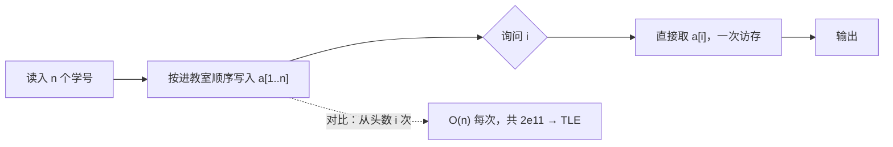

# P3156 【深基15.例1】询问学号

> 原题链接：<https://www.luogu.com.cn/problem/P3156>
> 本目录导航：[← 题库索引](../../../README.md) ｜ [题目原文](problem.txt) · [讲解代码](solution.cpp) · [元信息](metadata.yml) · [对拍脚本](verify.js) · [分步动画](visualization.html)

## 元信息

| 项目 | 内容 |
| --- | --- |
| 难度 | 入门 |
| 来源 | 洛谷 P3156（深基 15.例1） |
| 标签 | 数组、随机访问、模拟 |
| 时间复杂度 | $O(n+m)$ |
| 空间复杂度 | $O(n)$（$2\times10^6$ 个 int ≈ 8 MB） |
| 评测状态 | 本地 `g++ -static -O2 -std=c++14` 编译运行，样例输出 `1 8 5` 正确；与"从头数第 i 个人"的暴力随机对拍 200000 组 0 不一致；未在洛谷提交 |

## 题目大意

$n\le 2\times10^6$ 名同学按顺序进教室，给出他们的学号（$1\sim10^9$）。老师问"第 $i$ 个进来的同学学号是多少"，共问 $m\le10^5$ 次。

- 输入：`n m`；$n$ 个学号；$m$ 个询问 $i$
- 输出：$m$ 行答案
- 数据范围：$n\le2\times10^6$，$m\le10^5$，学号 $\le 10^9$

## 思路推导

### 1. 暴力想法与它的瓶颈

最直觉的做法是"每次询问都从头数第 $i$ 个人"：读入全部数据后，对每个 $i$ 走一遍计数。总代价 $n\cdot m\le 2\times10^{11}$，1 秒时限下差三个数量级，必 TLE。

另一个弯路是"用 `map<int,int>` 存 序号→学号"。$2\times10^6$ 个节点的红黑树，每节点约 40 字节（键、值、左右孩子、颜色、对齐），光节点就 80 MB 以上，再加 $O(\log n)$ 的查找，内存和时间双输。

瓶颈在于：把"第 $i$ 个"当成了需要检索的问题，而它其实就是一个下标。

### 2. 关键观察

#### 观察 1：输入顺序天然就是下标

题目按"进教室的顺序"给出学号，问的又是"第几个进教室"。同一个顺序既当存储序又当查询键 —— 第 $i$ 个进来的同学当初就写在 $a[i]$，答案是一次内存访问，不需要任何查找结构。

#### 观察 2：数组为什么能 $O(1)$

数组在内存里连续存放，`a[i]` 的地址 = 首地址 + $i\times$ 元素大小，一条加法指令算出来。这就是"随机访问"的定义，也是 `map`（要沿树走 $\log n$ 步）永远比不上的地方。

#### 观察 3：值域大不代表要用高级结构

学号到 $10^9$ 看着吓人，但我们**从不按学号查**，只按"第几个"查。值域只决定用 `int` 存（$10^9<2^{31}-1$，够），不决定用什么数据结构。这是本题最值得讲的一句判断法。

### 3. 算法设计

1. 全局数组 `int a[2000005]`；
2. `for i = 1..n: cin >> a[i]`；
3. 每个询问 $i$，输出 `a[i]`。

### 4. 正确性说明

对读入位置归纳：读第 $i$ 个数时，它是第 $i$ 个进教室的同学（输入顺序即进教室顺序），程序恰好写入 $a[i]$，故循环结束后不变式"$a[i]$ = 第 $i$ 个进教室同学的学号"对一切 $1\le i\le n$ 成立。询问直接读 $a[i]$，输出即答案。$\blacksquare$

### 5. 复杂度分析

时间 $O(n+m)$（读入 $n$、输出 $m$，每次询问 $O(1)$）；空间 $O(n)$ ≈ 8 MB，在 125 MB 限制内。

## 可视化讲解



分步演示见同目录 [`visualization.html`](visualization.html)：上排是带下标标签的格子，下排是"下标直取"与"从头数"两条路径的对比计数。

## 讲解代码

```cpp
const int MAXN = 2000005;
int a[MAXN];                       // 开在全局：8MB 放栈上会爆栈

for (int i = 1; i <= n; ++i) cin >> a[i];   // 进教室顺序 = 下标顺序
while (m--) { int i; cin >> i; cout << a[i] << '\n'; }  // 一次访存出答案
```

完整逐段注释版见 [`solution.cpp`](solution.cpp)。

### 机器实测记录

```
$ g++ -static -O2 -std=c++14 solution.cpp -o sol.exe
$ ./sol.exe < in1.txt
1
8
5
```

输入 `10 3 / 1 9 2 60 8 17 11 4 5 14 / 1 5 9`，与题面样例逐字节一致。
`node verify.js`：官方样例 OK；随机对拍 200000 组（下标直取 vs 从头数）0 不一致；定向边界 $n=1$、问第 1 个、问最后一个均 OK。

## 易错点与坑

- **数组必须开全局或加 `static`**：局部 `int a[2000005]` 在栈上，Windows 默认栈 1 MB，直接 RE。
- **多开一格**：下标从 1 用到 $n$，数组写 `a[2000000]` 时 `a[2000000]` 越界；写 `2000005`。
- **读入顺序**：第一行是 `n m`（学生数在前），读反则后面全部错位。
- **I/O**：$2\times10^6$ 个数，`cin` 不加 `ios::sync_with_stdio(false)` 在 1s 时限下危险；输出用 `'\n'` 不用 `endl`（后者每行 flush）。
- **0-based / 1-based**：若按 `a[0..n-1]` 存，答案要输出 `a[i-1]`，差一格就是 WA。

## 常见变式

| 变式 | 差异 | 对应题号 |
| --- | --- | --- |
| 按学号查人 | 查询键变成值，需要 `map`/排序+二分 | P1177（排序后二分） |
| 逆序对/名次 | 下标不再是输入序，要离散化 | P1908 |
| 前缀和 | 同样是"下标直取"，只是存的是累加量 | P1147 |

## 小结

**问"第几个"就是问下标，值域再大也不需要查找结构** —— 先确认查询键是谁，再决定用什么存。
