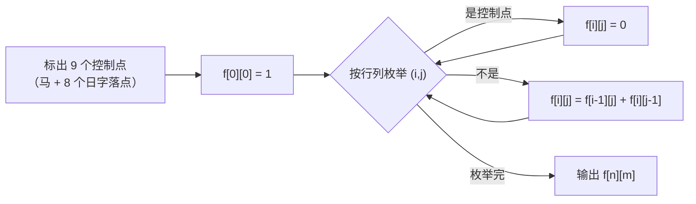

# P1002 [NOIP 2002 普及组] 过河卒

> 原题链接：<https://www.luogu.com.cn/problem/P1002>
> 题面逐字版（抓自题目页）：[`problem.txt`](problem.txt)
> 本目录导航：[← 题库索引](../../../README.md) ｜ [题目原文](problem.txt) · [讲解代码](solution.cpp) · [元信息](metadata.yml) · [分步动画](visualization.html)

## 元信息

| 项目 | 内容 |
| --- | --- |
| 难度 | 入门~普及-（NOIP 2002 普及组 T4，今天看是计数 DP 的入门题） |
| 来源 | NOIP 2002 普及组 第四题 |
| 标签 | 动态规划、路径计数、网格、马的控制点、long long |
| 数据范围 | $1\le n,m\le 20$，$0\le$ 马的坐标 $\le 20$，起点不是马的控制点 |
| 时间 / 空间 | $O(nm)$ / $O(nm)$ |
| 评测状态 | 未本地评测（洛谷提交需登录）；本地 `g++ -static -O2 -std=c++14` 编译，样例输出 6 逐字正确；满数据 $n=m=20$ 实测 8119857900（超 int，见易错点） |

## 题目大意

棋盘是 $[0,n]\times[0,m]$ 的格点，卒从 $A=(0,0)$ 走到 $B=(n,m)$，**只能向下或向右**（即每次 $x+1$ 或 $y+1$）。在 $(h_x,h_y)$ 有一匹固定不动的马，马和它"日"字能跳到的 8 个格点共 9 个点是控制点，卒**不能经过**这些点（马不会跳，位置不变）。求路径条数。

- 输入：`n m hx hy` 四个整数。
- 输出：路径条数（一个整数）。
- 关键：要的是**条数**，不是最短步数——最短步数永远是 $n+m$，没有意义。

## 思路推导

### 1. 暴力想法与它的瓶颈

DFS 枚举所有走法：从 $(0,0)$ 出发，每步二选一，路径数是 $\binom{n+m}{n}$。$n=m=20$ 时 $\binom{40}{20}=137846528820$，枚举在这个量级上根本跑不完，而且**每条路径走完只是加 1**，绝大多数计算是重复的。

瓶颈：到达 $(i,j)$ 之前的所有走法，对"从 $(i,j)$ 往后能走多少条"毫无影响，却被反复重算。

### 2. 关键观察

1. 只向上/向右 ⇒ 走到 $(i,j)$ 的**前一步只能是 $(i-1,j)$ 或 $(i,j-1)$**，两类路径的最后一个"进入动作"不同，所以**不重不漏**：
   $$f[i][j]=f[i-1][j]+f[i][j-1]$$
2. 起点 $f[0][0]=1$（"已经站在起点"本身算 1 条长度为 0 的路径，它是所有计数的种子）。
3. 控制点直接置 $f=0$：不可经过的点，走到它的方案数天然是 0，后面所有格子自动绕开它。
4. 边界：最下面一行只能从左边来，最左边一列只能从下面来，写成 `i>0` / `j>0` 的三元判断即可，不必单独预处理。

### 3. 算法设计



先处理控制点再填表，顺序上没有依赖（控制点是常数集合，与 $f$ 无关），所以两件事谁先谁后都行；但控制点的**越界判断**必须在标之前做——马在角上时 9 个点里有 4 个在棋盘外。

### 4. 正确性说明

对 $(i,j)$ 按 $i+j$ 归纳。$i+j=0$ 时只有起点，$f[0][0]=1$ 正确。设所有 $i'+j'<i+j$ 的格子都正确：任何到 $(i,j)$ 的路径去掉最后一步，必落在 $(i-1,j)$ 或 $(i,j-1)$，且这两类路径互不相同（最后一步方向不同）、合起来覆盖全部（只有这两个入边）。由归纳假设它们的条数已知，相加即 $(i,j)$ 的条数。控制点被置 0 后，所有"经过它"的路径都不会被计入任何后续格子，等价于题目要求的"不经过"。

### 5. 复杂度分析

- 时间：$O(nm)\le 441$ 次加法，纯签到。
- 空间：$O(nm)$，`long long f[25][25]` = 5 KB。
- **答案规模才是本题的难点**：无障碍时 $f[n][m]=\binom{n+m}{n}$，$\binom{40}{20}=137\,846\,528\,820\approx1.4\times10^{11}$，而 `int` 上限只有 $2.1\times10^{9}$ —— 必须 `long long`。

## 板书演示

官方样例 $n=m=6$、马在 $(3,3)$。先把 9 个控制点标出来（马本身 + 8 个日字落点，全部在棋盘内）：

$$(3,3),(1,2),(1,4),(2,1),(2,5),(4,1),(4,5),(5,2),(5,4)$$

再填表，`×` 是控制点（值恒为 0），每格 = 上方 + 左方：

| $x\backslash y$ | 0 | 1 | 2 | 3 | 4 | 5 | 6 |
| --- | --- | --- | --- | --- | --- | --- | --- |
| **0** | 1 | 1 | 1 | 1 | 1 | 1 | 1 |
| **1** | 1 | 2 | × | 1 | × | 1 | 2 |
| **2** | 1 | × | 0 | 1 | 1 | × | 2 |
| **3** | 1 | 1 | 1 | × | 1 | 1 | 3 |
| **4** | 1 | × | 1 | 1 | 2 | × | 3 |
| **5** | 1 | 1 | × | 1 | × | 0 | 3 |
| **6** | 1 | 2 | 2 | 3 | 3 | 3 | **6** |

两个值得在课堂上点出来的格子：

- $(2,2)=0$：它**不是**控制点，但上方 $(1,2)$ 和左方 $(2,1)$ 都是控制点，所以"无路可达"。这说明控制点和不可达格是两回事，学生手写表时最容易在这里填成 1。
- $(5,5)=0$：同理，上方 $(4,5)$、左方 $(5,4)$ 都是控制点，第 6 行的 3 全都从 $(5,6)$ 那一条缝里传上来。

## 可视化讲解

`solutions/dp/p1002-river-passage/visualization.html`（单文件、内联 CSS/JS、离线双击即开）：
逐格填表动画，控制点先变红打叉，然后一格一格算并把"上方 + 左方"两个来源高亮；右侧同时显示代码行高亮与 $n,m,h_x,h_y$ 的变量状态。默认数据就是样例 `6 6 3 3`，最后一帧停在答案 6。

## 讲解代码

`solution.cpp`，按 `g++ -static -O2 -std=c++14` 编译：

```cpp
#include <bits/stdc++.h>
using namespace std;

const int N = 25;              // 坐标 0..20
int bx, by, hx, hy;
bool blocked[N][N];            // 马的控制点（含马本身）共 9 个
long long f[N][N];             // f[i][j] = 从 (0,0) 走到 (i,j) 的路径条数

int main() {
    scanf("%d%d%d%d", &bx, &by, &hx, &hy);

    // 马 + 8 个"日"字落点
    static const int dx[9] = {0, -2, -2, -1, -1, 1, 1, 2, 2};
    static const int dy[9] = {0, -1, 1, -2, 2, -2, 2, -1, 1};
    for (int k = 0; k < 9; k++) {
        int x = hx + dx[k], y = hy + dy[k];
        if (x >= 0 && x <= bx && y >= 0 && y <= by) blocked[x][y] = true;   // 越界的控制点要丢掉
    }

    f[0][0] = blocked[0][0] ? 0 : 1;               // 题目保证起点不是控制点，这行只是把逻辑写全
    for (int i = 0; i <= bx; i++)
        for (int j = 0; j <= by; j++) {
            if (i == 0 && j == 0) continue;
            if (blocked[i][j]) { f[i][j] = 0; continue; }
            f[i][j] = (i > 0 ? f[i - 1][j] : 0) + (j > 0 ? f[i][j - 1] : 0);
        }

    printf("%lld\n", f[bx][by]);
    return 0;
}
```

### 本机实测记录

| 项目 | 实测 |
| --- | --- |
| 编译 | `g++ -static -O2 -std=c++14 solution.cpp` 通过 |
| 官方样例 | `6 6 3 3` ⇒ `6`，逐字一致 |
| 满数据 | `20 20 1 1`（马压在一角，控制点最少、路径最多）⇒ **`8119857900`**，5 次运行 4.9 / 5.7 / 11.1 ms（含进程启动） |
| 无障碍上界 | $n=m=20$、马被"移出棋盘外"的理论值 $\binom{40}{20}=137846528820$（本题输入保证马在盘内，取不到这个数，但它是量级参照） |

## 易错点与坑

1. **`int` 存不下答案**。把 `f` 从 `long long` 改成 `int`（连 `printf` 的格式一起改）后实测：官方样例 `6 6 3 3` 照样输出 `6`（**看不出问题**），但 `20 20 1 1` 输出 `-470076692`，正解 `8119857900`。$8119857900 \bmod 2^{32}$ 回绕成负数 —— 计数题的溢出必须在**满数据**上验，样例是 6，永远测不出来。
2. **`printf` 与实参类型不符**：`int` 的 $f$ 配 `%lld` 是未定义行为，本机错版曾因此打出过 `3824890604` 这种"看着像对"的数。改类型就同时改格式，或者统一用 `cout`。
3. **控制点标 9 个而不是 8 个**：马站的那格本身也不能经过。漏标马本身，样例 `6 6 3 3` 的答案会从 6 变大。
4. **越界的控制点要丢掉**：马在 $(0,0)$ 这类边角时 9 个点有一半在盘外，直接下标赋值会写脏 `blocked` 数组甚至越界。
5. **起点 $f[0][0]=1$，不是 0 也不是 2**：它是"空路径"的种子；写成 0 则全盘为 0。
6. **坐标方向别拧**：题目只说"可以向下、或者向右"，实现里 $x,y$ 谁是行谁是列只要自洽就行，但把 `scanf` 的 `n m` 顺序读反会直接算错目标格（题面输入是 `n m hx hy`，$n$ 对应 $x$、$m$ 对应 $y$）。

## 常见变式

- **换障碍物**：把控制点集合换成任意黑名单，转移一行不用改 —— 这是本题最有扩展性的地方。
- **允许走斜线**：入边变成 3 条，$f[i][j]=f[i-1][j]+f[i][j-1]+f[i-1][j-1]$（德洛Numbers）。
- **要求输出方案数取模**（如 $10^9+7$）：结构不变，每步加一次取模；这题原版不用取模，正因为要考 `long long`。
- **最短路径 + 条数**：如果允许走得更长，就要把状态拆成"步数 + 位置"，那已经不是本题的无后效性结构了。

## 一句话提炼

**"到这一步的方案数 = 所有能一步走到这里的前驱的方案数相加"**，障碍不是"绕路"，而是把那一格**置 0**；而计数题的第二个命门是：**答案会长到 int 装不下**。
