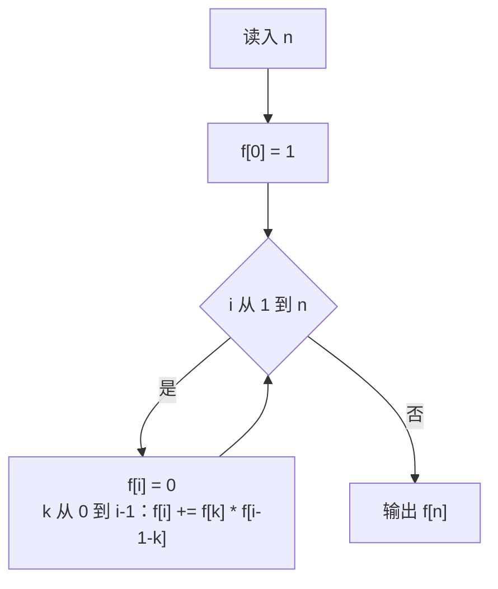

# P1044 [NOIP 2003 普及组] 栈

> 原题链接：<https://www.luogu.com.cn/problem/P1044>
> 题面逐字版（抓自题目页）：[`problem.txt`](problem.txt)
> 本目录导航：[← 题库索引](../../../README.md) ｜ [题目原文](problem.txt) · [讲解代码](solution.cpp) · [元信息](metadata.yml)

## 元信息

| 项目 | 内容 |
| --- | --- |
| 难度 | 普及（NOIP 2003 普及组 T3；卡特兰数递推的第一课） |
| 来源 | NOIP 2003 普及组 第三题 |
| 标签 | 计数型 DP、卡特兰数、分治思想 |
| 数据范围 | $1\le n\le 18$ |
| 时间 / 空间 | $O(n^2)$ / $O(n)$ |
| 评测状态 | 未本地评测（洛谷提交需登录）；本地 `g++ -static -O2 -std=c++14` 编译，样例输出 5 逐字核对；未做随机对拍（无更慢但独立的标准暴力可对），用 $n=3$ 全枚举 5 种出栈序列当自检；$n=18$ 满数据输出 477638700，5 次运行 4.9 / 5.1 / 10.3 ms |

## 题目大意

把 $1,2,\dots,n$ **按顺序**依次推进一个栈，中途任何时刻都可以把栈顶弹出到输出序列。问最终能得到多少种不同的输出序列。

- 输入：一个整数 $n$（$n\le 18$）。
- 输出：可能的出栈序列总数。
- 样例：$n=3$ 时是 $5$ —— $1,2,3$ 的全排列有 $6$ 个，只有 `3 1 2` 出不来（$1$ 在 $2$ 下面，$1$ 先出则 $2$ 必跟着先出）。

## 思路推导

### 1. 暴力想法与它的瓶颈

两条暴力路都不通：

- **枚举排列再逐个验证**：$n!$ 个排列，$18!\approx 6.4\times 10^{15}$，天文数字。
- **DFS 模拟进出栈过程，把每种输出序列真做出来数个数**：合法操作序列数恰好就是答案本身（卡特兰数 $C_{18}=477638700$），每条还要 $O(n)$ 输出 ⇒ $n=18$ 时 $8\times 10^9$ 量级的操作，超时。

瓶颈和数楼梯一样：**"做出来数"的代价就是被数的东西本身**；而且 DFS 里同一类子结构（"连续一段没进栈的数"）被反复重算 —— 典型的重叠子问题，DP 的入场券。

### 2. 关键观察

1. **进栈顺序被钉死是 $1,2,\dots,n$**，整个局面只由"何时弹出"决定，所以计数问题只剩一个自由度。
2. **盯住最早进栈的数 $1$**：设 $1$ 是第 $k+1$ 个出栈的（$0\le k\le n-1$）。
   - $1$ 出栈前，压在它上面的 $2,\dots,k{+}1$ 这 $k$ 个数必须已进栈且全部先弹出 —— 它们的相对进出完全独立，是一个 $k$ 个数的子问题，方案数 $f[k]$；
   - $1$ 出栈之后，剩下 $n-1-k$ 个数还没进栈，又变成一个独立的同规模子问题，方案数 $f[n-1-k]$。
3. 两部分**互不干扰**（前者弹出时后者还没进栈，各走各的栈顶规则），乘法原理，再对 $k$ 用加法原理：
   $$f[n]=\sum_{k=0}^{n-1} f[k]\cdot f[n-1-k],\qquad f[0]=1$$
   $f[0]=1$：空序列也算一种方案 —— 它是整个递推的地基，漏了它全盘皆 0（见易错点 1 的实测）。
4. 这组数就是**卡特兰数**。按递推算出的前 9 项：$1, 1, 2, 5, 14, 42, 132, 429, 1430$，第 4 项（$f[3]$）正好是样例的 $5$。

### 3. 算法设计



一层循环枚举子问题规模 $i$，内层枚举"第一个数的弹出位置" $k$，总共 $n^2/2\le 162$ 次乘法加法，$n=18$ 眨眼算完。

### 4. 正确性说明

对 $n$ 归纳。$n=0$ 时规定 $f[0]=1$ 与"什么都不做只有一种方案"一致。设规模小于 $n$ 时 $f$ 全部正确。任意一个 $n$ 个数的合法出栈序列，$1$ 必在第 $k+1$ 个位置（$k$ 唯一确定）：

- **不重**：不同 $k$ 对应的序列，$1$ 的位置不同，天然不相交；固定 $k$ 时，前 $k$ 个弹出者恰是 $2..k{+}1$ 的某种合法出栈序（$f[k]$ 种），后 $n-1-k$ 个恰是 $k{+}2..n$ 的某种合法出栈序（$f[n-1-k]$ 种），拼接方式一一对应，乘法原理成立。
- **不漏**：任取一个合法序列，按上面两类拆开，两半各自仍是"顺序进栈、随时弹出"的合法过程（栈的 LIFO 不会被跨段引用——前半弹空之后 $1$ 才能出，$1$ 出完栈才空，后半进栈时栈已空）。

所以 $f[n]$ 数出的恰是所有合法序列，归纳到题目给的 $n$ 即正确。

### 5. 复杂度分析

- 时间：$O(n^2)$，$n=18$ 时约 171 次乘加；对比暴力的 $4.8\times 10^8$ 条序列，是"用 324 次加法换走十亿次枚举"的现场教学。
- 空间：$O(n)$ 一张 $f$ 表。
- 数值：$C_{18}=477638700<2^{31}-1$，`int` 刚好够；但 $C_{20}=6564120420$ 已超 `int`，代码用 `long long` 是多留一格余量的习惯（见易错点 2）。

## 板书演示

**第一块板书：卡特兰递推表**（$f[n]=\sum f[k]f[n-1-k]$，逐格现场算两三项）：

| $n$ | 0 | 1 | 2 | 3 | 4 | 5 | 6 | 7 | 8 |
| --- | --- | --- | --- | --- | --- | --- | --- | --- | --- |
| $f[n]$ | **1** | 1 | 2 | **5** | 14 | 42 | 132 | 429 | 1430 |

算 $f[3]$ 时展开给学生看：$f[3]=f[0]f[2]+f[1]f[1]+f[2]f[0]=2+1+2=5$ —— $f[0]=1$ 不出现在每一项里就没有这一切。

**第二块板书：$n=3$ 的全部 5 种出栈序列**（程序枚举核对过，正好对应 $f[3]=5$）：

| # | 出栈序列 | 操作过程（进=push，出=pop） |
| --- | --- | --- |
| 1 | `3 2 1` | 进1 进2 进3 出3 出2 出1（全进再全出） |
| 2 | `2 3 1` | 进1 进2 出2 进3 出3 出1（题面图示的生成过程） |
| 3 | `2 1 3` | 进1 进2 出2 出1 进3 出3 |
| 4 | `1 3 2` | 进1 出1 进2 进3 出3 出2 |
| 5 | `1 2 3` | 进1 出1 进2 出2 进3 出3（挨个进就挨个出） |

缺的那个排列是 `3 1 2`：$3$ 先出意味着 $1,2$ 都还在栈里且 $1$ 压在 $2$ 下面，$1$ 出栈的瞬间 $2$ 必须下一个出来 —— 让学生自己找出栈规则"卡死"它的瞬间，比讲十遍公式都管用。

## 讲解代码

`solution.cpp`，按 `g++ -static -O2 -std=c++14` 编译：

```cpp
#include <bits/stdc++.h>
using namespace std;

// P1044 栈：1..n 依次进栈，问有多少种出栈序列（卡特兰数）
// 分治推导：考虑"第一个进栈的数 1"什么时候出栈。
//   若 1 是第 k+1 个出栈的，那么它出栈前，2..k+1 这 k 个数必须已经进过栈并且都排在 1 上面，
//   这些数的出栈顺序彼此独立，方案数 f[k]；1 出栈之后还剩 n-1-k 个数没进栈，方案数 f[n-1-k]。
//   两类相乘再对 k 求和：f[n] = sum_{k=0}^{n-1} f[k] * f[n-1-k]，f[0] = 1（空序列算一种）。
long long f[25];

int main() {
    int n;
    scanf("%d", &n);
    f[0] = 1;
    for (int i = 1; i <= n; i++) {
        f[i] = 0;
        for (int k = 0; k < i; k++) f[i] += f[k] * f[i - 1 - k];
    }
    printf("%lld\n", f[n]);
    return 0;
}
```

### 本机实测记录

| 项目 | 实测 |
| --- | --- |
| 编译 | `g++ -static -O2 -std=c++14 solution.cpp` 通过（本机两套 MinGW 冲突，**必须加 `-static`**，否则段错误、退出码 139） |
| 官方样例 | 输入 `3` ⇒ 输出 `5`，与题面逐字核对一致 |
| 对拍 | 未做随机对拍（没有独立且更慢的标准暴力可比）；用 $n=3$ 全枚举 5 种出栈序列当自检（板书第二块） |
| 错版实测 | 把 `f[0] = 1;` 删成空语句后，官方样例输出 `0`（正解 `5`） |
| 满数据 | $n=18$ ⇒ 输出 `477638700`，5 次运行 4.9 / 5.1 / 10.3 ms（最小/中位/最大，**含进程启动**） |

## 易错点与坑

1. **漏写 `f[0] = 1;`**。递推每一项都带一个 $f[0]$ 因子，$f[0]$ 缺省成 0 会把整张表乘成全 0。错误版本实测：官方样例输出 `0`（正解 `5`）—— 能编过、有输出、错得干脆，反而是好事，当场就能抓住；比它阴的是"局部数组未清零"之类的脏值，这里 `f` 开在全局默认 0 初始化，`f[i]=0` 再累加的写法把习惯也立正了。
2. **用 `int` 存卡特兰数**。$C_{18}=477638700$ 恰好压在 `int`（$2147483647$）里，这题按 `int` 也能过；但相邻项 $C_{20}=6564120420$ 已超 `int`，只要题目把 $n$ 的上限放宽两格就爆。代码用 `long long` 是"多留一格余量"的习惯，讲课时值得点评一句：**判数据类型别只看当前范围，看一眼相邻项**。
3. **下标写成 $f[k]\cdot f[n-k]$**。正确是 $f[k]\cdot f[n-1-k]$ —— "$1$ 本身占掉一个位置"必须被减掉，$k$ 也只会取到 $n-1$（$1$ 最晚最后一个出栈）。写错下标后算出的数与卡特兰数列分道扬镳，而 $n=3$ 前后可能察觉不出规模差异，自检要往后多算一项：拿板书表验 $f[4]=14$、$f[5]=42$，对不上就是转移下标错位。
4. 乘法原理的前提是"两半独立"。$1$ 弹出前后栈的状态恰好衔接（前面弹空、$1$ 出栈后栈空、后面重进），讲课时这一步要画栈图确认，不能口头带过。

## 常见变式

- **$n$ 对括号的合法匹配数、$n+1$ 叶子的满二叉树形态数、凸 $(n+2)$ 边形三角剖分数**：全都是同一组卡特兰数 —— 板书 $1,1,2,5,14,\dots$ 就是这些题的答案数列，"卡特兰家族"值得起了页专讲。
- **判断给定出栈序列是否合法**（如"进栈序 $1..n$，问 `3 1 2` 能不能出"）：不必计数，贪心模拟 —— 能进就进、栈顶能对上就弹，最后看弹完没有，$O(n)$。
- **$n$ 很大且对素数 $p$ 取模**：走通项 $C_n=\binom{2n}{n}/(n+1)$，阶乘 + 模逆元；递推 $O(n^2)$ 顶不住时用它。
- **出栈序列的字典序第 $k$ 个 / 打表前几个**：卡特兰数递推表 $f$ 正好当"计数引导构造"的 DP 表，是"计数 DP → 第 k 大构造"的标准进阶。

## 一句话提炼

**"最早进栈的那个数一弹出，问题就劈成两个互不打扰的小子问题"** —— 乘起来、对弹出时机求和，$f[n]=\sum_{k} f[k]f[n-1-k]$，地基是 $f[0]=1$：这就是卡特兰数。
