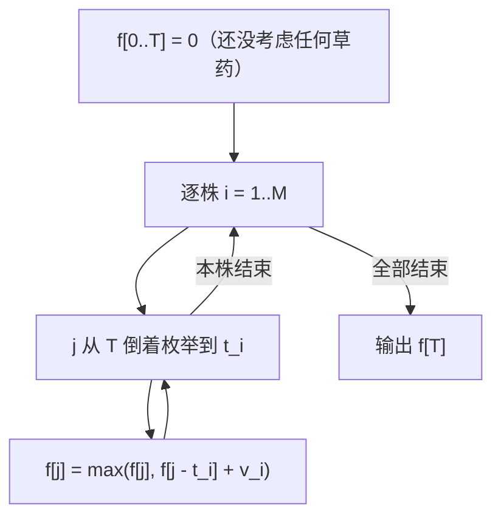

# P1048 [NOIP 2005 普及组] 采药

> 原题链接：<https://www.luogu.com.cn/problem/P1048>
> 题面逐字版（抓自题目页）：[`problem.txt`](problem.txt)
> 本目录导航：[← 题库索引](../../../README.md) ｜ [题目原文](problem.txt) · [讲解代码](solution.cpp) · [元信息](metadata.yml) · [对拍脚本](verify.js) · [分步动画](visualization.html)

## 元信息

| 项目 | 内容 |
| --- | --- |
| 难度 | 入门~普及-（NOIP 2005 普及组 T3，01 背包的最小模板） |
| 来源 | NOIP 2005 普及组 第三题 |
| 标签 | 动态规划、01 背包、滚动数组、倒序枚举 |
| 数据范围 | $1\le T\le 1000$，$1\le M\le 100$，每株的时间与价值都在 $1..100$ |
| 时间 / 空间 | $O(TM)$ / $O(T)$ |
| 评测状态 | 未本地评测（洛谷提交需登录）；本地 `g++ -static -O2 -std=c++14` 编译，样例输出 3 逐字正确；与"枚举 $2^M$ 个子集"的暴力随机对拍 200 组 0 不一致 |

## 题目大意

$M$ 株草药，第 $i$ 株采摘要花 $t_i$ 时间、价值 $v_i$，每株**只能采一次**。总时间 $T$，求能采到的最大总价值。

- 输入：第一行 `T M`，随后 $M$ 行每行 `t v`。
- 输出：一个整数——不超过 $T$ 时间的最大价值。
- 本质：这就是 01 背包，$T$ 是容量、$t_i$ 是体积、$v_i$ 是价值，没有任何变形。

## 思路推导

### 1. 暴力想法与它的瓶颈

每株草药"采 / 不采"，共 $2^M$ 种组合，$M=100$ 时是 $2^{100}\approx1.3\times10^{30}$，不可能穷举。就算只枚举到 $M=20$（约 $10^6$）也已经在时限边缘，而题面 $M\le 100$。

暴力慢在**重复**：前 10 株怎么采的 1024 种情况，会对后 90 株各重来一遍；但这些情况里真正有意义的差别只有"已经用掉多少时间"。

### 2. 关键观察

1. 把"已经用掉多少时间"当成状态，就把指数级的选择压缩成了 $T+1$ 个格子 —— 这是背包 DP 的核心思想。
2. 定义 $f[i][j]$ = 只考虑前 $i$ 株、总共用掉不超过 $j$ 时间时的最大价值，则
   $$f[i][j]=\max\big(f[i-1][j],\;f[i-1][j-t_i]+v_i\big)$$
   前一项是"不采第 $i$ 株"，后一项是"采第 $i$ 株"（必须先从 $j$ 里留出 $t_i$）。两类互斥且覆盖全部，所以不重不漏。
3. 第 $i$ 行只用第 $i-1$ 行 ⇒ **可以压成一维**，但压完必须**倒序**枚举 $j$（见正确性说明）。
4. $j<t_i$ 时装不下第 $i$ 株，$f[j]$ 保持原值，所以内层循环写 `j = T; j >= t; j--` 就行，不需要 `else` 分支。

### 3. 算法设计



### 4. 正确性说明

二维形式按"$i$ 从大到小、$j$ 从 $0$ 到 $T$"填表即可，第 $i$ 行的转移全部读第 $i{-}1$ 行，每株最多被用一次，正确性显然。

一维版的命门是**倒序**：把 $f[i][*]$ 就地覆盖在同一个数组上，那么算 $f[j]$ 时用到的 $f[j-t_i]$ 必须还是"第 $i{-}1$ 行"的旧值。

- 倒序（$j$ 从大到小）：$j-t_i<j$，而更小的下标本轮还没被更新 ⇒ 读到的就是上一行的值 ⇒ 第 $i$ 株只会被加进去一次。
- 正序（$j$ 从小到大）：算 $f[j]$ 时 $f[j-t_i]$ 已经在本轮更新过（可能已经含第 $i$ 株）⇒ 等于允许同一株反复采 ⇒ 退化成了**完全背包**。

这不是"可能会错"，是系统性偏大：本机随机 200 组对拍中，有 **167 组**正序版本的结果严格大于正解。

### 5. 复杂度分析

- 时间：$O(TM)=1000\times100=10^5$ 次 `max`，余量巨大（暴力的 $2^{100}$ 连比较次数都数不完）。
- 空间：$O(T)$，一维 `int f[1005]`。价值总和上界 $100\times100=10^4$，`int` 足够。
- 一维版算出的 $f[j]$ 是"不超过 $j$ 时间"的最大价值（因为初值全 0，隐含"剩余时间可以浪费"），所以答案直接取 $f[T]$。

## 板书演示

演示数据取 $T=10$、4 株草药 $(t,v)$ 依次为 $(3,4),(5,6),(7,8),(1,1)$，把每一株加入后整条 $f[0..10]$ 都写出来（数字由参考实现打印，不是手推）：

| 阶段 | $f[0]$ | 1 | 2 | 3 | 4 | 5 | 6 | 7 | 8 | 9 | 10 |
| --- | --- | --- | --- | --- | --- | --- | --- | --- | --- | --- | --- |
| 初始 | 0 | 0 | 0 | 0 | 0 | 0 | 0 | 0 | 0 | 0 | 0 |
| 加入 (3,4) | 0 | 0 | 0 | **4** | 4 | 4 | 4 | 4 | 4 | 4 | 4 |
| 加入 (5,6) | 0 | 0 | 0 | 4 | 4 | **6** | 6 | 6 | **10** | 10 | 10 |
| 加入 (7,8) | 0 | 0 | 0 | 4 | 4 | 6 | 6 | **8** | 10 | 10 | **12** |
| 加入 (1,1) | 0 | **1** | **1** | 4 | **5** | 6 | **7** | **8** | 10 | **11** | **12** |
| 错版·正序（完全背包） | 0 | 1 | 2 | 4 | 5 | 6 | 8 | 9 | 10 | 12 | **13** |

课堂上一眼能看懂的三处对比：

1. $f[8]=10$ 来自 $f[8-5]=f[3]=4$ 加上第 2 株的 6 —— "先留出 5 时间"这一步必须回看旧行。
2. $f[10]=12$（第 3、4 株组合 8+4 或 6+4+... 里的最优）；最后一株 $(1,1)$ 加入后 $f[9]$、$f[10]$ 保持 11、12，说明"价值小的东西不一定进最优解"。
3. 最后一行是**把内层循环写成正序**的结果：$f[10]=13$ 比正解 12 还大 —— 因为 $(1,1)$ 这株被反复采了多次。**"答案比正确值还大"是背包方向写反的典型症状**，样例上也一样（见易错点 1）。

## 可视化讲解

`solutions/dp/p1048-herbs/visualization.html`（单文件、内联 CSS/JS、离线双击即开）：
左边是 $f[0..T]$ 的条形图，每一步高亮"正在更新的格子 $j$"和"它读的那格 $j-t_i$"；右边是代码行高亮 + 变量状态（$i,t_i,v_i,j$）。可以一键切换"倒序（01 背包）/ 正序（完全背包）"，同一条草药走两遍，直接看到条形图从 12 变 13 的那一步 —— 这个对比是本动画存在的唯一理由。

## 讲解代码

`solution.cpp`，按 `g++ -static -O2 -std=c++14` 编译：

```cpp
#include <bits/stdc++.h>
using namespace std;

const int N = 1005;
int T, m;
int f[N];                    // f[j] = 用掉 j 时间能采到的最大价值（一维滚动）

int main() {
    scanf("%d%d", &T, &m);
    for (int i = 1; i <= m; i++) {
        int t, v;
        scanf("%d%d", &t, &v);
        for (int j = T; j >= t; j--)                 // j < t 时装不下，保持原值，不用写 else
            f[j] = max(f[j], f[j - t] + v);
    }
    printf("%d\n", f[T]);
    return 0;
}
```

### 本机实测记录

| 项目 | 实测 |
| --- | --- |
| 编译 | `g++ -static -O2 -std=c++14 solution.cpp` 通过 |
| 官方样例 | `70 3 / 71 100 / 69 1 / 1 2` ⇒ `3`，逐字一致（70 时间只能采 $(69,1)$ 和 $(1,2)$，第一株 71 时间装不下） |
| 对拍 | `node verify.js --exe ./solution.exe --rounds=200`：与枚举 $2^M$ 子集的暴力随机对拍 **200 组**（$T\le60,M\le16$）**0 不一致** |
| 满数据 | $T=1000,M=100$、$t,v$ 随机 $1..100$ ⇒ 输出 `2656`，5 次运行 4.9 / 5.2 / 10.9 ms（含进程启动） |
| 错版量级 | 同一批 200 组里，正序版本有 **167 组**严格大于正解 |

## 易错点与坑

1. **内层方向写成正序 ⇒ 01 背包变成完全背包**。本机实测：把 `for (int j = T; j >= t; j--)` 改成 `for (int j = t; j <= T; j++)` 后，官方样例输出 `140`，正解是 `3`（第一株 71 时间的草药被反复采了多次，价值 100 被加进去还配上别的东西）。这个错版在样例上就炸得很难看，是少见的"样例能抓住"的背包 bug；自造最小例子 `2 1 / 1 1`（$T=2$、一株 1 时间 1 价值）正解 `1`、错版 `2`，一眼看出"同一株被采了两次"。
2. **$f$ 数组下标从 $t$ 开始而不是从 0**。$j<t$ 时 $f[j-t]$ 会读负下标；全局数组读 $f[-1]$ 不一定越界报错，属于"能跑但错"的一类。
3. **答案是 $f[T]$，不是 $\max_j f[j]$**。因为一维初值全 0，$f[j]$ 本身就表示"不超过 $j$"，$f$ 单调不减，$f[T]$ 就是最大那个；写 $\max$ 不会错，但会掩盖你对"$\le j$ 还是 $= j$"的理解 —— 见 [P1164 小 A 点菜](../p1164-order-dishes/README.md)，那题求"恰好花光"，两者的区别就是生死线。
4. **$t_i$ 可能大于 $T$**：样例里就有 $71>70$ 和 $69\le70$，这类物品整行什么都不做，不用特判，但学生常在这里怀疑自己。
5. 想要"恰好装满"的语义时，初值必须改成 $f[0]=0$、其余 $-\infty$；本题求"不超过"，全 0 才对。

## 常见变式

| 变式 | 改动 | 库里现成的例子 |
| --- | --- | --- |
| 体积当价值（装箱） | 转移里写 `f[j-v]+v`，输出 $V-f[V]$ | [P1049 装箱问题](../p1049-box-packing/README.md) |
| 求方案数而非最优值 | `max` 换 `+=`，初值 $f[0]=1$ | [P1164 小 A 点菜](../p1164-order-dishes/README.md) |
| 每种物品无限件 | 内层改成**正序** | 上面错版本恰好就是它 |
| 二维费用（时间 + 空间） | $f[j][k]$ 两重倒序 | 洛谷 P175 一类 |
| 物品有依赖（树形背包） | 外层变成树上 DFS | 本题不要求 |

## 一句话提炼

**背包一维化的全部秘密就是"倒序"两个字**：倒序读到的是上一行的旧值，所以每件物品只用一次；正序读到的是本行新值，所以同一件可以无限拿。
