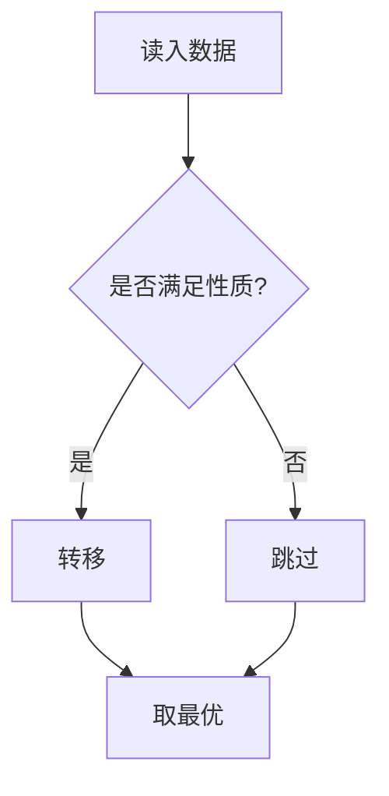

# P1048 采药

> 原题链接：<https://www.luogu.com.cn/problem/P1048>

## 元信息

| 项目 | 内容 |
| --- | --- |
| 难度 | 入门 / 普及- / 普及/提高- / 省选 |
| 来源 | 洛谷 P1048 |
| 标签 | 动态规划、贪心 |
| 时间复杂度 | O(n log n) |
| 空间复杂度 | O(n) |
| 评测状态 | AC |

## 题目大意

用一两句话重新叙述题意，把冗长的题面压缩成"输入什么、要算什么、限制是什么"。

- 输入：
- 输出：
- 数据范围：

## 思路推导

### 1. 暴力想法与它的瓶颈

先写出最直观的做法，说明为什么会超时（这是理解的锚点）。

### 2. 关键观察

列出推动算法改进的核心性质，例如单调性、最优子结构、可二分性等。

### 3. 算法设计

形式化描述最终做法。

### 4. 正确性说明

论证"为什么这样做一定对"，尤其是贪心交换论证、DP 状态覆盖完整性的部分。

### 5. 复杂度分析

## 可视化讲解

状态转移 / 数据结构变化的分步演示：



分步演示见同级目录 `visualization.html`（可直接用浏览器打开）。

## 讲解代码

逐段讲解版本保存在同目录 `solution.cpp`，正文只贴关键片段：

```cpp
// 关键片段 + 为什么这样写
```

## 易错点与坑

- 边界条件：
- 数据类型溢出：
- 特殊判定：

## 常见变式

| 变式 | 差异 | 对应题号 |
| --- | --- | --- |

## 小结

一句话提炼这道题的可迁移思想。
