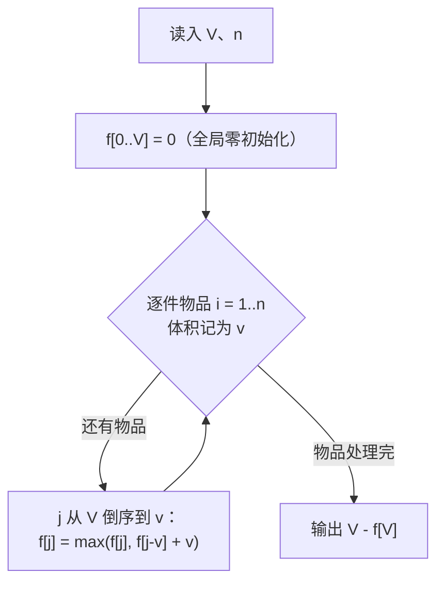

# P1049 [NOIP 2001 普及组] 装箱问题

> 原题链接：<https://www.luogu.com.cn/problem/P1049>
> 题面逐字版（抓自题目页）：[`problem.txt`](problem.txt)
> 本目录导航：[← 题库索引](../../../README.md) ｜ [题目原文](problem.txt) · [讲解代码](solution.cpp) · [元信息](metadata.yml)

## 元信息

| 项目 | 内容 |
| --- | --- |
| 难度 | 普及-（01 背包模板的第二种问法，紧跟 [P1048 采药](../p1048-herbs/README.md) 讲） |
| 来源 | NOIP 2001 普及组 T4 |
| 标签 | 动态规划、01 背包、滚动数组、"体积当价值" |
| 数据范围 | $1\le V\le 20000$，$0<n\le 30$，每个物品体积为正整数 |
| 时间 / 空间 | $O(nV)$ / $O(V)$ |
| 评测状态 | 未本地评测（洛谷提交需登录）；本地 `g++ -static -O2 -std=c++14` 编译，样例输出 0 逐字正确；本题未做随机对拍（与 P1048 是同一个 01 背包骨架，只是"价值 = 体积"的取值不同） |

## 题目大意

一个容量为 $V$ 的箱子，$n$ 个物品各有体积，每种物品最多拿一件（也可以一件都不拿），要求**装进去的总体积尽量多**，输出剩下的空隙有多大。

- 输入：$V$；$n$；随后 $n$ 行每行一个正整数，是第 $i$ 个物品的体积。
- 输出：一个整数——最小剩余空间。
- 范围：$V\le 20000$、$n\le 30$ ⇒ $nV\le 6\times 10^{5}$，一眼就知道该是 $O(nV)$ 的背包。

注意题目问的不是"最多装多少体积"，而是"**还剩多少空**"——这两个数相差一个 $V$，是这题第一个扣分点。

## 思路推导

### 1. 暴力想法与它的瓶颈

"每件物品要么拿要么不拿"，$n$ 件就是 $2^n$ 个子集：枚举子集、求体积和、取不超过 $V$ 的最大值。$n=30$ 时 $2^{30}\approx 1.07\times 10^{9}$，再配上求和的常数，1 秒绝对时限根本跑不完；而且就算 $n=25$（$3.4\times 10^{7}$）也已经很勉强。

瓶颈和所有背包题一样：**同一个"已经装了多大体积"的状态被不同选取顺序反复到达**。选取 $\{8,3\}$ 和 $\{3,8\}$ 在箱子看来毫无区别，却是两条独立的搜索分支。

### 2. 关键观察

1. **$V$ 是定值，"剩余空间最小" $\iff$ "装进去的体积最大"**。剩下要做的只是求"不超过 $V$ 的最大总体积"，最后做一次减法。
2. 把它对上 01 背包：每个物品**占用的空间是 $v_i$，带来的收益也是 $v_i$**。这就是"体积当价值"——不是新算法，只是把 [P1048 采药](../p1048-herbs/README.md) 里价值数组的那一格换成体积本身。
3. 于是 $f[j]$ = 容量为 $j$ 的箱子最多能装进去的体积，转移是
   $$f[j]=\max\big(f[j],\;f[j-v_i]+v_i\big)$$
   式子里第二个 $v_i$ 就是"体积同时充当价值"的那一份，它是这题的全部内容。
4. 由定义可知 $f[j]\le j$ 恒成立，且 **$f[j]=j$ 恰好等价于"容量 $j$ 能被恰好装满"** ——一个数组顺手把"能不能装满"也答了。
5. 每种物品只有一件 ⇒ 内层容量必须**倒序**；一维数组滚动，$O(V)$ 空间够用。

### 3. 算法设计



一件物品处理完就把它的信息覆盖掉，靠的是倒序；$n$ 件推完，$f[V]$ 就是全局最多能装下的体积。

### 4. 正确性说明

对物品编号归纳：设处理完前 $i$ 件之后，$f[j]$ = 从**前 $i$ 件**里任取若干件、总体积不超过 $j$ 时的最大总体积。

- $i=0$ 时谁都还没选，$f[j]=0$，成立。
- 考虑第 $i{+}1$ 件（体积 $v$）：任何合法选取分两类——**不选它**，最优值是旧的 $f[j]$；**选它**，那么剩下只能装 $j-v$，最优值是旧的 $f[j-v]$ 再加上这份 $v$。两类不重不漏，取 $\max$ 正确。内层倒序保证 $f[j-v]$ 还是"没考虑第 $i{+}1$ 件"的旧值，所以它至多被选一次，正好对应"每种物品只有一份"。

归纳到 $i=n$，$f[V]$ 即"不超过 $V$ 的最大总体积"。又因为箱子容量固定为 $V$，剩余空间 $=V-\text{装入体积}$ 关于装入体积单调递减，所以让剩余最小就是让装入最大，输出 $V-f[V]$ 正确。

### 5. 复杂度分析

- 时间：$O(nV)$，最坏 $30\times 20000=6\times 10^{5}$ 次 `max`，相对时限余量极大（本机实测见下）。
- 空间：$O(V)$，$f$ 开 `20005` 的 `int`，全局零初始化。
- 数值范围：$f[j]\le V\le 20000$，`int` 绰绰有余，**这题不需要 `long long`**（和隔壁计数型的 [P1164 小 A 点菜](../p1164-order-dishes/README.md) 正好是对照组）。

## 板书演示

官方样例：$V=24$，$n=6$，体积依次是 $8,3,12,7,9,7$。

倒序 01 背包推完之后 $f[24]=24$，剩余 $24-24=0$。真正值得在黑板上写的是**"哪些容量能被恰好装满"**，因为观察这个集合才知道"装满"并不显然（观察：$f[j]=j$ 的格子恰好是下面打勾的格子）：

| $j$ | 0 | 1 | 2 | 3 | 4 | 5 | 6 | 7 | 8 |
| --- | --- | --- | --- | --- | --- | --- | --- | --- | --- |
| 能否恰好装满 | ✓ | ✗ | ✗ | ✓ | ✗ | ✗ | ✗ | ✓ | ✓ |

| $j$ | 9 | 10 | 11 | 12 | 13 | 14 | 15 | 16 | 17 |
| --- | --- | --- | --- | --- | --- | --- | --- | --- | --- |
| 能否恰好装满 | ✓ | ✓ | ✓ | ✓ | ✗ | ✓ | ✓ | ✓ | ✓ |

| $j$ | 18 | 19 | 20 | 21 | 22 | 23 | 24 |
| --- | --- | --- | --- | --- | --- | --- | --- |
| 能否恰好装满 | ✓ | ✓ | ✓ | ✓ | ✓ | ✓ | ✓ |

讲课时盯三个点：

1. 能恰好装满的体积集合是 $0,3,7,8,9,10,11,12,14,15,16,17,18,19,20,21,22,23,24$，而 $1,2,4,5,6,13$ **装不满**——最小的体积已经是 $3$，所以 $1,2$ 白空；$13$ 是最有欺骗性的一个，看着"随手就能凑出来"，实际这 6 件物品的任何一个子集体积和都不是 $13$。
2. 如果箱子容量给的是 $13$ 而不是 $24$，答案就不是 $0$ 而是"装不满剩下的空隙"。所以**"输出 $V-f[V]$"这个减法必须做**，$f[V]$ 本身不一定等于 $V$。
3. $0$ 在集合里：一件都不拿就是体积和 $0$，这正是 $f$ 全局零初始化的含义（和 P1164 的 $f[0]=1$ 是同一个"空方案"，只是一个记体积一个记方案数）。

## 讲解代码

`solution.cpp`，按 `g++ -static -O2 -std=c++14` 编译：

```cpp
#include <bits/stdc++.h>
using namespace std;

const int N = 20005;
int V, n;
int f[N];                 // f[j] = 容量 j 的箱子最多能装多少体积

int main() {
    scanf("%d%d", &V, &n);
    for (int i = 1; i <= n; i++) {
        int v;
        scanf("%d", &v);
        for (int j = V; j >= v; j--)          // 倒序：每件物品只有一份
            f[j] = max(f[j], f[j - v] + v);   // +v 而不是 +w[i]：体积本身就是价值
    }
    printf("%d\n", V - f[V]);                 // 问的是"剩余"，不是"装了多少"
    return 0;
}
```

### 本机实测记录

| 项目 | 实测 |
| --- | --- |
| 编译 | `g++ -static -O2 -std=c++14 solution.cpp` 通过（本机两套 MinGW 路径冲突，`-static` 必须加，否则段错误退出码 139） |
| 官方样例 | 输入 `24 / 6 / 8 3 12 7 9 7` ⇒ 输出 `0`，与题面一致 |
| 错版实测 | 把最后一行写成 `printf("%d\n", f[V]);` ⇒ 官方样例输出 `24`，正解 `0` |
| 对拍 | **本题未做随机对拍**：与 [P1048 采药](../p1048-herbs/README.md) 是同一个 01 背包骨架，只是"价值 = 体积"的取值不同，所以没有单独配 `verify.js`；板书演示里"能恰好装满的体积集合"是本地程序打印的结果 |
| 满数据 | $V=20000$、$n=30$、体积随机 ⇒ 输出 `0`，5 次运行耗时 6.1 / 7.3 / 11.6 ms（最小/中位/最大） |

计时口径：用 node 的 `execFileSync` 起进程跑 5 次，报最小/中位/最大毫秒数，**数字里含进程启动开销与 Windows Defender 扫描噪声**，不是纯算法耗时，所以偶尔冒出来的最大值不必当真。

## 易错点与坑

1. **输出 $V-f[V]$，不是 $f[V]$**。本机实测：把 `printf` 改成 `f[V]` 后官方样例输出 `24`，正解是 `0`——"装了多少"算对了，"还剩多少"答错了，典型的"算对问错"。题面最后一句"表示箱子最小剩余空间"要用笔圈起来。
2. **`+v` 不要写成 `+1`**。写成 `+1` 求的是"最多能装几**件**物品"，是另一个问题（最大化件数），答案一般和本题不同；`f[j-v] + v` 里那个 `v` 才是"体积当价值"的落点。这是学生最容易顺手写错的一处，讲课时把 $+v$ 和 $+1$ 两种含义写在黑板上对比一遍。
3. **内层必须倒序，且下界是 `v` 不是 `0`**。写成 `j = 0` 起会读 `f[j - v]` 的负下标，属于数组越界（全局数组前面还有可读的脏内存，行为未定义，可能"看着能跑"）；改成正序 `for (j = v; j <= V; j++)` 就变成完全背包，同一件物品会被重复装。本机没在 P1049 上实测这两种写法，但同样的结构差异在 [P1164 小 A 点菜](../p1164-order-dishes/README.md) 里做过错版实测（正序让样例答案从 `3` 变成 `14`），可以拿来当反面教材。
4. **$f$ 开全局、开到 `V` 的上限**。$V\le 20000$ ⇒ `N = 20005`；`f[0]` 靠全局零初始化就是对的（"什么都不装是体积 0"），不需要手动赋初值，这一点和 P1164 的 `f[0] = 1` 不同，两个一起讲最容易讲混。
5. 数据里可能有**体积大于 $V$ 的物品**（题面只说体积是正整数）。倒序循环 `j >= v` 会自然跳过它，不需要特判；但如果是自己写"先排序再 DP"之类的花活，就要注意别把这类物品漏掉。

## 常见变式

| 变式 | 差异 | 对应题号 |
| --- | --- | --- |
| 价值与体积互相独立（最大化价值） | 转移写 `f[j-v] + w`，答案直接输出 `f[V]`，不用减 | [P1048 采药](../p1048-herbs/README.md) |
| "恰好花完"的方案数 | `max` 换成 `+=`，且必须 `f[0] = 1` | [P1164 小 A 点菜](../p1164-order-dishes/README.md) |
| 能否恰好装满（判定） | `f` 换成 `bool`，`f[0] = true`，转移取或 | 无独立题号，本课口述 |
| 每种物品无限件 | 内层改正序（完全背包） | 背包入门课的下一课时 |
| 要求输出选了哪些物品 | 额外记 `g[i][j] ∈ {选, 不选}`，从 $f[V]$ 倒着走回去 | 无独立题号，本课口述 |

## 一句话提炼

**"剩余空间 = 容量 − 最多能装下的体积"** —— 把体积同时当成价值跑一遍 01 背包（转移是 $f[j]=\max(f[j],f[j-v]+v)$），最后一定要做那次减法：输出 $V-f[V]$，不是 $f[V]$。
