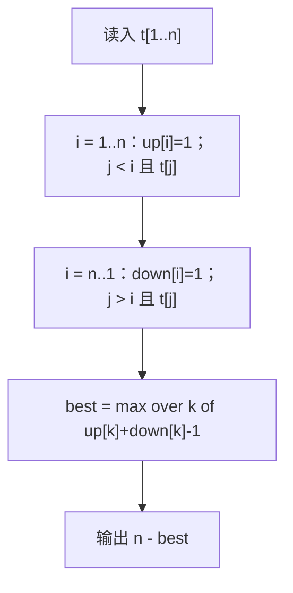

# P1091 [NOIP 2004 提高组] 合唱队形

> 原题链接：<https://www.luogu.com.cn/problem/P1091>
> 题面逐字版（抓自题目页）：[`problem.txt`](problem.txt)
> 本目录导航：[← 题库索引](../../../README.md) ｜ [题目原文](problem.txt) · [讲解代码](solution.cpp) · [元信息](metadata.yml)

## 元信息

| 项目 | 内容 |
| --- | --- |
| 难度 | 普及~普及+（其实是两道 LIS 拼起来，坑在"峰被数了两次"） |
| 来源 | NOIP 2004 提高组 |
| 标签 | 线性 DP、最长上升子序列（LIS）、双向 DP |
| 数据范围 | $2\le n\le 100$，$130\le t_i\le 230$ |
| 时间 / 空间 | $O(n^2)$ / $O(n)$ |
| 评测状态 | 未本地评测（洛谷提交需登录）；本地 `g++ -static -O2 -std=c++14` 编译，样例输出 4 逐字核对；未做随机对拍（$n\le 100$，$O(n^2)$ 双向 LIS 就是标准解，没有更值得对的对象），板书三行数组表即自检；$n=100$ 满数据输出 77，5 次运行 4.7 / 4.9 / 10.8 ms |

## 题目大意

$n$ 个同学站成一排，请走最少的人，使剩下的人身高满足**先严格升、后严格降**（存在峰位置 $i$，$t_1<\cdots<t_i>t_{i+1}>\cdots>t_k$；升或降的半边可以没有人，峰可以是任一位）。输出最少出列人数。

- 输入：$n$（$n\le 100$）和 $n$ 个身高。
- 输出：最少出列人数。
- 转化：留得最多 ⇔ 走得最少，所以本质是求**最长的"先升后降"子序列**，答案 $=n-\text{最长长度}$。
- 注意"子序列"：出列后剩下的人**保持原相对顺序**，不是重新排队。

## 思路推导

### 1. 暴力想法与它的瓶颈

"每个人决定留或走"，$2^{100}$ 种方案，判形还要 $O(n)$ —— 不可行。就算枚举留下 $k$ 个人，也是 $\binom{100}{k}$ 级别。

瓶颈：直接判"整排是不是山峰形"没有可复用的结构。但只要**把峰钉死**，左边只剩"升"、右边只剩"降"，各自都变成了你最熟的老朋友 —— LIS。

### 2. 关键观察

1. **枚举峰**：设最终队形里最高的那位（题面下标 $i$）是原序列第 $k$ 个人。他左边（含他自己）必须严格升 ⇒ 是"以 $k$ 结尾的上升子序列"；他右边（含他自己）必须严格降 ⇒ 是"以 $k$ 开头的下降子序列"。**峰本身两边共用**。
2. 于是定义两张表：
   - $up[k]$ = 以位置 $k$ **结尾**的最长**严格**上升子序列长度（经典 LIS）；
   - $down[k]$ = 以位置 $k$ **开头**的最长**严格**下降子序列长度 —— 把它**从右往左倒着看**，就是另一遍经典 LIS。
3. 钉死峰 $k$ 时最优队形长度 $=up[k]+down[k]-1$（$k$ 被两边各数了一次，**减 1**）。
4. 答案：$n-\max_k\big(up[k]+down[k]-1\big)$。
5. **两个方向都必须严格**：身高相等不能同在上升段（样例开头两个 $186$ 就是现成的反例）。

### 3. 算法设计



$down$ 的循环方向是重点：$i$ 必须**从 $n$ 倒着到 $1$**，因为 $down[i]$ 依赖它右边的 $down[j]$（$j>i$）已经算好。$up$ 同理依赖左边，正着推。两遍是完全对称的 LIS，写两遍即可，不用发明新东西。

### 4. 正确性说明

先证 $up$：对 $i$ 归纳，$up[i]$ 的转移枚举了"以 $i$ 结尾"的上升子序列的**倒数第二个位置** $j$（$t_j<t_i$，取 $up[j]+1$）以及"只有 $i$ 自己"（长度 1），分类不重不漏；$down$ 关于"从右往左、$t_j<t_i$ 接在后面构成下降"完全对称。

再证主结论：任取一个最优队形，峰在某位置 $k$。其左半是"以 $k$ 结尾的严格上升子序列"，长度 $\le up[k]$；右半是"以 $k$ 开头的严格下降子序列"，长度 $\le down[k]$；所以队形长度 $\le up[k]+down[k]-1\le \text{best}$，即 best 不小于任何合法队形。反过来，把达到 $up[k]$ 的一条上升链、达到 $down[k]$ 的一条下降链在 $k$ 处拼起来，恰是一个合法队形（左边升、右边降、峰唯一衔接，两侧除 $k$ 外位置不交叉：上升链全在 $k$ 左，下降链全在 $k$ 右），长度 $up[k]+down[k]-1$。所以 $\max_k(up[k]+down[k]-1)$ 是真正的最长队形，出列人数即 $n$ 减它。

### 5. 复杂度分析

- 时间：两遍 $O(n^2)$ 的 LIS + 一遍枚举峰，合计 $O(n^2)$；$n=100$ 时约 $2\times 10^4$ 次比较，毫无压力。
- 空间：$O(n)$（$t$、$up$、$down$ 三张表）。
- 数值：全是 $\le 100$ 的小整数，`int` 绰绰有余。

## 板书演示

官方样例（程序打印的三行数组，逐列现场填）：

```
t     = 186 186 150 200 160 130 197 220
up    =   1   1   1   2   2   1   3   4
down  =   3   3   2   3   2   1   1   1
up+down-1 = 3   3   2   4   3   1   3   4
```

最大 $4$（峰在第 4 位 $200$ 或第 8 位 $220$）⇒ 答案 $8-4=4$。

讲评点：

1. **$up[2]=1$ 而不是 2**：前面那个 $186$ 和它**相等**，严格上升接不上 —— 样例用两个相同身高专门埋了这个雷。
2. $up[7]=3$：$150\to160\to197$；$up[8]=4$：再挂上 $220$。
3. **$down$ 为什么从右往左推**：$down[1]=3$ 是 $186\to150\to130$，"往下走"依赖的全是右边已算好的值。
4. 峰 $k=4$（身高 200）：$up=2$（如 $186\to200$）$+$ $down=3$（$200\to160\to130$）$-1=4$，留 4 人走 4 人。
5. 别忘了 $\text{best}$ 里**减的那 1**：每个 $up[k]{+}down[k]$ 都比真实长度多 1（板书第三行就是减完的），漏减会得出 best$=5$、答案 $3$ —— 见易错点 1 的错版实测。

## 讲解代码

`solution.cpp`，按 `g++ -static -O2 -std=c++14` 编译：

```cpp
#include <bits/stdc++.h>
using namespace std;

const int N = 105;
int n, t[N];
int up[N], down[N];

// P1091 合唱队形：选出先升后降（严格，且峰只能一个人）的最长序列，答案 = n - 最长
// 关键转化：枚举"中间那位最高的同学" k，
//   左边要能以 t[k] 结尾取到最长上升 ⇒ up[k]；右边要能以 t[k] 开头取到最长下降 ⇒ down[k]。
//   k 被两边共用，所以长度是 up[k] + down[k] - 1。
int main() {
    scanf("%d", &n);
    for (int i = 1; i <= n; i++) scanf("%d", &t[i]);

    for (int i = 1; i <= n; i++) {                       // up[i]：以 i 结尾的 LIS 长度
        up[i] = 1;
        for (int j = 1; j < i; j++)
            if (t[j] < t[i]) up[i] = max(up[i], up[j] + 1);
    }
    for (int i = n; i >= 1; i--) {                       // down[i]：以 i 开头的 LDS 长度（倒着看就是 LIS）
        down[i] = 1;
        for (int j = n; j > i; j--)
            if (t[j] < t[i]) down[i] = max(down[i], down[j] + 1);
    }

    int best = 0;
    for (int k = 1; k <= n; k++) best = max(best, up[k] + down[k] - 1);
    printf("%d\n", n - best);
    return 0;
}
```

### 本机实测记录

| 项目 | 实测 |
| --- | --- |
| 编译 | `g++ -static -O2 -std=c++14 solution.cpp` 通过（本机两套 MinGW 冲突，**必须加 `-static`**，否则段错误、退出码 139） |
| 官方样例 | 输入 `8 / 186 186 150 200 160 130 197 220` ⇒ 输出 `4`，与题面逐字核对一致 |
| 对拍 | 未做随机对拍 —— $n\le 100$，$O(n^2)$ 双向 LIS 就是标准解，没有独立且更慢的合法暴力可对；板书三行数组表就是自检 |
| 错版实测 | 峰被左右共用却忘减 1（`up[k]+down[k]`）⇒ 官方样例输出 `3`（正解 `4`） |
| 满数据 | $n=100$（身高随机 $130..230$）⇒ 输出 `77`，5 次运行 4.7 / 4.9 / 10.8 ms（最小/中位/最大，**含进程启动**） |

## 易错点与坑

1. **忘了峰被数两次**。$up[k]$ 含 $k$、$down[k]$ 也含 $k$，拼接时 $k$ 只站一个人，必须 $-1$。错版实测：`best = max(best, up[k] + down[k])` 后官方样例输出 `3`（正解 `4`）—— 样例居然能抓住这个 bug，属于少见的好事，讲课先让学生猜"不减 1 会偏大还是偏小"。
2. **把严格写成不严格**（`t[j] <= t[i]`）。合唱队形定义里两头都是**严格**单调；样例开头两个 $186$ 是量身定做的反例：相等的人不能同一段台，用 `<=` 后 $up[2]$ 会错误地接在 $186$ 后面，整张表失真。写的时候两个方向都检查一遍 `<`。
3. **$down$ 正着推**。$down[i]$ 依赖**右边**的 $down[j]$（$j>i$），所以外层 $i$ 从 $n$ 到 $1$、内层 $j$ 从 $n$ 到 $i{+}1$；照抄 $up$ 的正向循环方向，依赖还没算好，得出来的不是 LIS。
4. **输出成 best 而不是 n - best**。题目问"最少出列几位"，DP 算的是"最多留下几位"，最后差一个减法；样例里输入是 $8$、答案是 $4$、best 也是 $4$，检查时别把"留下的 4"当"走的 4"混着用（本例恰好两者同值，纯属巧合，换组数据就露馅）。

## 常见变式

- **最少删几个数使序列严格上升**：$n-\text{LIS}$ —— 本题的半壁江山，先单独把 LIS 板演一遍再上合体版。
- **最长山谷形（先降后升）**：把 $up/down$ 的定义镜像一遍即可，结构完全对称。
- **山峰数组 / 摆动子序列**：同一"钉死转折点"的思路，转折点两边独立。
- **$n$ 大到 $10^5$**：LIS 要换成二分维护决策序列（或 BIT）的 $O(n\log n)$，$up$、$down$ 各跑一遍，总复杂度仍 $O(n\log n)$；本题 $n\le 100$，$O(n^2)$ 就是标准解、不需要上优化。

## 一句话提炼

**"把峰钉死，一个先升后降就拆成左右两边各一个 LIS；加起来时峰被数了两次，记得减 1"** —— $n-\max_k(up[k]+down[k]-1)$ 三块拼图：升、降、拼接。
