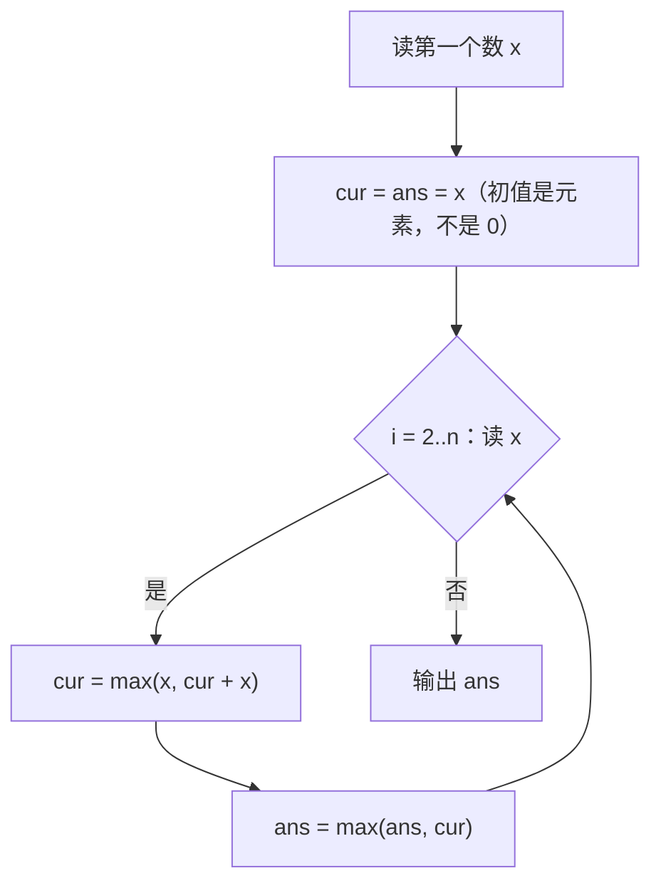

# P1115 最大子段和

> 原题链接：<https://www.luogu.com.cn/problem/P1115>
> 题面逐字版（抓自题目页）：[`problem.txt`](problem.txt)
> 本目录导航：[← 题库索引](../../../README.md) ｜ [题目原文](problem.txt) · [讲解代码](solution.cpp) · [元信息](metadata.yml)

## 元信息

| 项目 | 内容 |
| --- | --- |
| 难度 | 普及~普及+（转移一行话，坑全在初始化和"答案记在哪"） |
| 来源 | 洛谷 P1115（2026-01-21 官方新增一组 hack 数据，见 problem.txt 提示） |
| 标签 | 线性 DP、Kadane 算法、前缀和视角 |
| 数据范围 | $1\le n\le 2\times 10^5$，$-10^4\le a_i\le 10^4$ |
| 时间 / 空间 | $O(n)$ / $O(1)$ |
| 评测状态 | 未本地评测（洛谷提交需登录）；本地 `g++ -static -O2 -std=c++14` 编译，样例输出 4 逐字核对；与 $O(n^2)$ 枚举所有子段的暴力随机对拍 400 组 0 不一致；$n=2\times 10^5$ 满数据输出 2026425，5 次运行 29.1 / 29.2 / 34.6 ms |

## 题目大意

给长度 $n$ 的整数序列 $a$（**可含负数**），选出一个连续、非空的子段，使子段和最大，输出这个最大和。

- 输入：$n$ 和一串 $a_i$。
- 输出：最大子段和。
- 样例：`2 -4 3 -1 2 -4 3` 答案是 $4$，取第 $[3,5]$ 段 $\{3,-1,2\}$。
- 范围：$n\le 2\times10^5$，答案绝对值上界 $2\times 10^5\times 10^4=2\times 10^9$，距 `int` 上限 $2147483647$ 只差约 $7\%$ —— 见易错点 4。

## 思路推导

### 1. 暴力想法与它的瓶颈

最朴素的写法：枚举所有子段 $[l,r]$，$O(n^2)$ 个段，每个段用前缀和 $O(1)$ 求和 —— $n=2\times10^5$ 时 $\frac{n(n+1)}{2}\approx 2\times 10^{10}$ 次操作，必炸（$40\%$ 部分分 $n\le 2\times10^3$ 倒是正好给这条路的：$2\times 10^6$ 轻松过，讲课时可以先拿它垫场）。

瓶颈：一段子段的和里，$[l,r]$ 和 $[l{+}1,r]$ 共享尾巴，枚举把同一截尾巴**重复加了 $n$ 遍**。要省，就得换一个"不重叠计价"的状态 —— 把"以谁结尾"钉死。

### 2. 关键观察

1. **状态必须"钉住结尾"才有最优子结构**：定义 $f[i]$ = **以 $i$ 结尾**（必须选 $a_i$）的最大子段和。"任取一段"没法转移，"以 $i$ 结尾"只关心 $i$ 左边接不接。
2. **转移只有一句话**：以 $i$ 结尾的最优段，要么从 $i$ 自己另起炉灶（长度 1），要么接在以 $i-1$ 结尾的最优段后面（$f[i-1]+a_i$）。两者取大：
   $$f[i]=\max\big(a_i,\; f[i-1]+a_i\big)$$
   "接上"划算当且仅当 $f[i-1]>0$ —— 负的包袱不如扔掉。
3. **答案是所有结尾里的最大值**：最优子段总有某个右端点 $r$，它的和一定被 $f[r]$ 覆盖，所以
   $$\text{ans}=\max_{1\le i\le n} f[i]$$
   不是循环结束时最后的 $cur$（样例里 $cur$ 终于 $3$、答案却是 $4$，板书当场可见）。
4. $f[i]$ 只依赖 $f[i-1]$ ⇒ 整张表可以塌缩成**两个滚动变量** `cur`、`ans`，空间 $O(1)$，边读边算。

### 3. 算法设计



两个 `max` 一行一个职责：`cur` 回答"以当前位置结尾最多是多少"，`ans` 回答"一路走来最好是多少"。

### 4. 正确性说明

对 $i$ 归纳证明 `cur` $=f[i]$：$i=1$ 时以 $1$ 结尾的段只有 $[1,1]$，`cur` $=a_1$ 正确。设 `cur` $=f[i-1]$，以 $i$ 结尾的段两类：长度 1（和 $a_i$）、长度 $\ge 2$（去掉尾巴即"以 $i-1$ 结尾"的段，最优为 $f[i-1]+a_i$），分类不重不漏，取 $\max$ 恰是代码的 `cur = max(x, cur + x)`。

再证 `ans` 正确：设最优段为 $[l^*,r^*]$，其和 $\le f[r^*]$（$f[r^*]$ 是"以 $r^*$ 结尾"的最大值），而 $f[r^*]$ 在第 $r^*$ 轮被 `ans = max(ans, cur)` 记录过，故 $\text{ans}\ge$ 最优值；另一边 `ans` 始终是某个 $f[i]$，每个 $f[i]$ 都对应一条真实存在的子段，故 $\text{ans}\le$ 最优值。两边夹住，`ans` 即答案。

"非空"由初值 $cur=ans=a_1$ 保证：全程没有任何一步允许"长度为 0、和为 0"的段混进比较 —— 这正是 hack 数据卡的点。

### 5. 复杂度分析

- 时间：$O(n)$，每个元素一次读入两次 `max`；$n=2\times10^5$ 时 DP 本体可忽略，实测 29 ms 级别里大头是进程启动与读入。
- 空间：$O(1)$（不需要存整排 $a$，边读边算）。
- 数值：$|ans|\le 2\times 10^9$，`int` 侥幸够但余量极小（见易错点 4），代码用 `long long` 稳过。

## 板书演示

官方样例逐元素走一遍（程序打印的状态表，讲课时逐行填）：

| i | x | 决策 | cur | ans |
| --- | --- | --- | --- | --- |
| 1 | 2 | 起点 | 2 | 2 |
| 2 | -4 | 接上 | -2 | 2 |
| 3 | 3 | 另起 | 3 | 3 |
| 4 | -1 | 接上 | 2 | 3 |
| 5 | 2 | 接上 | 4 | 4 |
| 6 | -4 | 接上 | 0 | 4 |
| 7 | 3 | 接上 | 3 | 4 |

三个讲评点：

1. 第 3 行"另起"：$cur$ 是 $-2<0$，背它不如单干 —— 负包袱扔掉。
2. 第 6 行"接上"：$cur=0$，接不接都无所谓（$\max(3,0+3)$），代码统一写 `max(x, cur+x)` 不必特判。
3. 最后一行 $cur=3$ 而 $ans=4$：**答案早在第 5 行就定了，收尾的 cur 不是答案** —— 想打印 `cur` 的同学，样例就把你卖了。

## 讲解代码

`solution.cpp`，按 `g++ -static -O2 -std=c++14` 编译：

```cpp
#include <bits/stdc++.h>
using namespace std;

int main() {
    ios::sync_with_stdio(false);
    cin.tie(nullptr);

    int n;
    cin >> n;
    long long x;
    cin >> x;
    long long cur = x, ans = x;      // 命门：初值取第一个数，不是 0。全负数据下 0 会给出"空段"这个假答案

    for (int i = 2; i <= n; i++) {
        cin >> x;
        // 以 i 结尾的最大子段，要么接在前面那段后面（cur + x），要么从 i 重新开始（x）
        cur = max(x, cur + x);
        ans = max(ans, cur);         // 答案是所有"结尾"里最好的那个，不是最后的 cur
    }
    cout << ans << '\n';
    return 0;
}
```

### 本机实测记录

| 项目 | 实测 |
| --- | --- |
| 编译 | `g++ -static -O2 -std=c++14 solution.cpp` 通过（本机两套 MinGW 冲突，**必须加 `-static`**，否则段错误、退出码 139） |
| 官方样例 | 输入 `7 / 2 -4 3 -1 2 -4 3` ⇒ 输出 `4`（取 $[3,5]$ 段 $\{3,-1,2\}$），与题面逐字核对一致 |
| 对拍 | `node` 里与 $O(n^2)$ 枚举所有子段的暴力随机对拍 **400 组**（$n\le 120$，值域 $[-50,50]$）**0 不一致** |
| 错版实测 | `cur`/`ans` 初值写成 0：官方样例仍输出 `4`（**看不出问题**）；自造全负数据 `3 / -1 -2 -3` 输出 `0`，正解 `-1` |
| 满数据 | $n=200000$、$a_i$ 随机 $\in[-10000,10000]$（输入 1.03 MB）⇒ 输出 `2026425`，5 次运行 29.1 / 29.2 / 34.6 ms（最小/中位/最大，**含进程启动**） |

## 易错点与坑

1. **`cur`/`ans` 初值写成 0**（"求最大值先置 0"的直觉）。官方样例**照样输出 4**，完全看不出问题；但全负数据立刻爆炸：自造 `3 / -1 -2 -3` 实测输出 `0`，正解 `-1` —— $0$ 对应的是"选空段"，而题面要求**非空**。这正是洛谷 2026-01-21 官方新增 hack 数据卡掉的写法（题面提示可见 [`problem.txt`](problem.txt) 末行）。正确姿势：初值取第一个元素，循环从第二个开始。
2. **最后打印 `cur` 而不是 `ans`**。答案是对所有"结尾"取 $\max$，最优段完全可以在数组中间就结束。样例板书最后一行 $cur=3$、$ans=4$，两个变量不是一回事，讲课时用这对比数字钉死。
3. **把"接上"的条件写成 $f[i-1]\ge 0$ 之外又特判一堆**。`max(x, cur+x)` 已经自动处理 $cur\le 0$ 的情形（$cur<0$ 时选 $x$，$cur=0$ 时两边相等），不需要额外分支；分支越多越容易和 hack 数据捉对厮杀。
4. **数据类型不先算上界**。答案上界 $2\times10^5\times 10^4=2\times 10^9$，`int` 上限 $2147483647$ —— 恰好还差约 $7\%$，本题 `int` 侥幸够用但余量极小，换个数据范围就爆；代码直接用 `long long` 省心。讲课点：**先算上界再选类型**，别凭感觉。
5. 别忘了 $n=1$ 时循环体一次都不进 —— `cur = ans = x` 的初值写法天然覆盖；如果改成"循环里再赋初值"的写法，这里极易留脏值。

## 常见变式

- **输出最大子段本身（左右端点）**：`cur` 取 $x$ 另起时记录新起点，`ans` 刷新时记下当前起止 —— 状态不变，多维护两个下标。
- **最大子矩阵和**：把"列"当一维压进去——枚举上下边界行，两行之间每列的和构成一维序列，对内层跑一遍 Kadane，$O(n^3)$。
- **环形最大子段和**：$\max(\text{不跨界的最大段},\ \text{总和} - \text{最小子段和})$，注意全负特判 —— 一维 Kadane 跑两遍（最大和最小）即可。
- **分治做法**：答案在"左半 / 右半 / 跨过中线"三者取 max，$O(n\log n)$；这是许多教材的标准解，讲课上可作为"能从分治推出 Kadane"的进阶表演，本题时限下 $O(n)$ 更优。

## 一句话提炼

**"走到 i 只有两个选择：扔掉包袱另起炉灶，或者背着前面的和接上去；而答案要在一路的所有结尾里选最好"** —— 前者是 `cur`，后者是 `ans`，初值都不是 0。
