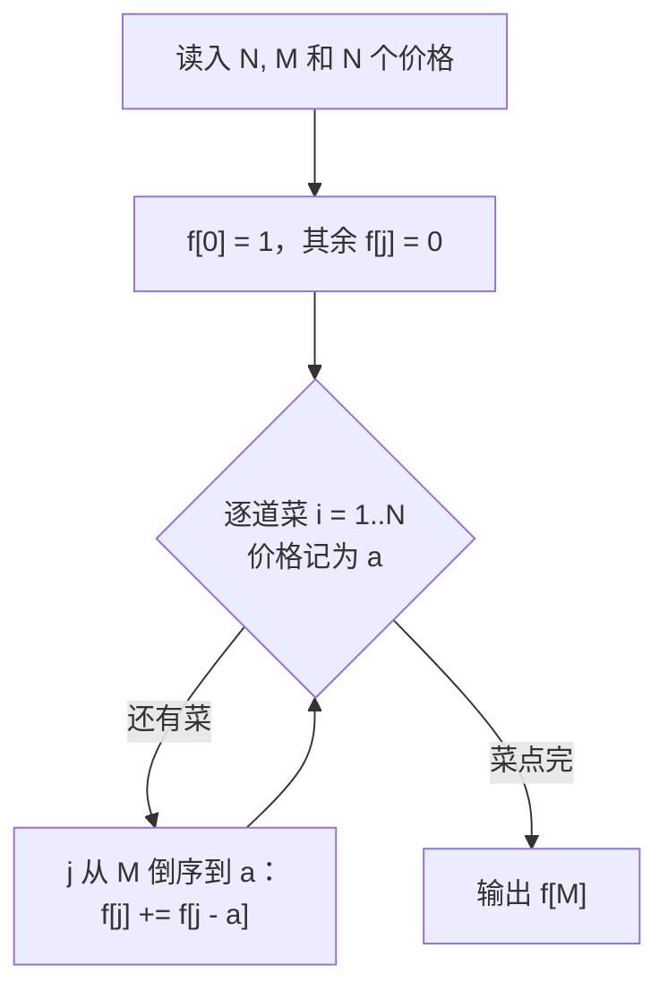

# P1164 小 A 点菜

> 原题链接：<https://www.luogu.com.cn/problem/P1164>
> 题面逐字版（抓自题目页）：[`problem.txt`](problem.txt)
> 本目录导航：[← 题库索引](../../../README.md) ｜ [题目原文](problem.txt) · [讲解代码](solution.cpp) · [元信息](metadata.yml) · [对拍脚本](verify.js)

## 元信息

| 项目 | 内容 |
| --- | --- |
| 难度 | 普及（01 背包的"计数"问法，背包四连击的第三题） |
| 来源 | 洛谷 P1164（题面标注 2020.8.29 由 @yummy 增添一组 hack 数据） |
| 标签 | 动态规划、01 背包、方案数计数、"恰好花光" |
| 数据范围 | $1\le N\le 100$，$0<M\le 10000$，$0<a_i\le 1000$（价格可重复，每种菜只有一份） |
| 时间 / 空间 | $O(NM)$ / $O(M)$ |
| 评测状态 | 未本地评测（洛谷提交需登录）；本地 `g++ -static -O2 -std=c++14` 编译，样例输出 3 逐字正确；`node verify.js` 与"枚举 $2^N$ 个菜品子集"的暴力随机对拍 400 组（$N\le 16$、$M\le 40$）0 不一致 |

## 题目大意

身上只剩 $M$ 元，餐馆有 $N$ 种菜，第 $i$ 种 $a_i$ 元且**每种只有一份**。问有多少种点法能**正好把钱花光**（不多不少）。

- 输入：第一行 $N$ 和 $M$；第二行 $N$ 个正整数 $a_i$（可以重复）。
- 输出：方案数，题面保证答案在 $[0,2^{31}-1]$ 内。
- 关键限定："刚好花完" —— 不是"最多花多少"，也不是"不超过 $M$ 里挑最贵的组合"。

换个数学说法：给 $N$ 个数，求**和恰好等于 $M$ 的子集个数**（下标不同即算不同子集，价格相同但种类不同的两盘菜是两种点法）。这就是计数版 01 背包。

## 思路推导

### 1. 暴力想法与它的瓶颈

最直接的写法是枚举所有点法：每种菜点或不点，$2^N$ 种。$N=100$ 时 $2^{100}\approx 1.3\times 10^{30}$，题面还写了"最多只能等待 1 秒"，连 $N=40$ 都嫌多。

暴力慢的原因还是那一条：**"当前已花多少钱"这个状态会被海量不同的点法重复到达**。前 20 道菜里点 $\{1,3\}$ 和点 $\{2,4\}$ 如果花的钱一样，它们对后面 80 道菜的影响完全相同，没必要分开算——把它们合并成一个计数即可。

### 2. 关键观察

1. **"恰好花光" $\Rightarrow$ 状态里必须记"已经花了多少"**。设 $f[j]$ = 恰好花掉 $j$ 元的点菜方案数，答案就是 $f[M]$。
2. **求的是方案数，不是最大值**：转移把 01 背包的 $\max$ 换成 $+$。考虑第 $i$ 道菜（价格 $a$），所有"恰好花 $j$ 元"的点法严格分成两类——**不点第 $i$ 道**的方案有旧 $f[j]$ 种，**点第 $i$ 道**（于是前面恰好花 $j-a$ 元）的方案有旧 $f[j-a]$ 种，两类不重不漏：
   $$f[j]\;\mathrel{+}=\;f[j-a]$$
3. **$f[0]=1$ 是整个递推的地基**："什么都不点"是花 0 元的**唯一**方案。第一道菜定价 $a$ 元时，$f[a]\mathrel{+}=f[0]$ 靠的就是这个 1；漏掉它则所有转移都是 $0+0$，答案恒为 0。
4. **倒序保证每种菜只有一份**：$j$ 从 $M$ 递减到 $a$，$f[j-a]$ 才是"还没考虑第 $i$ 道菜"的旧值。写成正序就变成"每种菜可以点无数次"的完全背包，方案数会膨胀。
5. 定义本身就写了"恰好"，所以 $f[j]$ 天然只统计和正好是 $j$ 的点法，不需要额外判据。

### 3. 算法设计



一维数组滚动，$N$ 轮推完，$f[M]$ 即答案。

### 4. 正确性说明

对菜品种类数归纳：设处理完前 $i$ 种菜之后，$f[j]$ = 从前 $i$ 种菜里任取若干部、**价格总和恰好为 $j$** 的取法数。

- $i=0$：只有"什么都不取"这一种取法，和为 $0$，所以 $f[0]=1$、其余为 $0$，成立。
- 从 $i$ 到 $i{+}1$（新增价格 $a$ 的第 $i{+}1$ 种菜）：任何"和恰好为 $j$"的取法要么不含这道菜（旧 $f[j]$ 种），要么含这道菜、去掉它之后是"和恰好为 $j-a$"的旧取法（旧 $f[j-a]$ 种）。这两个集合互不相交且并起来是全部，故相加正确。内层倒序保证转移读到的 $f[j-a]$ 不含这道菜本身，所以每种菜至多点一份，符合"每种菜只有一份"。

归纳到 $i=N$，$f[M]$ 就是所求方案数。

再补一句**为什么不能贪心、也不能取 $\max$**：题面 2020-08-29 加过 hack 数据，专门打"把答案写成 $\max_{j\le M} f[j]$"的写法。"不超过 $M$ 的花费"和"恰好等于 $M$ 的花费"是两个问题，$f$ 的定义里带"恰好"两字，答案就必须取 $f[M]$ 这一格。

### 5. 复杂度分析

- 时间：$O(NM)$，最坏 $100\times 10000=10^{6}$ 次加法，1 秒时限非常宽裕（本机满数据 5 ms 级）。
- 空间：$O(M)$，$f$ 开 `10005`。
- 数值：`long long` 是**底线不是保险**，见易错点 4 的实测溢出。

## 板书演示

官方样例 $N=4$、$M=4$、价格 $1\ 1\ 2\ 2$。每上一道菜就把 $f[0..4]$ 整行重算一遍：

| 轮次 | 处理的菜 | $f[0]$ | $f[1]$ | $f[2]$ | $f[3]$ | $f[4]$ | 这一行怎么来的 |
| --- | --- | --- | --- | --- | --- | --- | --- |
| 初值 | — | 1 | 0 | 0 | 0 | 0 | $f[0]=1$：什么都不点是花 0 元的唯一方案 |
| 1 | 1 元 | 1 | 1 | 0 | 0 | 0 | 倒序：$f[1]\mathrel{+}=f[0]=1$ |
| 2 | 1 元 | 1 | 2 | 1 | 0 | 0 | $f[2]\mathrel{+}=f[1]$（旧值 1）、$f[1]\mathrel{+}=f[0]$ ⇒ $f[1]=2$（两盘 1 元的菜是两种点法） |
| 3 | 2 元 | 1 | 2 | 2 | 2 | 1 | $f[4]\mathrel{+}=f[2]$、$f[3]\mathrel{+}=f[1]$、$f[2]\mathrel{+}=f[0]$ |
| 4 | 2 元 | 1 | 2 | 3 | 4 | **3** | 同上再走一遍 ⇒ 答案 $f[4]=3$ |

答案 $3$ 对应三种点法：点第 1、2、3 道（$1+1+2$）、点第 1、2、4 道（$1+1+2$）、点第 3、4 道（$2+2$）。第 1、2 道都是 1 元，但它们是**不同种类**的菜，所以前两种点法要分开数。

**错版对比**（内层写成正序 `for (j = a; j <= m; j++)`，即每种菜可以点无数次的完全背包）：最后一行 $f[0..4]$ 变成

| $f[0]$ | $f[1]$ | $f[2]$ | $f[3]$ | $f[4]$ |
| --- | --- | --- | --- | --- |
| 1 | 2 | 5 | 8 | **14** |

正解 3、错版 14，差距全部来自"同一道菜被重复点"。黑板上把两行并排放，学生一眼就明白倒序在保护什么。

## 讲解代码

`solution.cpp`，按 `g++ -static -O2 -std=c++14` 编译：

```cpp
#include <bits/stdc++.h>
using namespace std;

const int N = 10005;
int n, m;
long long f[N];            // f[j] = 恰好花掉 j 元的点菜方案数

int main() {
    scanf("%d%d", &n, &m);
    f[0] = 1;                                  // 地基：什么都不点 = 花 0 元的唯一方案
    for (int i = 1; i <= n; i++) {
        int a;
        scanf("%d", &a);
        for (int j = m; j >= a; j--) f[j] += f[j - a];   // 倒序 + 加法：每种一份，统计方案数
    }
    printf("%lld\n", f[m]);                    // 恰好花光 ⇒ 取 f[M]，不是对 j<=M 取 max
    return 0;
}
```

### 本机实测记录

| 项目 | 实测 |
| --- | --- |
| 编译 | `g++ -static -O2 -std=c++14 solution.cpp` 通过（本机两套 MinGW 路径冲突，`-static` 必须加，否则段错误退出码 139） |
| 官方样例 | 输入 `4 4 / 1 1 2 2` ⇒ 输出 `3`，与题面一致 |
| 对拍 | `node verify.js`：与"枚举 $2^N$ 个菜品子集、统计和恰好等于 $M$ 的个数"的暴力随机对拍 **400 组**（$N\le 16$、$M\le 40$）0 不一致，另有定向边界自检 |
| 错版实测 1 | 内层写成正序（变成完全背包）⇒ 官方样例输出 `14`，正解 `3` |
| 错版实测 2 | 漏掉 `f[0] = 1;` ⇒ 官方样例输出 `0`，正解 `3` |
| 满数据 A | $N=100$、$M=10000$、价格随机取 $9000..10000$（方案数很少，符合题面"答案不超 int"）⇒ 输出 `0`，5 次运行的最小 4.9 / 中位 5.3 ms（最大值未记录） |
| 满数据 B | $N=100$、$M=10000$、价格随机取 $1..1000$ ⇒ 输出 `2728559009139495181`（约 $2.7\times10^{18}$），耗时 5.4 / 6.2 ms；**换另一组同参数随机数据直接输出负数 `-3350482870095781823`** |

计时口径：用 node 的 `execFileSync` 起进程跑 5 次，报最小/中位/最大毫秒数，**数字里含进程启动开销与 Windows Defender 扫描噪声**，不是纯算法耗时。

## 易错点与坑

1. **求 $f[M]$，不是 $\max_{j\le M} f[j]$**。题面「说明/提示」只有一句 `2020.8.29，增添一组 hack 数据 by @yummy`——没说明 hack 的是什么，但本题最常见的错法就是把"恰好 $M$ 元"读成"$M$ 元以内"。"$M$ 元以内"和"恰好 $M$ 元"是两个题；把 $f$ 的定义念成"恰好"两字，答案就只会写在一格里。
2. **漏 `f[0] = 1;`**：本机实测官方样例输出 `0`，正解 `3`。而且这个 bug 特别隐蔽——程序照样编过、照样有输出，只是永远是 0。$f[0]=1$ 的讲法是："**什么都不点**"本身就是花 0 元的一种（也是唯一一种）方案，第一道菜的价格全靠它把计数传下去。
3. **内层写成正序**：本机实测官方样例输出 `14`，正解 `3`，板书对比表里 $f[0..4]$ 变成 `1 2 5 8 14`。正序等于"每种菜可以点无数次"，题目明说"每种菜只有一份"，这是 01 背包与完全背包的唯一代码差异。
4. **`int` 存 `f[j]` 会溢出，`long long` 是底线而不是保险**。题面只保证**官方数据的最终答案** $\le 2^{31}-1$，但 $f[j]$（$j<M$ 的那些格子）是中间量，没有任何保证。本机自造数据实测：$N=100$、$M=10000$、价格随机 $1..1000$ 时输出 $2728559009139495181\approx 2.7\times10^{18}$，**已经贴近 `long long` 上限**；另一组同参数随机数据更是直接输出负数 `-3350482870095781823`，也就是 `long long` 都被打爆。讲课结论：官方数据弱 $\neq$ 代码安全，写这题先用 `long long`，真要在自造大数据上算精确方案数得进一步上高精度或取模。
5. **同价不同种算不同方案**。样例里有两盘 1 元、两盘 2 元的菜，推完第 2 道菜后 $f[1]=2$ 就是这个意思： DP 按"种类"枚举而不是按"价格值"枚举，$a_i$ 重复不影响正确性。学生如果试图先排序去重，就把题意改掉了。
6. $a_i>M$ 的菜点不起：内层 `j >= a` 会让循环一次都不执行，自动处理，不用特判；但别画蛇添足地"提前读入完再补一遍"。

## 常见变式

| 变式 | 差异 | 对应题号 |
| --- | --- | --- |
| 不超过 $M$ 元最多能买多少价值 | `+=` 换回 `max`，答案取 $f[V]$ 或 $V-f[V]$ | [P1048 采药](../p1048-herbs/README.md)、[P1049 装箱问题](../p1049-box-packing/README.md) |
| 恰好装满的体积可行性 | `f[j] = max(f[j], f[j-v] + v)`，看 $f[j]=j$ 是否成立 | [P1049 装箱问题](../p1049-box-packing/README.md) |
| 每种菜可以点无限份的方案数 | 内层改正序（完全背包计数） | 本课口述，实测见上面错版 1 |
| 要求输出方案字典序最小 / 打印所有点法 | 需要额外记录决策并回溯，计数做法不够 | 背包记录方案一课 |
| 带预算上限的多维计数 | $f[j][k]$：钱数 $\times$ 份数，转移同型 | 后续课程 |

## 一句话提炼

**"'恰好花光'让背包从取 $\max$ 变成做加法：$f[j]\mathrel{+}=f[j-a]$，而 $f[0]=1$ 说的就是'什么都不点也是花 0 元的一种点法'"** —— 倒序保证每种菜只有一份，答案写死在 $f[M]$ 这一格，别取 $\max$。
