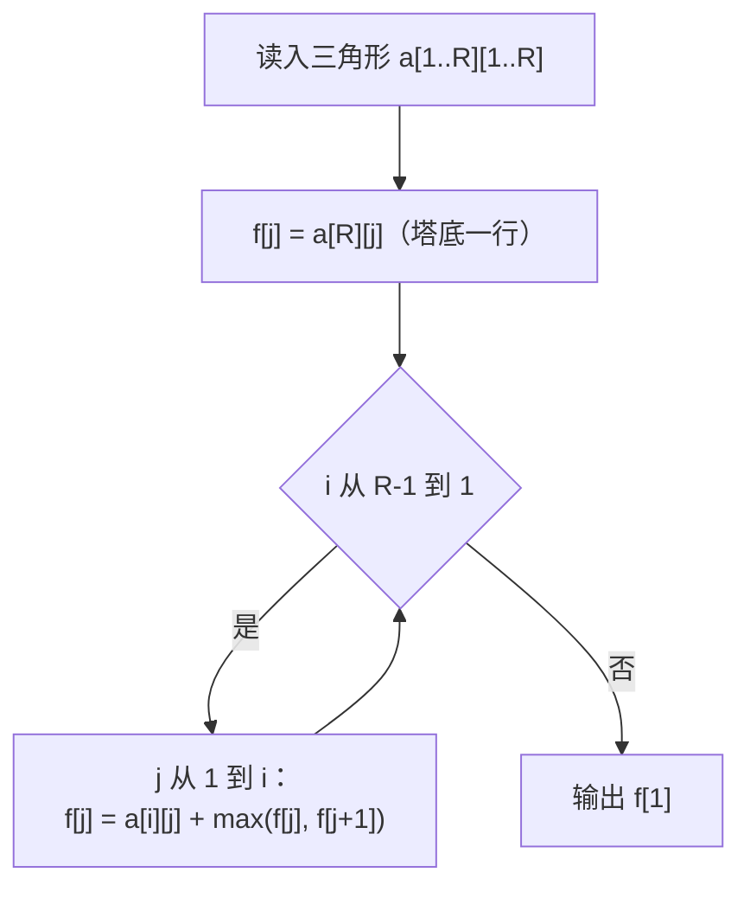

# P1216 [IOI 1994 / USACO1.5] 数字三角形 Number Triangles

> 原题链接：<https://www.luogu.com.cn/problem/P1216>
> 题面逐字版（抓自题目页）：[`problem.txt`](problem.txt)
> 本目录导航：[← 题库索引](../../../README.md) ｜ [题目原文](problem.txt) · [讲解代码](solution.cpp) · [元信息](metadata.yml) · [对拍脚本](verify.js) · [分步动画](visualization.html)

## 元信息

| 项目 | 内容 |
| --- | --- |
| 难度 | 入门~普及-（洛谷难度标 2，全部 DP 题的第一课） |
| 来源 | IOI 1994 Day1 T1 / USACO Training Section 1.5 |
| 标签 | 动态规划、数塔、滚动数组 |
| 数据范围 | $1\le R\le 1000$，每个数 $0\le a\le 100$ |
| 时间 / 空间 | $O(R^2)$ / $O(R)$（滚动一行的写法） |
| 评测状态 | 未本地评测（洛谷提交需登录）；本地 `g++ -static -O2 -std=c++14` 编译，样例输出 30 逐字正确；与 DFS 全路径枚举随机对拍 400 组 0 不一致 |

## 题目大意

给一个 $R$ 行的数字三角形，从塔顶出发，每步只能走到**左下**或**右下**相邻的数，走到塔底任意一格为止。求路径上数字之和的最大值。

- 输入：$R$，随后 $i$ 行有 $i$ 个数。
- 输出：一个整数——最大路径和。
- 范围：$R\le 1000$ ⇒ 格子总数 $\frac{R(R+1)}{2}\approx 5\times 10^{5}$。

## 思路推导

### 1. 暴力想法与它的瓶颈

"从顶端出发，每步二选一"，直接写 DFS：走 $R$ 层就有 $2^{R-1}$ 条路径，$R=1000$ 时是 $2^{999}$，宇宙年龄都不够跑。即使 $R=20$（约 52 万条路径）已经开始慢，$R=30$ 就完全不可接受。

瓶颈不在实现，在于**同一格被反复到达**：第 $i$ 行第 $j$ 格会被上面 $\binom{i}{j}$ 条路径各走一遍，每遍都重新算它往下能拿多少。

### 2. 关键观察

1. **一个格子的"往下最多能拿多少"与怎么走到它是无关的** —— 只取决于它下面的子三角形。这就是无后效性，DP 的入场券。
2. 于是定义 $f[i][j]$ = 从 $(i,j)$ 出发走到塔底的最大路径和，答案就是 $f[1][1]$。
3. $(i,j)$ 只有两条出边：左下 $(i{+}1,j)$、右下 $(i{+}1,j{+}1)$，所以
   $$f[i][j]=a[i][j]+\max\big(f[i{+}1][j],\;f[i{+}1][j{+}1]\big)$$
4. **塔底那一行不需要转移**：$f[R][j]=a[R][j]$。有了这一层初值，往上逐行推即可。
5. 算第 $i$ 行只用第 $i{+}1$ 行的 $f[j],f[j{+}1]$ ⇒ 整个二维表可以塌缩成**一个一维数组滚动**。

### 3. 算法设计



填表方向是**从下往上**，每算一行把该行覆盖掉上一行的信息即可。

### 4. 正确性说明

对行号做归纳。$i=R$ 时 $f[j]=a[R][j]$ 显然正确（只有一个格子可选）。设第 $i{+}1$ 行的 $f$ 全部正确，则任何从 $(i,j)$ 出发的路径第一步必落在 $(i{+}1,j)$ 或 $(i{+}1,j{+}1)$ 之一，剩下部分的最大和由归纳假设已知，取 $\max$ 再加上 $a[i][j]$ 就是 $(i,j)$ 的最优值 —— 转移覆盖了全部两类路径，不重不漏。归纳到 $i=1$，$f[1]$ 即答案。

顺带说明为什么**不能**贪心：每一步只看眼前的较大子节点会走 $7\to8\to1\to4\to5=25$，比最优的 $30$ 差 5。局部最优不保证全局最优，这正是"要 DP 不要贪心"的标准反例。

### 5. 复杂度分析

- 时间：$O(R^2)$，即 $\approx 5\times10^5$ 次 `max`，相对 $10^8$/秒的时限余量极大。
- 空间：$O(R)$ 的 $f$ + $O(R^2)$ 的 $a$。想省到 $O(R)$ 可以边读边算（但要反过来读入，讲课时不必强调）。
- 答案上界 $1000\times100=10^5$，`int` 足够，不需要 `long long`。

## 板书演示

官方样例（$R=5$）逐行滚动，每行只写一次：

| 轮次 | $i$ | 本行 $a[i][*]$ | 滚动后的 $f$ | 说明 |
| --- | --- | --- | --- | --- |
| 初值 | 5 | 4 5 2 6 5 | `4 5 2 6 5` | 塔底：原样抄下来 |
| 1 | 4 | 2 7 4 4 | `7 12 10 10` | $2+\max(4,5)=7$，$7+\max(5,2)=12$，$4+\max(2,6)=10$，$4+\max(6,5)=10$ |
| 2 | 3 | 8 1 0 | `20 13 10` | $8+\max(7,12)=20$，$1+\max(12,10)=13$，$0+\max(10,10)=10$ |
| 3 | 2 | 3 8 | `23 21` | $3+\max(20,13)=23$，$8+\max(13,10)=21$ |
| 4 | 1 | 7 | `30` | $7+\max(23,21)=30$ ⇒ 答案 |

最优路径 $7\to3\to8\to7\to5=30$（走的是 $3$ 不是 $8$，因为 $3$ 下面藏着 $8$ 和 $7$）。

## 讲解代码

`solution.cpp`，按 `g++ -static -O2 -std=c++14` 编译：

```cpp
#include <bits/stdc++.h>
using namespace std;

const int N = 1005;         // R <= 1000
int r, a[N][N];
int f[N];                   // 滚动的一行：f[j] = 从第 i 行第 j 格出发到塔底的最大路径和

int main() {
    scanf("%d", &r);
    for (int i = 1; i <= r; i++)
        for (int j = 1; j <= i; j++) scanf("%d", &a[i][j]);

    for (int j = 1; j <= r; j++) f[j] = a[r][j];        // 塔底：自己就是最大值，不用转移
    for (int i = r - 1; i >= 1; i--)
        for (int j = 1; j <= i; j++)
            f[j] = a[i][j] + max(f[j], f[j + 1]);       // 左下 = f[j]，右下 = f[j+1]

    printf("%d\n", f[1]);
    return 0;
}
```

### 本机实测记录

| 项目 | 实测 |
| --- | --- |
| 编译 | `g++ -static -O2 -std=c++14 solution.cpp` 无警告通过 |
| 官方样例 | 输入 5 行三角 ⇒ 输出 `30`，与题面一致 |
| 对拍 | `node verify.js`：与 DFS 枚举全部 $2^{R-1}$ 条路径的暴力随机对拍 **400 组**（$R\le10$）0 不一致 |
| 满数据 | $R=1000$、每个数随机 $\le100$（输入 1.42 MB）⇒ 输出 `74444`，5 次运行耗时 191 / 199 / 206 ms（最小/中位/最大），瓶颈是读入 50 万个数，DP 本身只占很少 |

## 易错点与坑

1. **塔底那一行要单独赋初值**。把 `f[j] = a[r][j]` 写成 `f[j] = 0`（"从第 0 行开始推"的直觉）后，本机实测样例输出 `25` 而不是 `30` —— 少加的那部分正是最后一行的最大值。错误版本照样能编过、照样有输出，属于最容易被忽视的一类 bug。
2. **$j$ 的上界是 $i$ 不是 $r$**。内层写成 `j <= r` 会读到 $a[i][j]=0$ 的空位，$f[j+1]$ 也可能读到脏值；因为 $a$ 是全局零初始化，答案可能"看着对"但只是运气。
3. **上下两个方向的表含义不同**。自顶向下要定义"走到 $(i,j)$ 的最大和"，最后必须对第 $R$ 行取 `max`；如果照抄自底向上的代码去 `printf(f[1])`，答案直接错。两份表不能混用，讲课时建议只用自底向上，少一个特判。
4. 不要贪心。见上面 $7\to8$ 的反例，考场上"每步取较大"的写法在样例上就可能对，但一定拿不到满分。

## 常见变式

- **走法条数**（不是最大和）：把 $+$ / $\max$ 换成 $\Sigma$，即 $f[i][j]=f[i{+}1][j]+f[i{+}1][j{+}1]$，塔底置 1 —— 这就是 [P1002 过河卒](../p1002-river-passage/README.md) 的结构。
- **只能走相邻同列或右一列**：即杨辉三角式数塔，转移不变，边界不同。
- **要求输出路径本身**：额外记 `g[i][j] ∈ {左下, 右下}`，从 $f[1][1]$ 顺着 $g$ 走回去打印。
- **三角形里允许向左下/右下/正下方三种走法**：转移里多一项 `max`，结构完全一样。

## 一句话提炼

**"从一个格子往下能拿多少，跟你怎么走到它无关"** —— 把这句话写进 $f[i][j]$ 的定义，转移式 $f[i][j]=a[i][j]+\max(f[i{+}1][j],f[i{+}1][j{+}1])$ 就是它的直译。
