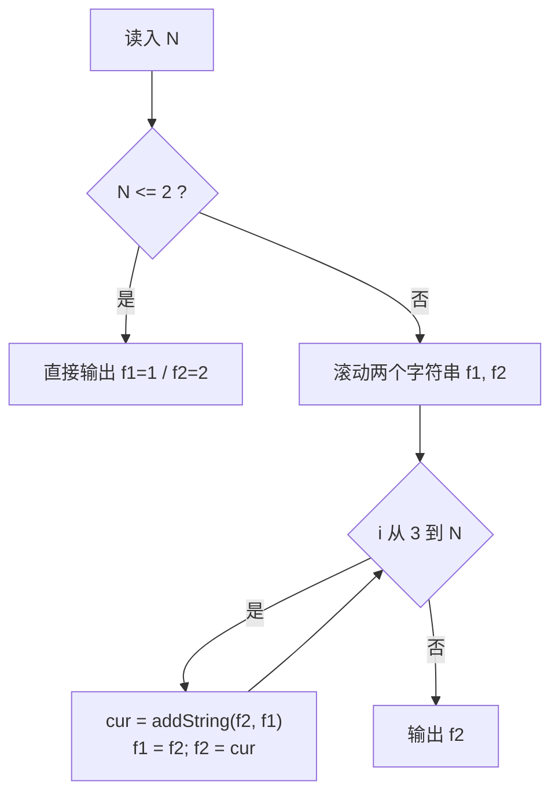

# P1255 数楼梯

> 原题链接：<https://www.luogu.com.cn/problem/P1255>
> 题面逐字版（抓自题目页）：[`problem.txt`](problem.txt)
> 本目录导航：[← 题库索引](../../../README.md) ｜ [题目原文](problem.txt) · [讲解代码](solution.cpp) · [元信息](metadata.yml)

## 元信息

| 项目 | 内容 |
| --- | --- |
| 难度 | 入门~普及-（递推本身是入门级，真正的门槛是高精度加法） |
| 来源 | 洛谷 P1255 |
| 标签 | 递推、斐波那契、高精度（大整数加法） |
| 数据范围 | $1\le N\le 5000$（$60\%$ 的数据 $N\le 50$） |
| 时间 / 空间 | $O(N\cdot L)$ / $O(L)$，$L\approx 1045$ 是最终答案的十进制位数 |
| 评测状态 | 未本地评测（洛谷提交需登录）；本地 `g++ -static -O2 -std=c++14` 编译，样例输出 5 逐字核对；未做随机对拍（递推唯一，暴力就是它自己），改用整数溢出实测数据支撑"必须高精度"的结论；$N=5000$ 满数据 5 次运行 17.5 / 17.6 / 23.3 ms |

## 题目大意

楼梯共 $N$ 阶，每步只能上 **1 阶**或 **2 阶**，问从楼下走到楼顶一共有多少种不同的走法。

- 输入：一个整数 $N$。
- 输出：走法总数（一个可能非常大的整数）。
- 范围：$N\le 5000$ ⇒ 答案高达 **1045 位十进制**，这是本题的真正考点。
- 样例：$N=4$ 时答案是 $5$（$1{+}1{+}1{+}1$、$1{+}1{+}2$、$1{+}2{+}1$、$2{+}1{+}1$、$2{+}2$）。

## 思路推导

### 1. 暴力想法与它的瓶颈

最直接的写法是 DFS：站在当前阶数上，分别尝试跨 1 阶和跨 2 阶，走到顶就计数。这条路要**逐条走完所有路径**，路径数恰好就是答案本身 —— $60\%$ 部分分 $N\le 50$ 时答案已经是 $20365011074$（下面实测表里 $f_{50}$ 那一行），显然枚举不完。

但即使把 DFS 换成"只数不枚举"的递推，$O(N)$ 加 5000 次早就很快了，**本题卡住的不是时间，而是数字装不进任何内置类型**：$f_{46}$ 就已超出 `int`，$f_{5000}$ 有 1045 位。

### 2. 关键观察

1. **按"最后一步"分类**：走到第 $n$ 阶，最后一步要么从 $n-1$ 阶跨 1 阶上来，要么从 $n-2$ 阶跨 2 阶上来。两类互不重叠、合起来又覆盖所有走法（加法原理），所以
   $$f[n]=f[n-1]+f[n-2]$$
2. **手推初值**：$f[1]=1$（一步跨 1 阶），$f[2]=2$（$1{+}1$ 和直接跨 2 阶）。这就是斐波那契数列错一位（$f[n]=F_{n+1}$），前几项：$1, 2, 3, 5, 8, 13,\dots$
3. **数字按指数速度膨胀**：$f_{16}=1597$ 已经是 4 位数，$f_{50}$ 是 11 位数，$f_{5000}$ 有 **1045 位**。⇒ 递推式照旧，但加号两边得换成**自己手写的大整数加法**。
4. 大整数加法没有魔法，就是**小学竖式**：低位对齐、逐位相加、处理进位。用字符串存十进制，从两个串的末尾（个位）往前逐位加，最后把结果翻转回来。

### 3. 算法设计



`addString(x, y)`：从 $x$、$y$ 的末位开始逐位相加，短的串补 0，`carry` 一路带上；循环条件是 `i>=0 || j>=0 || carry` —— **最高位还有进位时必须再多算一位**，否则会丢 1。低位先存进结果串，最后 `reverse` 得到正常书写顺序。

### 4. 正确性说明

两件事分开证。

**递推正确**：对 $n$ 归纳。$n=1,2$ 手列举完（$\{1\}$ 和 $\{1{+}1,\,2\}$）。$n\ge 3$ 时，把任意一条到顶路径按最后一步归类：跨 1 阶的与跨 2 阶的显然不相交，且每条路径必有其中之一；删去最后一步分别得到到 $n-1$、$n-2$ 的完整路径，一一对应。故两类数目分别是 $f[n-1]$、$f[n-2]$，加法原理给出 $f[n]=f[n-1]+f[n-2]$。

**大数加法正确**：`addString` 是竖式加法的逐字翻译——第 $k$ 轮处理两个数的第 $k$ 位（缺失补 0），$s=a+b+carry$ 的本位 $s\bmod 10$ 写下、进位 $\lfloor s/10\rfloor$ 带入下一轮；循环条件带 `|| carry` 保证最高位产生的进位不被截断。串是十进制无损存储，所以加法的和与真值一致。

### 5. 复杂度分析

- 时间：递推 $N-2\approx 5\times 10^3$ 次加法，每次加法至多扫 $L=1045$ 位 ⇒ 位运算量约 $5\times10^6$，远低于 $10^8$/秒的时限；实测满数据全程 ~18 ms，大头是进程启动。
- 空间：滚动只保留 $f_{n-1}$、$f_n$ 两个字符串，$O(L)$。想整表存下 $f[1..5000]$ 也放得进（约 260 万字符），但滚动写法更省、也更好背。
- 答案上界就是 $f_{5000}$（1045 位）——`int`（10 位）、`long long`（19 位）、`unsigned long long`（20 位）全部差好几个数量级，**没有任何内置类型能装下**。

## 板书演示

**第一块板书：前 20 项递推表**（$f[1]=1$，$f[2]=2$，往后全是前两行之和）：

| $n$ | 1 | 2 | 3 | 4 | 5 | 6 | 7 | 8 | 9 | 10 |
| --- | --- | --- | --- | --- | --- | --- | --- | --- | --- | --- |
| $f[n]$ | 1 | 2 | 3 | 5 | 8 | 13 | 21 | 34 | 55 | 89 |
| $n$ | 11 | 12 | 13 | 14 | 15 | 16 | 17 | 18 | 19 | 20 |
| $f[n]$ | 144 | 233 | 377 | 610 | 987 | **1597** | 2584 | 4181 | 6765 | 10946 |

$f_{16}=1597$ 是**第一次出现 4 位数**——从 1 到 16 项，位数翻了两番，指数增长肉眼可见。

**第二块板书：不做高精度会发生什么**（独立小程序用整数逐项推，实测）：

| 项 | 值 | 结论 |
| --- | --- | --- |
| $f_{45}$ | 1836311903 | `int` 装得下（上限 2147483647） |
| $f_{46}$ | 2971215073 | **`int` 爆掉**：2971215073 > 2147483647 |
| $f_{50}$ | 20365011074 | 已超 `int`，`long long` 尚可 |
| $f_{92}$ | 12200160415121876738 | `unsigned long long` 最后一项安全 |
| $f_{93}$ | 1293530146158671551 | **回绕**：真值 12935301461586715516，最高位被砍 |
| $f_{100}$ | 1298777728820984005 | 继续回绕，值已完全失真 |

而题面 $N\le 5000$，$f_{5000}$ 共 **1045 位**，前 12 位是 `627630280048…` ⇒ 必须手写大数。

**第三块板书：竖式加法走一遍** `1597 + 2584`（由 $f_{16}$、$f_{17}$ 算 $f_{18}$），从个位往高位一轮一轮过：

| 轮（位） | 算式 | 本位 $s\bmod 10$ | 进位 `carry` |
| --- | --- | --- | --- |
| 个位 | $7+4=11$ | 1 | 1 |
| 十位 | $9+8+1=18$ | 8 | 1 |
| 百位 | $5+5+1=11$ | 1 | 1 |
| 千位 | $1+2+1=4$ | 4 | 0 |
| 收尾 | $i,j$ 均出界且 carry=0，退出循环 | 反串 `1814` → `reverse` → **4181** | — |

注意最后两轮：千位算完 `carry` 归 0、$i,j$ 同时出界，循环才停 —— 这就是条件里 `|| carry` 存在的意义（若有最高位进位，还得再来一轮）；以及结果先按"低位在前"存成 `1814`，不 `reverse` 就会倒着打印。

## 讲解代码

`solution.cpp`，按 `g++ -static -O2 -std=c++14` 编译：

```cpp
#include <bits/stdc++.h>
using namespace std;

// 数楼梯：f[n] = f[n-1] + f[n-2]（最后一步跨 1 阶或跨 2 阶，两类不重不漏）
// 命门是 N <= 5000：F(5001) 有 1045 位，long long 只有 19 位，必须手写高精度加法。
// 这里用 string 存十进制、按位加，是最容易讲清、也最容易背下来的一种写法。
string addString(const string& x, const string& y) {
    string r;
    int carry = 0;
    for (int i = (int)x.size() - 1, j = (int)y.size() - 1;
         i >= 0 || j >= 0 || carry; i--, j--) {                 // carry 也要进循环，否则最高位丢 1
        int a = i >= 0 ? x[i] - '0' : 0;
        int b = j >= 0 ? y[j] - '0' : 0;
        int s = a + b + carry;
        r.push_back(char('0' + s % 10));
        carry = s / 10;
    }
    reverse(r.begin(), r.end());                                 // 低位先算，最后整体翻转
    return r;
}

int main() {
    int n;
    if (!(cin >> n)) return 0;
    if (n == 0) { cout << 0 << '\n'; return 0; }                 // 递推式推不出 f[0]，按题意（1<=N）本不该出现
    string f1 = "1", f2 = "2";                                   // f[1]=1 种，f[2]=2 种
    if (n == 1) { cout << f1 << '\n'; return 0; }
    if (n == 2) { cout << f2 << '\n'; return 0; }
    string cur;
    for (int i = 3; i <= n; i++) {
        cur = addString(f2, f1);
        f1 = f2;
        f2 = cur;
    }
    cout << f2 << '\n';
    return 0;
}
```

### 本机实测记录

| 项目 | 实测 |
| --- | --- |
| 编译 | `g++ -static -O2 -std=c++14 solution.cpp` 通过（本机两套 MinGW 冲突，**必须加 `-static`**，否则段错误、退出码 139） |
| 官方样例 | 输入 `4` ⇒ 输出 `5`，与题面逐字核对一致 |
| 对拍 | 未做随机对拍——本题递推式唯一，暴力枚举路径就是它自己的复杂度；改用上面的整数溢出实测表（int 第 46 项爆、unsigned long long 第 93 项起回绕）支撑"必须高精度" |
| 满数据 | $N=5000$ ⇒ 5 次运行 17.5 / 17.6 / 23.3 ms（最小/中位/最大，**含进程启动**），输出与 $f_{5000}$ 的前 12 位 `627630280048…` 一致（共 1045 位） |

## 易错点与坑

1. **不做高精度，用 `int`/`long long` 硬存**。实测：`int` 在**第 46 项就爆**（$f_{46}=2971215073>2147483647$）；换成 `unsigned long long` **只撑到第 92 项**（$f_{92}=12200160415121876738$ 正好装下），第 93 项起回绕——真值 $12935301461586715516$，实测打出来是 `1293530146158671551`，最高位被砍；$f_{100}$ 实测已是 `1298777728820984005`，完全失真。而 $N\le 5000$ 的答案是 1045 位，**必须手写大数**。
2. **`addString` 循环条件漏掉 `|| carry`**。最高位相加产生进位时（比如 $999+1$），不进循环最后一位就丢了 1。这是本函数唯一的"玄学"位，写的时候默念"还有进位就再来一轮"。
3. **忘了 `reverse`**。竖式是**从个位往高位**算的，结果串里低位在前；不翻转打印出来就是个倒着写的数。
4. **$f[0]$ 的坑**：题面 $1\le N$，本不该出现 $N=0$；但要注意递推式**推不出** $f[0]$ ——由 $f[2]=f[1]+f[0]$ 反解会得到 $f[0]=1$，这是被公式"倒推"出来的假初值，别把它当已知条件往前推。代码里对 $n=0$ 直接输出 0，只是防御性分支。
5. **初值写错**：$f[1]=1$、$f[2]=2$ 要手数路径得到（$n=2$ 有两种：$1{+}1$ 和 $2$），别顺手写成 $f[2]=1$ 变成标准斐波那契，那样恰好从第二项起全错。

## 常见变式

- **每步可跨 1、2、3 阶**：$f[n]=f[n-1]+f[n-2]+f[n-3]$（tribonacci），结构完全一样，高精度照用。
- **铺 $2\times n$ 多米诺骨牌**：方案数也是斐波那契——按最左端一块竖放/两块横放分类，是"按最后一步分类"的换皮。
- **大数换成数组存**：`int d[]` 每位存 1 个数字（或每格存 4~9 位，基数 $10^4/10^9$）更快更短；讲课时 string 版最直观，考前可换到自己顺手的写法。
- **斐波那契第 $n$ 项取模**（如 $n\le 10^{18}$、模 $p$）：递推不动了，要上矩阵快速幂——本题 $N\le 5000$ 用不上。

## 一句话提炼

**"递推只是斐波那契，加法还得自己竖式"** —— 按最后一步分类写出 $f[n]=f[n-1]+f[n-2]$ 只解决"算什么"；答案 1045 位提醒你这题真正考的是"怎么加"：逐位、进位、翻回来。
