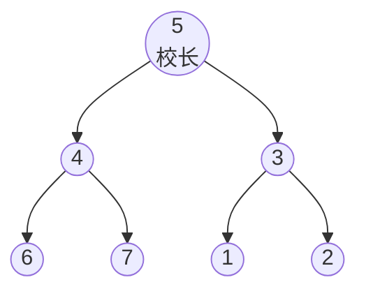

# P1352 没有上司的舞会

> 原题链接：<https://www.luogu.com.cn/problem/P1352>
> 本目录导航：[← 题库索引](../../../README.md) ｜ [讲解代码](solution.cpp) · [元信息](metadata.yml) · [对拍脚本](verify.js)

## 元信息

| 项目 | 内容 |
| --- | --- |
| 难度 | 普及（洛谷 difficulty=3） |
| 来源 | 洛谷 P1352（《算法竞赛进阶指南》经典例题） |
| 标签 | 动态规划、**树形 DP**、树上最大权独立集、后序遍历 |
| 数据范围 | $1\le N\le6000$，$-128\le r_i\le127$，保证给出的关系是一棵树 |
| 时间 / 空间 | $O(N)$ / $O(N)$ |
| 时限 / 内存 | 1000 ms / 128 MB |
| 评测状态 | 未本地评测（洛谷提交需登录）；本地 `g++ -static -O2 -std=c++14` 编译，样例输出 `5` 逐字正确；与「枚举 $2^N$ 个出席集合」独立暴力随机对拍共 530 组（JS 双实现 500 组 + 编译后 `solution.exe` 30 组）0 不一致 |

## 题目大意

$N$ 名职员构成一棵树（父结点是子结点的直接上司）。邀请职员 $u$ 能获得快乐指数 $r_u$，但**有直接上下级关系的两人不能同时出席**。求能获得的最大快乐指数之和。

- 输入：第一行 `N`；第 $2\sim N+1$ 行每行一个整数，第 $i$ 个是 $r_i$；第 $N+2\sim2N$ 行每行 `L K`，表示 $K$ 是 $L$ 的直接上司。
- 输出：一个整数——最大快乐指数。
- 样例：$N=7$、$r$ 全为 1、边 `1 3 / 2 3 / 6 4 / 7 4 / 4 5 / 3 5` ⇒ `5`。

> 这是**树形 DP 的第一课**：状态定义在节点上，"合并"发生在父子之间。学会它，树形背包（[P2014 选课](https://www.luogu.com.cn/problem/P2014)）、树上最大独立集、树的重心这一类题就都有了下手处。

## 思路推导

### 1. 暴力想法与它的瓶颈

枚举请哪些人：$2^N$ 种集合，逐个检查"有没有父子同时出席"。$N=6000$ 时 $2^{6000}$ 不可行——但注意，**这正是本目录 `verify.js` 里暴力所做的事**，$N\le11$ 时它是最可靠的正确答案来源。

暴力慢在：树的结构没被利用，每个集合都要重新检查一遍。

### 2. 关键观察

#### 观察 1：每个节点只有"来 / 不来"两种状态

一个人来不来，只影响他的**直接**上司和**直接**下属，跟叔叔舅舅没关系。所以每个节点 $u$ 定义两个值就够了：

- $f[u][0]$：$u$ **不来**时，以 $u$ 为根的**子树**能拿到的最大快乐值；
- $f[u][1]$：$u$ **来**时，同上。

#### 观察 2：子树的最优值可以"合并"到父节点上

一旦确定 $u$ 来不来，各棵子树就**互相独立**了——因为 $u$ 的任意两个不同孩子的子树之间没有任何约束关系。于是：

$$f[u][1]=r_u+\sum_{v\in\text{child}(u)}f[v][0]\qquad\text{（}u\text{ 来了，孩子们都不能来）}$$

$$f[u][0]=\sum_{v\in\text{child}(u)}\max\big(f[v][0],f[v][1]\big)\qquad\text{（}u\text{ 没来，孩子来不来都行，各取更优）}$$

"把子树的最优值合并上来"，这就是"树形 DP"名字的由来。

#### 观察 3：计算顺序必须是后序遍历

$f[u][\cdot]$ 依赖所有孩子的值，所以必须先算完孩子。后序 DFS 一遍即可。

#### 观察 4：快乐指数可以是负数，但答案不会是负数

$r_i$ 允许是负数。但 $f[u][0]=\sum\max(f[v][0],f[v][1])\ge0$（叶子 $f[0]=0$，归纳下去每项非负），所以根节点的 $f[\text{root}][0]\ge0$——它代表"**这棵子树一个人都不请**"这个合法方案。所以答案恒 $\ge0$。

### 3. 算法设计

样例这棵树（$r$ 全为 1）：



```cpp
void dfs(int u) {
    f[u][1] = r_[u];                     // u 来
    f[u][0] = 0;                         // u 不来
    for (int v : child_[u]) {
        dfs(v);                          // 后序：先算完孩子
        f[u][1] += f[v][0];              // u 来了 -> 孩子一定不能来
        f[u][0] += max(f[v][0], f[v][1]);// u 没来 -> 孩子来不来都行，取更优
    }
}
```

找根：读边时用 `hasParent[]` 标记每个节点的"有上司"状态，**唯一没有上司的节点就是校长**。

### 4. 正确性说明

**引理（子树独立性）**：固定 $u$ 的出席状态后，$u$ 的各孩子子树内部的方案互相不受约束。

*证明*：题目只禁止**直接**上下级同时出席，而 $u$ 的任意两个孩子之间不存在父子关系，它们的子树也不相交。$\blacksquare$

**定理（DP 正确）**：$f[u][0/1]$ 等于"固定 $u$ 不来 / 来"时，子树 $u$ 内合法方案的最大快乐值之和。

*归纳*：设所有孩子的 $f$ 值已正确（后序保证）。**上界**：任一合法方案在子树 $u$ 内，$u$ 的状态固定后，每个孩子 $v$ 的子树取一个合法方案；若 $u$ 来，则 $v$ 必须不来，该子树的贡献 $\le f[v][0]$；若 $u$ 不来，则 $v$ 可来可不来，贡献 $\le\max(f[v][0],f[v][1])$。求和即得方案值 $\le$ 转移式右边。**可达性**：对每个孩子取到 $f[v][0]$（或 $\max$ 对应的那个状态）的方案，把它们拼起来，与 $u$ 的状态拼成一个整体——由于引理，这不违反任何约束，于是转移式右边可达。上下界相夹，等式成立。$u$ 为叶子时 $f[u][1]=r_u$、$f[u][0]=0$，是归纳基。$\blacksquare$

**答案正确**：校长必须被考虑（它是根，不存在"上司"约束的上方），故答案为 $\max(f[\text{root}][0],f[\text{root}][1])$。

### 5. 复杂度分析

- 时间：每个节点进出 DFS 一次，$O(N)$。
- 空间：$O(N)$（孩子表 + $f[N][2]$）。
- **递归深度**：最深是一条长链，深度可达 $N=6000$。本机实测 $N=6000$ 的链**不爆栈**（输出 3000，即链上最大独立集 $\lceil6000/2\rceil$）。如果评测机栈较小或 $N$ 更大，可改写成显式栈的迭代后序。

## 板书演示

样例树（$r$ 全为 1）。下表按**后序**顺序逐节点填，数字由参考实现打印：

| 顺序 | 节点 | 类型 | $f[u][0]$（不来） | $f[u][1]$（来） | 说明 |
| --- | --- | --- | --- | --- | --- |
| 1 | 1 | 叶子 | 0 | 1 | 来就拿 1，不来就是 0 |
| 2 | 2 | 叶子 | 0 | 1 | 同上 |
| 3 | 3 | 孩子 1,2 | ${\max(0,1)}+{\max(0,1)}=2$ | $1+0+0=1$ | 3 来 ⇒ 1、2 都不能来 |
| 4 | 6 | 叶子 | 0 | 1 | |
| 5 | 7 | 叶子 | 0 | 1 | |
| 6 | 4 | 孩子 6,7 | 2 | 1 | 与节点 3 完全同构 |
| 7 | 5 | **根**，孩子 4,3 | ${\max(2,1)}+{\max(2,1)}=4$ | $1+f[4][0]+f[3][0]=1+2+2=\mathbf{5}$ | 5 来 ⇒ 4、3 都不能来，但它们的**孩子**都能来 |

答案 $\max(f[5][0],f[5][1])=\max(4,5)=\mathbf{5}$，与样例一致。对应的方案是请 $\{5,6,7,1,2\}$——**校长来，两个部门经理都不来，四个组员都来**。

课堂上值得停下来问的三个点：

1. **为什么 $f[5][1]=5$ 反而比 $f[5][0]=4$ 大？** 因为 5 来了以后，4 和 3 不能来，但 6、7、1、2 反而**都能来**。所以"根节点来"未必吃亏——这正是树形 DP 比线性 DP 反直觉的地方。
2. **$f[u][0]$ 的 $\max$ 能不能省掉？** 不能。省掉就变成"上司不来 ⇒ 下属也不来"，本机 500 组随机数据里 **415 组**会出错。
3. **全负数据为什么答案是 0 而不是负数？** 因为"一个人都不请"是合法方案，$f[\text{root}][0]$ 就代表它。本机实测一条 5 节点、$r_i$ 全为 $-1$ 的链，输出正是 `0`。

## 讲解代码

`solution.cpp`，按 `g++ -static -O2 -std=c++14` 编译：

```cpp
const int MAXN = 6005;
int n, r_[MAXN];
vector<int> child_[MAXN];
bool hasParent[MAXN];
int f[MAXN][2];

void dfs(int u) {
    f[u][1] = r_[u];                          // u 来：至少拿到自己的快乐值
    f[u][0] = 0;                              // u 不来：初值 0
    for (int v : child_[u]) {
        dfs(v);                               // 后序：先算完孩子
        f[u][1] += f[v][0];                   // u 来了 -> 孩子 v 一定不能来
        f[u][0] += max(f[v][0], f[v][1]);     // u 没来 -> 孩子 v 来不来都行，取更优
    }
}

int main() {
    scanf("%d", &n);
    for (int i = 1; i <= n; ++i) scanf("%d", &r_[i]);
    for (int i = 1; i < n; ++i) {             // 共 N-1 条边
        int L, K;
        scanf("%d%d", &L, &K);                // K 是 L 的直接上司，边 K -> L
        child_[K].push_back(L);
        hasParent[L] = true;
    }
    int root = 1;                             // 校长：唯一没有上司的人
    for (int i = 1; i <= n; ++i) if (!hasParent[i]) { root = i; break; }
    dfs(root);
    printf("%d\n", max(f[root][0], f[root][1]));
}
```

### 本机实测记录

```bash
$ g++ -static -O2 -std=c++14 solution.cpp -o solution.exe
$ printf '7\n1\n1\n1\n1\n1\n1\n1\n1 3\n2 3\n6 4\n7 4\n4 5\n3 5\n' | ./solution.exe
5
$ node verify.js --rounds=500
共 500 组（N<=11, r_i 含负数），不一致 0 组
其中 415 组里"f[u][0] 漏写 max"的错版结果与正解不同 —— 它假设上司不来时孩子也不来
```

| 项目 | 实测 |
| --- | --- |
| 编译 | `g++ -static -O2 -std=c++14 solution.cpp` 通过 |
| 官方样例 | ⇒ `5`，逐字一致 |
| 对拍（JS 双实现） | 与 $2^N$ 枚举出席集合的独立暴力随机对拍 **500 组**（$N\le11$，$r_i\in[-5,10]$ 含负数）**0 不一致** |
| 对拍（真实 exe） | 编译后的 `solution.exe` 对同一暴力另跑 **30 组 0 不一致** |
| 错版量级 | 500 组里 **415 组**「$f[u][0]$ 漏写 $\max$」的结果与正解不同 |
| 深链压力 | $N=6000$ 的一条链，递归深度 6000 ⇒ 输出 `3000`，实测 **0.21 s，不爆栈** |
| 全负边界 | 5 节点全 $-1$ 的链 ⇒ 输出 `0`（"一个人都不请"） |

## 易错点与坑

1. **$f[u][0]$ 漏写 $\max$**：写成 `f[u][0] += f[v][0]` 就等于假设"上司不来 ⇒ 下属也不来"。本机 500 组随机数据里 **415 组**能抓到这个错。这是树形 DP 最常见的错。
2. **忘记后序遍历**：$f[u]$ 依赖孩子，写成先序（先处理 $u$ 再递归）会读到未初始化的 0。递归写法里只要把 `dfs(v)` 放在累加之前就不会错；写成显式栈时容易搞反。
3. **根节点找错**：根是**唯一没有上司**的节点，用 `hasParent[]` 标记后扫一遍即可。别默认根是 1 号（样例里根是 5）。
4. **边的方向搞反**：输入是 `L K`，含义是"$K$ 是 $L$ 的直接上司"，所以边的方向是 $K\to L$。写反了树就朝上长了。
5. **`N=1`**：没有边，读入循环 `for (i=1; i<n; ++i)` 一次都不执行，`root=1`，答案 $\max(0,r_1)$。逻辑自洽，不用特判。
6. **$r_i$ 是负数时误以为答案也是负数**：答案恒 $\ge0$（"一个人都不请"）。本机实测全负链输出 `0`。
7. **深链爆栈**：$N=6000$ 的链递归深度就是 6000。本机 MinGW 实测不爆栈，但若评测机栈更小，请改成迭代后序。

## 常见变式

| 变式 | 差异 | 对应题号 |
| --- | --- | --- |
| 树上的背包（每个子树有容量） | 状态多一维"体积"，父子间做背包合并 | [P2014 选课](https://www.luogu.com.cn/problem/P2014) |
| 树上带"每个点选或不选"的计数 | 转移由 $\max$ 换成 $+$（乘法原理） | 洛谷 P1122 最大子树和（同型入门） |
| 树形 DP + 环（基环树） | 断一条边，分"强制选 / 强制不选"跑两遍树形 DP | 洛谷 P2607 骑士 |
| 树上最小点覆盖 / 最大匹配 | 状态含义换成"覆盖/匹配"，转移同型 | 洛谷 P2279 消防局的设立 |
| 线性版最大独立集 | 树退化成链，就是 [P1115 最大子段和](../p1115-max-subarray/README.md) 那一类线性 DP | —— |

## 一句话提炼

**树形 DP 的第一步是"给每个节点定几个状态"，第二步是"把子树的最优值合并上来"**——本题每个节点两个状态（来 / 不来），转移里那个 $\max$ 就是全部的坑。
