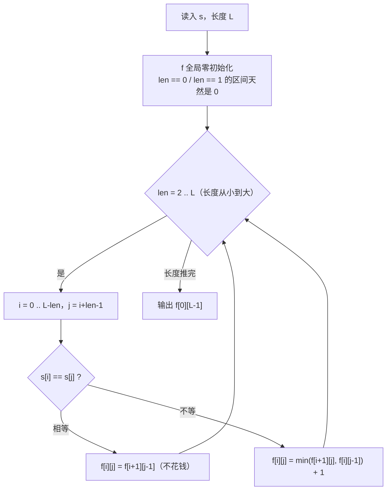

# P1435 [IOI 2000] 回文字串

> 原题链接：<https://www.luogu.com.cn/problem/P1435>
> 题面逐字版（抓自题目页）：[`problem.txt`](problem.txt)
> 本目录导航：[← 题库索引](../../../README.md) ｜ [题目原文](problem.txt) · [讲解代码](solution.cpp) · [元信息](metadata.yml) · [对拍脚本](verify.js)

## 元信息

| 项目 | 内容 |
| --- | --- |
| 难度 | 普及/提高-（区间 DP 的入门首选，比 [P1216 数字三角形](../p1216-number-triangle/README.md) 多一个"按长度填表"的顺序问题） |
| 来源 | IOI 2000 |
| 标签 | 动态规划、区间 DP、回文、填表顺序 |
| 数据范围 | 串长 $0<l\le 1000$，**区分大小写** |
| 时间 / 空间 | $O(l^2)$ / $O(l^2)$（`int f[1005][1005]` 约 4 MB，必须开全局） |
| 评测状态 | 未本地评测（洛谷提交需登录）；本地 `g++ -static -O2 -std=c++14` 编译，样例输出 2 逐字正确；`node verify.js` 与"$l-\text{LCS}(s,\text{reverse}(s))$"的另一套结论交叉随机对拍 400 组（串长 $\le 11$）0 不一致 |

## 题目大意

给一个字符串，允许在**任意位置插入任意字符**把它补成回文串，求最少要插入多少个字符。

- 输入：一行一个字符串。
- 输出：一个整数——最少插入字符数。
- 范围：$l\le 1000$；题面明确"**此问题区分大小写**"，`A` 和 `a` 不算相同字符。
- 题面给的例子：`Ab3bd` 插 2 个字符可以变成 `dAb3bAd` 或 `Adb3bdA`，插 1 个不行。

等价的另一种说法（后面变式里会用）：**保留尽量多的字符不动，让它们本来就构成回文**，也就是求最长回文子序列，插入数 $=l-\text{最长回文子序列长度}$。本题按"插入"这个原始说法来写 DP。

## 思路推导

### 1. 暴力想法与它的瓶颈

最直觉的做法是"试"：枚举插入位置（$l+1$ 个）、枚举插入的字符、递归下去。插第一个字符就有 $O(l\times|\Sigma|)$ 种选择，插 $k$ 个则是 $(O(l\cdot|\Sigma|))^{k}$，且答案 $k$ 上界可以到 $l-1$（$l=1000$ 时没人敢搜）。即使只判"插 $k$ 个字符行不行"，也是个搜索深度接近 $1000$ 的指数问题。

瓶颈在于：**"一段连续的子串要补成回文"这件事，被无数种外层插入顺序反复问到**，而它的代价跟外面怎么插是无关的。把这段代价记成状态，就是区间 DP。

### 2. 关键观察

1. 定义 $f[i][j]$（闭区间，下标从 0 起）= 让 $s[i..j]$ 变成回文**最少要插入的字符数**。答案 $f[0][l-1]$。
2. **只看区间两端 $s[i]$ 和 $s[j]$**：
   - $s[i]=s[j]$：这两个字符已经能互为镜像的配对，**中间怎么处理与两端无关**，一个字符都不用为它们花：
     $$f[i][j]=f[i+1][j-1]$$
   - $s[i]\ne s[j]$：它俩不可能配成对。要成回文，就必须让其中一端单独去找配对——在 $i$ 的右边补一个 $s[i]$（让它和最左的 $s[i]$ 配对），或者在 $j$ 的左边补一个 $s[j]$。两种做法各花 1 个字符，取较小：
     $$f[i][j]=\min\big(f[i+1][j],\;f[i][j-1]\big)+1$$
3. **小区间是天然的边界**：$f[i][i]=0$（单字符已经是回文），长度为 0 的"空区间"也是 0。全局数组零初始化把这两件事一起做了——所以循环从 `len = 2` 开始，不要从 1 开始。
4. **`len == 2` 且两端相等时会读 $f[i+1][j-1]$，也就是"左端点大于右端点"的空区间**，那个格子值恰好是 0，正是想要的结果。这就是"零初始化 + 从长度 2 起"必须成套写的原因，拆开就错。
5. $f[i][j]$ 依赖 $f[i+1][j-1]$、$f[i+1][j]$、$f[i][j-1]$，**三个都是更短的区间** ⇒ 填表顺序必须是**区间长度从小到大**。

### 3. 算法设计



### 4. 正确性说明

对区间长度 $\text{len}=j-i+1$ 做归纳。$\text{len}\le 1$ 时区间已经是回文，$f=0$ 正确；设所有长度小于 $\text{len}$ 的区间值都正确。

- **$s[i]=s[j]$**：任何把 $s[i..j]$ 补成回文的方案里，最左的 $s[i]$ 与最右的 $s[j]$ 字符相同，让它们**互为配对**不会使方案变差（把原本 $s[i]$ 的伙伴和 $s[j]$ 的伙伴互相交换配对即可）。于是代价完全由内部 $s[i+1..j-1]$ 决定，$f[i][j]=f[i+1][j-1]$。反过来，内部不补够 $f[i+1][j-1]$ 个字符就不可能成回文，所以这个值也最小。
- **$s[i]\ne s[j]$**：最终回文串里，$s[i]$ 的镜像伙伴不是 $s[j]$（字符不等）。于是 $s[i]$ 必须与区间内部的某个字符、或与一个**新插入**的 $s[i]$ 配对；前者的效果等价于"先把 $s[i]$ 撇下、把 $s[i+1..j]$ 补好，再补一个 $s[i]$"，代价 $f[i+1][j]+1$；后者同理。对称地还可以撇下 $s[j]$，代价 $f[i][j-1]+1$。两类方案都不重不漏地覆盖了所有最优解的结构，取 $\min$ 加 1 即最优。

归纳到 $\text{len}=l$，$f[0][l-1]$ 是答案。填表顺序按长度递增，保证用到的三个格子都已算好——这正是"不等分支/不等顺序"两个错版实测会翻车的原因（见易错点）。

### 5. 复杂度分析

- 时间：$O(l^2)$ 个区间、每个 $O(1)$ 转移 ⇒ $l=1000$ 时约 $10^{6}$ 次操作，非常宽裕。
- 空间：$O(l^2)$ 的 `int f[1005][1005]` $\approx 4$ MB。**这 4 MB 必须开在全局**：`main` 里的自动存储区（栈）通常只有 1~8 MB，放局部随时可能爆栈；洛谷 128 MB 限制下，全局静态区是唯一稳妥的落点。
- 数值：答案上界 $l-1\le 999$，`int` 足够。

## 板书演示

官方样例 `Ab3bd`（下标 0 起，$s=$ `A b 3 b d`）。上三角按**长度从小到大**填，下三角无意义记作 `.`：

| $i\backslash j$ | 0 `A` | 1 `b` | 2 `3` | 3 `b` | 4 `d` |
| --- | --- | --- | --- | --- | --- |
| **0** | 0 | 1 | 2 | 1 | **2** |
| **1** | . | 0 | 1 | 0 | 1 |
| **2** | . | . | 0 | 1 | 2 |
| **3** | . | . | . | 0 | 1 |
| **4** | . | . | . | . | 0 |

读表要点：

- 对角线 $f[i][i]=0$（单字符天然是回文）；`len = 2` 的格子先填：$f[1][3]$ 因 $s[1]=s[3]=$`b` 直接取 $f[2][2]=0$（中间怎么处理跟两端无关）；$f[0][1]$ 两端不等，取 $\min(f[1][1],f[0][0])+1=1$。
- $f[0][3]=1$：`Ab3b` 里 $s[0]\ne s[3]$，$\min(f[1][3],f[0][2])+1=\min(0,2)+1=1$——只需补一个 `A` 变成 `Ab3bA`。
- 最后一格 $f[0][4]=2$ 就是答案，对应题面给的 `dAb3bAd` 或 `Adb3bdA` 两种插法。
- 顺带验证一下"表是对称方向上单调的"：$f[2][4]=2$（`3bd` 三个互不相同的字符，要补 2 个），和 $f[0][2]=2$（`Ab3`）一致，符合直觉。

## 讲解代码

`solution.cpp`，按 `g++ -static -O2 -std=c++14` 编译：

```cpp
#include <bits/stdc++.h>
using namespace std;

const int N = 1005;
string s;
int f[N][N];            // f[i][j]（0 起址，闭区间）= 让 s[i..j] 变成回文最少要插入的字符数

int main() {
    cin >> s;
    int L = (int)s.size();

    for (int len = 2; len <= L; len++)              // len == 1 的区间天然是回文，f = 0（全局零初始化）
        for (int i = 0; i + len - 1 < L; i++) {
            int j = i + len - 1;
            if (s[i] == s[j]) f[i][j] = f[i + 1][j - 1];      // 两端已经配对，一个字符不花
            else f[i][j] = min(f[i + 1][j], f[i][j - 1]) + 1; // 逼某一端单独去找配对
        }

    cout << f[0][L - 1] << '\n';
    return 0;
}
```

### 本机实测记录

| 项目 | 实测 |
| --- | --- |
| 编译 | `g++ -static -O2 -std=c++14 solution.cpp` 通过（本机两套 MinGW 路径冲突，`-static` 必须加，否则段错误退出码 139） |
| 官方样例 | 输入 `Ab3bd` ⇒ 输出 `2`，与题面一致（题面同时给了 `dAb3bAd` / `Adb3bdA` 两种插法） |
| 对拍 | `node verify.js`：与另一个独立结论"最少插入数 $=l-\text{LCS}(s,\text{reverse}(s))$"交叉随机对拍 **400 组**（串长 $\le 11$，字母表 `abAB3`，区分大小写）0 不一致，另有定向边界自检 |
| 错版实测 1 | 不分情况、一律 `min(f[i+1][j], f[i][j-1]) + 1`（丢掉 $s[i]=s[j]$ 时取 $f[i+1][j-1]$ 的分支）⇒ 官方样例输出 `4`，正解 `2` |
| 错版实测 2 | 填表顺序写成外层 $i$ 从大到小、内层 $j$ 从小到大 ⇒ 官方样例输出 `0`，正解 `2` |
| 满数据 | $l=1000$ 随机串（大小写字母混合）⇒ 输出 `755`，5 次运行耗时 7.6 / 8.3 / 14.2 ms（最小/中位/最大） |

计时口径：用 node 的 `execFileSync` 起进程跑 5 次，报最小/中位/最大毫秒数，**数字里含进程启动开销与 Windows Defender 扫描噪声**，不是纯算法耗时，最大那个尖峰不必当真。

## 易错点与坑

1. **丢掉 $s[i]=s[j]$ 的分支**，一律写 `min(f[i+1][j], f[i][j-1]) + 1`。本机实测官方样例输出 `4`，正解 `2`。两端相等时"配对是免费的"，强行 $+1$ 会把每层代价都抬高。
2. **填表顺序错了**。本机实测：外层 $i$ 从大到小、内层 $j$ 从小到大 ⇒ 官方样例输出 `0`，正解 `2`。后果有两层：`len == 1` 的区间也被拿去参与转移（$f[i][i]$ 被覆盖），以及 $f[i+1][j-1]$ 读到的还是没算过的 0。区间 DP 的口号是**先短后长**，谁依赖谁就去先把长度小的那一层填完。
3. **`f[N][N]` 必须开全局**。$1005\times1005$ 个 `int` 是 4 MB，塞进 `main` 的局部变量里就是在栈上开 4 MB，随时可能爆栈（Windows 下默认栈通常只有 1~8 MB，这一版实测是放全局跑的）；开全局还顺带白送零初始化，正好是第 4 点需要的。
4. **`len` 从 2 起，别从 1 起**。从 1 起会让 $f[i][i]$ 走一遍转移（$s[i]=s[i]$ 命中"相等"分支去读 $f[i+1][i-1]$，那是完全无关的格子），把对角线写脏。零初始化 + 从 2 起是配套写法：$f[i+1][j-1]$ 在 `len == 2` 时落到"空区间"，值必须正好是 0。
5. **区分大小写**。题面专门写了一句"此问题区分大小写"，`A` 与 `a` 是两个不同字符：样例 `Ab3bd` 里首尾是 `A` 和 `d`，中间两个 `b` 才是配对的那个 $s[i]=s[j]$ 分支。做 `l - LCS` 变式时两边都要用原始串，不许 `tolower`。
6. 内层循环上界写 `i + len - 1 < L`（等价于 `i <= L - len`）。写成 `i < L` 会算出越界的 $j$，读到串外的字符——`std::string` 越界是未定义行为，可能不崩但值全错。

## 常见变式

| 变式 | 差异 | 对应题号 |
| --- | --- | --- |
| 最少**删除**几个字符使其成为回文 | 递推式长得一模一样（相等取 $f[i+1][j-1]$，不等取 $\min+1$），只是含义换成删除 | 本课口述 |
| 最长回文子序列长度 | $l-f[0][l-1]$ | 本课口述 |
| $l-\text{LCS}(s,\text{reverse}(s))$ | 值相同，正确性需额外论证，适合当对拍工具 | 本目录 `verify.js` |
| 输出补好之后的回文串本身 | 额外记录决策（走相等 / 走左 / 走右），从 $f[0][l-1]$ 回溯构造 | 本课口述 |
| 区间 DP 通用套路 | 枚举长度 → 枚举左端点 → 用更短的区间转移，`[i+1][j-1]` 类依赖靠零初始化兜底 | [P1216 数字三角形](../p1216-number-triangle/README.md) 是"按行滚动"的对照版 |

### 变式详解：`l - LCS`

另一套等价结论（也是本目录 `verify.js` 用来对拍的独立实现）：**最少插入数 $=l-\text{LCS}(s,\text{reverse}(s))$**，其中 $\text{LCS}$ 是最长公共子序列长度。

```cpp
int f[N][N];                       // 同样必须全局，4 MB
int solve(const string& s) {
    int L = (int)s.size();
    string t = string(s.rbegin(), s.rend());
    for (int i = 1; i <= L; i++)
        for (int j = 1; j <= L; j++) {
            if (s[i - 1] == t[j - 1]) f[i][j] = f[i - 1][j - 1] + 1;
            else f[i][j] = max(f[i - 1][j], f[i][j - 1]);
        }
    return L - f[L][L];            // LCS 就是最长回文子序列，剩下的全是要插的
}
```

它和上面的区间 DP **值相同，但正确性要额外论证**：$\text{LCS}(s,\text{reverse}(s))$ 取到的公共子序列未必真能对应成一个回文子序列（正反两份匹配可能"错位复用"同一批字符），所以这不是 LCS 模板的显然推论。另外本题**区分大小写**，反转串必须用同一份字符集逐字符比较，别顺手 `tolower`。考场上写区间 DP 更稳，这套 `l - LCS` 留作验算与对拍工具。


## 一句话提炼

**"两端相等就白捡，不等就逼一端去找配对、代价 +1"** —— 区间 DP 的答案永远写在 $f[0][l-1]$，而填表必须按**区间长度从小到大**，因为 $f[i][j]$ 只依赖三个更短的区间。
