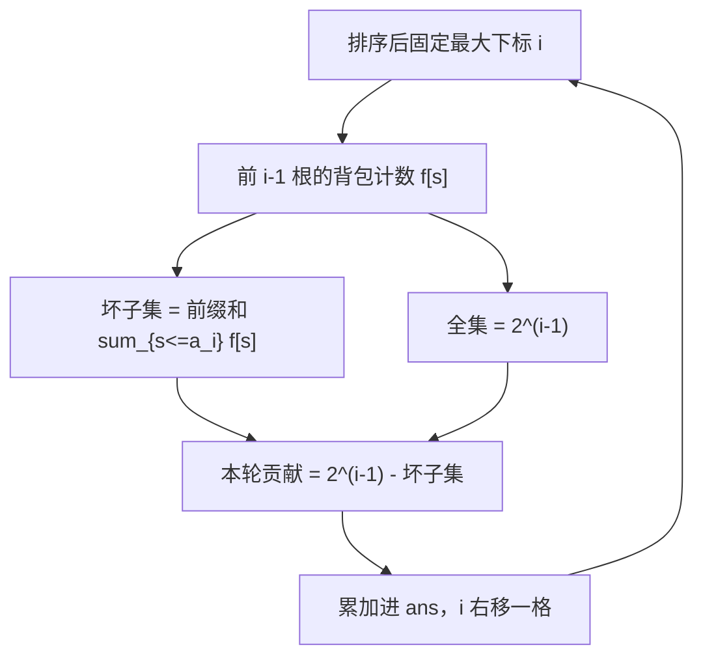

# P14360 [CSP-J 2025] 多边形 / polygon

> 原题链接：<https://www.luogu.com.cn/problem/P14360>
> 本目录导航：[← 题库索引](../../../README.md) ｜ [讲解代码](solution.cpp) · [元信息](metadata.yml) · [分步动画](visualization.html)

## 元信息

| 项目 | 内容 |
| --- | --- |
| 难度 | 普及+/提高（CSP-J 2025 T3） |
| 来源 | 洛谷 P14360 |
| 标签 | 动态规划、01 背包计数、补集转化、排序、快速幂 |
| 时间复杂度 | $O(n \cdot \max a)$ |
| 空间复杂度 | $O(\max a)$ |
| 算法验证 | ✅ 600 组随机对拍 + 2 组官方样例 + 8 组临界数据，与暴力枚举全部一致 |
| 编译验证 | ✅ 本机 `g++ -static -O2 -std=c++14 -Wall` 编译无警告，2 组官方样例实跑输出 `9` / `6` 与期望一致；未在洛谷提交，故不下 AC 结论 |

## 题目大意

$n$ 根木棍，第 $i$ 根长 $a_i$。选出若干根首尾相接拼成**多边形**，问有多少种选法（按下标集合区分），对 $998244353$ 取模。

判定法则（题面直接给出）：选出的 $m$ 根能拼成多边形 $\iff$ $m \ge 3$ 且

$$\sum_{i=1}^{m} l_i > 2 \times \max_i l_i$$

- 输入：$3 \le n \le 5000$，$1 \le a_i \le 5000$
- 样例：`1 2 3 4 5` → `9`；`2 2 3 8 10` → `6`

## 思路推导

### 1. 暴力想法与它的瓶颈

枚举所有下标子集，$2^{5000}$，不可行。即便只求"能否判定"也需要一个能计数的结构。

瓶颈：直接数"合法的"子集，需要同时管理**元素个数下限**（$m\ge3$）和**最大值**这两个耦合条件。

### 2. 关键观察

把判定式改写为最自然的形式。设选出的子集中最长的一根为 $M$，其余之和为 $S$，则

$$\underbrace{S + M > 2M}_{\text{题面判定式}} \iff \underbrace{S > M}_{\text{真正要用的形式}}$$

于是三件事被一次性解决：

- **观察 A（极值锚定）**：先升序排序。任何一个子集都有唯一的"下标最大元素"，用它充当 $M$，即可把全体子集**不重不漏**地划分成 $n$ 类（长度相等时靠下标区分，仍然唯一）。
- **观察 B（$m\ge3$ 自动成立）**：若 $S > M$，而 $M$ 是最大值，那么单独一根不可能超过 $M$，故"其余"至少两根 → 总数 $\ge 3$。**根本不需要单独处理元素个数下限。** 反之，只选 1 根时 $S=0$、选 2 根时 $S \le M$，天然被判据排除。
- **观察 C（值域足够小）**：$\max a \le 5000$，"其余之和 $S$"的取值只有 $5001$ 种可能 —— 这正是计数型 01 背包的容量。

### 3. 算法设计

固定极值锚点 $i$（$3 \le i \le n$），问题变成：

> 前 $i-1$ 根木棍的所有子集中，有多少个的和 $> a_i$？

答案是 $2^{i-1}$ 减去"和 $\le a_i$"的子集数。后者用背包计数：

设 $f[s]$ = 已考虑的前缀中，凑出**和恰为 $s$** 的子集数。转移为标准 01 背包（逆序枚举容量）：

$$f[s] \leftarrow f[s] + f[s - a_i]$$

记 $\mathrm{sum}[k] = \sum_{s \le a_{k+1}} f_k[s]$（$f_k$ 表示考虑完前 $k$ 根后的状态），则最终

$$ans = \sum_{i=3}^{n} \left( 2^{i-1} - \mathrm{sum}[i-1] \right) \bmod p$$

### 4. 正确性说明

**引理 1（划分不重不漏）**：排序后每个非空子集有唯一的最大下标 $i$，故按 $i$ 分类是互斥且完备的；同一长度值的不同木棍因下标不同而属于不同方案，与题意"下标集合不同即方案不同"一致。

**引理 2（等价判据）**：以 $i$ 为最大下标的子集合法 $\iff$ 其余元素之和 $S > a_i$。*证明*：该子集总和为 $S + a_i$，最大值即 $a_i$（升序保证），代入题面判据 $S + a_i > 2a_i$ 得 $S > a_i$。$\blacksquare$

**引理 3（元素数约束冗余）**：满足 $S > a_i$ 的子集必有 $|S|\ge 2$ 个其余元素，故总元素数 $\ge 3$。*证明*：若其余元素只有 1 个，其值 $\le a_i$（升序）$\Rightarrow S \le a_i$，矛盾；若为 0 个则 $S=0 \le a_i$，同理矛盾。$\blacksquare$

**引理 4（容量截断安全）**：背包只需维护 $s \le \max a$。*证明*：所有查询都是 $\sum_{s\le a_{i}}$ 形式且 $a_i \le \max a$；而转移 $f[s] \mathrel{+}= f[s-a_i]$ 只从更小的下标流向更大的下标，丢弃 $s > \max a$ 的状态不会污染任何被查询的 $s \le \max a$ 位置。$\blacksquare$

**引理 5（模运算合法性）**：$\mathrm{sum}[i-1] \le 2^{i-1}$ 在整数意义下成立，但两者都先取了模，故 $2^{i-1} - \mathrm{sum}[i-1]$ 的模值可能为负。代码用 $(\,\cdots + p\,) \bmod p$ 修正；因两项均在 $[0,p)$ 内，其差 $> -p$，加一个 $p 即足够。$\blacksquare$

五条引理合并：算法累加量恰为全体合法子集数。

### 5. 复杂度分析

- 时间：背包 $\sum_i (\max a - a_i) = O(n\max a)$，前缀统计同样 $O(n\max a)$，快速幂 $O(n\log n)$。$n = \max a = 5000$ 时约 $5\times 10^7$ 次操作。
- 空间：$f$、$\mathrm{sum}$、$a$ 各 $O(\max a)$ 或 $O(n)$。

## 可视化讲解

固定锚点 $i$ 时的计数几何意义 —— 直方图是 $f_{i-1}[s]$，竖线在 $a_i$，**线左侧是"凑不过去"的坏子集，线右侧与总数之差即合法方案**：



交互动画见 [`visualization.html`](visualization.html)：可拖动逐锚点观察直方图、阈值线与答案的增长。

## 讲解代码

见 [`solution.cpp`](solution.cpp)。骨架：

```cpp
sort(a + 1, a + 1 + n);
f[0] = 1; f[a[1]] = 1;                    // 考虑完第 1 根后的状态
for (int i = 2; i <= n; i++) {
    for (int s = maxn; s >= a[i]; s--)     // 01 背包计数，逆序防重复选取
        f[s] = (f[s] + f[s - a[i]]) % p;
    for (int s = 0; s <= a[i + 1]; s++)    // 以 i+1 为锚点时的坏子集数
        sum[i] = (sum[i] + f[s]) % p;
}
for (int i = 3; i <= n; i++)
    ans = (ans + qp(2, i - 1) - sum[i - 1] + p) % p;
```

### 关于你的原稿

**算法完全正确，没有 bug。** 600 组随机对拍与全部临界数据都一致。我只做了三处不影响行为的加固：

| 位置 | 原稿 | 改后 | 原因 |
| --- | --- | --- | --- |
| 数组声明 | `const int N=1e6;` 从未使用 | 删去，数组写 `N=5005` | 死代码；且 `f[50005]` 与注释不符 |
| 取模 | `(f[s]+=f[x])%=p` | `f[s]+=f[x]; if(f[s]>=p) f[s]-=p;` | $f$ 值恒 $<p$，两数之和 $<2p<p\cdot 2<2^{31}$，一次减法即可，比 `%` 快 |
| I/O | 无 | `sync_with_stdio(false); cin.tie(nullptr);` | $n=5000$ 读入虽小，但习惯问题 |

两处**能跑但脆**的写法，留着提醒：

- `for (int j=0; j<=a[i+1]; j++)` 在 $i=n$ 时读 `a[n+1]`。它落在数组内且全零初始化为 $0$，于是 $\mathrm{sum}[n]=f[0]=1$ —— 恰好没人用（$ans$ 只用 $\mathrm{sum}[2..n-1]$），所以不出错。但这是"靠边界巧合活下来的越界读"，一旦有人改用 `sum[n]` 或把数组换成局部变量立刻炸。显式写成 `if (i < n)` 更稳。
- `#define int long long` 是必需的：`qp` 里 `a*a` 若为 32 位 int 会溢出（$p^2 \approx 10^{18}$）。但代价是 $f$、$\mathrm{sum}$ 也全变 8 字节、取模变慢。更干净的写法是 $f$/$\mathrm{sum}$ 用 `int`（两数之和 $<2p<2^{31}$ 安全），只在 `qp` 内部用 `long long`。

## 易错点与坑

- **忘记 $m\ge3$ 已被判据包含**，额外去减 $1$ 根、$2$ 根的情况 → 反而减多。见引理 3。
- **等长木棍去重做过头**：本题按**下标集合**区分方案，等长的不同木棍算不同方案，不能做组合去重。
- **容量开成 $\sum a_i$**（$5000\times5000=2.5\times10^7$）：内存和时间双爆。见引理 4，只需 $\max a$。
- **`sum[i]` 的前缀上界写成 `a[i]`**：锚点是 $i+1$ 时必须用 $a[i+1]$，off-by-one 是这道题最常见的错。
- **负数取模**：$2^{i-1}-\mathrm{sum}$ 一定要 $+p$。
- **`qp(2,i-1)` 每轮重算**：$O(n\log n)$ 虽小，但可以预处理 `pow2[i]=pow2[i-1]*2%p` 递推，更清晰。

## 常见变式

| 变式 | 差异 | 备注 |
| --- | --- | --- |
| 只选 3 根拼三角形 | 组合计数 $O(n^2)$ 双指针 | 判据同为"两边之和 > 第三边" |
| 求**不能**拼成多边形的方案数 | 总方案 $2^n-1-n-\binom n2$ 减去本题答案 | 补集方向相反 |
| $n\le10^5,\ a_i\le10^5$ | $O(n\max a)$ 失效，需 FFT/生成函数 | 背包计数换多项式乘法 |
| 方案按下标集合改为按长度多重集 | 等长木棍需去重 | 组合数 $\prod$ 分桶 |

## 小结

题面把"多边形判定"包装成几何，实际是**补集转化 + 计数型 01 背包**：极值锚定把 $2^n$ 个子集划成 $n$ 类，每类只需问"前缀凑出的和不超过锚点长度"。可迁移的识别信号有二：一是"最大值与其他之和"的判据一律改写成 $S>M$ 再排序锚定；二是当值域小、元素个数大时，背包容量取 $\max a$ 而非 $\sum a$。
