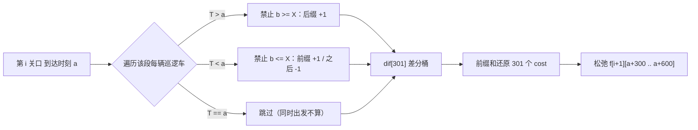

# P1499 [CTSC2000] 公路巡逻

> 原题链接：<https://www.luogu.com.cn/problem/P1499>
>
> 本题是训练单 320175 里唯一的时间轴 DP + 差分桶，也是最难的一道（CTSC 2000）。
> 交付按要求做了精简：**没有 HTML 动画**，改为下面的"时空图板书"。
> 本目录导航：[← 题库索引](../../../README.md) ｜ [题目原文](problem.txt) · [讲解代码](solution.cpp) · [元信息](metadata.yml) · [对拍脚本](verify.js)

## 元信息

| 项目 | 内容 |
| --- | --- |
| 难度 | 省选/NOI−（CTSC2000） |
| 来源 | 洛谷 P1499 |
| 标签 | 时间轴 DP、差分桶、几何判据、时刻格式化 |
| 时间复杂度 | $O\big(\sum_i \#\{可到达时刻\}\times(\text{该段车数}+301)\big)$ |
| 空间复杂度 | $O(n\cdot 600 + m)$（两行滚动 $<1$ MB） |
| 评测状态 | 本地 `g++ -static -O2 -std=c++14` 编译运行，样例输出 `0 / 061301` 正确；`node verify.js`：闭式 DP vs 枚举路径 DFS 随机对拍 20000 组 0 不一致，另用"逐时刻采样"第三种判据复核 300 组，判据不一致 0 组、采样暴力答案与 DP 不一致 0 组；$n=49,m=299$ 满规模随机数据 **96 ms**（冷启动一轮 104 ms）；未在洛谷提交 |

## 题目大意

一条无岔路的高速公路有 $n$ 个关口（$1<n<50$），相邻关口相距 10 km。车速只能在 $[60,120]$ km/h，且**只能在关口处变速** ⇒ 每段耗时是 $[300,600]$ 秒内的**整数**。

巡逻车：$m$ 辆（$1<m<300$），第 $i$ 辆在时刻 $T_i$（`HHMMSS`）从第 $n_i$ 关口出发，匀速 $t_i$ 秒驶抵 $n_i+1$ 关口。输入按 $n_i$ 递增给出。

相遇定义：两车**发生超车**，或**同时到达某关口**（同时出发**不算**）。

求一辆 6:00 整从第 1 关口出发的目标车：

1. 最少与多少辆巡逻车相遇；
2. 相遇次数最少的前提下，**最早**到达第 $n$ 关口的时刻（`HHMMSS`，补前导 0）。

## 思路推导

### 1. 暴力想法与它的瓶颈

把"每段用多少秒"看成一个选择，$n-1$ 段每段 301 种取值，路径数 $301^{48}$ —— 枚举路径不可行。
于是自然想到 DP：$f[i][j]$ = 目标车在 $j$ 秒到达第 $i$ 个关口时，已遇到的最少巡逻车数。

状态数是好的（时刻轴只要 $[21600+300(i-1),\,21600+600(i-1)]$，每段窗口最宽 $300(n-2)+1\le14401$）。
**瓶颈全在转移**：$f[i][j]=\min_{d\in[300,600]} f[i-1][j-d]+\text{cost}(i-1,j-d,j)$，
如果 $\text{cost}$ 要遍历该段所有车（$O(m)$），总量就是
$48\times14401\times301\times300\approx6\times10^{10}$ —— 这才是真正会 TLE 的地方，不是状态数。

### 2. 关键观察

#### 观察 1：一段路完全由"进出时刻"两个整数决定

只能在关口变速 ⇒ 段内匀速 ⇒ 目标车在第 $s$ 段的轨迹是一条直线：
$$(a,\text{关口 }s)\to(b,\text{关口 }s+1),\qquad b-a\in[300,600],\ a,b\in\mathbb Z$$
所以"在哪个关口提速/降速"这种细节不用建模，**时刻就是全部状态**。
这就是上面 $f[i][j]$ 定义合法的根据，也是本题最容易被学生质疑的第一步。

#### 观察 2：相遇判定化简成"两端异号或右端为 0"

设路段比例 $x\in[0,1]$。目标车 $\tau_t(x)=a+(b-a)x$，巡逻车 $\tau_p(x)=T+t\,x$，令
$$g(x)=\tau_t(x)-\tau_p(x)=(a-T)+x\big((b-a)-t\big)$$
$g$ 是**线性**函数，两端值 $g(0)=a-T$、$g(1)=b-(T+t)$。记巡逻车到达下一关口的时刻 $X=T+t$。

- $g(0),g(1)$ **异号** ⇒ 内部有交叉 ⇒ 超车 ⇒ 相遇；
- $g(1)=0$ 且 $g(0)\ne0$ ⇒ **同时到达下一关口** ⇒ 相遇（题面明确算）；
- $g(0)=0$（即 $a=T$）⇒ **同时出发，题面明确不算**；此时线性函数只在 $x=0$ 处为 0，内部不再相交 ⇒ 这一段**无论 $b$ 取什么都不相遇**；
- 同号 ⇒ 不相遇。

这一步把"几何相遇"翻译成两个整数的大小比较，后面全部推导都建立在它之上。

#### 观察 3：固定 $a$ 后，每辆车对 $b$ 的限制是一个半区间

这是本题从 $O(m)$ 降到 $O(1)$ 的唯一支点。仍看观察 2 的四条：$a$ 已固定，只有 $b$ 在 $[a+300,a+600]$ 里变，$g(1)=b-X$。

| 车与 $a$ 的关系 | 相遇条件 | 禁止的 $b$ |
| --- | --- | --- |
| $T>a$（车出发比目标车晚） | $g(0)=a-T<0$，要异号或右端 0 ⇒ $b\ge X$ | $[X,+\infty)$（**后缀**）|
| $T<a$（车比目标车早出发） | $g(0)>0$，要 $b\le X$ | $(-\infty,X]$（**前缀**）|
| $T=a$ | 同时出发，永不相遇 | 无限制（**必须短路，不能并进上面两个分支**）|

后缀 +1、前缀 +1 再 $-1$，正好就是**差分**。对每个 $a$ 建一个长度 301 的 `dif[]`（下标 $k$ 对应 $b=a+300+k$），
每辆车做 $O(1)$ 区间加，前缀和一次还原出 301 个 $\text{cost}$，顺便松弛 $f[i+1][b]$。
于是 $\text{cost}$ 从 $O(m)$ 变成"该段车数 + 301"，**且不再乘 301 这个转移因子**。

#### 观察 4：答案有两个关键字，必须分两步取

题面要"相遇最少时**最早**到达"。所以不能边 DP 边只保留最早时刻（那样可能保住一个早到但相遇多的解）。
正确做法：DP 完成后，先在整个终点窗口里求全局最小值 $\text{best}=\min_j f[n][j]$，
再取达到 $\text{best}$ 的**最小** $j$（代码里用严格 `<` 比较，天然保留最早的 $j$）。

### 3. 算法设计

1. **分桶**：`seg[ni].push_back({T, T+t})`，把 $m$ 辆车按所在段归类；$T_i$ 必须**按字符串读**再拆 `HH/MM/SS`。
2. **初始化**：$f$ 用两行滚动数组，下标直接用"当日秒数"；`f[1][21600]=0`，其余 $+\infty$（`0x3f3f3f3f`）。
3. **逐段转移**（$i=1..n-1$）：
   - 只把本段到达窗口 $[21600+300i,\ 21600+600i]$ 清成 $\infty$（不清整行）；
   - 对窗口内每个可达的 $a$：`memset(dif,0,sizeof(int)*301)`，遍历 `seg[i]` 按观察 3 做区间加，
     前缀和还原时对每个 $k$ 松弛 `f[nxt][a+300+k] = min(., base+acc)`；
   - 滚动 `cur<->nxt`。
4. **收尾**：在终点窗口取全局最小及其最小下标，`printf("%02d%02d%02d", h, m, s)`。

### 4. 正确性说明

- **状态覆盖**：由观察 1，任一合法驾驶方案都唯一对应一串到达时刻 $(j_1{=}21600, j_2,\dots,j_n)$，且相邻差在 $[300,600]$ 的整数；反过来这样的序列也一定可行（每段取 $v=10\,\text{km}/(b-a)$，落在 $[60,120]$）。DP 的转移枚举了全部合法的 $(a,b)$ 对，无遗漏无多余。
- **代价正确**：$\text{cost}(s,a,b)$ 由观察 2 的四分支给出，与"超车/同时到达/同时出发"三条题面规则一一对应；差分桶里的 `acc` 在 $b=a+300+k$ 处等于"所有把该 $b$ 列入禁止区间的车的数量"，即相遇数，因为每辆车的禁止区间按观察 3 恰好等于它产生相遇的 $b$ 集合，且三类互不重叠。
- **最优子结构**：$f[i][b]$ 只依赖 $f[i-1][a]$ 与本段代价，前面段的选择不会影响后面段的相遇判定（每辆巡逻车只属于一段，禁止区间也只在同一段内定义），所以"前 $i-1$ 段最优 + 第 $i$ 段代价"仍是前 $i$ 段最优。
- **边界**：$a=T$ 的车辆被 `continue` 短路，对应观察 2 第三条；$b=X$ 被归入"相遇"（后缀分支含端点、前缀分支含端点），对应观察 2 第二条。
- **两关键字**：由观察 4 的两步取法，输出是第一关键字最小、第二关键字最小的唯一时刻。$\blacksquare$

### 5. 复杂度分析

第 $i$ 段的到达时刻至多 $300(n-2)+1\le14401$ 个，每个时刻做"该段车数 + 301"次整数操作：
$$O\Big(\sum_{i=1}^{n-1}\big(300i\big)\times(m_i+301)\Big),\quad \sum m_i=m$$
最坏约 $48\times14401\times301\approx2\times10^8$ 次简单整数操作（加上 $m$ 的线性项）。
实测 $n=49,m=299$ 随机满数据 **96 ms**（冷启动 104 ms）—— 差分桶是关键，
按第 1 节的朴素 $\text{cost}$ 写法是 $6\times10^{10}$，本机跑不动。

空间：两行 $5.2\times10^4$ 的 `int` 滚动数组 + $m$ 辆车 + 301 格差分 $<1$ MB。

## 可视化讲解



### 时空图板书（本题不做动画）

横轴时间、纵轴关口，两条线一交叉就是相遇。样例数据 `3 2 / 1 060000 301 / 2 060300 600`：

```
关口3 ┤                                        ● 目标车 06:13:01 到达
      │                                     ／      （= 22381 秒）
      │        车2 ╱(06:03:00→06:13:00)  ／
关口2 ┤ - - - ● - - - - - - - - - - - ／- - - - - - - ← 若走 480s 就 06:13:00 同时到达，算相遇！
      │                            ／      多走 1 秒（481s）→ 06:13:01，错开，0 次相遇
      │   车1 ╱(06:00:00→06:05:01)╱
关口1 ┤ ●━━━━━━━━━━━...━━━━━━━━━╱
      └──┬──────┬──────────┬──────────┬──── 时间
       06:00  06:03     06:05:01   06:13:01
```

黑板上分三步画：

1. **画车 1**（段 1，$T=21600$、$X=21901$）。目标车 06:00 出发，$a=T$ ⇒ 观察 2 第三条 ⇒ **同时出发不算相遇**，
   所以目标车在段 1 无论走多快多慢都是 0 次。取最快 300 s ⇒ $b=21900$（06:05:00）。
   ⚠️ 这条分支**用样例是查不出错的**（见"易错点"第一条的实测），只能靠"同时出发/同时到达两个等号方向不同"这件事本身讲清楚。
2. **画车 2**（段 2，$T=21780$、$X=22380$）。目标车 $a=21900>T$ ⇒ 禁止的是**后缀** $b\ge22380$。
   走满 480 s 时 $b=22380=X$ ⇒ 同时到达关口 2 的下一站 ⇒ **相遇**；再多走 1 秒 $b=22381$ ⇒ 错开。
3. **读出答案**：$22381$ 秒 $=06{:}13{:}01$ ⇒ `061301`，相遇 0 次。**"多花 1 秒躲掉一辆车"就是本题的题眼**，
   值得让全班先猜"最少相遇是几"，再解释为什么 0 次可以达到。

第二问的板书要单独强调：$f[n][j]$ 里 $j=22381$ 与 $j=22382,\dots$ 都是 0 次相遇，
"最早到达"是在这一堆 0 里取最小下标，不是"全程最快"（全程最快 $=300\times2=600$ s，到达 06:10:00，反而相遇 1 次）。

## 讲解代码

```cpp
const int BASE = 21600;               // 6:00:00 的秒数
vector<Patrol> seg[MAXN];             // 按段分桶：seg[s] = 第 s 段的巡逻车
static int f[2][MAXT];                // 两行滚动，下标 = 当日秒数

// 逐段转移（i = 1 .. n-1），只清本段到达窗口
for (int a = loA; a <= hiA; a++) {
    int base = f[cur][a];
    if (base >= INF) continue;                    // 不可达
    memset(dif, 0, sizeof(int) * 301);            // 只清 301 格，不清整行
    for (auto &c : seg[i]) {
        if (c.T == a) continue;                   // 同时出发 → 永不相遇，必须短路
        int k = c.X - (a + 300);                  // 阈值落在差分桶的第 k 格
        if (c.T > a) { if (k <= 300) dif[k < 0 ? 0 : k]++; }      // 后缀 [X,∞)
        else { if (k >= 0) { dif[0]++; if (k + 1 <= 300) dif[k+1]--; } }  // 前缀 (-∞,X]
    }
    int acc = 0;
    for (int kk = 0; kk <= 300; kk++) {           // 前缀和还原 + 同时松弛
        acc += dif[kk];
        int b = a + 300 + kk, val = base + acc;
        if (val < f[nxt][b]) f[nxt][b] = val;
    }
}
// 收尾：先全局最小，再取达到最小值的最小 j（严格 <）
for (int j = lo; j <= hi; j++) if (f[cur][j] < best) { best = f[cur][j]; bestJ = j; }
printf("%d\n%02d%02d%02d\n", best, bestJ/3600, bestJ%3600/60, bestJ%60);
```

完整逐段注释版见 [`solution.cpp`](solution.cpp)。

### 机器实测记录

```
$ g++ -static -O2 -std=c++14 solution.cpp -o sol.exe
$ ./sol.exe < in1.txt
0
061301
```

手算路径与题面样例解释一致（段 1 走 300 s、段 2 走 481 s，见上面时空图板书）。

```
$ node verify.js
--- 官方样例 --- closedDP -> enc=0 end=061301 | bruteDFS -> enc=0 end=061301 | 期望 enc=0 end=061301  OK
--- 主对拍：closedDP vs bruteDFS(解析)，缩窗口 [3,7]、n<=5、m<=6，20000 组 ---  20000 组全部一致
--- 三方一致性：meetSampling(10001点) vs meetAnalytic vs closedDP，n<=4、m<=4、窗口[2,5] ---
   检查 300 组：判据不一致 0 组，采样暴力答案与 DP 不一致 0 组
```

满规模压测（$n=49$、$m=299$，$T$ 随机落在 05:00–23:00、$t$ 随机 $[300,600]$）：
**96 ms**（连跑三轮：104 / 96 / 96 ms，首轮含冷启动），输出 `0 / 100000`
（$100000$ 即 10:00:00 $=21600+300\times48$，正好是"每段都走最快 300 秒"的下界，符合预期）。

三种独立实现（闭式 DP、枚举每段时长的 DFS、按 10001 个采样点判相遇的暴力）互相对拍全部一致，
这是本题"判据写对没有"的最强证据 —— 因为判据有三条分支、两个等号方向不同。

## 易错点与坑

- **$T_i$ 是 `HHMMSS` 不是十进制秒**：`060000` 要拆成 $6\cdot3600+0\cdot60+0=21600$。当整数读进 `int` 得 60000 秒 = 16:40:00，全盘皆错。
  代码必须 `scanf("%s")` 再逐位拆；输出同理要 `%02d%02d%02d` **补前导零**，`printf("%d",...)` 会丢掉开头的 0。
- **$a=T$ 必须单独短路，而且样例查不出来**：实测把 `if (T == a) continue;` 这一行删掉（让它掉进 $T<a$ 的前缀分支），
  跑**官方样例仍然输出 `0 / 061301`**，看不出任何异常。要自造数据才暴露：
  ```
  2 1
  1 060000 600      →  正确答案 0 / 060500；漏短路后变 1 / 060500（凭空多算一次相遇）
  2 1
  1 060000 300      →  正确答案 0 / 060500；漏短路后变 0 / 060501（第二问晚 1 秒）
  ```
  原因是这类车上界恰好压住窗口、只影响一个 $b$，样例的结构刚好避开。**题面括号里那句"同时出发不算相遇"是判据的第三条分支，不是修辞**，
  讲课时必须用自造数据证明它，否则学生会以为删掉这行没关系。
- **$b=X$ 算相遇、$a=T$ 不算**：两个等号方向相反，一个归右端点、一个归左端点。
  写差分时下标 `k = X-(a+300)` 的 $+1/-1$ 位置就是这个等号决定的，**建议课上用样例把 $k$ 算一遍**（车 2：$k=22380-22200=180$，落在第 180 格，即 $b=21900+300+180=22380$ 开始禁止，正好含端点）。
- **每段耗时是 $[300,600]$ 闭区间且必须整秒**：题面"所有车辆到达关口的时刻都是整秒"。
  写成 $[301,600]$ 会漏掉样例的 $b=21900$（段 1 走满 300 s）这类关键解；用浮点秒更是直接失去状态有限性。
- **两关键字不能合并成一个循环**：见观察 4。求最小值时用严格 `<`（不是 `<=`），才能保留最早的 $j$。
- **`INF` 用 `0x3f3f3f3f` 不用 `1e9`**：`memset(f,0x3f,sizeof f)` 逐字节填充才等价于每个 int 都是 `0x3f3f3f3f`；
  而 $+\infty$ 参与 `base + acc` 时仍要能判定，`0x3f3f3f3f` 两个相加也不爆 `int`。
- **`dif[]` 只需清 301 格**：`memset(dif, 0, sizeof(int)*301)`。清整个 `sizeof dif`（305 格）也行，
  但千万不要在每层 $a$ 里 `memset` 整个 $f$ 行 —— 那是 $O(\text{时刻}\times\text{时刻})$。
- **同段的巡逻车不保证按 $T$ 有序**：题面只说整体按 $n_i$ 递增。差分桶法不依赖有序；
  若改用"每段车按 $T$ 排序 + 双指针"的优化版，必须先自己排序。

## 常见变式

| 变式 | 差异 |
| --- | --- |
| 把"整秒"改成"任意实数时刻" | 时间轴不可枚举，DP 失效，变成连续优化/几何题 |
| 相遇只算超车、不算同时到达 | 观察 3 的后缀 $b\ge X$ 变成 $b>X$，差分下标整体平移 1 格 |
| 求"最多避免几辆" | 同一 DP，把 $\min$ 换成 $\max$、初始值换 $-\infty$ |
| 每段距离不等 | 窗口不再是 $[300,600]$，改成按各段距离重算上下界，差分桶宽度随之改变 |

## 小结

**"两个时刻定住一段直线"之后，相遇判定就退化成两条端点异号的符号检查，于是每辆车对时长的限制是一个半区间 —— 半区间能差分，DP 的转移才从 $O(m)$ 降到 $O(1)$。**
