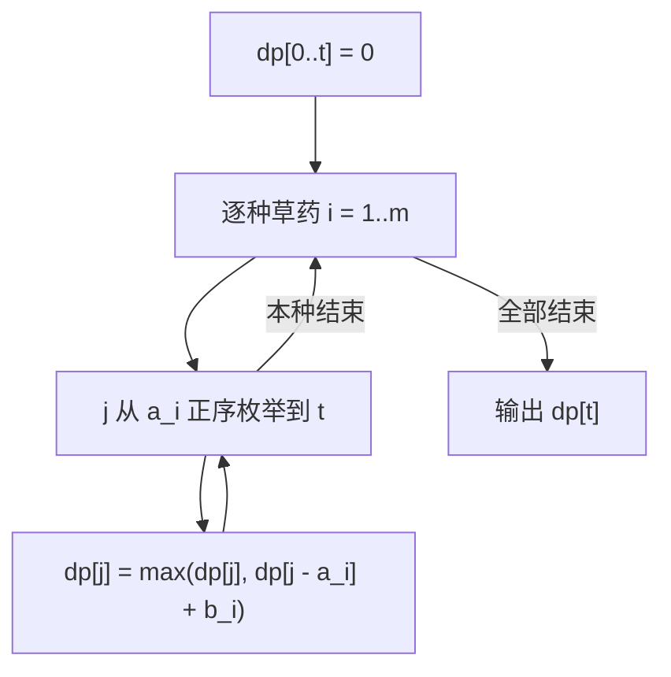

# P1616 疯狂的采药

> 原题链接：<https://www.luogu.com.cn/problem/P1616>
> 本目录导航：[← 题库索引](../../../README.md) ｜ [讲解代码](solution.cpp) · [元信息](metadata.yml) · [对拍脚本](verify.js)

## 元信息

| 项目 | 内容 |
| --- | --- |
| 难度 | 普及−（洛谷 difficulty=2） |
| 来源 | 洛谷 P1616（蓝桥杯考前复习冲刺） |
| 标签 | 动态规划、完全背包、正序枚举、一维滚动数组 |
| 数据范围 | $1\le m\le 10^4$，$1\le t\le 10^7$，**且 $1\le m\times t\le 10^7$**；$1\le a_i,b_i\le 10^4$ |
| 时间 / 空间 | $O(mt)$ / $O(t)$ |
| 时限 / 内存 | 1000 ms / 128 MB |
| 评测状态 | 未本地评测（洛谷提交需登录）；本地 `g++ -static -O2 -std=c++14` 编译，样例输出 `140` 逐字正确；与「DFS 枚举每种草药采几株」的独立暴力随机对拍共 2100 组（JS 双实现 2000 组 + 编译后 `solution.exe` 100 组）0 不一致 |

## 题目大意

$m$ 种草药，第 $i$ 种采摘一次花 $a_i$ 时间、得到 $b_i$ 价值，**每种可以采任意多次**。总时间 $t$，求能采到的最大总价值。

- 输入：第一行 `t m`（**先时间后种数**），随后 $m$ 行每行 `a_i b_i`。
- 输出：一个整数——不超过 $t$ 时间的最大价值。
- 与 [P1048 采药](../p1048-herbs/README.md) 的**唯一**差别：P1048 每种草药只能采一次，本题可以无限次采。

> **课堂第一句就该说的事**：本题的样例输入与 P1048 **逐字相同**
> ```
> 70 3 / 71 100 / 69 1 / 1 2
> ```
> P1048 的答案是 `3`，本题的答案是 `140`。差的不是数据，是那一句"可以无限制地疯狂采摘"。

## 思路推导

### 1. 暴力想法与它的瓶颈

P1048 的暴力是"每株采 / 不采"，共 $2^m$ 种。本题每种草药可以采 $k$ 株（$k$ 由时间决定），方案数变成

$$\prod_{i=1}^{m}\left(\left\lfloor \frac{t}{a_i}\right\rfloor + 1\right)$$

样例里第三种草药 $(1,2)$ 就能采 $70$ 种数量，$m$ 再大一点就彻底爆炸。但注意：暴力之所以慢，仍然是因为**重复**——"已经用掉多少时间"这一个数，就概括了前面所有选择的效果。这和 P1048 是同一个突破口。

### 2. 关键观察

1. 沿用 P1048 的状态：$f[i][j]$ = 只考虑前 $i$ 种、总共用掉不超过 $j$ 时间时的最大价值。
2. 区别只在于第 $i$ 种可以拿 $k$ 次：
   $$f[i][j]=\max_{k\ge 0,\;k a_i\le j}\Big(f[i-1][j-k\,a_i]+k\,b_i\Big)$$
3. 把 $f[i]$ 就地覆盖成 $f$（一维滚动）。此时算 $f[j]$ 时，$f[j-a_i]$ 是**本轮**已经算好的值，它可能已经含了一株第 $i$ 种草药——于是 $f[j-a_i]+b_i$ 天然表示"再采一株"。
4. 所以：**内层容量枚举从 P1048 的倒序改成正序，$O(mt)$ 就完成了从 01 背包到完全背包的切换。**

### 3. 算法设计



一句话代码骨架：

```cpp
for (int i = 1; i <= m; ++i)
    for (int j = a[i]; j <= t; ++j)          // 正序！
        dp[j] = max(dp[j], dp[j - a[i]] + b[i]);
```

### 4. 正确性说明

记 $f^{(i)}[j]$ 为"处理完前 $i$ 种草药后 $dp[j]$ 的值"。就地覆盖的正序更新是

$$f^{(i)}[j]=\max\Big(f^{(i-1)}[j],\;f^{(i)}[j-a_i]+b_i\Big)$$

对 $j$ 做归纳，把右边第二项不断展开：

$$f^{(i)}[j]=\max_{k\ge 0,\;k a_i\le j}\Big(f^{(i-1)}[j-k\,a_i]+k\,b_i\Big)$$

（$j-k a_i<0$ 的项不参与，正好对应"装不下"。）

右边恰好就是第 2 节的状态转移——枚举第 $i$ 种草药采 $k$ 株、其余留给前 $i-1$ 种。所以就地正序更新**精确**地算出了完全背包的转移式，不是"碰巧"。

对照 P1048 的倒序：倒序时 $f[j-a_i]$ 还是 $f^{(i-1)}$ 的旧值，展开后 $k$ 只能取 $0$ 或 $1$，于是退化成 01 背包。**两个方向的差别就是"$k$ 能不能大于 1"。**

### 5. 复杂度分析

- 时间：$O\!\left(\sum_i (t-a_i+1)\right)\le O(mt)$。题面把 $m\times t\le 10^7$ 写进了约束，所以最坏也只有 $10^7$ 次转移。
- 空间：$O(t)$，`long long dp[10^7+5]` 约 80 MB，在 128 MB 之内。
- **读题要点**：$m\le10^4$ 与 $t\le10^7$ 单独看都很大，但题面同时给了 $m\times t\le10^7$。少了这条乘积约束，朴素完全背包就是 $10^{11}$，必须换算法。**看到两个大数字，先找它们之间的乘积约束。**

## 板书演示

数据取本题官方样例（$t=70$）：$(71,100)$、$(69,1)$、$(1,2)$。下表数字由参考实现打印，不是手推：

| 阶段 | $dp[0]$ | $dp[1]$ | $dp[2]$ | … | $dp[68]$ | $dp[69]$ | $dp[70]$ |
| --- | --- | --- | --- | --- | --- | --- | --- |
| 初始 | 0 | 0 | 0 | … | 0 | 0 | 0 |
| 加入 $(71,100)$ | 0 | 0 | 0 | … | 0 | 0 | 0 |
| 加入 $(69,1)$ | 0 | 0 | 0 | … | 0 | 1 | 1 |
| 加入 $(1,2)$ | 0 | **2** | **4** | … | **136** | **138** | **140** |

三处课堂对照：

1. **第一行 $a=71>t=70$**，内层循环从 $j=71$ 起，一次都不执行——整株草药被"装不下"自动跳过，不用写 `if`。
2. 加入 $(69,1)$ 后只有 $dp[69]=dp[70]=1$；再加入 $(1,2)$ 后 $dp[j]=2j$（$j\ge1$），最后 $dp[70]=2\times70=140$。**同一株草药被用了 70 次**，这就是"疯狂采摘"。
3. 把内层改成倒序（即照抄 P1048），同一组样例得到的是 `3` —— 与 P1048 的答案一模一样。

| 内层写法 | 样例输出 | 含义 |
| --- | --- | --- |
| 正序 `j = a..t` | **140** | 完全背包：每种草药可采任意多次 |
| 倒序 `j = t..a` | **3** | 01 背包：每种草药只能采一次（= P1048 的答案） |

## 讲解代码

`solution.cpp`，按 `g++ -static -O2 -std=c++14` 编译：

```cpp
const int MAXT = 10000005;  // t <= 1e7
long long dp[MAXT];         // 全局：约 80 MB，放 main 里会爆栈

int main() {
    int t, m;
    scanf("%d%d", &t, &m);                  // 注意：先总时间 t，后草药种数 m
    for (int i = 1; i <= m; ++i) {
        int a, b;
        scanf("%d%d", &a, &b);
        for (int j = a; j <= t; ++j)        // 【正序】—— 完全背包的唯一标志
            dp[j] = max(dp[j], dp[j - a] + b);
    }
    printf("%lld\n", dp[t]);
    return 0;
}
```

### 本机实测记录

```bash
$ g++ -static -O2 -std=c++14 solution.cpp -o solution.exe
$ node verify.js --rounds=2000
  完全背包(正序)  = 140
  01 背包(倒序)   = 3   <- 这就是 P1048 采药的答案
共 2000 组（T<=60, M<=6），不一致 0 组
其中 1745 组里"倒序（01 背包）"的结果严格小于正解

$ printf '70 3\n71 100\n69 1\n1 2\n' | ./solution.exe
140
$ printf '10000000 1\n1 10000\n' | ./solution.exe
100000000000            # 10^11，int 装不下
```

| 项目 | 实测 |
| --- | --- |
| 编译 | `g++ -static -O2 -std=c++14 solution.cpp` 通过 |
| 官方样例 | `70 3 / 71 100 / 69 1 / 1 2` ⇒ `140`，逐字一致 |
| 对拍（JS 双实现） | 与 DFS 枚举株数的独立暴力随机对拍 **2000 组**（$t\le60$，$m\le6$，$a_i\le12$）**0 不一致** |
| 对拍（真实 exe） | 编译后的 `solution.exe` 对同一暴力另跑 **100 组 0 不一致**（本机沙箱里 node 无法 spawn 新编译的 exe，故改用 bash 驱动 exe 完成） |
| 方向写反的量级 | 2000 组里 **1745 组**「倒序（01 背包）」的结果严格小于正解 |
| 满约束 | $t=10^7$、$m=1$、$a=1$、$b=10^4$ ⇒ 输出 `100000000000`（$10^{11}$，验证 `long long` 必要），实测 0.21 s |

## 易错点与坑

1. **内层方向写反**：写成 `for (int j = t; j >= a; --j)` 就退回 01 背包。本题样例上输出 `3`（正解 `140`），与 P1048 的答案重合——所以这道题和 P1048 互为对方的"错版检测器"，**把两题的样例放一起讲，学生一次就记住方向**。
2. **`dp` 数组类型必须是 `long long`**：上界 $10^7\times10^4=10^{11}$，`int` 直接回绕。本机实测满约束输出 `100000000000`，`int` 版本得到的是回绕后的垃圾值。
3. **数组必须开在全局**：$10^7+5$ 个 `long long` 约 80 MB，`main` 的栈通常只有 8 MB，会直接栈溢出。本题是"大数组开全局"最典型的教材。
4. **输入顺序**：第一行是 `t m`，不是 `m t`。写反时样例仍然可能"看起来对"，但 $m>t$ 的数据会立刻错。
5. **`j` 从 `a` 开始而不是从 0**：$j<a$ 时 `dp[j-a]` 读到负下标，属于"能跑但错"的一类。
6. **别用 `cin` 硬读满数据**：本题数据量不大（$m\le10^4$），但养成 `scanf` / 关同步的习惯没坏处。

## 常见变式

| 变式 | 改动 | 库里现成的例子 |
| --- | --- | --- |
| 每种只能拿一次（01 背包） | 内层改**倒序** | [P1048 采药](../p1048-herbs/README.md) |
| 求方案数而非最优值 | `max` 换 `+=`，初值 $dp[0]=1$ | [P1164 小 A 点菜](../p1164-order-dishes/README.md) |
| 二维费用（时间 + 空间） | $dp[j][k]$ 两维都正序 | 洛谷 P1507 NASA的食物计划 |
| 多重背包（每种有件数上限） | 加一层件数枚举，或二进制拆分 | 洛谷 P1776 宝物筛选 |
| 物品有依赖（树形背包） | 外层换成树上 DFS | 洛谷 P1064 金明的预算方案 |

## 一句话提炼

**01 背包与完全背包只差一个字：容量枚举倒序还是正序**——倒序读到上一轮的旧值，每件只用一次；正序读到本轮的新值，同一件可以无限拿。把 P1048 和 P1616 的样例并排写在黑板上，这两题就都讲透了。
