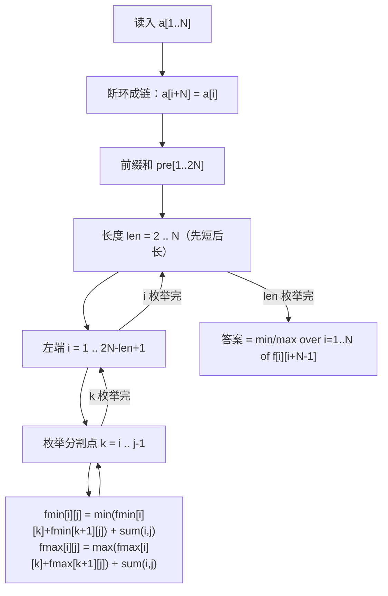

# P1880 [NOI1995] 石子合并

> 原题链接：<https://www.luogu.com.cn/problem/P1880>
> 本目录导航：[← 题库索引](../../../README.md) ｜ [讲解代码](solution.cpp) · [元信息](metadata.yml) · [对拍脚本](verify.js)

## 元信息

| 项目 | 内容 |
| --- | --- |
| 难度 | 普及+/提高−（洛谷 difficulty=4） |
| 来源 | NOI 1995 |
| 标签 | 动态规划、**区间 DP**、断环成链、环形 DP |
| 数据范围 | $1\le N\le100$，$1\le a_i\le20$ |
| 时间 / 空间 | $O(N^3)$ / $O(N^2)$ |
| 时限 / 内存 | 1000 ms / 125 MB |
| 评测状态 | 未本地评测（洛谷提交需登录）；本地 `g++ -static -O2 -std=c++14` 编译，样例输出 `43` / `54` 逐字正确；与「枚举所有合并顺序」独立暴力随机对拍共 2050 组（JS 双实现 2000 组 + 编译后 `solution.exe` 50 组）0 不一致 |

## 题目大意

圆形操场上摆着 $N$ 堆石子，每次只能把**相邻的两堆**合并成新的一堆，得分是这两堆的石子总数。一直合到只剩一堆，问**最小总得分**和**最大总得分**。

- 输入：第一行 `N`，第二行 $N$ 个整数 $a_i$。
- 输出：两行——第一行最小得分，第二行最大得分。
- 样例：`4` / `4 5 9 4` ⇒ `43` / `54`。

> 这是**区间 DP 的教科书例题**，也是 [P1435 回文字串](../p1435-palindrome-string/README.md) 之后自然的下一步：那道题的区间只有"端点"，这道题的区间要"枚举分割点"。而它比回文字串多出来的那层难度，全在"**环形**"两个字上。

## 思路推导

### 1. 暴力想法与它的瓶颈

直接枚举所有合并顺序：每步在当前 $k$ 堆里挑一对相邻的合并，直到剩一堆。合并顺序的数量随 $N$ 呈阶乘级增长（本机 `verify.js` 的暴力就是这么写的，$N=7$ 时已经有几万条路径）。$N=100$ 时完全不可行。

但注意一个关键事实：**无论按什么顺序合并，一共都要合并 $N-1$ 次**，而且每次合并的得分是那两堆的石子总数。这提示我们按"最后一步"来拆问题——这正是区间 DP 的起手式。

### 2. 关键观察

#### 观察 1：最后一次合并的得分与"怎么切"无关

看区间 $[i..j]$ 的最后一次合并：它必然把 $[i..k]$ 与 $[k+1..j]$ 合成一堆（$k$ 是某个分割点）。这一次的得分是这两堆的总石子数，也就是

$$\text{sum}(i,j)=\sum_{t=i}^{j}a_t$$

**无论 $k$ 取在哪，这个数都一样。** 这是本题转移式能写得这么干净的根本原因。

#### 观察 2：于是有了区间 DP 的转移式

$$f[i][j]=\min_{i\le k<j}\Big(f[i][k]+f[k+1][j]\Big)+\text{sum}(i,j)$$

求最大得分把 $\min$ 换成 $\max$ 即可，其余一字不改。

#### 观察 3：环形 ⇒ 断环成链

圆形上"最后合并的两堆"可能**跨越第 $N$ 堆与第 $1$ 堆的边界**，直线 DP 覆盖不到这种切法。

标准技巧：把数组**复制一倍**，得到长度 $2N$ 的序列 $a_1,\dots,a_N,a_1,\dots,a_N$。在它上面做完全相同的 DP，然后**枚举环从哪里剪开**：

$$\text{ans}=\min/\max_{i=1}^{N}\ f[i][i+N-1]$$

每一个长度 $N$ 的窗口 $[i,i+N-1]$ 就对应一种"剪开方式"，所有环形方案都被覆盖，且不重不漏。

### 3. 算法设计



**为什么长度必须从 2 开始、并且先短后长？** 因为 $f[i][j]$ 依赖两个**更短**的区间 $[i,k]$ 与 $[k+1,j]$。按长度递增填表，算 $f[i][j]$ 时它们一定已经算好了。

### 4. 正确性说明

**引理 1（最后一次合并得分固定）**：把区间 $[i..j]$ 合并成一堆的最后一次操作，其得分恒为 $\text{sum}(i,j)$。

*证明*：最后一次操作把当时的两堆合并。这两堆恰好是 $[i..j]$ 的一个划分（分割点为 $k$），它们各自的石子数之和就是 $[i..j]$ 的全部石子数 $\text{sum}(i,j)$，与 $k$ 无关。$\blacksquare$

**定理 1（直线版 DP 正确）**：$f[i][j]$ 等于把区间 $[i..j]$ 合并成一堆的最小总得分。

*状态完备性*：任何合并方案的最后一次操作对应唯一的 $k\in[i,j-1]$，且 $[i..k]$ 与 $[k+1..j]$ 各自的合并过程互相独立（它们之间的元素不参与对方的合并），故总得分恰为 $f[i][k]+f[k+1][j]+\text{sum}(i,j)$ 的一个取值。

*不遗漏*：$k$ 枚举了 $[i,j-1]$ 中所有可能值，而 $f[i][k]$、$f[k+1][j]$ 由归纳假设已是各自区间的最优值。故 $\min$ 取到全局最优。$|j-i|=0$ 时区间只有一堆，得分 0，是归纳基。$\blacksquare$

**定理 2（断环成链正确）**：环形问题的最优解，等于 $\min_i f[i][i+N-1]$（最大化同理）。

*证明*：任一环形合并方案的最后一次合并，是把圆形切成两段圆弧的某条"切口"，等价于在环上选一个起点 $s$，使整个方案在展开后的直线序列 $a_s,a_{s+1},\dots,a_{s+N-1}$ 上是一组合法操作。反之，任一长度 $N$ 的窗口上的直线方案都能在环上复现（窗口的最后一个元素与第一个元素在环上相邻，但直线方案不需要用到这条边，所以合法）。于是环形方案的集合与 $\{f[i][i+N-1]\}_{i=1}^{N}$ 覆盖的直线方案集合一一对应，两侧取最优即相等。$\blacksquare$

### 5. 复杂度分析

- 时间：状态 $O(N^2)$，每个状态枚举 $O(N)$ 个分割点 ⇒ $O(N^3)$。$N=100$ 时是 $10^6$，双 DP 也只有 $2\times10^6$。
- 空间：$O(N^2)$，两个 $205\times205$ 的 `int` 表约 336 KB。
- **数值**：最多合并 $N-1=99$ 次，每次得分不超过总和 $100\times20=2000$，总得分不超过约 $2\times10^5$，`int` 完全够用（这也解释了为什么这题不需要 `long long`，和 [P1005 矩阵取数游戏](../p1005-matrix-game/README.md) 的高精度形成对照）。

## 板书演示

样例 `N=4`，$a=4,5,9,4$。断环成链后

```
b[1..8] = 4  5  9  4 | 4  5  9  4
          └─ 原序列 ─┘ └─ 复制的一份 ─┘
```

按长度递增填表（每格写 `min | max`），数字由参考实现打印：

**len = 2**（相邻两堆，得分就是和）

| 区间 | (1,2) | (2,3) | (3,4) | (4,5) | (5,6) | (6,7) | (7,8) |
| --- | --- | --- | --- | --- | --- | --- | --- |
| min ｜ max | 9 ｜ 9 | 14 ｜ 14 | 13 ｜ 13 | 8 ｜ 8 | 9 ｜ 9 | 14 ｜ 14 | 13 ｜ 13 |

**len = 3**（$= \min/\max_k(f[i][k]+f[k+1][j]) + \text{sum}$）

| 区间 | (1,3) | (2,4) | (3,5) | (4,6) | (5,7) | (6,8) |
| --- | --- | --- | --- | --- | --- | --- |
| 区间和 | 18 | 18 | 17 | 13 | 18 | 18 |
| min | 27 | 31 | 25 | **21** | 27 | 31 |
| max | 32 | 32 | 30 | 22 | 32 | 32 |

**len = 4**（答案从这 5 个窗口里取）

| 区间 | (1,4) | (2,5) | (3,6) | (4,7) | (5,8) |
| --- | --- | --- | --- | --- | --- |
| 区间和 | 22 | 22 | 22 | 22 | 22 |
| min | 44 | 44 | **43** | 44 | 44 |
| max | **54** | **54** | 52 | **54** | **54** |

所以 $\min=43$、$\max=54$，与样例一致。

课堂上值得停下来问的三个点：

1. **为什么 $(3,6)$ 的 min 是 43、别的都是 44？** 窗口 $(3,6)$ 对应 $b_3,b_4,b_5,b_6 = 9,4,4,5$，也就是把原序列从第 3 堆开始读：$9,4,4,5$。它的最优切法先把两个 4 并起来（得分 8），所以省下 1 分。**这正是"环可以从任意一处剪开"的价值** —— 不做断环成链，就永远看不到这个 43。
2. **为什么 $(4,6)$ 的 min 是 21，比 $(3,5)$ 的 25 还小？** 因为它的区间和只有 13，比 17 小。**区间和这一项是"固定成本"，切法只影响前一项**——这是观察 1 的直接体现。
3. **$b$ 的下标为什么要开 $2N$？** 因为 $i$ 要能取到 $N$，此时 $i+N-1=2N-1$；数组开到 $2N+1$ 才够。

## 讲解代码

`solution.cpp`，按 `g++ -static -O2 -std=c++14` 编译：

```cpp
for (int i = 1; i <= n; ++i) a[i + n] = a[i];            // 断环成链
for (int i = 1; i <= 2 * n; ++i) pre[i] = pre[i - 1] + a[i];
for (int i = 1; i <= 2 * n; ++i) fmin_[i][i] = fmax_[i][i] = 0;

for (int len = 2; len <= n; ++len)                       // 先短后长
    for (int i = 1; i + len - 1 <= 2 * n; ++i) {
        int j = i + len - 1;
        fmin_[i][j] = INF; fmax_[i][j] = -INF;
        int s = pre[j] - pre[i - 1];                     // 最后一次合并的得分（与 k 无关）
        for (int k = i; k < j; ++k) {
            fmin_[i][j] = min(fmin_[i][j], fmin_[i][k] + fmin_[k + 1][j] + s);
            fmax_[i][j] = max(fmax_[i][j], fmax_[i][k] + fmax_[k + 1][j] + s);
        }
    }

int ansmin = INF, ansmax = -INF;
for (int i = 1; i <= n; ++i) {                           // 枚举环的 N 种剪法
    ansmin = min(ansmin, fmin_[i][i + n - 1]);
    ansmax = max(ansmax, fmax_[i][i + n - 1]);
}
printf("%d\n%d\n", ansmin, ansmax);
```

### 本机实测记录

```bash
$ g++ -static -O2 -std=c++14 solution.cpp -o solution.exe
$ printf '4\n4 5 9 4\n' | ./solution.exe
43
54
$ node verify.js --rounds=2000
共 2000 组（N<=7, 1<=a_i<=20），不一致 0 组
其中 1098 组里"忘了断环成链"的错版结果与正解不同 —— 它漏掉了跨越首尾边界的合并方案
```

| 项目 | 实测 |
| --- | --- |
| 编译 | `g++ -static -O2 -std=c++14 solution.cpp` 通过 |
| 官方样例 | `4 / 4 5 9 4` ⇒ `43` / `54`，逐字一致 |
| 对拍（JS 双实现） | 与「枚举所有合并顺序」的独立暴力随机对拍 **2000 组**（$N\le7$）**0 不一致** |
| 对拍（真实 exe） | 编译后的 `solution.exe` 对同一暴力另跑 **50 组 0 不一致** |
| 错版量级 | 2000 组里 **1098 组**「忘了断环成链」的结果与正解不同 |
| 满约束 | $N=100$、$a_i$ 随机 $1..20$ ⇒ 输出 `7137` / `59209`，实测 **0.20 s** |

## 易错点与坑

1. **忘了断环成链**：直接在原数组上做直线区间 DP，会漏掉跨越首尾边界的方案。本机 2000 组随机数据里 **1098 组**出错——超过一半，这个坑非常容易踩。
2. **填表顺序写成"先枚举 i 再枚举 j"**：必须**按长度递增**。$f[i][j]$ 依赖更短的区间，长度序保证依赖已就绪。写成朴素的双重 `for i` / `for j` 会读到没算过的 0，答案偏小且不报错。
3. **数组开成 $N+1$ 而不是 $2N+1$**：$i$ 最大取到 $N$，$j$ 最大取到 $2N-1$，数组要开到 $2N+1$。
4. **答案遍历写成只取 $f[1][N]$**：那只是"从第 1 堆剪开"这一种方案。要遍历 $i=1..N$ 取 $f[i][i+N-1]$ 的最值。
5. **min 表初值忘了设成 `INF`**：`fmin_[i][j]` 在 `len >= 2` 时必须先置 `INF`（本目录代码里显式写了 `fmin_[i][j] = INF;`），否则会被全局 0 初值污染，最小值恒为 0。
6. **以为要用 `long long`**：本题 $N\le100$、$a_i\le20$，总得分上界约 $2\times10^5$，`int` 绰绰有余。**别把"上一题用了高精度"的经验无脑搬过来**（对照 [P1005 矩阵取数游戏](../p1005-matrix-game/README.md)）。

## 常见变式

| 变式 | 差异 | 对应题号 |
| --- | --- | --- |
| **直线版**（不绕环） | 去掉断环成链，直接 $f[1][N]$ | [P1775 石子合并（弱化版）](https://www.luogu.com.cn/problem/P1775) |
| 环形 + 合并的是"项链的珠子" | 转移里乘的是两端珠子的头尾标记，而非区间和 | [P1063 能量项链](https://www.luogu.com.cn/problem/P1063) |
| 区间 DP 但只依赖端点 | 去掉分割点枚举，$O(N^2)$ | [P1435 回文字串](../p1435-palindrome-string/README.md) |
| 区间 DP + 高精度 | 转移同型，但数值远超 `long long` | [P1005 矩阵取数游戏](../p1005-matrix-game/README.md) |
| 环形 + 关灯代价与位置有关 | 转移里带上"当前在区间左端还是右端" | [P1220 关路灯](https://www.luogu.com.cn/problem/P1220) |

## 一句话提炼

**区间 DP 的套路是"枚举最后一次操作"**——本题最后一次合并的得分恒等于区间和，所以转移干净利落；而"环形"只要**复制一倍再枚举剪开位置**，就能原封不动地复用直线 DP。
