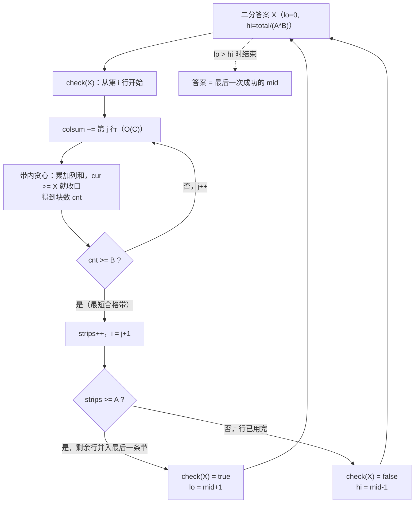

# P3017 [USACO11MAR] Brownie Slicing G / 布朗尼切片

> 原题链接：<https://www.luogu.com.cn/problem/P3017>

## 元信息

| 项目 | 内容 |
| --- | --- |
| 难度 | 洛谷难度等级 5（提高+/省选−），USACO 2011 March Gold |
| 来源 | 洛谷 P3017（页面无登录可见；快照存于 `.raw/full/P3017.html`） |
| 标签 | 二分答案、贪心（交换论证）、线性 DP、列前缀和 |
| 时间复杂度 | $O(RC\log V)$，$V=\lfloor \text{total}/(A\cdot B)\rfloor \le 10^9$（讲解里先给的 DP 判定版是 $O(R^2C\log V)$，实测差距见 §5） |
| 空间复杂度 | $O(RC)$（$500\times500$ 的 int 网格 1 MB） |
| 算法验证 | ✅ 与独立暴力随机对拍 **5700 组 0 不一致**；9 组定向边界；DP 判定版另与暴力对拍 800 组 |
| 评测状态 | 未本地评测（无洛谷登录，仅本地自测）；题面示例实测输出 `3` |

## 题目大意

题面里决定生死的两句话（**原文照抄**，不要凭印象复述）：

> 布朗尼的切割方式是先进行 $A-1$ 次水平切割（总是在整数坐标上），将布朗尼分成 $A$ 条带。然后**每条带独立地**进行 $B-1$ 次垂直切割，也是在整数边界上。其他 $A \times B - 1$ 头牛各自选择一块布朗尼，剩下最后一块给 Bessie。由于它们很贪心，它们会把巧克力豆最少的一块留给 Bessie。

压成一句：$R\times C$ 的豆数网格，先按整行横切成 $A$ 条带（切点贯穿整块），再在**每条带内部各自**竖切成 $B$ 块，共 $A\cdot B$ 块；别的牛挑最大的，Bessie 拿到**和最小**的那块。问 Bessie 怎么切能让自己拿到的豆数最多 —— 即 **最大化最小块的和**。

- 输入：第一行四个整数 $R, C, A, B$；接下来 $R$ 行，每行 $C$ 个整数 $N_{ij}$
- 输出：一个整数，Bessie 能保证获得的最多巧克力豆数
- 数据范围：$1 \le R \le 500$，$1 \le C \le 500$，$0 \le N_{ij} \le 4000$，$1 \le A \le R$，$1 \le B \le C$；洛谷页面 `limits` 给的是 时间 1000 ms / 内存 128 MB
- **题面示例（非洛谷评测样例）**：$5\times4$、$A=4$、$B=2$

  ```
  5 4 4 2
  1 2 2 1
  3 1 1 1
  2 0 1 3
  1 1 1 1
  1 1 1 1
  ```

  输出 `3`。这组数据就是题面 `题目描述` 里那张切割图（本地三个实现都输出 3，见「机器实测记录」）；
  未登录的快照没有渲染出独立的「输入样例/输出样例」区块，所以不把它称作评测样例。

先看清这张图，本题的全部难点都藏在它里面：

```
1 2 | 2 1      <- 第 1 带：只有 1 行，竖切点在第 2 列后
---------
3 | 1 1 1      <- 第 2 带：只有 1 行，竖切点却在第 1 列后
---------
2 0 1 | 3      <- 第 3 带：只有 1 行，竖切点在第 3 列后
---------
1 1 | 1 1      <- 第 4 带：占 2 行，竖切点在第 2 列后
1 1 | 1 1
```

三条带的竖切点**各不相同**。水平线是贯穿整块的，竖直线是各带自己定的。

## 思路推导

### 1. 暴力想法与它的瓶颈

初三同学第一反应一定是：**把切法全枚举一遍**。切点都在整数边界上，所以

- 水平切点：在 $R-1$ 个行间隙里选 $A-1$ 个；
- 竖直切点：在 $C-1$ 个列间隙里选 $B-1$ 个 —— **而且每条带单独选一次**。

```
best = -1
for 每一种水平切点组合:                        # C(R-1, A-1) 种
    for 第 1 条带的竖直切点组合:  C(C-1, B-1) 种
    for 第 2 条带的竖直切点组合:  C(C-1, B-1) 种
    ...
    for 第 A 条带的竖直切点组合:  C(C-1, B-1) 种
        算出 A*B 块的和，取最小值 mn
        best = max(best, mn)
```

方案总数是

$$\binom{R-1}{A-1}\cdot\binom{C-1}{B-1}^{A}$$

把题面示例代进去：$\binom{4}{3}\times\binom{3}{1}^{4}=4\times 81=324$ —— 手都能数完。把规模推大一点（本机 `verify/brute.cpp` 实测，见 `verify/RESULTS.md` §4）：

| 数据 | 方案数 | 暴力实测 | 正解实测 |
| --- | --- | --- | --- |
| 5×4，A=4，B=2 | 3.24e2 | 0.033 s | 0.033 s |
| 12×12，A=6，B=6 | 4.49e18 | **196 ms** | 0.037 s |
| 14×14，A=7，B=7 | 7.52e25 | **1739 ms** | 0.052 s |
| 16×16，A=8，B=8 | 1.89e34 | **30385 ms**（30 秒） | 0.032 s |
| 500×500，A=250，B=250 | $10^{37340}$ | 宇宙热寂也跑不完 | 0.07 s |

**瓶颈不在常数，在指数**。注意式子里那个 $\binom{C-1}{B-1}^{A}$：每条带一套切点，是**带数的幂**，这才是真正的杀手 —— 就算把 $A$ 固定成 1，$R=C=500$ 时单是 $\binom{499}{249}\approx 5.8\times10^{148}$ 就已经写不完。

枚举这条路必须换掉，但不是"换个写法"，而是**换个问法**。

### 2. 关键观察

#### 观察 1：目标是"最大化最小值"，可以改成判定问题

"最小块的和 $\ge X$" 这种命题有一个极好性质：**如果 $X$ 能做到，那么任何 $X'<X$ 也一定能做到**（同一套切法，每块和都 $\ge X > X'$）。反之若 $X$ 做不到，更大的 $X$ 更做不到。

于是"最大能到多少"变成了"在 $[0, \text{上界}]$ 里找最后一个能做到的"，这就是**二分答案**。判定函数 `check(X)` 只需回答"能不能让每块都 $\ge X$"，比"怎么切最优"少了"最优"两个字，难度断崖式下降。

#### 观察 2：一条带内部是"一维最多能切几段"，贪心从左到右即可

固定一条带（若干连续行），把它的各行同列相加，得到长度 $C$ 的**列和数组** $c_1,\dots,c_C$。带内问题变成：把数组切成连续段，最多几段每段和 $\ge X$。

贪心：**从左往右累加，一旦累计 $\ge X$ 立刻收口切一刀，然后清零继续。**

为什么不用 DP？因为"越早收口，剩下的列越长"，这是典型的交换论证场景（§4 引理 1 给出完整证明）。这条贪心把带内从"枚举 $\binom{C-1}{B-1}$ 种切法"降成一次 $O(C)$ 扫描 —— 观察 1 消灭了外层二分之外的枚举，这条消灭了带内枚举。

#### 观察 3：块数只要 $\ge B$，多了能合并回去

贪心给出的块数 $cnt$ 是"这条带最多能切出多少块 $\ge X$"。题目要求**恰好** $B$ 块，$cnt > B$ 合法吗？合法：把多出来的块**并到最后一块**上，被并的块本身 $\ge X$，和只会更大，块数变回 $B$。$cnt < B$ 就一定不行（引理 1 说 $cnt$ 已是上限）。

所以带 [i..j] 的合格判据是 $cnt(i,j,X)\ge B$，一个纯 $O(C)$ 的判断。

> 这条"至少"的方向感很容易搞反，写成 `cnt == B` 会漏掉"切得更细再合并"的方案，见易错点 5。

#### 观察 4：剩下"哪些行合成一条带"是一个线性 DP

水平切点把行切成 $A$ 段连续区间，这是一个"分段"结构 —— 和「书的复制」「木材加工」同一类。于是

$$f[i] = \text{只使用前 } i \text{ 行（必须用完）时，能切出的最多合格带数}$$

转移枚举最后一条带的起点：$f[i]=\max_k\{f[k]+1\}$，其中 $[k+1..i]$ 合格（观察 3）。这就是**选带的 DP**。

#### 观察 5：合格性对"扩行"单调，于是 DP 塌缩成贪心

若带 [i..j] 合格，那么把它**往下多吸一行、往上多扩一行**仍然合格：新带的每列列和都不减，同一套切点的每块和都不减。因此对固定起点 $i$，合格性关于终点 $j$ 单调 —— 存在一个**最小可行终点** $e(i)$。

"要带的数量最多，就把每条带做到尽可能短"：于是选带 DP 退化成"从第 1 行开始，取 $e(1)$ 收口，再从 $e(1)+1$ 开始"。单次 `check(X)` 从 $O(R^2C)$ 降到 $O(RC)$（引理 3 + 定理 2 是严格证明，不是"显然"）。

### 3. 算法设计

**预处理**：列前缀和 $\text{pre}[i][j]=\sum_{t\le i} N_{tj}$，于是带 $[i..j]$ 的第 $c$ 列列和是 $\text{pre}[j][c]-\text{pre}[i-1][c]$，$O(1)$ 拿到一格。

**带内贪心**（判定用）：

$$cnt(i,j,X):\ \text{扫 } c=1..C,\ \text{cur}\mathrel{+}=\text{列和},\ \text{若 } \text{cur}\ge X\Rightarrow cnt{+}{+},\ \text{cur}=0$$

**DP 版 check**（课堂推导用的形态，对应 `verify/dp_check.cpp`）：

$$f[0]=0,\qquad f[i]=\max_{0\le k<i}\{f[k]+1 \;:\; cnt(k+1,i,X)\ge B\},\qquad \text{check}(X)\iff f[R]\ge A$$

**加速版 check**（`solution.cpp` 里真正跑的形态，观察 5 的产物）：

```
strips = 0, i = 1
while i <= R:
    把 colsum[] 清零
    for j = i .. R:  colsum += 第 j 行;  if cnt(本带,X) >= B: 找到终点 j，跳出
    若没找到 -> return false            # 后面再也凑不出合格带，带数不足
    strips++; i = j + 1
    if strips >= A -> return true       # 剩余行并进最后一条带，仍合格
return false
```

**二分**：下界 $lo=0$（一定可行：$X=0$ 时无解都"够"），上界取

$$hi=\left\lfloor \frac{\text{total}}{A\cdot B}\right\rfloor$$

因为 $A\cdot B$ 块每块都 $\ge X$ 必然推出 $A\cdot B\cdot X\le \text{total}$，即最小块不超过平均值 —— 超过平均值的 $X$ 直接不可能。不变式：`lo` 可行、`hi` 不需要可行，每次 $\text{mid}=(lo+hi)/2$ 把区间对半分，$O(\log V)$ 次，$V\le 10^9$ 即 $\le 30$ 次。

最终答案就是 `lo`（或记录最后一次成功的 `mid`）。

### 4. 正确性说明

**引理 1（带内贪心最优，交换论证）**：对固定的列和数组 $c_1..c_C$ 和阈值 $X$，贪心切出的块数 $cnt$ 是所有切法中最大的。

*证明*：对块数归纳。设贪心第 1 块结束于位置 $p$（最小的使 $\sum_{t\le p}c_t\ge X$ 的位置），任一合法方案第 1 块结束于 $q$，则 $\sum_{t\le q}c_t\ge X$，由 $p$ 的最小性 $p\le q$。把该方案的第一刀从 $q$ 移到 $p$：第 1 块仍 $\ge X$（$p$ 的定义），原来第 2 块覆盖 $(q, r]$，现在覆盖 $(p, r]$，是它的**超集**，列和非负所以和只增不减，仍然 $\ge X$；后续所有块不受影响，块数不变。于是"存在一个最优方案，其第一刀在 $p$"。固定第一刀后，剩余问题是同型的更小实例，归纳即得贪心块数 $\ge$ 任意方案块数。$\blacksquare$

**引理 2（"$cnt\ge B$" 与"恰好 $B$ 块且每块 $\ge X$"等价）**：若 $cnt\ge B$，取贪心的前 $B-1$ 个收口位置作切点，第 $B$ 块吃掉贪心第 $B$ 块及其右侧全部列，和 $\ge$ 贪心第 $B$ 块 $\ge X$；反之若存在一种切法使 $B$ 块都 $\ge X$，由引理 1 $cnt\ge B$。$\blacksquare$

**引理 3（扩行单调）**：若带 $[i..j]$ 合格，则对任意 $i'\le i$、$j'\ge j$，带 $[i'..j']$ 也合格。

*证明*：$[i'..j']$ 的每列列和 $\ge$ $[i..j]$ 对应列列和（多吸的行豆数非负，$N_{ij}\ge 0$ 是题面给的）。用 $[i..j]$ 的那套切点，$[i'..j']$ 里每块和都不小于 $[i..j]$ 中对应块的和，故都 $\ge X$。$\blacksquare$

**定理 1（DP 正确）**：`check(X)` 里的 $f[i]$ 表示"把前 $i$ 行**全部用完**且每条带都合格时，最多能有的带数"，$f[i]=-1$ 表示无法完成。

*状态完备性*：任何把前 $i$ 行的合法分段的最后一条带必是某个 $[k+1..i]$（$0\le k<i$），且它必须合格（引理 2），其余部分恰是"前 $k$ 行的合法分段"，故带数 $\le f[k]+1$。*转移不遗漏*：枚举了所有 $k$ 且用 $f[k]\ge 0$ 保证前缀真实可分。两类情况合起来给出 $f[i]$ 的精确值，故 $f[R]\ge A \iff$ 存在把全部 $R$ 行分成 $\ge A$ 条合格带的切法。再由引理 3，把相邻带**合并**得到的更长的带仍合格，"$\ge A$ 条"可缩成"恰好 $A$ 条"。$\blacksquare$

**定理 2（贪心选带 = DP 最大值）**：设 $e(i)$ 为带起点 $i$ 的最小合格终点（不存在则 $+\infty$）。贪心产生 $g_1=1,\ i_{t+1}=e(g_t)+1$。对任意把前 $R$ 行分成 $m$ 条合格带的方案，其分界 $b_1<b_2<\dots=b_m=R$ 满足贪心第 $t$ 条带的终点 $\le b_t$（归纳：$e(1)\le b_1$；若贪心第 $t$ 条带终点 $\le b_t$，则第 $t+1$ 条带起点 $\le b_t+1$，而 $[b_t+1..b_{t+1}]$ 合格，由引理 3 把它向上扩到贪心起点仍合格，故 $e(\text{贪心起点})\le b_{t+1}$）。于是贪心至少能切出 $m$ 条带，即它取到最大带数。所以加速版 `check` 与 DP 版判定结果一致。$\blacksquare$

（这条正是课堂上最该追问的一句：**凭什么叫它贪心而不是 DP？** 答：DP 的状态被引理 3 的单调性压缩掉了，$f$ 只剩"下一个带从哪开始"一个自由度，贪心即最优。）

**引理 4（二分单调）**：若 `check(X)` 为真，则对 $X'<X$，同一套切法每块和 $\ge X > X'$，`check(X')` 亦真。故可行 $X$ 构成一段前缀 $[0..X^\star]$，二分找右端点合法。

**定理 3（答案正确）**：$X^\star=\max\{X:\text{check}(X)\}$ 就是 Bessie 能保证的最大豆数。一方面 `check(X)` 真时按 DP/贪心的切法确实使每块 $\ge X$，别的牛拿走较大的 $AB-1$ 块后 Bessie 拿最小块 $\ge X$；另一方面任何切法的最小块若 $=Y$，则该切法使所有块 $\ge Y$，即 `check(Y)` 真，故 $Y\le X^\star$。两侧夹住同一值。$\blacksquare$

### 5. 复杂度分析

记 $V=\lfloor\text{total}/(AB)\rfloor \le 500\cdot500\cdot4000=10^9$，二分次数 $\lceil\log_2(V+1)\rceil\le 30$。

| 形态 | 单次 check | 总计 | 代入 $R=C=500$、$\log V=30$ 的量级 |
| --- | --- | --- | --- |
| 暴力枚举切法 | — | $\binom{R-1}{A-1}\binom{C-1}{B-1}^{A}$ | $10^{37340}$（A=B=250） |
| DP 选带（§3 的 $f[i]$） | $O(R^2C)$：$R$ 个状态 × 平均 $R/2$ 个转移 × 每次 $O(C)$ 贪心 | $O(R^2C\log V)$ | $\tfrac{R^2}{2}C=6.3\times10^{7}$，乘 30 ≈ $1.9\times10^{9}$ |
| **`solution.cpp`（观察 5 加速）** | $O(RC)$：$j$ 指针在带间不重叠，总移动 $\le 2R$ 次，每次「累加一行 + 扫一遍列」$=2C$ | $O(RC\log V)$ | $2R\cdot2C=10^{6}$，乘 30 = $3\times10^{7}$ |

实测印证（本机 g++ 13.1 `-static -O2`，`/usr/bin/time`，$R=C=500$；完整表在 `verify/RESULTS.md` §5）：

- DP 版最慢一组（`500 500 500 1`）**1.264 s**，已经**超过洛谷 1000 ms 时限**，其余组 0.47~0.72 s —— 属于"贴线、不稳"，交上去可能拿到部分分或 TLE。
- 同一批数据 `solution.cpp` 全部 **0.053~0.087 s**，其中还包含 1.2 MB 输入的读入时间。

所以课堂上的口径要说清楚：**DP 版是"思路正确但复杂度不够"的版本，不能对学生谎称它能过**；把它当推导跳板，再用单调性降到 $O(RC\log V)$ 才稳。空间 $O(RC)$（`int a[505][505]` 约 1 MB，远小于 128 MB）。

## 可视化讲解



分步演示（$5\times4$ 题面示例：网格与每条带的切点、$check(3)$ 的竖向贪心指针与选带 DP 表逐格填充、二分的区间收缩）见同目录 [`visualization.html`](visualization.html)，浏览器直接打开即可离线逐帧播放。

## 讲解代码

完整逐段注释版见 [`solution.cpp`](solution.cpp)；下面三段是板书级别的骨架。

**① 带内贪心 —— "能切几块"**

```cpp
int greedyPieces(long long X) {          // colsum[] 已填好当前条带的列和
    int cnt = 0;
    long long cur = 0;
    for (int c = 1; c <= C; ++c) {
        cur += colsum[c];
        if (cur >= X) { ++cnt; cur = 0; }   // 够 X 就收口：引理 1 说越早收口块数越多
    }
    return cnt;                              // 右侧零头并入最后一块，故 cnt 是上限
}
```

写成 `cur > X` 会把恰好等于 $X$ 的块留给下一段，块数偏少，判定就假了（易错点 2）。

**② check(X) —— 选带（DP 塌缩成"取最短合格带"）**

```cpp
bool check(long long X) {
    int strips = 0, i = 1;
    while (i <= R) {
        for (int c = 1; c <= C; ++c) colsum[c] = 0;   // 换带必须清零，否则列和串味
        int end = -1;
        for (int j = i; j <= R; ++j) {
            for (int c = 1; c <= C; ++c) colsum[c] += a[j][c];
            if (greedyPieces(X) >= B) { end = j; break; }  // 第一次合格就停：行要留给后面的带
        }
        if (end == -1) return false;              // 连一条合格带都凑不出
        if (++strips >= A) return true;           // 剩下的行并进最后一条带（引理 3 仍合格）
        i = end + 1;
    }
    return false;
}
```

**③ 二分 —— 上界用平均值，不用 total**

```cpp
long long lo = 0, hi = total / (1LL * A * B), ans = 0;   // 最小块 <= 平均块，这是硬上界
while (lo <= hi) {
    long long mid = (lo + hi) >> 1;
    if (check(mid)) { ans = mid; lo = mid + 1; }
    else hi = mid - 1;
}
```

`1LL * A * B`：$A\cdot B$ 最大 $2.5\times10^5$ 没事，但**别写成 `total / (A * B)`** 之外的任何把 `mid` 乘回去的式子（`A * B * mid` 在 `int` 下直接溢出，见易错点 3）。

### 机器实测记录

逐字照抄终端结果（临时 exe 与数据都在 `$TMPDIR/p3017`，仓库不留二进制）：

```bash
$ g++ -static -O2 -std=c++14 solution.cpp -o sol.exe
$ g++ -static -O2 -std=c++14 verify/brute.cpp -o brute.exe
$ g++ -static -O2 -std=c++14 verify/dp_check.cpp -o dp.exe
$ g++ -static -O2 -std=c++14 verify/brute_global.cpp -o bglobal.exe

$ ./sol.exe < in1.txt
3
$ ./brute.exe < in1.txt
3
$ ./dp.exe < in1.txt
3

$ node verify/stress.js ./sol.exe ./brute.exe verify/gen.py 5000
共 5000 组，不一致 0 组
real    0m50.516s

$ node verify/stress.js ./sol.exe ./brute.exe verify/gen.py 400 5 8    # R,C 都在 5..8
共 400 组，不一致 0 组

$ node verify/stress.js ./sol.exe ./brute.exe verify/gen.py 300 1 --use-gen   # 数据由 gen.py 生成
共 300 组，不一致 0 组

$ node verify/stress.js ./dp.exe ./brute.exe verify/gen.py 800          # DP 判定版也对
共 800 组，不一致 0 组

$ python verify/gen.py 1 big > big1.txt      # 500 500 69 292
$ time ./sol.exe < big1.txt                  # 15581   real 0m0.068s
$ time ./dp.exe  < big1.txt                  # 15581   real 0m0.716s
$ time ./dp.exe  < w_500_500_500_1.txt       # 908404  real 0m1.264s   <- DP 版超 1s
$ time ./sol.exe < w_500_500_500_1.txt       # 908404  real 0m0.069s
$ ./sol.exe < wc_ab1.txt                     # 全 4000, A=B=1 -> 1000000000（int 只剩 2 倍余量）
```

题面示例、9 组定向边界（全零、$A=R$ 且 $B=C$、单行、单列、$A=B=1$、$1\times1$）三方一致；
`solution.cpp`、DP 版、暴力版之间累计 **5700 + 800 + 200 组 0 不一致**。完整数据表见 [`verify/RESULTS.md`](verify/RESULTS.md)。

> `verify/brute.cpp`、`verify/dp_check.cpp`、`verify/brute_global.cpp`、`verify/gen.py`、`verify/stress.js`
> 都是**对拍/计时工具，仅用于验证，非讲解代码**；讲解代码只有 C++14 的 `solution.cpp`（AGENTS.md §3）。

## 变式：二维前缀和 + 贪心选带（洛谷标程口径）

`solution.cpp` 里"带内列和"是**逐行增量累加**得到的，没用前缀和。把它换成**二维前缀和**当
$O(1)$ 矩形查询，就是洛谷上这题最常见的标程写法，思路完全同 §3：二分 $X$ → `check(X)` 里
**贪心选最短合格带** → 带内**从左到右贪心数块**。实现见 [`verify/sol_2dpre_greedy.cpp`](verify/sol_2dpre_greedy.cpp)。

```cpp
long long pre[MAXN][MAXN];                       // 二维前缀和
inline long long rect(int r1,int c1,int r2,int c2){
    return pre[r2][c2]-pre[r1-1][c2]-pre[r2][c1-1]+pre[r1-1][c1-1];
}
bool stripOK(int r1,int r2,long long X){         // 带 [r1..r2] 贪心能切 >= B 块?
    int cnt=0; long long cur=0;
    for(int c=1;c<=C;c++){ cur+=rect(r1,c,r2,c); if(cur>=X){++cnt;cur=0;} }
    return cnt>=B;
}
bool check(long long X){                          // 贪心选带，和 solution.cpp 同构
    int strips=0,i=1;
    while(i<=R){
        int end=-1;
        for(int j=i;j<=R;j++) if(stripOK(i,j,X)){ end=j; break; }
        if(end==-1) return false;
        if(++strips>=A) return true;
        i=end+1;
    }
    return false;
}
```

**关键：二维前缀和不改变复杂度，选带策略才决定过不过。** 单次 `check` 里 `j` 指针跨带不重叠，
总移动 $\le R$ 次，每次 $O(C)$ 贪心 → $O(RC)$；二分 $\le 30$ 次 → 总体 $O(RC\log V)$，和 `solution.cpp` 同阶。
本机 $R=C=500$ 最坏组（`500 500 500 1`）实测：

| 实现 | 选带 | 上界 | 最坏实测 |
| --- | --- | --- | --- |
| `verify/sol_2dpre_greedy.cpp` | 贪心 | $\lfloor\text{total}/(AB)\rfloor$ | **0.138 s** |
| 洛谷常见标程（`int`、上界取 `total`） | 贪心 | `total` | **0.354 s**（多约 10 轮 check） |
| 若把选带改成 $O(R^2)$ DP（`verify/dp_check.cpp` 的形态） | DP | — | **1.264 s，超时** |

所以课堂上要划清这条线：**超时的是"枚举带起点"的 DP，不是二维前缀和**。二维前缀和在这里只是
让"某条带某列的和"查询更直观，换成它照样 $O(RC\log V)$ 稳过。三方（本变式 / `solution.cpp` / 独立暴力）
在随机 $500\times500$ 与最坏组上输出逐位相同，`sol_2dpre_greedy.cpp` 另与暴力对拍 3000 组 0 不一致。

## 易错点与坑

1. **把"每条带独立竖切"写成"全局同一套竖切点"** —— 本题第一大坑，也是题目全部难度的来源。水平线贯穿整块，竖线只在带内。验证用的 `verify/brute_global.cpp` 就是专门把这句话读错的暴力：题面示例上它输出 **2**，正解是 **3**；随机小数据 300 组里有 **17 组**两者不同（`verify/RESULTS.md` §7）。读题时看到 *independently* 应该立刻在草稿上画竖线错位。
2. **`>=` 写成 `>`（或二分边界反了）**：带内收口条件是 `cur >= X`，写成 `cur > X` 会让等于 $X$ 的块被拖到下一段，`cnt` 偏小 → `check(X)` 假阴性 → 答案偏小。二分一侧同理：`check(mid)` 真时要 `lo = mid + 1`（继续往上要更大），写成收缩 `hi` 就变成求最小可行值。
3. **溢出与"刚好够用"的 `int`**：豆数总和上限 $500\times500\times4000=10^9$（本机实测答案就是 `1000000000`），离 `int` 上限 $2.147\times10^9$ 只有 2 倍余量。`lo+hi`、`A*B*mid`、把二维和再乘一个系数 —— 任意一个都翻车。check 与二分一律 `long long`；`total / (1LL * A * B)` 里的 `1LL` 别省。
4. **`cnt >= B` 与 `cnt == B`**：贪心给的是"最多块数"。$cnt>B$ 是**合法**的（右侧零头/多余块并到最后一块，引理 2），判据必须写成 $\ge$。
5. **换带时忘记把 `colsum[]` 清零**：条带之间列和必须重新累加，漏一次就等于把上一带的豆算进下一带，`check` 恒真、答案爆炸。
6. **最后剩余行的处理**：`strips >= A` 时要把 $i..R$ 并进最后一条带并**立刻返回 true**；若坚持"必须正好用完 A 条带且最后一条以 R 结尾"去改写循环，容易写成 `return false` 把合法情况判死（合法性靠引理 3 的扩行单调）。
7. **读入顺序与行列语义**：首行是 `R C A B`，不是 `R C B A`；$A\le R$ 对应水平切（按行分段），$B\le C$ 对应竖直切。把 $A,B$ 与 $R,C$ 配对搞反时，$A>B$ 的数据会直接数组越界或给出荒谬答案。
8. **二分的上界**：$hi=\text{total}/(A\cdot B)$（平均值）而不是 `total`，少 4~5 轮 `check`；写 `total` 也能过但白挨常数。下界 `lo=0` 必须允许，全零网格的正确答案就是 0（边界用例已实测）。

## 常见变式

| 变式 | 差异 | 对应题号 |
| --- | --- | --- |
| 一维版：把一段豆串切成 $A$ 段，最大化最小段和 | 去掉二维与"带内独立竖切"，只剩二分 + 一次贪心 | [洛谷 P2440 木材加工](https://www.luogu.com.cn/problem/P2440)（求最大长度，判定同型） |
| 最小化最大段和（"至少/至多"方向反过来） | `check(X)` 变成"每段和 $\le X$ 时段数 $\le A$"，贪心变为"装不下才开新段" | [洛谷 P1281 书的复制](https://www.luogu.com.cn/problem/P1281) / LeetCode 410 |
| 二分答案 + 贪心跳点（跳过型判定） | 判定不是计数而是"最少移除几个" | [洛谷 P2678 跳石头](https://www.luogu.com.cn/problem/P2678) |
| 二分答案 + 求最大/最小值本身（阈值影响代价） | 判定里累加代价而非块数 | [洛谷 P1873 砍树](https://www.luogu.com.cn/problem/P1873) |
| 二维切法但竖切必须全局统一 | 带与带不再独立，DP 状态要再加一维"当前列位置"，难度上升 | 本题改动（无对应题号；`verify/brute_global.cpp` 是该改动的暴力参考） |

## 小结

看到"最大化最小值 / 最小化最大值"先把它**判定化**再二分；判定里凡是"分段且段与段互不影响"的结构，**贪心数段数 + 一维 DP 选分界**就是全部套路 —— 而一旦"合格性对扩张单调"成立，那层 DP 还能塌回贪心，把 $O(R^2C)$ 降到 $O(RC)$。
