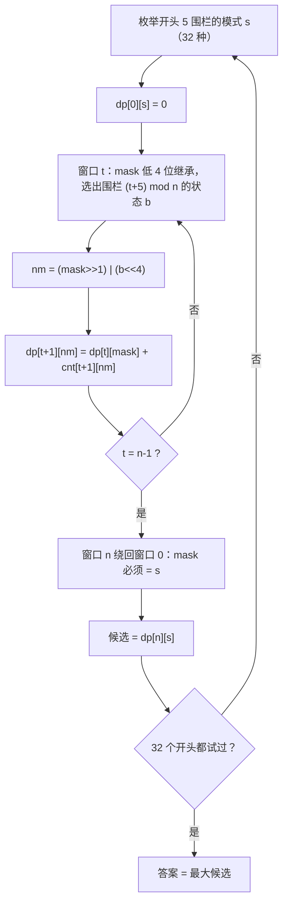

# P3622 [APIO2007] 动物园

> 原题链接：<https://www.luogu.com.cn/problem/P3622>
> 本目录导航：[← 题库索引](../../../README.md) ｜ [讲解代码](solution.cpp) · [元信息](metadata.yml) · [分步动画](visualization.html) · [对拍记录](verify/RESULTS.md)

## 元信息

| 项目 | 内容 |
| --- | --- |
| 难度 | 洛谷 提高+/省选−（难度 6），APIO 2007 |
| 来源 | 洛谷 P3622 |
| 标签 | 状压 DP、轮廓线（5 位滑动窗口）、环形处理（枚举开头 + 绕回检查） |
| 时间复杂度 | $O(32^2\cdot N + 32\cdot C)$（实测 $N=10^4,C=5\times10^4$ 全约束 0.163 s） |
| 空间复杂度 | $O(32\cdot N)$（`cnt` 表约 1.3 MB） |
| 算法验证 | ✅ 与独立子集枚举暴力随机对拍 **1400 组 0 不一致**（1200 组小 + 200 组中）；两个官方样例本地输出 5、6 |
| 评测状态 | 未本地评测（无洛谷登录，仅本地自测）；官方样例实测输出 `5` / `6`；满约束一组实测 0.163 s |

## 题目大意

题面里决定生死的两句话（**原文照抄**）：

> 每个小朋友站在大围栏圈的外面，可以看到连续的 5 个围栏。……当下面两处情况之一发生时，小朋友就会高兴：至少有一个他害怕的动物被移走；至少有一个他喜欢的动物没被移走。

压成一句：$N$ 个围栏围成一圈，$C$ 个小朋友各看到**连续 5 个**围栏（编号超过 $N$ 绕回 1）。选一个"移走动物"的围栏集合，一个小朋友开心 ⟺（他怕的 ∩ 被移走）≠ ∅ **或**（他喜欢的 ∩ 没被移走）≠ ∅。最大化开心的小朋友数。

- 输入：第一行 $N, C$；接下来 $C$ 行 `E F L` + $F$ 个怕的围栏 + $L$ 个喜欢的围栏（**都在该小朋友可见的 5 连窗口内且两两不同**，所以 $F+L\le 5$）
- 输出：最多开心人数
- 数据范围：$10 \le N \le 10^4$，$1 \le C \le 5\times10^4$
- **官方样例 1**：$N=14$，5 个小朋友（题面配图那组），移走 $\{13\}$ 可让全部 5 人开心，输出 `5`
- **官方样例 2**：$N=12$，7 个小朋友，输出 `6`

## 思路推导

### 1. 暴力想法与它的瓶颈

最直接：枚举"哪些围栏的动物被移走"。每个围栏有移/不移两种，共 $2^N$ 种方案，每种再花 $O(C)$ 判定所有小朋友——总计 $O(2^N\cdot C)$。$N=10$ 时才 1024 种，能跑；$N=10^4$ 时是 $2^{10000}\approx10^{3010}$，宇宙热寂也跑不完。

`verify/brute.cpp` 就是这个暴力（$N\le16$ 内正确），本仓库用它对拍正解。

### 2. 关键观察

#### 观察 1：每个小朋友只关心自己窗口里那 5 个围栏

小朋友的开心条件只涉及他可见的 5 个围栏的**状态**（移/不移），与圈里其他 $N-5$ 个围栏毫无关系。所以判定一个方案时，逐窗口看即可；反过来说，**优化目标能按窗口拆开累加**。

#### 观察 2：窗口滑动只"露出"一个新围栏——轮廓线只有 5 位

从窗口 $[i, i+4]$ 滑到 $[i+1, i+5]$，两者共享 4 个围栏。也就是说，从左往右扫，**还没定论的围栏永远只有 1 个**，需要记住的"历史"只有重叠的 4 位。把"接下来 5 个围栏各移不移"压成一个 5 位二进制 `mask`（$0\sim31$），状态总数只有 32。

#### 观察 3：开心条件可以按 mask 预数出来

一个小朋友（窗口起点 $s$）怕的围栏集合、喜欢的围栏集合都落在窗口内，换成窗口内的**相对位**：`fear`、`like`（bit $k$ = 围栏 $(s+k)\bmod N$）。则模式 `mask` 下他开心 ⟺

$$ (\texttt{fear}\ \&\ \texttt{mask}) \ne 0 \quad\text{或}\quad (\texttt{like}\ \&\ \sim\texttt{mask}) \ne 0 $$

（有怕的被移走，或有喜欢的留下来。）把每个小朋友按他的起点 $s$ 累进 `cnt[s][mask]`：**站在 $s$ 的所有小朋友里，模式 mask 下有多少人开心**。这一步 $O(32C)$，之后 DP 再也不用逐人看。

#### 观察 4：圈的问题——枚举开头，绕回来对答案

围栏排成圈， DP 想线性扫就得**先固定开头**：枚举围栏 $0..4$ 的模式 $s$（32 种），从它出发把 $n$ 个窗口推完；推完 $n$ 步后 mask 恰好描述"窗口 $n$"，它绕回就是"窗口 0"——**必须等于 $s$** 才是真实存在的一圈方案。$s$ 对答案的贡献就是这条路的累计开心数，最终答案取 32 个 $s$ 的最大值。

### 3. 算法设计

```
读入；对每个小朋友把怕/喜欢换成窗口内相对位 fear、like，
     对 32 种 mask 判开心条件，cnt[起点][mask]++（同一起点有多人是累加）

枚举开头模式 s = 0..31:
    dp[0][s] = 0（窗口 0 还没结算！），其余 -∞
    for t = 0 .. n-1:
        for mask ∈ 0..31 可达:
            for b ∈ {不移走, 移走}:          # 围栏 (t+5) mod n 的状态
                nm = (mask >> 1) | (b << 4)  # 低 4 位继承，最高位换新
                dp[t+1][nm] = max(dp[t+1][nm], dp[t][mask] + cnt[(t+1) mod n][nm])
    候选 = dp[n][s]                          # 窗口 n 绕回窗口 0 且模式 = s
答案 = 32 个候选的最大值
```

初值为什么是 `dp[0][s] = 0` 而不是 `cnt[0][s]`：转移一共走 $n$ 步，第 $k$ 步结算的是窗口 $k$（$k=1..n$），而窗口 $n$ 绕回就是窗口 0——这样 $n$ 个窗口**各恰好结算一次**。如果初值先加 `cnt[0][s]`，窗口 0 的小朋友会被数两遍。这个坑官方样例 2 就能抓出来（初值写错得 7，正确 6），见易错点 1。

### 4. 正确性说明

**命题 1（状态刻画完整）**：`dp[t][mask]` 的语义是"窗口 $0..t-1$ 的小朋友全部结算完毕，且围栏 $t..t+4$（超过 $n$ 取模）的移走模式为 mask 时，开心人数的最大值"。任何一圈方案在每个位置都有唯一的 mask；反过来 mask 链 $\to$ 方案也是一一对应（相邻 mask 的低 4 位/高 4 位重合，把每个围栏的状态唯一确定）。转移枚举了新围栏的两种取值，覆盖全部方案。$\blacksquare$

**命题 2（环的正确归约）**：一圈方案 $\iff$ 一条满足 $m_0=m_n=s$ 的 mask 链。必要性：方案里每个围栏状态确定，$m_t$ 取窗口 $t$ 的真实状态，则 $m_0$（围栏 $0..4$）与 $m_n$（围栏 $n..n+4\equiv 0..4$）是同一批围栏，故 $m_n=s$。充分性：链上相邻 mask 重合 4 位保证每个围栏在所有窗口里状态一致，拼回一圈就是一个真实方案。于是"枚举 $s$ + 要求 $dp[n][s]$ 可达"恰好不重不漏枚举了所有一圈方案，取 max 即答案。$\blacksquare$

**命题 3（每个窗口结算恰好一次）**：初值 0，第 $t$ 步转移（$t=0..n-1$）加的是 `cnt[(t+1) mod n]`，即窗口 $1,2,\dots,n$ 各一次；窗口 $n\equiv 0$，且窗口 $0..n-1$ 合起来恰是不重不漏的全部 $n$ 个窗口、$C$ 个小朋友每人恰被结算一次（他只属于起点 $E-1$ 那个窗口）。$\blacksquare$

**命题 4（无后效性）**：结算窗口 $t+1$ 只需要窗口 $t+1..t+5$ 的状态，即 $m_{t+1}$；更早的围栏状态与后面的窗口无关（没有小朋友同时看到 $t+1$ 和更早的围栏——每个窗口只有 5 连）。$\blacksquare$

### 5. 复杂度分析

| 部分 | 量级 |
| --- | --- |
| 预处理 cnt | $O(32\cdot C)$ = $32\times5\times10^4=1.6\times10^6$ |
| DP | 32 个开头 × $n$ 步 × 32 状态 × 2 转移 = $O(32^2 N)\approx10^7$ |
| 实测 | $N=10^4,C=5\times10^4$ 一组 **0.163 s**（时限 1.00 s） |

空间：`cnt[10005][32]` 的 int 约 1.3 MB，DP 滚动两行 32 个 int，远小于 125 MB。

## 可视化讲解



分步演示（官方样例 1：围栏圈的移走状态沿最优路径逐格点亮、每个窗口的小朋友逐个打 ✓/✗、dp 值累计、绕回一致性检查、32 个开头的答案汇总）见同目录 [`visualization.html`](visualization.html)，浏览器直接打开、离线可播。

## 讲解代码

完整逐段注释版见 [`solution.cpp`](solution.cpp)；下面是板书级别的骨架。

**① 把小朋友折算成 cnt 表（本题的"读入即预处理"）**

```cpp
int s0 = (E - 1) % n;                     // 窗口起点（0 起）
fear |= 1 << ((x - 1 - s0 + n) % n);      // 围栏 x → 窗口内相对位
like |= 1 << ((y - 1 - s0 + n) % n);
for (int mask = 0; mask < 32; mask++)
    if ((fear & mask) || (like & ~mask))  // 有怕的被移走，或有喜欢的留下来
        cnt[s0][mask]++;
```

**② 环形 DP（枚举开头 + 绕回检查）**

```cpp
for (int s = 0; s < 32; s++) {
    dp[0][s] = 0;                          // 窗口 0 不在这里结算！
    for (int t = 0; t < n; t++) {
        int tn = (t + 1) % n;
        for (int m = 0; m < 32; m++) {
            if (dp[t][m] < 0) continue;    // -∞ = 不可达
            for (int b = 0; b < 2; b++) {
                int nm = (m >> 1) | (b << 4);
                dp[t+1][nm] = max(dp[t+1][nm], dp[t][m] + cnt[tn][nm]);
            }
        }
    }
    ans = max(ans, dp[n][s]);              // 绕回 s 才是真实的一圈
}
```

### 机器实测记录

逐字照抄终端结果（exe 与临时数据不进仓库）：

```bash
$ g++ -static -O2 -std=c++14 solution.cpp -o sol.exe
$ g++ -static -O2 -std=c++14 verify/brute.cpp -o brute.exe

$ ./sol.exe < sample1.txt     # 官方样例 1
5
$ ./sol.exe < sample2.txt     # 官方样例 2
6

$ node verify/stress.js ./sol.exe ./verify/brute.exe 1200 12 8
共 1200 组，不一致 0 组
$ node verify/stress.js ./sol.exe ./verify/brute.exe 200 14 20
共 200 组，不一致 0 组

# 满约束性能（n=10000, c=50000）
$ time ./sol.exe < big.txt    # 输出 44847   real 0m0.163s
```

真实插曲：第一版初值写成 `dp[0][s] = cnt[0][s]`，转移又走满 $n$ 步把窗口 0 绕回来再结算一次——样例 1 侥幸全对（$E=1$ 处没有小朋友），样例 2 输出 7 而非 6，当场抓出。修正为初值 0（见易错点 1）。

## 易错点与坑

1. **环形收口的重复结算**。转移走满 $n$ 步时，窗口 $n$ 绕回就是窗口 0。初值若是 `dp[0][s] = cnt[0][s]`，$E=1$ 的小朋友会被结算两遍——样例 2 实测输出 7（正确 6）。初值必须为 0，让 $n$ 步转移把窗口 $1..n$ 各算一次。
2. **相对位的取模方向**。围栏编号 $x$（1 起）换算成窗口 $s$（0 起）内相对位：`(x - 1 - s + n) % n`。漏掉 `+n` 会在 $x < s$ 时出负数，移位是未定义行为。
3. **开心条件是"或"**：`(fear & mask) || (like & ~mask)`。`like & ~mask` 的 `~` 别写成 `^` 或漏写——"喜欢的没被移走"是位上为 0，不是异或。
4. **$F$ 或 $L$ 可以为 0**。$F=L=0$ 的小朋友永远不开心（两个条件都落空），条件式自然给出，不用特判；但读入循环要按 0 次处理。
5. **同一 $E$ 有多个小朋友**。`cnt[s][mask]` 是"站在 $s$ 的所有人里开心的人数"，累加即可；题面"已按 $E$ 排序"只是陈述，算法不依赖顺序。
6. **`cnt` 数组开静态区**。`10005×32` 的 int 约 1.3 MB，放 `main` 里局部数组会爆栈。
7. **不需要 long long**。答案 ≤ $C=5\times10^4$，int 足够；`-∞` 用 `INT_MIN/2` 防止加法溢出。

## 常见变式

| 变式 | 差异 | 对应题号 |
| --- | --- | --- |
| 状压 DP 入门（棋盘放国王） | 同为"按位压状态"，但不相邻约束 + 计数 | P1896 [SCOI2005] 互不侵犯 |
| 棋盘种植轮廓线 | 状态压一整行，逐行转移 | P1879 [USACO06NOV] Corn Fields |
| 环形 DP 的另一路处理 | 断环成链复制一遍（石子合并是环形区间 DP），与本题"枚举开头绕回"互为对照 | P1880 [NOI1995] 石子合并 |

## 小结

一句话提炼（板书用，可独立引用）：

> **窗口只滑一格，历史就只剩 4 位——把"接下来 5 个围栏移不移"压成 5 位 mask 做轮廓线 DP；圈的问题枚举开头模式、走完一圈要求绕回原模式，每人每窗恰结算一次。**
