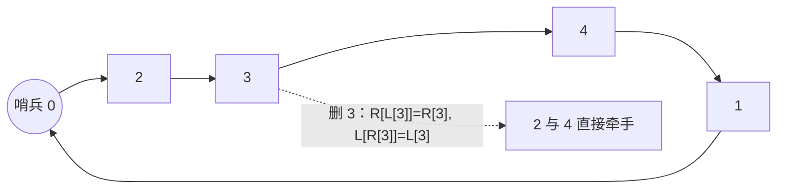

# P1160 队列安排

> 原题链接：<https://www.luogu.com.cn/problem/P1160>
> 本目录导航：[← 题库索引](../../../README.md) ｜ [题目原文](problem.txt) · [讲解代码](solution.cpp) · [元信息](metadata.yml) · [对拍脚本](verify.js)

## 元信息

| 项目 | 内容 |
| --- | --- |
| 难度 | 普及−（数据结构入门：双向链表模板） |
| 来源 | 洛谷 P1160 |
| 标签 | 双向链表、数组模拟、哨兵、模拟 |
| 时间复杂度 | $O(N+M)$ |
| 空间复杂度 | $O(N)$（三个数组各 $10^5$） |
| 评测状态 | 本地 `g++ -static -O2 -std=c++14` 编译运行，样例输出 `2 4 1` 正确；$N=M=10^5$ 随机满数据 126 ms（另一轮 141 ms，同数据 vector 暴力 1748 ms）；`node verify.js`：JS 双实现随机对拍 3000 组 0 不一致，另用编译好的 C++ 程序交叉验证 300 组（含 5 组 $n=m\le1000$）0 不一致，7 个定向边界全 OK；未在洛谷提交 |

## 题目大意

$n\le10^5$ 个同学排队：

1. 先把 1 号放进去；
2. $2\sim N$ 依次入列，第 $i$ 行给 $(k,p)$，$k<i$：$p=0$ 站到 $k$ 号**左边**，$p=1$ 站到 **右边**；
3. 然后 $M$ 次移出指令，每次给一个编号 $x$；**$x$ 已经不在队里就忽略这条指令**。

输出最后从左到右的队形。范围 $1<M\le N\le10^5$。

## 思路推导

### 1. 暴力想法与它的瓶颈

拿一个 `vector<int>` 当队伍：插入时先 `find` 出 $k$ 的下标（$O(N)$），再 `insert`（后面整体后移，$O(N)$）；删除同理。
最坏搬动量 $O(N^2+NM)=2\times10^{10}$ 次。**实测并没有差四个数量级**：本机 `g++ -O2` 跑 $N=M=10^5$ 的随机满数据，
vector 版 **1748 ms**、链表版 **126 ms**（同一份数据，输出 36873 人完全一致）。
原因是 `vector` 的搬动是 `memmove`，常数极小，$10^{10}$ 次"比较+搬动"实际只折成 1.7 秒。
所以讲课时准确的表述是：**1748 ms 已经越过 1 s 时限，而且这还只是本机 `-O2` 的成绩，评测机上更悬** ——
不是"根本不可能过"，而是"没有任何余量、且被 14 倍碾压"。

瓶颈在于**"在某个人的左边/右边"这句话里没有下标**。vector 只能用下标定位，而题面只给编号，
于是每次都要先把编号翻译成下标 —— 这一步就是全部的浪费。

### 2. 关键观察

#### 观察 1：编号本身就是节点号，定位是 $O(1)$ 的

同学的编号 $1\sim N$ 全程不变，也不会重复。所以"找 $k$ 号同学"根本不需要查找：
直接拿 $k$ 当数组下标即可。**vector 需要"编号 → 下标"的翻译，链表天然不需要** ——
链表的节点本来就散落在各处，靠编号索引就等于靠地址索引。

#### 观察 2：需要的只有"左邻居"和"右邻居"

题目从不问"排第几"，只问"你左边/右边是谁"和"最终从左到右的顺序"。
前者是两条指针，后者是从队头顺着右指针走一遍。所以每个节点只需要存两个信息：

```cpp
int L[i], R[i];    // i 的左、右邻居编号
```

这就是双向链表。插入 = 改 4 根指针，删除 = 改 2 根指针，都是 $O(1)$。

#### 观察 3：用 0 号哨兵把链化成环，边界就不用特判

队头的人左边没有节点、队尾的人右边没有节点，写普通链表要一堆 `if (x == 0)`。
技巧是让 0 号当哨兵并自环：`L[0] = 队尾`、`R[0] = 队头`。这样

- "插到队头左边"变成"插到 `L[k]` 与 $k$ 之间"，而 $L[k]$ 此时就是哨兵 0，代码完全一样；
- "删掉队头"变成 `R[L[head]] = R[head]`，即 `R[0] = 新队头`，也无需特判；
- 输出时从 `R[0]` 开始沿 `R` 走，走回 0 就结束。

**哨兵是链表题最值钱的三行代码**，讲课时值得单独写一遍。

#### 观察 4：重复删除必须用标记挡住

题面明说"如果 $x$ 号同学已经不在队列中则忽略这一条指令"。
值得提醒学生的是：**连着删同一个节点两次，第二次通常是幂等的**（删除只改邻居的指针，$L[x],R[x]$ 自己没被动过），
所以样例那种 `3 / 3` 漏判也照样对。真正致命的是**两次删除之间夹了邻居的删除**：
那时 $x$ 记着的 $L[x],R[x]$ 早已不是链上的邻居，第二次执行会把"已经离场的人"接到链上，
或者把该改的 $R[0]$ 漏掉，队头残留一个已删节点。实测见"易错点"第一条（正确答案 `1`，漏判输出 `4 1`）。
所以 `bool gone[x]` 不是"优化"，而是把这条指令语义写全。注意插入全部发生在删除之前，
标记只需要在删除阶段用。

### 3. 算法设计

1. 初始化空环：`L[0]=R[0]=0`，把 1 号挂上：`L[1]=R[1]=0; R[0]=L[0]=1`；
2. 对 $i=2..N$ 读 $(k,p)$：
   - $p=0$（插到 $k$ 左边，塞进 $L[k]$ 与 $k$ 之间）：
     `x = L[k]; R[x] = i; L[i] = x; L[k] = i; R[i] = k;`
   - $p=1$（插到 $k$ 右边，塞进 $k$ 与 $R[k]$ 之间）：
     `y = R[k]; L[y] = i; R[i] = y; R[k] = i; L[i] = k;`
3. 对 $M$ 次删除：`if (gone[x]) continue; gone[x]=true; R[L[x]]=R[x]; L[R[x]]=L[x];`
4. 从 `R[0]` 沿 `R` 输出，遇到 0 停止。

### 4. 正确性说明

不变式：任意时刻，从 `R[0]` 出发沿 `R[]` 走，恰好在回到 0 时遍历完"当前队列从左到右的所有人"，且对每个在队的人 $i$ 有 $L[R[i]]=i$、$R[L[i]]=i$；不在队的人由 `gone` 标记隔离，永不再被访问。

- **插入**（$p=0$）：新节点 $i$ 的两个邻居是 $x=L[k]$ 和 $k$。四条赋值把 $x\to i\to k$ 接好，
  且 $x$ 是先取出来存进局部变量的，所以 $L[k]$ 被覆盖时原邻居没丢。其余节点间的相邻关系未被改动，环仍然闭合。$p=1$ 对称。
- **删除**：$R[L[x]]\mathrel{+}= $ 令 $x$ 的左右邻居直接相连，$x$ 从环上摘掉；`gone[x]` 保证同一个人不会被摘第二次。被摘节点的 $L/R$ **保留旧值**，删除操作本身不去清它们 —— 这就是"漏判重复删除会出错"的根源：旧值在邻居又被动过之后已经不代表链上的关系，第二次使用时就会接错。**正确性依赖 `gone[]` 把这个口子封住**，而不是依赖"旧值恰好还对"。
- **输出**：由不变式，从哨兵右边走一圈正好列出队头到队尾，遇 0 终止保证不多走。

插入的相对位置也符合题面：$p=0$ 让 $i$ 紧邻 $k$ 左侧且成为 $k$ 的新左邻居，没有别人被插到他们中间（后续若有 $p=0$ 再插到同一个 $k$ 左边，新人才会顶到更左，这正是"站在 $k$ 左边"的字面含义）。$\blacksquare$

### 5. 复杂度分析

插入 $N-1$ 次每次 4 个赋值，删除 $M$ 次每次 2 个赋值，输出至多 $N$ 个节点：$O(N+M)$。
空间 `L`、`R`、`gone` 三个 $10^5$ 的数组 ≈ 0.9 MB。
实测 $N=M=10^5$ 满数据 **126 ms**（另一轮 141 ms），同一份数据 vector 暴力 1748 ms —— 14 倍差距，且暴力版已经越过 1 s 时限。

## 可视化讲解



### 板书演示（本题不做动画，黑板上画链条就够）

在黑板上画一行节点，上面写 $R$、下面写 $L$，哨兵 0 放最左：

| 步骤 | 队形（沿 $R$ 读）| 关键指针变化 |
| --- | --- | --- |
| 放 1 号 | `1` | $R[0]=L[0]=1$ |
| `2 1 0`（2 插 1 左）| `2 1` | $x=L[1]=0$：$R[0]=2,\;L[1]=2$ |
| `3 2 1`（3 插 2 右）| `2 3 1` | $y=R[2]=1$：$L[1]=3,\;R[2]=3,\;R[3]=1$ |
| `4 1 0`（4 插 1 左）| `2 3 4 1` | $x=L[1]=3$：$R[3]=4,\;L[1]=4$ |
| 删 3 | `2 4 1` | $R[L[3]] = R[L[3]]=R[3]$ → $R[2]=4$；$L[4]=2$ |
| 再删 3 | `2 4 1`（忽略）| `gone[3]` 已为真，直接 `continue` |

倒数第二行是本题的"讲授时刻"：**让学生手算 $R[L[3]]$ 是哪个人**，答案 2 —— 于是 $R[2]$ 从 3 改成 4。
最后一行追问"如果不判 `gone[3]` 会怎样"：**这个样例恰好看不出问题** —— 第二次删 3 时 $L[3]=2,R[3]=4$ 未被改动，两条赋值是幂等的。
必须再加一组数据（先删 3、再删 2、又删 3）才暴露：那时 $L[4]$ 已被改成 2（2 已离场），删 4 时改的是死节点的指针，$R[0]$ 仍指着已删的 4，输出多出一个 4。
**"重复删除"这个坑样例测不出来，讲课时要把这组自造数据写在黑板上**，见下面易错点第一条。

## 讲解代码

```cpp
const int MAXN = 100005;
int L[MAXN], R[MAXN]; bool gone[MAXN];   // 开全局：1e5 个 int 放局部有爆栈风险

L[0] = R[0] = 0;                         // 空环：哨兵自己指自己
L[1] = R[1] = 0; R[0] = L[0] = 1;        // 1 号先入列

for (int i = 2; i <= n; ++i) {
    int k, p; scanf("%d%d", &k, &p);
    if (p == 0) { int x = L[k]; R[x] = i; L[i] = x; L[k] = i; R[i] = k; }
    else        { int y = R[k]; L[y] = i; R[i] = y; R[k] = i; L[i] = k; }
}
int m; scanf("%d", &m);
while (m--) {
    int x; scanf("%d", &x);
    if (gone[x]) continue;               // 题面要求：已经不在队里就忽略
    gone[x] = true;
    R[L[x]] = R[x]; L[R[x]] = L[x];      // 左右邻居直接牵手
}
for (int x = R[0]; x != 0; x = R[x]) printf(...);   // 从队头沿 R 走一圈
```

完整逐段注释版（含行末空格的输出处理）见 [`solution.cpp`](solution.cpp)。

### 机器实测记录

```
$ g++ -static -O2 -std=c++14 solution.cpp -o sol.exe
$ ./sol.exe < in1.txt
2 4 1
```

输入即题面样例（`4 / 1 0 / 2 1 / 1 0 / 2 / 3 / 3`），输出逐字节一致。

```
$ node verify.js --exe <编译好的 sol.exe>
--- 官方样例 --- 链表=2 4 1 | vector暴力=2 4 1 | 期望=2 4 1        OK
--- 随机对拍：数组双向链表 vs vector 直接插删 --- 共 3000 组，不一致 0 组
--- 定向边界 --- 7 项全 OK（删空、删队头、重复删 5 次、全左插、全右插等）
--- C++ 交叉验证 --- 共 300 组（含 5 组 n=m<=1000），不一致 0 组
```

满数据压测（$N=M=10^5$，插入对象随机、删除指令随机且大量重复）：**141 ms**，输出 1 行。

## 易错点与坑

- **忘了"重复删除要忽略"**：这是本题最隐蔽的坑，**而且官方样例查不出来** —— 样例里连着删两次 3，第二次执行的还是 $R[L[3]]=R[3]$、$L[R[3]]=L[3]$，而 $L[3]=2,R[3]=4$ 在第一次删除后并没有被改动，于是第二次是幂等的，输出照样是 `2 4 1`。
  真正出事要**中间夹一个邻居被删**：自造数据
  ```
  4 / 1 0 / 2 1 / 1 0        →  队形 2 3 4 1
  M=4，删除指令 3, 2, 3, 4    →  正确答案是 1
  ```
  漏掉 `gone[]` 时程序输出 `4 1`：删掉 2 之后队头是 4 且 $L[4]=0$，可第二次删 3 又把 $L[4]$ 改回 2，于是删 4 时执行的是 $R[2]=R[4]$（2 已经不在链上，白改），$R[0]$ 仍指着已删的 4，输出就多出一个 4。**讲课时一定要用这组自造数据，别指望样例。**
- **插入时必须先把 $L[k]$（或 $R[k]$）取进局部变量**：把 `L[k] = i` 写在前面，后面再读 `L[k]` 读到的就是刚插进去的 $i$ 自己，左邻居彻底丢失。实测这种顺序错误的版本跑样例输出 `4 1`（应为 `2 4 1`），少掉一整段。
- **四个赋值一条都不能漏**：漏掉 `R[i] = k` 会变成"从左边能走到 $i$、从 $i$ 走不回 $k$"，沿 $R$ 遍历时 $i$ 后面接的是 0，$i$ 之后的所有人凭空消失。
- **输出起点是 `R[0]` 而不是 1**：1 号可能被删掉，也不一定是队头；终点是 $x==0$。写成 `for (int i=1;i<=n;i++) if(!gone[i]) printf(...)` 是按编号序输出，实测样例输出 `1 2 4`（应为 `2 4 1`）—— 数量对、顺序全错，是最容易被忽略的 WA。
- **数组开全局**：$10^5$ 的 `int` 数组放 `main` 局部，Windows 默认栈 1 MB，两个数组就顶满了。
- **行末空格**：题面要求空格隔开。洛谷一般能接受行末空格，但本解答用 `head` 标志输出"间隔符在前"，最保险。

## 常见变式

| 变式 | 差异 | 对应题号 |
| --- | --- | --- |
| 按"位置"而非"编号"插入 | 编号失去 $O(1)$ 定位能力，需要平衡树/树状数组维护序 | — |
| 链式前向星存图 | 同样用数组模拟链表，只是 `next[]` 单向、头指针换成 `head[]` | 图的邻接表存储 |
| `list<int>` + 迭代器 | STL 版双向链表，`splice/erase` $O(1)$，但迭代器失效规则要记清 | — |

## 小结

**题面只给编号、不给下标时，就用"编号当节点号"的双向链表 + 0 号哨兵 —— 定位、插入、删除全都降到 $O(1)$，而重复删除必须用标记挡住。**
