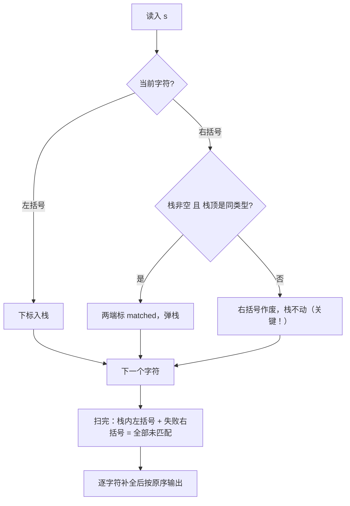

# P1241 括号序列

> 原题链接：<https://www.luogu.com.cn/problem/P1241>（洛谷训练单 <https://www.luogu.com.cn/training/320175>）
> 题面逐字版：[`problem.txt`](problem.txt)
> 本目录导航：[← 题库索引](../../../README.md) ｜ [题目原文](problem.txt) · [讲解代码](solution.cpp) · [元信息](metadata.yml) · [对拍脚本](verify.js) · [分步动画](visualization.html)

## 元信息

| 项目 | 内容 |
| --- | --- |
| 难度 | 普及−（栈的经典应用，唯一的坑在"匹配失败时弹不弹栈"） |
| 来源 | 洛谷 P1241 |
| 标签 | 栈、括号匹配、字符串、模拟 |
| 时间复杂度 | $O(n)$，$n = |s| \le 100$ |
| 空间复杂度 | $O(n)$ |
| 评测状态 | 本地 `g++ -static -O2 -std=c++14` 编译运行，两组官方样例均输出 `()[]()` 正确；与"数组两两扫描模拟原始定义"的暴力随机对拍 **200000 组 0 不一致**，另用编译好的 C++ 程序复核 **500 组 0 不一致**；未在洛谷提交 |

## 题目大意

给你一个只由 `(`、`)`、`[`、`]` 四种字符组成的串 $s$（$|s| \le 100$）。按下面的规矩给每个字符找"搭档"：

- 从左到右扫描；
- 扫到**右括号**时，只看它**左边离它最近的、还没有配对成功的左括号**：
  - 如果类型对得上（`(` 配 `)`、`[` 配 `]`），就把这两个配成一对；
  - 如果左边根本没有未配对的左括号，或者那个最近的左括号**类型不对**，那么这个**右括号配对失败**。

扫完之后，凡是没配上对的括号，都在它旁边**补一个字符**让它成对（左括号右边补右括号，右括号左边补左括号），把补完的串输出。

**一句话人话**：把每个没配上的括号"凑对"，`(` 旁边补 `)`、`)` 旁边补 `(`，凑成一个合法的括号串。

> ⚠️ 先划重点：本题的"配对"规则**比普通合法括号序列判定要"短视"** —— 右括号只认最近那一个左括号，类型不对就当场作废，**不会跳过它去够更早的左括号**。而且作废时那个左括号**不会被消耗掉**。这一句是整道题最容易写错的地方，样例 #2 就是专门卡它的。

## 思路推导

### 1. 暴力想法与它的瓶颈

学生第一反应通常是：拿两个循环，对每个右括号 $i$，从 $i-1$ 往前一个一个看，找第一个"还没配对过的左括号" $j$；判断 $s[i]$ 和 $s[j]$ 类型对不对，对了就把它俩标成已配对。

这个思路其实**没有错**，只是写起来很别扭，原因有两点：

- 你得用一个布尔数组 `used[]` 记住"哪些左括号已经被配走了"，否则"最近未匹配的左括号"这个语义没法表达；
- "从右往左找最近的没被用的左括号"这句话，用循环 + 标记数组来表达，边界一堆，很容易写漏（比如把已经配对成功的右括号也算进去）。

而且它的复杂度是 $O(n^2)$。本题 $n \le 100$，$O(n^2)$ 并不超时，所以"慢"不是它真正的问题——**真正的问题是它把"最近未匹配"这个天然的结构信息藏在了循环里，写起来绕**。下面我们会发现，有一个数据结构天生就是干这件事的。

### 2. 关键观察

#### 观察 1："左侧最近的未匹配左括号"恰好就是栈顶

我们从左往右扫描，遇到的左括号先攒着，等右边的右括号来配。注意一个事实：**任何一个右括号能配的，只可能是"还没被配走的最靠右的那个左括号"**。

这正是栈的行为——后进先出。把每个还没匹配的左括号**下标**压进栈：

- 栈底是最早入栈的、也就是最靠左的未匹配左括号；
- 栈顶是最后入栈的、也就是**最靠右**的未匹配左括号 = "当前右括号左侧最近的那个"。

所以"考察左侧最近的未匹配左括号"，翻译成栈操作就是"看栈顶"。$O(n^2)$ 的两两扫描，当场塌成 $O(n)$ 的"看栈顶"。

#### 观察 2：类型不符时，右括号作废，但栈顶左括号【不弹出】

这是本题**与"判断合法括号序列"唯一的区别**，也是最大的坑。

普通合法括号判定题，遇到"栈顶是 `[` 而当前是 `)`"，会直接判整个串非法（或干脆把栈顶弹掉丢弃）。但本题不行：

- 当前右括号 `)` 配对失败，它自己作废（记为未匹配）；
- 但栈顶那个 `[` **只是暂时没人配它，并没有被消耗**。它还得留在栈里，等**后面**也许出现的 `]` 来配。

如果在这里把 `[` 弹掉了，后面来的 `]` 就找不到它了，结果全错。我们用样例 #2 逐步核对（这段是真实程序跑出来的，不是口算）：

| 步骤 | 当前字符 | 栈（底→顶） | 判断 | 结果 |
| --- | --- | --- | --- | --- |
| 1 | `(` | `[(` | 左括号，入栈 | — |
| 2 | `[` | `[([` | 左括号，入栈 | — |
| 3 | `)` | `[([` | 栈顶 `[` 与 `)` 类型不符 | `)` **作废**，`[` **留在栈里不弹** |

扫完：栈里剩 `(` 和 `[` 两个未匹配左括号，`)` 是未匹配右括号。补全：`(`→`()`、`[`→`[]`、`)`→`()`，按原顺序拼起来 = `()[]()`，与官方答案一致 ✅。

> 反过来想：假如你在第 3 步把 `[` 弹了，那 `[` 会被当成"已匹配"，答案就变成 `()` 后面 `[` 和 `)` 各补——顺序、内容都乱。**记住：只有配对成功才弹栈。**

#### 观察 3：扫描结束后，栈里剩下的左括号全是未匹配的

栈里只放"还没被配走"的左括号，配成功就弹走了。所以循环结束时，**栈里每一个位置都是未匹配左括号**；而所有没标记成 matched 的右括号，就是配对失败的右括号。两类合起来，正好是"全部未配对的括号"，可以直接进入补全。

### 3. 算法设计

维护一个存下标的栈 `st` 和一个布尔数组 `matched[i]`：

1. 从左到右扫每个位置 $i$，字符 $c = s[i]$。
2. $c$ 是**左括号**：把 $i$ 压入 `st`（此刻它必然未匹配）。
3. $c$ 是**右括号**：
   - 若 `st` 非空 **且** 栈顶字符与 $c$ 同类型 → 把两端 `matched` 都置 `true`，**弹栈**；
   - 否则（栈空，或类型不符）→ 什么都不做，$c$ 保持未匹配，**不弹栈**（观察 2）。
4. 扫描完，按原顺序 $i = 0 \dots n-1$ 输出：
   - `matched[i]` 为真：原样输出 $s[i]$；
   - 未匹配的左括号：输出 `s[i] + 对应右括号`；
   - 未匹配的右括号：输出 `对应左括号 + s[i]`。

**不变式**（用于正确性论证，见 §4）：扫描到位置 $i$ 时，栈中自底到顶恰好是"位置 $< i$ 且尚未匹配的所有左括号的位置"，且越靠栈顶下标越大（越靠右）。

### 4. 正确性说明

对扫描位置 $i$ 做**归纳**，证明上面那条不变式始终成立：

- **奠基**：$i = 0$ 时栈空，"位置 < 0 的未匹配左括号"集合也是空，成立。
- **归纳步**：假设扫到 $i$ 前不变式成立。
  - 若 $s[i]$ 是左括号：把它加入集合，位置最大所以放栈顶，`push` 正好做到 → 不变式保持。
  - 若 $s[i]$ 是右括号：按题面它只跟"集合里下标最大的那个左括号"配，而这个恰好是栈顶（不变式保证）。
    - 类型匹配：两者配对，该左括号从"未匹配集合"里移除 → 对应 `pop`；不变式保持。
    - 类型不符 / 栈空：右括号作废，不改动"未匹配左括号集合" → 对应"不弹栈"；不变式保持。

  三种情形都不破坏不变式。

由不变式，扫完 $i = n$ 时，**栈里剩下的位置集合 = 全部未匹配的左括号**；而 `matched` 为假的右括号 = 全部配对失败的右括号。两者合起来正是题面说的"全部未配对的括号"。

补全规则是**逐字符独立**应用的：一个括号补成一对，与别的括号补成什么无关，也不改变原字符的相对顺序。所以对每个位置套用补全规则、再按原序拼接，得到的串正是题目要求"在原串旁边补字符"后的结果。$\blacksquare$

### 5. 复杂度分析

- 时间：每个位置入栈至多一次、出栈至多一次，扫描 + 输出各一遍 → $O(n)$。$n \le 100$，轻松跑满。
- 空间：栈 + `matched` 数组 + 答案串 → $O(n)$。
- 实现要点：**不能边扫边输出**。因为某个右括号到底匹没匹配上、栈里最后剩哪些左括号，要扫完全串才知道，所以先把 `matched` 标好，最后一遍统一补全输出。

## 可视化讲解



交互式分步演示见同目录 [`visualization.html`](visualization.html)：左边字符串格子实时标"已匹配/未匹配"，中间是竖直栈（栈顶在上），右边是正在拼的答案串，配成功连线变绿、类型不符打红叉并提示"右括号作废，栈不变"。默认载入样例 `([()`，可一键切到 `([)` 看那个不弹栈的关键步骤。

## 讲解代码

完整逐段注释版见 [`solution.cpp`](solution.cpp)。核心匹配循环：

```cpp
for (int i = 0; i < n; ++i) {
    char c = s[i];
    if (isOpen(c)) {
        st.push_back(i);                              // 左括号：下标入栈，此刻必未匹配
    } else if (!st.empty() && sameType(s[st.back()], c)) {
        matched[st.back()] = true; matched[i] = true; // 栈顶能配 → 两端记为已配对
        st.pop_back();                                // 只有配成功才弹栈
    }
    // 栈空 或 类型不符：右括号作废，栈【不动】——本题唯一陷阱（观察 2）
}
```

为什么存下标而不是存字符：最后要用 `matched[i]` 按**原位置**回填并输出，栈里存下标才能顺手标记 `matched[st.back()]`；若只存字符，就不知道配的是哪个位置。

### 机器实测记录

编译命令（本机两套 MinGW 冲突，必须加 `-static`）：

```bash
cd solutions/ds/p1241-bracket-sequence
g++ -static -O2 -std=c++14 solution.cpp -o sol.exe
```

样例 #1 实际输入输出（逐字节照抄终端）：

```
输入：([()
$ printf '([()\n' | ./sol.exe
()[]()
```

样例 #2 实际输入输出：

```
输入：([)
$ printf '([)\n' | ./sol.exe
()[]()
```

对拍命令与实测结果：

```bash
node verify.js --exe ./sol.exe
```

```
--- 官方样例 ---
([() -> 栈=()[]() 暴力=()[]() 期望=()[]() OK
([) -> 栈=()[]() 暴力=()[]() 期望=()[]() OK
--- 随机对拍：栈 vs 暴力 ---
共 200000 组，不一致 0 组
--- C++ 程序 vs 暴力：共 500 组，不一致 0 组
```

> `verify.js` 里的两份 JS 逻辑（栈贪心、数组两两扫描暴力）**仅用于验证，非讲解代码**；讲解一律用 C++（AGENTS.md §3）。暴力版完全按题面"最近未匹配左括号"的定义线性回扫，不借助栈，与正解是独立思路。

## 易错点与坑

1. **类型不符时把栈顶弹了**（第一大坑）。普通合法括号判定会"弹掉/判非法"，本题**必须留着栈顶**。弹了就错，样例 #2 `([)` 专卡这一点：正确 `()[]()`，弹栈的话结果面目全非。
2. **补全方向补反**：未匹配的**左**括号要在**右边**补对应右括号（`(` → `()`）；未匹配的**右**括号要在**左边**补对应左括号（`)` → `()`）。方向搞反，输出的就不是合法序列。
3. **小括号与中括号互配**：`(` 和 `]`、`[` 和 `)` 都**不算**同类型，判据用 `(a=='('&&b==')')||(a=='['&&b==']')`，不能只写"一左一右就算配"。
4. **栈存字符还是存下标**：存字符就没法回填 `matched[i]`，最后拼答案需要**位置信息**。用下标栈。
5. **空串 / 读入方式**：$|s| \le 100$ 允许长度为 0 的输入（空行）。`cin >> s` 遇空白会读不到空串，用 `getline(cin, s)` 更稳，空串时输出空行（实测 `"" -> ""`）。
6. **边判断边输出**：匹配与否要扫完全串才确定，务必先把 `matched` 全标好，再统一补全输出，不能一边扫一边打印。

## 常见变式

| 变式 | 差异 | 对应题号 |
| --- | --- | --- |
| 判断括号序列是否合法 | 类型不符直接判整个串非法（整体 Yes/No，不补全） | LeetCode 20 / 本仓库栈专题 |
| 最少添加次数使其合法 | 只问"补几个"，不要求还原每个配对 | LeetCode 921 |
| 最长合法括号子串 | 求连续合法段长度，规则里"失败即断"与本题"失败作废但栈不动"不同 | 洛谷同类题 |
| 表达式嵌套深度 | 栈大小峰值 = 最大嵌套层数 | 括号匹配衍生 |

## 小结

> **"左侧最近的未匹配左括号"就是栈顶；配成功才弹，类型不对右括号作废、栈顶原封不动。** 记住这"不弹"的一次，本题就从"判合法"升级成了"补全"。
