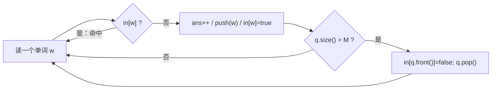

# P1540 [NOIP 2010 提高组] 机器翻译

> 原题链接：<https://www.luogu.com.cn/problem/P1540>
>
> 同题另有一份写法不同的讲评在 [`solutions/basic/p1540-machine-translation/`](../basic/p1540-machine-translation/)（`set` 判存在 + 数组手工 shift 淘汰）。
> 本目录这一版只用**队列 + 一个 `bool in[]` 标记数组**，是考场上最短、最好讲的一种实现；两份都保留，讲课时任选其一。

## 元信息

| 项目 | 内容 |
| --- | --- |
| 难度 | 普及−（NOIP2010 提高组 T1） |
| 来源 | 洛谷 P1540 |
| 标签 | 队列、FIFO 缓存、模拟 |
| 时间复杂度 | $O(N)$ |
| 空间复杂度 | $O(M + V)$，$V=1001$ 是单词值域 |
| 评测状态 | 本地 `g++ -static -O2 -std=c++14` 编译运行，样例输出 `5` 正确；$M=100,N=1000$ 满数据 12 ms；未在洛谷提交 |

## 题目大意

软件依次翻译 $N$ 个单词，内存有 $M$ 个单元，初始为空。每个词先在内存里找：

- 命中 → 直接用；
- 未命中 → 查外存词典（次数 +1），然后把这个词放进内存；若内存已存满 $M$ 个，**清空最早进入内存的那个**。

输出查词典次数。单词是 $0\sim1000$ 的非负整数，$1\le M\le100$，$1\le N\le1000$。

## 思路推导

### 1. 暴力想法与它的瓶颈

把内存开成一个数组，每来一个词就线性扫一遍看"在不在"，满了就从数组里把最老的那个挪走、后面全部前移。
$N\le1000$、$M\le100$，最坏 $10^5$ 次操作 —— **本题数据太弱，暴力不会 TLE**。
所以它的瓶颈不在时间，而在"淘汰谁"这件事用数组写很容易写错：谁最老要自己维护，前移一次就要重写一段下标。

这正是"该用队列"的信号：需要一个能自动记住进入顺序的结构。

### 2. 关键观察

#### 观察 1：淘汰规则是 FIFO，不是 LRU

题面说"清空**最早进入内存**的那个单词"，而不是"最久没被使用的那个"。
所以命中时**什么都不用做** —— 不需要把这个词挪到队尾。写成 LRU（命中就 move-to-end）在样例上可能对，在随机数据上必然偏少。
样例第 6 步就是证据：`4` 命中时内存仍是 `2 5 4`，顺序没变。

#### 观察 2：`bool in[]` 把"在不在内存"降到 $O(1)$

内存里查一个词，暴力要 $O(M)$。但单词值域只有 $0\sim1000$，直接开一个标记数组：
`in[w] == true` 当且仅当 $w$ 此刻在内存里。判存 $O(1)$，整题 $O(N)$。
**队列负责"谁最老"，标记数组负责"在不在"** —— 两个结构各管一半信息，这是本题最值得讲的模式。

#### 观察 3：先判满还是先入队，结果一样，但代码难度不同

常见写法是"满了就先 pop 再 push"。本解答反过来：**先 push，再 `if (size() > M) pop`**。
好处是不用特判"内存满没满"，`size() > M` 天然等价于"入队前是满的"，少一个分支就少一处错。

### 3. 算法设计

1. `queue<int> q`（队头 = 最老）、`bool in[1005]` 全 false、`ans = 0`；
2. 对每个词 $w$：
   - `if (in[w]) continue;`（命中，什么都不做）
   - `++ans; q.push(w); in[w] = true;`
   - `if (q.size() > M) { in[q.front()] = false; q.pop(); }`
3. 输出 `ans`。

### 4. 正确性说明

不变式：任意时刻 `q` 中的元素集合恰为内存中的单词集合，且从左到右按进入内存的时间递增；`in[w]==true` 当且仅当 $w$ 在 `q` 中。

- 命中：$w$ 已在 `q` 中，规则要求"不改变内存"，程序 `continue`，不变式不动。
- 未命中且入队前不满：`push` 到队尾，进入时间最新，位置正确；`in[w]` 置真，一致。
- 未命中且入队前已满（$|q|$ 变 $M+1$）：`pop` 掉队头，即进入最早的那个，正是题面指定的淘汰对象；先把它的 `in` 抹掉再 `pop`，两个结构同步。

容量方面：$|q|\le M$ 恒成立（超限即弹），且不满时绝不弹，与"不超过 $M-1$ 就找空位放"完全对应。$\blacksquare$

### 5. 复杂度分析

每个词最多一次 `push`、一次 `pop`，判存 $O(1)$，总计 $O(N)$；空间 $O(M+1001)$。
$N\le1000$ 时毫无压力，实测满数据 12 ms（其中大部分是进程启动）。

## 可视化讲解



### 板书演示（本题不做动画，黑板上画四行就够）

按样例 `M=3`，把每步的**队头→队尾**和 `ans` 都写在黑板上：

| # | 词 | 命中? | 内存（老→新）| 淘汰 | ans |
| --- | --- | --- | --- | --- | --- |
| 1 | 1 | 否 | `1` | — | 1 |
| 2 | 2 | 否 | `1 2` | — | 2 |
| 3 | 1 | **是** | `1 2`（**不动**）| — | 2 |
| 4 | 5 | 否 | `1 2 5` | — | 3 |
| 5 | 4 | 否 | `2 5 4` | 淘汰 1 | 4 |
| 6 | 4 | **是** | `2 5 4` | — | 4 |
| 7 | 1 | 否 | `5 4 1` | 淘汰 2 | **5** |

第 3 行和第 6 行是全班最容易画错的地方：**命中那一行内存顺序必须原样抄下来**。
一旦把它改成"把 1 挪到最后"（LRU），第 5 步淘汰的就不是 1 而是 5，第 7 步不再是 miss，最后答 4 —— 这就是 LRU 与 FIFO 的分歧，用黑板能直接算出来。

## 讲解代码

```cpp
bool in[1005];            // 单词值域 0..1000，下标 0 这一格必须存在
queue<int> q;             // q.front() = 内存中最先进来的单词
int ans = 0;

for (int i = 0; i < N; ++i) {
    int w; scanf("%d", &w);
    if (in[w]) continue;                       // 命中：FIFO 不看访问时间，什么都不做
    ++ans;                                     // 未命中：查一次词典
    q.push(w); in[w] = true;                   // 新词总是最新的，进队尾
    if ((int)q.size() > M) {                   // 说明放进去之前内存是满的
        in[q.front()] = false;                 // 必须先清标记再 pop
        q.pop();
    }
}
printf("%d\n", ans);
```

完整逐段注释版见 [`solution.cpp`](solution.cpp)。

### 机器实测记录

```
$ g++ -static -O2 -std=c++14 solution.cpp -o sol.exe
$ ./sol.exe < in1.txt
5
```

输入 `3 7 / 1 2 1 5 4 4 1`，输出与题面样例一致。

满数据（$M=100$，$N=1000$，单词随机取 $0\sim1000$）：**12 ms**，输出 899。
$M=1$ 边界（此时每个新词都淘汰上一个，答案 = 相邻不同的次数）自造数据手算与程序一致。

## 易错点与坑

- **读入顺序是 `M N` 不是 `N M`**：题面第一行先给内存容量再给文章长度，和很多同学的肌肉记忆相反。实测把 `scanf("%d%d",&M,&N)` 写成 `&N,&M` 后跑样例：$N$ 变成 3、$M$ 变成 7，**只读了 3 个词**（`1 2 1`）就结束，输出 2。这类错误不一定崩溃，只是少处理数据，答案偏小，很隐蔽。
- **`in[]` 要开到 1001 以上**：单词是"大小不超过 1000 的**非负**整数"，0 和 1000 都合法。开 `bool in[1000]` 时 `in[1000]` 越界。
- **命中时不要重排队列**：见板书演示，这是 FIFO/LRU 之分，是本题唯一的语义坑。
- **`in[q.front()]=false` 必须在 `pop()` 之前**：实测改成"先 `pop()` 再 `in[q.front()]=false`"，样例输出 4（应为 5）—— 因为 pop 之后 `front()` 已经是下一个词，抹掉的是无辜单词的标记，而真正被淘汰的那个词标记仍是 `true`，下次它明明不在内存里却被判命中，答案偏小。这个 bug 只改一个语句顺序，最难查。
- **不要在 push 前判 `size()==M` 然后 pop**：两种写法都对，但混用时如果先 `pop` 再 `push` 而忘了 pop 分支只在满时执行，空内存也会被弹一次，`front()` 在未定义状态上取值。
- **重复词不会同时存在两份**：只在 `!in[w]` 时 push，所以队列天然无重复；如果哪天改成"每次都 push"，`in[]` 就必须换成计数 `cnt[]`，弹一次不能清零。

## 常见变式

| 变式 | 差异 | 对应题号 |
| --- | --- | --- |
| 淘汰"最久未使用"（LRU） | 命中要把元素移到队尾，队列失效，得用 `list` + 迭代器表 | — |
| 淘汰"出现次数最少/最早消失影响最小" | 标记数组要换成计数或优先级队列 | P2058 海港（窗口 + 计数） |
| 值域很大但需要判存 | 换成 `set`/`unordered_set`，`in[]` 那招作废 | 本仓库 `basic/p1540` 版 |

## 小结

**淘汰"最早进入"就是队列，判"在不在"就用值域下标的标记数组 —— 命中时什么都不做，是 FIFO 与 LRU 的唯一分界。**
