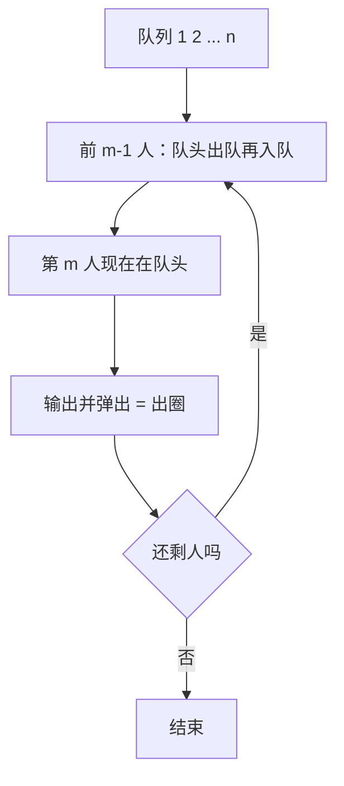

# P1996 约瑟夫问题

> 原题链接：<https://www.luogu.com.cn/problem/P1996>
> 本目录导航：[← 题库索引](../../../README.md) ｜ [题目原文](problem.txt) · [讲解代码](solution.cpp) · [元信息](metadata.yml) · [对拍脚本](verify.js)

## 元信息

| 项目 | 内容 |
| --- | --- |
| 难度 | 普及− |
| 来源 | 洛谷 P1996 |
| 标签 | 队列、模拟 |
| 时间复杂度 | $O(nm)$ |
| 空间复杂度 | $O(n)$ |
| 评测状态 | 本地 `g++ -static -O2 -std=c++14` 编译运行，样例输出正确；与"数组 + vis 标记跳过已出圈者"的暴力随机对拍 200000 组 0 不一致；未在洛谷提交 |

## 题目大意

$n$ 个人围成一圈，从 1 号开始报数，数到 $m$ 的人出圈，然后从他下一个人重新报 1，直到全部出圈，按顺序输出出圈编号。

- 输入：两个整数 $n, m$
- 输出：一行 $n$ 个整数
- 数据范围：$1\le m,n\le100$

## 思路推导

### 1. 暴力想法与它的瓶颈

课本上的经典写法是数组 + 标记：`vis[i]` 记录第 $i$ 人是否已出圈，每次从当前位置往后走，遇到没出圈的就计数 1，数到 $m$ 就输出并打标记。逻辑完全正确，但"跳过已出圈的人"要写成 `while(vis[pos]) pos = pos % n + 1;`，取模回环和计数混在一起，学生写着写着就错一格 —— 它是**能过但难写对**的代表。

### 2. 关键观察

#### 观察 1：圈的"往后走"和"绕回来"，队列天生就会

把圈从"下一个要报数的人"处剪开拉直，他就站在队头。往后移动一个人 = 队头出队；绕回圈尾 = 再把他压回队尾。于是"报数"这个动作在队列里就是一串 `push(front()); pop();`。

#### 观察 2：报数为 $m$ 的人一定在队头

前 $m-1$ 个人各挪一次到队尾之后，第 $m$ 个人恰好轮到队头。所以淘汰 = `q.pop()` 并输出，不需要任何条件判断。

#### 观察 3：弹完之后队列状态自动等于"从下一个人重新报数"

被弹的人后面那个自然成为新队头，正是下一轮的报数起点。这就是队列解法比数组标记短一半的原因：**回环和起点由数据结构本身维护**。

### 3. 算法设计

1. $1..n$ 依次入队；
2. 重复 $n$ 次（本题要输出全部出圈顺序）：
   - `for t = 1..m-1`：`q.push(q.front()); q.pop();`
   - 输出 `q.front()`，然后 `q.pop()`。

### 4. 正确性说明

对轮次 $k$ 归纳。$k=1$ 时队列为 $1,2,\dots,n$，恰为"从 1 号开始沿圈顺序的剩余人员"。设第 $k$ 轮开始时该不变式成立：前 $m-1$ 次"出队再入队"把报数 $1..m-1$ 的人按原顺序搬到队尾，队列仍是同一个环、只是起点右移了 $m-1$ 格，故队头正是报数 $m$ 的人；弹出他之后，剩余人员按环顺序排在队列里，且新队头是他的下一个人 —— 与"由下一个人重新从 1 开始报数"完全一致。不变式保持，归纳完成。$\blacksquare$

### 5. 复杂度分析

每轮做 $m-1$ 次搬动 + 1 次弹出，共 $n$ 轮：时间 $O(nm)\le 10^4$；空间 $O(n)$。

## 可视化讲解



## 板书演示（本题不做动画，黑板上四行就够）

$n=10,m=3$，队列写成一行，`|` 左边是已出圈序列：

| 轮 | 搬动（前 m-1=2 人） | 弹出 | 队列剩余 |
| --- | --- | --- | --- |
| 1 | `3 4 ... 2` | 3 | `4 5 6 7 8 9 10 1 2` |
| 2 | `6 7 ... 4 5` | 6 | `7 8 9 10 1 2 4 5` |
| 3 | `9 10 ... 7 8` | 9 | `10 1 2 4 5 7 8` |
| 4 | `2 4 ... 10 1` | 2 | `4 5 7 8 10 1` |

（第 4 轮起就能看出"绕圈"的效果：10、1 被搬到后面去了。）

课堂实测三个边界：`n=1 m=1 → 1`、`n=5 m=1 → 1 2 3 4 5`（一次都不搬）、`n=10 m=3 → 3 6 9 2 7 1 8 5 10 4`。

## 讲解代码

```cpp
queue<int> q;
for (int i = 1; i <= n; ++i) q.push(i);

for (int k = 1; k <= n; ++k) {          // 做满 n 轮：本题要输出全部出圈顺序
    for (int t = 1; t < m; ++t) {       // 只搬 m-1 个人，报 m 的那个必须留在队头
        q.push(q.front());
        q.pop();
    }
    cout << (k > 1 ? " " : "") << q.front();
    q.pop();                            // 弹出 = 出圈，新队头自动是下一个人
}
```

完整逐段注释版见 [`solution.cpp`](solution.cpp)。

### 机器实测记录

```
$ g++ -static -O2 -std=c++14 solution.cpp -o sol.exe
$ echo "10 3" | ./sol.exe
3 6 9 2 7 1 8 5 10 4
```

`node verify.js`：官方样例 OK；随机对拍 200000 组（$n,m\in[1,12]$，队列 vs vis 数组暴力）0 不一致；定向边界 `n=1 m=1`、`n=1 m=100`、`n=5 m=1` 均 OK。

## 易错点与坑

- **搬 $m-1$ 次而不是 $m$ 次**：搬 $m$ 次会把该出圈的人藏到队尾，全体错位，是最典型的 off-by-one。
- **要做满 $n$ 轮**：题面特别提醒"本题是全部出圈"，只做到剩 1 人就是照抄课本例题，WA。
- **$m=1$ 边界**：内层循环一次都不执行，输出应为 `1 2 ... n`，用它自检最快。
- **输出格式**：$n$ 个数空格隔开，第一个数前不能有空格（用 `k>1` 控制）。
- **$n,m$ 顺序**：输入是 `n m`，别和"报数上限在前"的其它版本混了。

## 常见变式

| 变式 | 差异 | 对应题号 |
| --- | --- | --- |
| 只求最后剩下的人 | 递推 $f_1=0,\ f_i=(f_{i-1}+m)\bmod i$，$O(n)$，无需模拟 | 剑指 Offer 62 |
| 数组 + vis 标记 | 跳过已出圈者，取模回环，$O(n^2m)$ 级 | 本目录 `verify.js` 里的暴力 |
| 链表循环 | `list` + 迭代器前进，删除 $O(1)$ | 双向链表版约瑟夫 |
| $m=2$ 特例 | 答案与 $n$ 的二进制最高位有关 | 数学题 |

## 小结

**"围成一圈"在队列里就是"队头出队再入队"** —— 让数据结构替你维护回环和起点，比手写取模少一半 bug。
