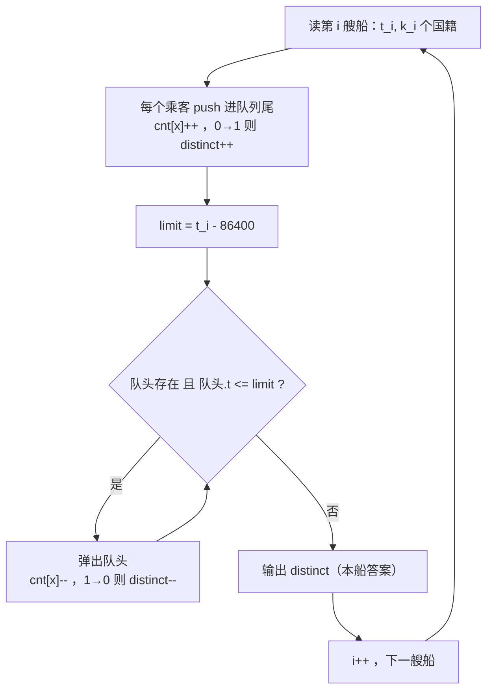
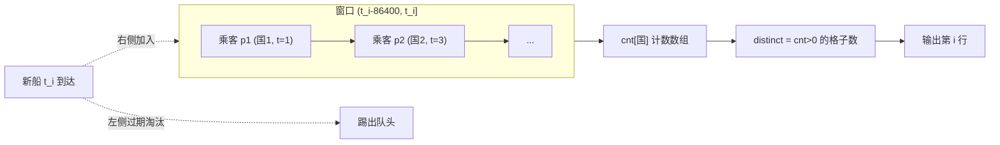

# P2058 [NOIP 2016 普及组] 海港

> 原题链接：<https://www.luogu.com.cn/problem/P2058>（洛谷训练单 <https://www.luogu.com.cn/training/320175>）
> 题面逐字版：[`problem.txt`](problem.txt)

## 元信息

| 项目 | 内容 |
| --- | --- |
| 难度 | 普及/提高−（NOIP2016 普及组 T3；思路只有一层，坑全在边界） |
| 来源 | 洛谷 P2058 / NOIP 2016 普及组 |
| 标签 | 数据结构、队列、滑动窗口、计数数组、均摊分析 |
| 时间复杂度 | $O(n + \sum k_i)$，实测 $6\times10^4$ 艘船 / $3\times10^5$ 名乘客 JS 版 15ms |
| 空间复杂度 | $O(\sum k_i + \max x)$，约 2.8MB |
| 评测状态 | 未在洛谷提交（题目页需登录）；本地 `g++ -static -O2 -std=c++14` 编译运行，2 组官方样例输出 `3 4 4` / `3 3 3 4` **逐字全对**；与"每艘船重建 Set"的暴力随机对拍 **200000 组 0 不一致**，另用编译好的 C++ 程序复核 **300 组 0 不一致**（复现命令见下） |

## 题目大意

$n$ 艘船**按到达时间先后**依次进港，第 $i$ 艘在 $t_i$ 秒到达、带来 $k_i$ 名乘客，每名乘客有一个国籍编号 $x$。
对**每一艘**船 $i$，要算出：所有满足

$$t_i - 86400 < t_p \le t_i \qquad (p \le i)$$

的船上的乘客，一共来自多少个**不同**的国家。

- 输入：第一行 $n$；接下来 $n$ 行，每行 $t_i\ k_i$，再跟 $k_i$ 个国籍编号
- 输出：**$n$ 行**，第 $i$ 行是第 $i$ 艘船到达后的答案
- 数据范围：$1\le n\le 10^5$，$\sum k_i\le 3\times10^5$，$1\le x_{i,j}\le 10^5$，$1\le t_i\le 10^9$，$t_i$ 递增

**一句话翻译成人话**：每次船来了，就数一数"过去 24 小时（不含整 24 小时那一刻）进港的所有人里有多少种国籍"，每艘船都要报一个数。

> 三个必须先在题面上圈出来的细节，后面所有推导都围绕它们：
> 1. $86400 = 24\times60\times60$，就是"一天"的秒数；
> 2. 不等式**左边是严格大于**、**右边是小于等于** —— 区间是**左开右闭** $(t_i-86400,\ t_i]$，本题最大的坑；
> 3. $t_i$ **递增**是题目保证的，不是你自己假设的 —— 正因为有这个保证，才有下面的"滑动窗口"。

## 思路推导

### 1. 暴力想法与它的瓶颈

考场上最诚实的第一版代码（也是绝大多数同学的第一反应）：

```cpp
// 对每艘船 i：往回一艘艘扫，把窗口内所有乘客的国籍塞进一个全新的 set
for (int i = 1; i <= n; ++i) {
    set<int> s;
    for (int p = i; p >= 1; --p) {
        if (t[p] > t[i] - 86400)            // 窗口条件
            for (int x : passengers[p]) s.insert(x);
        // 注意：t 递增，所以理论上可以扫到不满足就 break，但最坏还是全扫
    }
    cout << s.size() << '\n';
}
```

**它慢在哪里？把账算清楚。** 最坏情况：所有船都挤在同一天内到达，例如 $t_i = i$（$1\le i\le 10^5$）。那么对第 $i$ 艘船，窗口 $ (t_i-86400,\ t_i]$ 把前面**所有** $i$ 艘船全包住，乘客总数约 $3\times10^5$ 人里的前 $\tfrac{3i}{10^5}\cdot i$ 个。总量：

$$\sum_{i=1}^{10^5}(\text{第 } i \text{ 次要插入的人数}) \approx 10^5 \times \frac{3\times10^5}{2} = 1.5\times10^{10}\ \text{次插入}$$

再乘上 `set.insert` 的 $\log$（约 17）。现在的评测机一秒大约 $10^8$ 次简单操作，这个数**超时一百倍以上**，连"把船读进来再往回放一遍"这件事本身都做不完。瓶颈不在常数，在于**同一批乘客被反复数了很多遍**：第 $i$ 艘船和第 $i+1$ 艘船的窗口有 $99\%$ 是重叠的，可我们每次都从零重建。

> 讲课时的提问：**"两次查询的答案重叠那么多，为什么还要重算？"** 把这句话想明白，本题就已经做完了。

### 2. 关键观察

#### 观察 1：$t_i$ 递增 ⇒ 窗口只会朝一个方向滑，每个人最多"进一次、出一次"

窗口是 $\big(t_i-86400,\ t_i\big]$。$i$ 变大时，右端点 $t_i$ 变大（题目保证递增），左端点 $t_i-86400$ **同样变大**。于是：

- 一个乘客一旦因为"太旧"被踢出窗口，就**永远**不会被后面的船需要（后来的船左边界只会更靠右，把他排除得更彻底）；
- 一个乘客刚进窗口时一定合格（因为 $t_i > t_i-86400$ 恒成立，即自己的船永远不会把自己踢掉）。

结论：把乘客按到港顺序排成一队，**窗口永远是这支队列的一段"后缀"** —— 左边淘汰、右边新增，队伍整体朝一个方向移动。这就是**滑动窗口**。每个人进出各一次 ⇒ 均摊 $O(1)$，$3\times10^5$ 个人就是 $3\times10^5$ 次操作，而不是 $1.5\times10^{10}$ 次。

> 注意这个"窗口是队列的一段后缀"能不能成立，全靠**观察 1 的单调性**。如果题目不保证 $t_i$ 递增（比如船是按输入顺序乱序给的），被踢掉的人可能在下一艘船的窗口里又出现了，那这套做法立刻失效 —— 此时才需要莫队或线段树那样的重型武器。

#### 观察 2：答案不是"集合本身"，而是"集合的大小"，可以靠 $0\leftrightarrow1$ 跳变增量维护

维护一个真实的 `set` 然后每步重建，等于放弃观察 1。正确做法是只留一个计数数组：

$$cnt[c] = \text{当前窗口内国籍为 } c \text{ 的乘客人头数}$$

答案就是"有多少个 $c$ 满足 $cnt[c] > 0$"。这个数**不需要每次重新统计**，因为一次插入或删除只动一个桶：

| 操作 | $cnt$ 的变化 | 对答案 $distinct$ 的影响 |
| --- | --- | --- |
| 进一个国籍 $c$ 的人 | $0 \to 1$ | $+1$（这个国家刚"出现"） |
| 进一个国籍 $c$ 的人 | $k \to k+1\ (k\ge1)$ | **不变**（这个国家本来就在窗口里） |
| 出一个国籍 $c$ 的人 | $1 \to 0$ | $-1$（这个国家刚"消失"） |
| 出一个国籍 $c$ 的人 | $k \to k-1\ (k\ge2)$ | 不变（还剩人） |

代码里就是两行对称的话：

```cpp
if (cnt[x]++ == 0) ++distinct;   // 进：只有跨过 0 这条线才算"多一个国家"
if (--cnt[x] == 0) --distinct;   // 出：只有掉回 0 才算"少一个国家"
```

**这就是本题的技术核心**：把"集合大小"这种看起来必须整体重算的量，拆成"单个桶跨越零点"这种每次只动一点的增量。

#### 观察 3：同一艘船里的重复国籍，`cnt` 天然帮你合并了，不要手写去重

样例 #1 第一艘船 `1 4 4 1 2 2`：乘客国籍是 $4,1,2,2$。两次 $2$ 让 $cnt[2]=2$，但 $distinct$ 只在 $0\to1$ 时加了一次，所以答案 $\{1,2,4\} = 3$ —— **正确**。很多同学下意识先写个 `sort + unique` 或者用 `set` 去重，属于白干的活：观察 2 的跳变判定已经把"同国多人"处理干净了。

#### 观察 4：窗口左开右闭，"过期"的判据是 $t \le t_i - 86400$，不是 $t < t_i-86400$

留在窗口里的条件是 $t > t_i-86400$，那么反面（该弹出去的）就是 $t \le t_i-86400$。$t$ **正好等于** $t_i-86400$ 的人**必须弹** —— 差了整整一天，题目说"不超过 24 小时"是严格小于。样例 #2 的第三艘船 $t=86401$，左边界 $86401-86400 = 1$，而第一艘船 $t=1$ **恰好压在边界上**，就是专门设计来卡这一条的（实测影响见"易错点 1"）。

### 3. 算法设计

**数据结构**

- 队列 $Q$：元素是**乘客** $(\text{国籍 } x,\ \text{所属船的到港时间 } t)$，队头是最早进港的；
- 数组 $cnt[1..10^5]$：窗口内各国籍人头数；
- 变量 $distinct$：窗口内 $cnt>0$ 的国籍种数。

**不变式**（处理第 $i$ 艘船、输出之前的那一刻）

- (I1) $Q$ 中恰好装着所有满足 $t_i-86400 < t \le t_i$ 的乘客，且按 $t$ 非降排列（队头最早）；
- (I2) 对每个国籍 $c$，$cnt[c] = Q$ 中 $c$ 的人头数；
- (I3) $distinct = |\{c : cnt[c] > 0\}|$。

**每艘船的三步**（这就是整个算法）

1. **进**：读入本船 $k_i$ 名乘客，每人 `push_back` 到队尾，同时按观察 2 更新 $cnt$ 与 $distinct$；
2. **淘汰**：令 $limit = t_i - 86400$，`while` 队头非空且 $Q.\text{front}.t \le limit$，弹出队头并按观察 2 回退 $cnt$ 与 $distinct$；
3. **报**：输出 $distinct$。



> **"先弹再算"还是"先算再弹"？** 两种都对，因为本船乘客的时间 $t_i$ 一定满足 $t_i > t_i-86400$，绝不会被自己这一轮的淘汰误伤（见易错点 2）。上面写的是"先进后弹"，代码最短；写成"先弹后进"也只是把两个代码块对调。

### 4. 正确性说明

本题是**模拟 + 增量维护**，正确性的标准是：**每一步维护后的状态，都和"照题目定义直接重算"得到的一模一样**。对船号 $i$ 归纳，证 (I1)(I2)(I3) 同时成立。

**基础（$i=1$）**：第 1 艘船唯一的乘客时间都是 $t_1$，满足 $t_1-86400 < t_1 \le t_1$，故全部入队；淘汰环节里 $limit = t_1-86400 < t_1$，队头时间 $t_1 \not\le limit$，一个都不弹。于是 $Q$ 恰为窗口内全体乘客，(I1) 成立。$cnt$ 与 $distinct$ 按观察 2 的规则逐个建立，故 (I2)(I3) 成立。

**归纳（$i \to i+1$）**：设第 $i$ 步后 (I1)(I2)(I3) 成立。

*（a）入队不破坏 (I1) 的"完整性"。* 第 $i+1$ 艘船的乘客时间都是 $t_{i+1}$，满足 $t_{i+1}-86400 < t_{i+1} \le t_{i+1}$，本来就应当属于新窗口，且他们的时间不小于队列中任何人的时间（$t$ 递增、按船序入队），所以追加到队尾后队列仍按时间非降排列。

*（b）`while` 弹出的恰好是"全部过期者"，不多也不少。* 设 $limit = t_{i+1}-86400$。队列按时间非降排列，因此
$$\{\text{过期的乘客}\} = \{\,p \in Q : t_p \le limit\,\}$$
是队列的一段**前缀**（若队头之后的某人不合格，他前面的人时间更早，更不合格）。`while` 从队头连续弹出直到遇到第一个 $t > limit$ 的人为止：
 **弹掉的都过期**（每次弹出都现场检查 $t\le limit$）；
 **没弹的都不过期**（剩下的队头 $t>limit$，由非降性，其后所有人 $t \ge$ 队头 $>limit$）；
 **一个都不会漏**（一旦停止，剩余队列全体合格）。
 这一段论证也解释了为什么必须写 `while` 而不是 `if`：过期者可能有几十个连续排在队头。

*（c）$cnt$、$distinct$ 跟着同步。* 每次 `push` 使某个 $cnt$ 加一，每次 `pop` 使某个 $cnt$ 减一，且两次操作都作用在**同一个人**身上，故 (I2) 在每步后保持。而 $distinct$ 只在 $0\to1$（进）与 $1\to0$（出）时改变：$0\to1$ 使 $\{c:cnt[c]>0\|$ 恰好多出一个元素 $c$，$1\to0$ 恰好少一个，其余情况集合不变。故 (I3) 保持。

由 (I1)+(I2)+(I3)，输出的 $distinct$ 正是"窗口内乘客的不同国籍数"，即题目所求。$\blacksquare$

**总操作数**：每个乘客恰好被 push 一次、pop 至多一次，$cnt$ 的读写各 $O(1)$，所以淘汰环节的**总**代价是 $O(\sum k_i)$，而不是"每艘船都可能弹很多"。这叫**均摊分析**，是滑动窗口类题目的标准收工方式。

### 5. 复杂度分析

- **时间**：$O(n + \sum k_i)$ —— 读入 $O(\sum k_i)$，push $O(\sum k_i)$，pop 总计 $O(\sum k_i)$，输出 $O(n)$。代入上限：$3\times10^5 + 10^5 = 4\times10^5$ 次基本操作，相对 $10^8$/秒的时限**余量两万倍**。对比暴力的 $1.5\times10^{10}$，这就是"少算 $10^5$ 倍"。
- **空间**：队列最坏装整个窗口 $=O(\sum k_i)$，每名乘客两个 `int` = 8 字节，$3\times10^5 \times 8 = 2.4\text{MB}$；`cnt` 数组 $100005\times4\approx0.4\text{MB}$。合计约 $2.8\text{MB}$，远低于 $125\text{MB}$。
- **别用 map**：`map<int,int>` 也能做对，但每次操作带 $\log$，且节点分配常数大；国籍本身就是 $1..10^5$ 的整数，**天然适合当数组下标**。

## 可视化讲解

上面那张流程图是"控制流"视角；课堂上更有用的是"**窗口在时间轴上滑动**"的视角：



**交互式分步演示**见同目录 [`visualization.html`](visualization.html)（单文件、离线双击可看，默认数据就是**样例 #2**，专门用来演示 $t=1$ 的人在 $t_i=86401$ 那一刻被弹出的边界）。它同时给你四样东西：时间轴上的窗口区间、队列格子（入队绿色、弹出红色）、`cnt` 柱状图 + $distinct$ 大数字、**右侧代码行高亮 + 变量状态表**，以及每步"为什么这么做"的讲解文字。

### 课堂手算状态表（样例 #2，和可视化里的步骤一一对应）

| 船 | $t_i$ | 乘客 | 进队后 $cnt$ | $limit=t_i-86400$ | 弹出 | 弹出后 $cnt$ | 输出 |
| --- | --- | --- | --- | --- | --- | --- | --- |
| 1 | 1 | 1 2 2 3 | 1:1 2:2 3:1，$d=3$ | $-86399$ | 无 | 同上 | **3** |
| 2 | 3 | 2 3 | 1:1 2:3 3:2，$d=3$ | $-86397$ | 无 | 同上 | **3** |
| 3 | 86401 | 3 4 | 1:1 2:3 3:3 4:1，$d=4$ | $1$ | 船 1 的 4 人（$t=1\le1$） | 1:0 2:2 3:3 4:1，$d=3$ | **3** |
| 4 | 86402 | 5 | 1:0 2:2 3:3 4:1 5:1，$d=4$ | $2$ | 无（队头 $t=3>2$） | 同上 | **4** |

第 3 行就是**边界时刻**：$t=1$ 的乘客恰好落在左开右闭区间的"开区间端点"上，必须被弹掉，$cnt[1]$ 从 $1\to0$，于是 $distinct$ 由 4 掉回 3。第 4 行说明"队头一合格就可以直接停"—— $t=3$ 的人还在窗口里。

## 讲解代码

完整逐段注释版见 [`solution.cpp`](solution.cpp)。核心就这三段（C++14）：

```cpp
// ① 进：本船乘客全部入队尾，只有 0->1 跳变才多一个国家
for (int j = 0; j < k; ++j) {
    int x; cin >> x;
    if (cnt[x]++ == 0) ++distinct;
    q.push({x, t});
}

// ② 淘汰：左开右闭 => 等于 limit 也要弹；必须 while（可能连弹一批）
const int limit = t - 86400;
while (!q.empty() && q.front().t <= limit) {
    const Passenger p = q.front(); q.pop();
    if (--cnt[p.country] == 0) --distinct;   // ③ 出：只有 1->0 跳变才少一个国家
}

cout << distinct << '\n';   // 每艘船一行
```

**为什么队列里存"乘客"而不是"船"？** 存船也行（同船乘客时间相同，要么整批在窗口内要么整批过期），但那样每次弹出还要遍历这艘船的乘客列表去减 $cnt$，代码多两行、均摊分析多绕一层。存乘客让"一个人进出各一次"这句话**在数据结构上就是显然的**。

**为什么 `if (cnt[x]++ == 0)` 这种写法要看得懂？** 后置 `++` 先用旧值比较再自增，一行同时完成"判断是否 0→1"和"加一"，比写三行更不容易看错。想读得更直白可以写：

```cpp
if (cnt[x] == 0) ++distinct;   // 先判断
++cnt[x];                      // 再加
```

### 机器实测记录

```bash
cd E:/ai/suanfa_study/oi-solutions/solutions/ds/p2058-harbour
g++ -static -O2 -std=c++14 solution.cpp -o sol.exe
./sol.exe < in1.txt      # 样例 #1
./sol.exe < in2.txt      # 样例 #2
node verify.js --exe ./sol.exe
```

实际终端输出（逐字照抄）：

```
=== sample1 ===
3
4
4
=== sample2 ===
3
3
3
4
```

`node verify.js --exe ./sol.exe` 的实际输出：

```
--- 官方样例（题面逐字版见 problem.txt）---
样例 #1: 期望=3 4 4 正解=3 4 4 暴力=3 4 4 OK
样例 #2: 期望=3 3 3 4 正解=3 3 3 4 暴力=3 3 3 4 OK
--- 错误写法对照：过期判定写成 `< limit`（窗口当闭区间）---
样例 #1: 期望=3 4 4 错误写法=3 4 4 碰巧对
样例 #2: 期望=3 3 3 4 错误写法=3 3 4 4 WA（正是坑 1）
--- 定向边界 ---
恰好相差 86400 秒（左开：t = t_i-86400 的人必须弹出）: 正解=1 1 暴力=1 1 OK｜错写 < 版=1 2（错）
相差 86399 秒（仍在窗口内，不能弹）: 正解=1 2 暴力=1 2 OK｜错写 < 版=1 2（碰巧也对）
空船 k=0: 正解=2 2 3 暴力=2 2 3 OK｜错写 < 版=2 2 3（碰巧也对）
一次弹掉多艘（时间跳跃约 3 天）: 正解=1 2 3 1 暴力=1 2 3 1 OK｜错写 < 版=1 2 3 1（碰巧也对）
同国籍同船重复 3 次: 正解=1 暴力=1 OK｜错写 < 版=1（碰巧也对）
国籍号到 1e5 上限: 正解=1 2 暴力=1 2 OK｜错写 < 版=1 2（碰巧也对）
两艘船时间相同（非严格递增的极端）: 正解=1 2 暴力=1 2 OK｜错写 < 版=1 2（碰巧也对）
窗口内只剩 1 人，下一艘船把他挤出去: 正解=1 1 暴力=1 1 OK｜错写 < 版=1 1（碰巧也对）
--- 随机对拍：滑动窗口正解 vs Set 重建暴力 ---
共 200000 组，不一致 0 组
（同批数据上，把 <= 写成 < 的错误版本错了 41417 组 —— 坑 1 不是理论问题）
--- 压力：60000 艘船 / 300000 名乘客，正解耗时 15ms，最后一行答案 88493
--- C++ 程序 vs 暴力：共 300 组，不一致 0 组
全部通过
```

> `verify.js` 里的 JS 版正解和 JS 版暴力**只是验证工具，不是讲解代码**（讲解代码一律 C++，见 AGENTS.md §3）。暴力版是独立思路：对每艘船往回枚举窗口内的每艘船、把每一个乘客塞进一个全新的 `Set`、取 `size()`，完全不维护增量信息。

## 易错点与坑

1. **把左开右闭写成左闭右闭（`<` vs `<=`）—— 本题第一杀手。**
   留在窗口的条件是 $t > t_i-86400$，所以弹出条件必须是 $t \le t_i-86400$（**等于也弹**）。把 `while` 的条件写成 `q.front().t < limit`，则压线那个人被多留下来，$cnt$ 多出一个正数，$distinct$ 偏大。
   实测（上面的机器实测记录）：错误版在样例 #1 上**碰巧全对**，在样例 #2 上输出 `3 3 4 4`（正确 `3 3 3 4`），随机 20 万组里错 41417 组。
   **注意一个细节**：错版在样例 #2 的**第 3 行就错了**（`4` vs `3`），但第 4 行**碰巧又对上了**（第 4 艘船把 $t=1$ 的那批人删掉了，$cnt[1]$ 归零、$cnt[5]$ 加一，$distinct$ 又回到 4）。所以"样例 #2 的第 3、4 行都卡这个边界"这个说法要修正：**真正起鉴别作用的是第 3 行**，第 4 行只是顺带把错误值盖住了。讲课时的结论不变：**只看样例最后一行会漏掉这个 bug**。
2. **"先弹再算"还是"先算再弹"，以及 `if` 还是 `while`。**
   顺序无所谓，理由是 $t_i - 86400 < t_i$ 恒成立 ⇒ 本船乘客永远在自己这一轮的窗口里，不会因为先进来就被误删；反过来，若题目把窗口改成左闭（$t \ge t_i-86400$）而你把弹人放在进人之前，就会有"该弹的没弹"之类的顺序依赖。**唯一必须写对的是 `while`**：时间跳跃一大（例如船间隔 3 天），队头可能连着几十个过期乘客，`if` 只弹一个，剩下的一直赖在窗口里，答案越算越大。
3. **$cnt$ 数组开小 / 用 `map` 代替数组。**
   $x_{i,j}\le 10^5$，数组至少开 `100005`（留出 $10^5$ 这个下标，也防越界写坏别的变量）。`map<int,int>` 逻辑正确但带 $\log$ 与堆分配，$4\times10^5$ 次操作常数大好几倍，属于"能过但不该写"。
4. **$distinct$ 每次重新统计。**
   有同学维护对了 $cnt$，却在输出前写一个 `for (int c=1;c<=100000;++c) if(cnt[c]) ++ans;` —— 每艘船扫 $10^5$ 格，总代价 $n\times10^5 = 10^{10}$，**滑动窗口白做了**，还是 TLE。$distinct$ 是全局增量维护的状态，只在 $0\leftrightarrow1$ 跳变时改。
5. **只输出最后一艘船的答案。** 题面要求 $n$ 行。每艘船都输出一次，且输出必须在"进人 + 弹人"之后。
6. **别为"同国籍重复"额外写去重。** 同船 `2 2` 两个人只算一个国家 —— 观察 3 已经由 `cnt` 的 $0\to1$ 跳变保证；再写 `sort/unique` 是多余工作（$O(k\log k)$ 每艘船）。
7. **`int` 溢出的判断要看清题。** 本题 $t_i\le 10^9$、$t_i-86400$ 也远小于 $2.1\times10^9$，`int` **安全**。但如果变式把窗口改成"累加秒数"或 $t_i$ 上到 $10^{18}$（很多 CF 题如此），`int` 立刻爆，得换 `long long`。**结论是"这里恰好安全"，不是"永远安全"** —— 课时要把这条边界讲清楚，别让学生形成"OI 不用 long long"的错觉。

## 常见变式

| 变式 | 差异 | 对应题号 / 备注 |
| --- | --- | --- |
| **定长**窗口（长度固定 $k$ 个元素），求每个窗口的最大/最小值 | 左右端点按"个数"而非"时间"移动；求**最值**还要在窗口之上再加一层单调队列 | 洛谷 P1886【模板】滑动窗口 |
| 单调队列优化 DP（转移是"窗口内最优 $f$"） | 数据结构相同，套在 DP 转移里 | 洛谷 P1725 一类（先掌握 P1886 再上） |
| 静态询问"区间内不同元素个数"（询问任意给定、左端点不单调） | **观察 1 失效**：左端点会来回跳，不能一遍滑完 | 洛谷 P1972 HH 的项链：莫队或树状数组 + "上一次出现位置"，与本题思想同源（"种数 $=cnt>0$ 的桶数"） |
| 窗口条件依赖窗口内的内容（如"区间和 $\le S$"、"至少包含全部颜色"） | 左端点由窗口内部的变量决定，但只要它仍单调，均摊分析照旧 | 经典尺取法/双指针模板题 |
| 把"24 小时"改成 $T$ 秒 | 判据变成 $t \le t_i - T$，代码一行都不改 | 课堂练习：让学生自己改一遍确认边界仍写对 |
| 还要输出窗口内**人数最多**的国籍 | 只维护"种数"不够，还要维护 $cnt$ 的最大值 | 计数数组 + 单调队列 / `multiset` |
| 船不按到达顺序给 | 观察 1 的单调性被破坏 | 先按 $t$ 排序再滑窗（答案要按原船号还原，需离线记录编号），或改用莫队 |

## 小结

> **窗口只会朝一个方向滑，就把"每问一次重算一次"换成"进出各一次的增量维护"：用计数数组把集合大小拆成 $0\leftrightarrow1$ 的跳变，滑动窗口的均摊代价就是 $O(1)$ 一个人 —— 而左开右闭的边界（等于左边界也要弹）是这种题唯一真正扣分的地方。**
