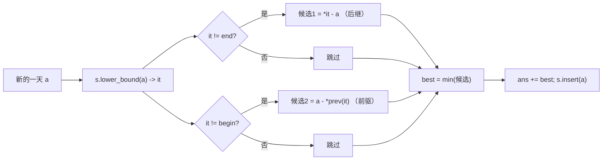

# P2234 [HNOI2002] 营业额统计

> 原题链接：<https://www.luogu.com.cn/problem/P2234>
> 本目录导航：[← 题库索引](../../../README.md) ｜ [题目原文](problem.txt) · [讲解代码](solution.cpp) · [元信息](metadata.yml) · [对拍脚本](verify.js)

## 元信息

| 项目 | 内容 |
| --- | --- |
| 难度 | 普及/提高−（`set` 前驱后继入门） |
| 来源 | 洛谷 P2234（HNOI2002） |
| 标签 | 有序集合、前驱后继、`set`、`lower_bound` |
| 时间复杂度 | $O(n\log n)$ |
| 空间复杂度 | $O(n)$ |
| 评测状态 | 本地 `g++ -static -O2 -std=c++14` 编译运行，样例输出 `12` 正确；`node verify.js`：JS 双实现随机对拍 200000 组 0 不一致，另用编译好的 C++ 程序与暴力交叉 300 组 0 不一致，12 个定向边界（负数/重复/n=1）全 OK；$n=32767$、$|a_i|\le10^6$ 满数据 20~23 ms（同数据 $O(n^2)$ 暴力 382~390 ms，答案一致）；未在洛谷提交 |

## 题目大意

第 $i$ 天的**最小波动值**定义为 $\min\{$ |第 $i$ 天以前的某天营业额 $-$ 第 $i$ 天营业额| $\}$，
特别地**第一天的最小波动值就是第一天的营业额本身**。求 $n$ 天最小波动值之和。

$n\le32767$，$a_i$ 是 $|a_i|\le10^6$ 的整数（**可能为负**），保证结果 $<2^{31}$。

## 思路推导

### 1. 暴力想法与它的瓶颈

按定义写两层循环：对第 $i$ 天，把前面 $i-1$ 天全部枚举一遍取最小差。
$n\le32767 \Rightarrow n^2/2\approx 5.4\times10^8$ 次"减法+绝对值+比较"。
**本机实测并没有当场爆炸**：$n=32767$、$a_i\in[-10^6,10^6]$ 的随机满数据，$O(n^2)$ 暴力跑 **382~390 ms**（三轮），
而 $O(n\log n)$ 的 `set` 版只要 **20~23 ms**。原因是最内层是三个整数指令的紧密循环，`-O2` 下能跑到每秒 $10^9$ 次量级。

所以要诚实地讲：**这题暴力在洛谷 1 s 时限下是"卡线可能过"，不是"必 TLE"**。
真正的问题有两个：
一是没有余量，换一组 $a_i$ 全相同以外的数据、换一台评测机就可能翻车；
二是它教会学生"枚举所有历史"这个错误模式，而本题的价值恰恰在于**发现只需要看两个候选**。
课堂上的说法应该是"暴力 390 ms、正解 20 ms，差 18 倍，而且正解更短"，别说成"暴力过不了"。

瓶颈：为了找"离 $a_i$ 最近的数"，把前面所有数都看了一遍。
但"离得最近"这件事只需要知道**排序后相邻**的数，不需要全部。

### 2. 关键观察

#### 观察 1：离 $a$ 最近的已出现的数，一定是 $a$ 的前驱或后继

把已经出现过的营业额按大小排好。对一个新数 $a$：

- 若集合里有等于 $a$ 的，差为 0，当场最优；
- 否则集合被 $a$ 切成两半：左边是 $\le a$ 的（最大者是**前驱** $L$），右边是 $\ge a$ 的（最小者是**后继** $R$）。
  对任意更左的 $x<L$，有 $a-x>(a-L)\ge0$；对任意更右的 $y>R$，有 $y-a>(R-a)\ge0$。

所以只需比较 $|a-L|$ 与 $|a-R|$ 两个候选。**"只可能是前驱或后继"是本题的全部核心**，
一句话就能讲完，但必须把不等式说清楚，否则学生回去会写成"只比后继"。

#### 观察 2：需要一个"动态有序集合"

数是一个一个进来的，所以要的是**支持插入 + 查前驱后继**的有序结构。`std::set`（红黑树）正好：
`lower_bound(a)` 给后继，`prev(it)` 给前驱，一次 $O(\log n)$。

替代方案与为什么不用：

| 方案 | 问题 |
| --- | --- |
| 排序后二分（数组） | 插入要 $O(n)$ 搬动，退化成 $O(n^2)$ |
| 值域开布尔数组扫左右 | $|a_i|\le10^6$，含负数要偏移，最坏每次扫 $O(V)$，$3\times10^4\times2\times10^6$ 不可接受 |
| 树状数组/权值线段树 | 能做（离散化后查前缀最后出现位），但对这题是杀鸡用牛刀，代码量三倍 |

#### 观察 3：重复值不影响，`set` 去重是对的

如果 $a$ 已经出现过，答案这一项就是 0。`set` 只存一份 $a$，`lower_bound(a)` 命中的正是 $a$ 自己，
差 $=0$ —— **去重并没有丢掉"差为 0"这个信息**，因为集合里仍留着那一份。
这一点值得在课堂上专门说，否则学生不敢用 `set`，非要用 `multiset`。

### 3. 算法设计

1. `set<int> s` 存"第 $i$ 天之前已经出现过的营业额"；
2. 第 1 天：`ans = a1`（题面硬性定义），`s.insert(a1)`；
3. 第 $i\ge2$ 天：
   - `it = s.lower_bound(a)`；
   - `if (it != s.end()) best = min(best, *it - a);`  ← 后继
   - `if (it != s.begin()) best = min(best, a - *prev(it));`  ← 前驱
   - `ans += best;`
   - `s.insert(a)`  ← **必须在查询之后**
4. 输出 `ans`。

### 4. 正确性说明

对 $i$ 归纳。设第 $i$ 天处理前，不变式"$s$ 恰为 $\{a_1,\dots,a_{i-1}\}$ 的去重集合，且有序"成立。

- 由观察 1 的不等式，$\min_{j<i}|a_i-a_j|=\min(a_i-L,\;R-a_i)$，其中 $L$ 是 $s$ 中 $\le a_i$ 的最大者、$R$ 是 $\ge a_i$ 的最小者。
  `lower_bound` 的语义正是"第一个 $\ge a_i$ 的元素"，故 $R=*it$（存在时）；
  $L=*$prev(it)$（`it != begin()` 时，包含 `it == end()` 且集合非空的情形）。
  两个分支各自取到候选并用 `min` 合并，得到的正是上式。
- 边界：$s$ 在第 $i\ge2$ 天时非空（至少含 $a_1$），故 $L,R$ 至少存在一个，`best` 一定会被更新，不会带着 `INT_MAX` 加进答案。
- 插入后不变式对 $i+1$ 成立。第 1 天按题面定义直接取 $a_1$。$\blacksquare$

### 5. 复杂度分析

$n$ 次 `lower_bound`/`insert`，每次 $O(\log n)$，$n\le32767$：总计 $O(n\log n)\approx 5\times10^5$。空间 $O(n)$。
实测满数据（$n=32767$，$a_i\in[-10^6,10^6]$ 随机）：`set` 版 **20~23 ms**（三轮），$O(n^2)$ 暴力同数据 **382~390 ms**（三轮），约 18 倍。

## 可视化讲解



### 板书演示（本题不做动画，黑板上一行数列就够）

样例 `5 1 2 5 4 6`，黑板上画"已出现的数排好序"这一行，每步标出前驱/后继：

| 天 | $a$ | 排序后的 $s$（处理前）| 前驱 $L$ | 后继 $R$ | 本项 | 累计 |
| --- | --- | --- | --- | --- | --- | --- |
| 1 | 5 | `{}` | — | — | **5**（题面规定）| 5 |
| 2 | 1 | `{5}` | 无 | 5 | $\|1-5\|=4$ | 9 |
| 3 | 2 | `{1,5}` | 1 | 5 | $\min(1,3)=1$ | 10 |
| 4 | 5 | `{1,2,5}` | 5 | 5 | $0$ | 10 |
| 5 | 4 | `{1,2,5}` | 2 | 5 | $\min(2,1)=1$ | 11 |
| 6 | 6 | `{1,2,4,5}` | 5 | 无 | $1$ | **12** |

第 2 行（没有前驱）和第 6 行（没有后继）就是 `it != begin()` / `it != end()` 两个判断的来源；
第 4 行 $a=5$ 已在集合里、差 0，正是观察 3。三个知识点全部落在同一张表上，板书不用另起。

## 讲解代码

```cpp
set<int> s;                 // 第 i 天之前出现过的营业额（有序、去重）
long long ans = 0;          // 中间量逼近 int 边界，用 ll 是零成本保险

for (int i = 1; i <= n; ++i) {
    int a;  cin >> a;
    if (i == 1) ans = a;                      // 题面硬性定义：负数也照加
    else {
        set<int>::iterator it = s.lower_bound(a);
        int best = INT_MAX;
        if (it != s.end())   best = min(best, *it - a);      // 后继
        if (it != s.begin()) best = min(best, a - *prev(it)); // 前驱
        ans += best;
    }
    s.insert(a);                              // 先查后插，顺序不能反
}
cout << ans << '\n';
```

完整逐段注释版见 [`solution.cpp`](solution.cpp)。

### 机器实测记录

```
$ g++ -static -O2 -std=c++14 solution.cpp -o sol.exe
$ ./sol.exe < in1.txt
12
```

```
$ node verify.js --exe sol.exe
--- 官方样例 --- 输入 5 1 2 5 4 6 -> 正解=12 暴力=12 期望=12 OK
--- 定向边界 12 项全 OK ---
   n=1 [-8] -> -8（第一天的定义会加进负数）
   n=5 [3,3,3,3,3] -> 3（重复值被 set 去重，第 2 天起每项都是 0）
   n=4 [-5,-1,-2,-5] -> 0（全负 + 重复）
   n=3 [10,-10,0] -> 40、n=4 [100,1,2,3] -> 201（跨越大，检查绝对值方向）
--- 随机对拍：set 前驱后继 vs 定义式 O(n^2) 暴力 --- 共 200000 组，不一致 0 组
--- C++ 程序 vs 暴力：共 300 组（n<=14，四种数据口味轮换：密集重复/全负/全域/极小值域），不一致 0 组
```

满数据压测：**20~23 ms**（另有 27 ms 的一轮，含冷启动），$n=32767$、$a_i\in[-10^6,10^6]$ 随机，输出 10068637；
同一份数据 $O(n^2)$ 暴力 382~390 ms，两个程序答案一致。

## 易错点与坑

- **`prev(it)` 之前必须判 `it != s.begin()`**：`it == begin()` 时 `prev(it)` 是未定义行为；`it == end()` 时 `*it` 是未定义行为，但 `prev(end())` 是**合法的**（集合非空）。
  所以 `end()` 那个判断只管 `*it`，管不到前驱分支 —— 两个判断各自独立，缺一不可。
  实测把 `if (it != s.begin())` 改成 `if (true)`，样例输出 **4**（应为 12）：`set` 的迭代器是双向迭代器，`--begin()` 在本库实现里并不崩溃，只是读出无意义的前一个槽位，**属于"能跑但全错"的那种 bug**。
- **必须先查再插**：实测把 `s.insert(a)` 提到查询之前，`lower_bound(a)` 一定命中刚插进去的自己，差恒为 0，样例输出 **5** —— 正好就是 $a_1$，整个答案退化。
- **第一天是 $a_1$ 不是 0，也不是 $|a_1|$**：题面写"第一天的最小波动值为第一天的营业额"。
  实测把 `ans = a` 改成 `ans = abs(a)` 后，样例照旧输出 12（因为样例全正），但 $n=1,\ a=[-8]$ 输出 **8**（应为 $-8$）—— **样例查不出这个坑**，必须靠 `verify.js` 的定向边界。
- **`best` 不能省掉 `INT_MAX` 初值吗？** 可以省逻辑但不能省赋值：集合非空保证至少更新一次，但漏写初值（未定义）时编译器一般给 0，答案悄悄变小。
- **负数**：$a_i$ 可负，用 `abs(a[i]-a[j])` 的暴力在 $|a_i|\le10^6$ 下不会溢出 int；但正解里 `*it - a` 与 `a - *prev(it)` 都保证非负，**不要写成 `abs(*it - a)` 之外的形式**，尤其不要写 `a - *it`（后继分支会得负数，`min` 直接把答案拉穿）。
- **`endl` vs `'\n'`**：$n$ 只有 $3\times10^4$，不是决定性的，但养成习惯：`endl` 每次 flush。
- **`multiset` 不需要**：见观察 3，去重不丢信息。

## 常见变式

| 变式 | 差异 | 对应题号 |
| --- | --- | --- |
| 静态集合 + 第 $k$ 近 | 离散化后权值线段树/树状数组查前驱后继 | — |
| 要求支持删除 | `set` 换成 `multiset`，删除要 `erase(find(x))` 而不是 `erase(x)`（后者删全部） | — |
| 流式求中位数 | 对顶堆（大根堆装一半、小根堆装另一半），比 `set` 更常考 | — |

## 小结

**"离我最近的历史数据"永远只在前驱和后继两个候选里 —— `lower_bound` 拿一个，`prev` 拿另一个，两个判空一个都不能少。**
