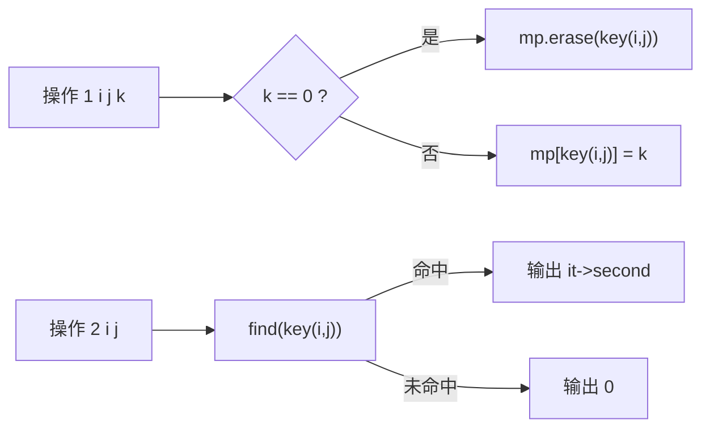

# P3613 【深基15.例2】寄包柜

> 原题链接：<https://www.luogu.com.cn/problem/P3613>

## 元信息

| 项目 | 内容 |
| --- | --- |
| 难度 | 普及− |
| 来源 | 洛谷 P3613（深基 15.例2） |
| 标签 | 稀疏存储、键编码、`map` |
| 时间复杂度 | $O(q\log q)$ |
| 空间复杂度 | $O(q)$（只存被点名过的格子） |
| 评测状态 | 本地 `g++ -static -O2 -std=c++14` 编译运行，样例输出 `118014 / 1` 逐字正确；$n=q=10^5$ 随机压测 186 ms；未在洛谷提交 |

## 题目大意

$n\le 10^5$ 个寄包柜，第 $i$ 个柜子有 $a_i$ 格，**但 $a_i$ 未知**。$q\le 10^5$ 次操作：

- `1 i j k`：往第 $i$ 柜第 $j$ 格存入物品 $k$；$k=0$ 表示**清空**这格
- `2 i j`：查第 $i$ 柜第 $j$ 格，输出里面的物品编号（空则输出 `0`）

格子编号 $j\le 10^5$，物品编号 $k\le 10^9$，全超市格子总数 $\le 10^7$。

## 思路推导

### 1. 暴力想法与它的瓶颈

题面给了 $n\le10^5$、$j\le10^5$，最直觉的做法是开二维数组 `int a[100005][100005]`：
$10^{10}$ 个 int = 40 GB，直接 MLE。哪怕按"总格子数 $\le10^7$"开 `a[100005][]` 的变长结构，
**我们根本不知道每个柜子有几格**，$a_i$ 未知就没法预先分配。

瓶颈：**按值域分配内存，而不是按实际需要分配。**

### 2. 关键观察

#### 观察 1：被"点名"的格子最多只有 $q$ 个

$q$ 次操作，每次最多涉及一个格子，所以真正需要记住的格子数 $\le 10^5$。
$10^{10}$ 的值域里只用到 $10^5$ 个位置 —— 这就是**稀疏**的定义，稀疏表就不该用数组存。

#### 观察 2：$a_i$ 未知恰好是提示，不是障碍

题面专门写"我们并不知道各个 $a_i$ 的值"，又在后面补一句"$a_i$ 保证不小于该柜子存物品请求的最大格子号"。
这两句合起来是在告诉你：**别想去建整张表**，只需要对每个出现过的 $(i,j)$ 记住它的值。
$n$ 这个数字读进来其实用不上。

#### 观察 3：二维键要压成一维，且乘数必须留余量

`map<pair<int,int>, int>` 可以直接用，但面试/讲课时更值得写的是"自己编码"：
把 $(i,j)$ 压成 `i*B + j`。这里 $B$ 必须**严格大于** $j$ 能取到的最大值：
$j\le10^5$，所以 $B=100001$。取 $B=10^5$ 就出事 —— $(i,10^5)$ 和 $(i+1,0)$ 会撞成同一个键。

### 3. 算法设计

1. `map<ll,int> mp`，键 `key(i,j) = (ll)i * 100001 + j`，值 = 该格当前物品编号；
2. 存入：`k==0` → `mp.erase(key)`；否则 `mp[key] = k`（覆盖旧值）；
3. 查询：`find(key)`，命中输出 `it->second`，未命中输出 `0`。

"不在表里"和"在表里但值为 0"合并成同一件事——空柜。用 `erase` 而不是赋 0，
表的大小就永远 $\le$ 真实存了东西的格子数。

### 4. 正确性说明

不变式：任意时刻，`mp` 中恰好包含所有"当前有物品"的格子，且 `mp[key(i,j)]` 等于该格物品编号。

- 存入 $k\ne0$：操作语义就是"这格变成 $k$"，`mp[key]=k` 覆盖旧值，不变式保持。
- 存入 $k=0$：语义是清空，`erase` 把该键移出，不变式保持。
- 查询：若该格有物品，由不变式键必在表中且值正确；若没物品（从未存过或被清空），键不在表中，输出 `0` 正是空柜语义。

三条操作都保持不变式，初始空表满足不变式，故全过程正确。$\blacksquare$

### 5. 复杂度分析

每次操作一次 `map` 查找/插入/删除，表大小 $\le q=10^5$，故单次 $O(\log q)$，总计 $O(q\log q)\approx 1.7\times10^6$。
空间 $O(q)$。实测 $q=10^5$ 满数据 186 ms，1 s 时限富余。

## 可视化讲解



### 板书演示

黑板上画"格子总数 vs 实际记录数"的对比，再把 4 次操作逐条打表：

| 操作 | 键 `i*100001+j` | 表的当前内容（只列非空）| 输出 |
| --- | --- | --- | --- |
| `1 3 10000 118014` | 400003 | `{(3,10000)→118014}` | — |
| `1 1 1 1` | 100002 | `{(1,1)→1, (3,10000)→118014}` | — |
| `2 3 10000` | 400003 | 同上 | **118014** |
| `2 1 1` | 100002 | 同上 | **1** |

再补一条题面外的自造操作把坑演示完：

| 追加 | 效果 | 查询结果 |
| --- | --- | --- |
| `1 1 1 0`（清空） | `(1,1)` 从表里 erase | `2 1 1` → **0**，不是"没有输出" |
| 从没存过的格 | 表里从来没有这个键 | `2 99999 1` → **0** |

$10^{10}$ 个格子 vs 表里最多 $10^5$ 条记录，这个对比是本题板书的落点。

## 讲解代码

```cpp
typedef long long ll;
const ll B = 100001;                 // 必须严格大于 j 的最大值 1e5
inline ll key(int i, int j) { return (ll)i * B + j; }

map<ll, int> mp;
if (op == 1) {
    if (k == 0) mp.erase(key(i, j)); // 清空 = 删键，不是存 0
    else        mp[key(i, j)] = k;
} else {
    map<ll,int>::iterator it = mp.find(key(i, j));
    printf("%d\n", it == mp.end() ? 0 : it->second);
}
```

完整逐段注释版见 [`solution.cpp`](solution.cpp)。

### 机器实测记录

```
$ g++ -static -O2 -std=c++14 solution.cpp -o sol.exe
$ ./sol.exe < in1.txt
118014
1
```

输入 `5 4 / 1 3 10000 118014 / 1 1 1 1 / 2 3 10000 / 2 1 1`，与题面样例逐字节一致。

满数据压测（$n=q=10^5$，一半存一半查，$j$ 随机取到 $10^5$）：**186 ms**，50000 行输出，无超时。

## 易错点与坑

- **`k=0` 是清空，不是"存入编号 0 的物品"**：写成 `mp[key]=0` 也能过样例，但表会越存越大，$10^5$ 次清空后仍占 $10^5$ 条，思路已经错了；更麻烦的是后面接 `if (k==0)` 之外的分支时容易漏判。
- **查询未命中必须输出 0**：题面只保证"查询的柜子有存过东西"，不保证那个**格子**有东西。直接 `cout << mp[key]` 看似省事（`operator[]` 缺键时返回 0），但它会**顺手插入一个键**，把表撑大且让下次 `erase` 语义混乱；讲课时用 `find` 更清楚。
- **乘数踩线**：$B=10^5$ 时 `key(3,100000) == key(4,0)`，两个不同格子共用一格，属于"看起来对、随机数据必炸"的经典 bug。取 $B=100001$。
- **`i*B` 先算再转类型**：`i * B * ...` 若 $B$ 写成 `int`，$10^5\times10^5=10^{10}$ 在 `int` 里溢出。必须 `const ll B` 或显式 `(ll)i * B`。
- **`n` 读进来不用是正常的**：不要为了"用掉 $n$"去开 `a[n][...]`。

## 常见变式

| 变式 | 差异 | 对应题号 |
| --- | --- | --- |
| 键只有二维且不想编码 | 直接 `map<pair<int,int>,int>`，第一维相同时第二维仍可 `lower_bound` | — |
| 需要按柜子枚举它的格子 | `map<pair<...>>` 的有序性更好用，编码键则退化为全局序 | — |
| 需要 $O(1)$ 期望 | 换 `unordered_map<ll,int>`；本题数据随机不会被卡，但考场上 `map` 更稳 | — |

## 小结

**不知道每行有多长，就别开二维表 —— 只存被点名的键，把 $(i,j)$ 压成一个留够余量的整数。**
