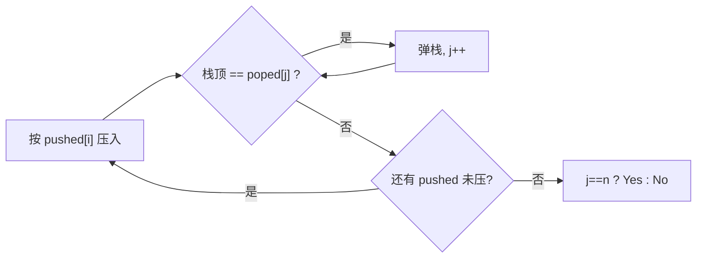

# P4387 【深基15.习9】验证栈序列

> 原题链接：<https://www.luogu.com.cn/problem/P4387>（洛谷训练单 <https://www.luogu.com.cn/training/320175>）
> 题面逐字版：[`problem.txt`](problem.txt)

## 元信息

| 项目 | 内容 |
| --- | --- |
| 难度 | 普及−（贪心 + 栈模拟，难点在"为什么能弹就弹就一定最优"） |
| 来源 | 洛谷 P4387 |
| 标签 | 栈、贪心、模拟、交换论证 |
| 时间复杂度 | $O(n)$ 每组询问（每个元素至多进栈、出栈各一次） |
| 空间复杂度 | $O(n)$ |
| 评测状态 | 本地 `g++ -static -O2 -std=c++14` 编译运行，官方样例输出 `Yes` / `No` 正确；与"DFS 穷举所有压/弹调度"的暴力随机对拍 **30000 组 0 不一致**，另用编译好的 C++ 程序复核 **200 组 0 不一致**；$n=10^5$ 反序压力 2ms；未在洛谷提交 |

## 题目大意

给两个长度为 $n$ 的序列 $pushed$、$poped$，都是 $1 \sim n$ 的**排列**（无重复数字）。入栈顺序被固定成 $pushed$，问：**存不存在**一种压/弹的操作节奏，使得出栈顺序刚好等于 $poped$？存在输出 `Yes`，否则 `No`。

- 输入：第一行询问次数 $q$；每个询问给出 $n$、$pushed$（$n$ 个数）、$poped$（$n$ 个数）。
- 数据范围：$n \le 100000$，$q \le 5$。
- 样例：$pushed=1\,2\,3\,4\,5,\ poped=5\,4\,3\,2\,1 \Rightarrow$ `Yes`；$pushed=1\,2\,3\,4,\ poped=2\,4\,1\,3 \Rightarrow$ `No`。

**一句话人话**：给你固定的入栈次序，再给你一个"期望的出栈次序"，问这个出栈次序做不做得到。

> ⚠️ 两个先入为主的坑：① 入栈序列**不一定是 `1 2 ... n`**，题面是任意排列，得真按 $pushed$ 的顺序模拟；② 出栈能得到的顺序其实**由栈结构强约束**，不是随便排的（比如 `1 2 3` 依次入栈，绝不可能出成 `3 1 2`）。

## 思路推导

### 1. 暴力想法与它的瓶颈

最笨但最可靠的办法：把每一步"到底是压入下一个元素，还是弹出栈顶"都当成一次决策，$2n$ 步里压 $n$ 次、弹 $n$ 次，**枚举所有合法的压/弹操作序列**，逐个模拟，看有没有哪个能刚好弹出 $poped$。合法的操作序列数量是**卡特兰数**级别，约 $\dfrac{4^n}{n^{3/2}}$。$n=10^5$ 时这个数大到无法想象，直接超时爆掉。

所以枚举不可行。但暴力给了我们一个重要视角：**入栈顺序是钉死的，唯一的自由度是"什么时候弹"**。既然只是"何时弹"，那能不能不枚举、直接判断？下面把决策空间压到 1 条路径。

### 2. 关键观察

#### 观察 1：目标 $poped[j]$ 被弹出前，$pushed$ 必须先一直压到它出现

栈是后进先出。要让 $poped$ 的第 $j$ 个元素 $p$ 成为"下一个出栈"的元素，$p$ 出栈的那一刻必须在**栈顶**。这意味着：

1. $p$ 必须已经被压进栈；由于入栈顺序固定为 $pushed$，我们得把 $pushed$ 从头一直压到 $p$ 本身出现为止（$p$ 不在栈里就没法弹它）；
2. $p$ 压进去之后，在弹 $p$ 之前，**不能再往 $p$ 上面压别的还没弹走的元素**，否则 $p$ 就被盖住了。

也就是说：**为了弹出下一个目标 $p$，"压到 $p$ 出现 → 弹 $p$" 是唯一的动作骨架**。剩下能自由决定的，只是"要不要顺手把栈顶连着别的目标也一起弹掉"。

#### 观察 2：能弹就弹（越早弹越不亏）

既然骨架已经定了，我们提出一个贪心策略：**每压入一个新元素后，只要栈顶正好等于当前要弹出的目标 $poped[j]$，就立刻把它弹掉，并连续这么弹下去。**

为什么"立刻弹"不会比"晚点弹"更差？——交换论证。假设某个可行方案里，栈顶已经是当前目标 $p$，但它**偏偏不弹**，先去压 $p$ 上面的元素 $x$。那么：

- $p$ 现在被 $x$ 盖住了，等它重见天日、能弹出时，$x$ 必须先弹；
- 可 $x$ 是**更晚入栈**的元素，$x$ 在 $poped$ 里排在 $p$ **后面**（因为 $p$ 才是当前目标）；
- 于是要让 $x$ 在 $p$ 之前弹出，$poped$ 里 $x$ 得排在 $p$ 之前——矛盾。

所以只要栈顶是当前目标，**把它推迟弹只会挡住后面的目标**，"现在弹"不劣于"以后弹"。反复应用：任何可行方案都能被改造成"能弹就弹"方案，$poped$ 依然被完整弹出。$\blacksquare$（详细形式化见 §4）

> 讲课时点一句：这就是本题贪心的"敢不敢"——直觉上"晚点弹也许更灵活"，但栈的后进先出恰恰让"晚弹"更受限，越早弹越干净。

#### 观察 3：贪心弹不完，就是真的无解

如果按"能弹就弹"跑完所有压入后，$j \ne n$（还有目标没弹出），说明卡在某个目标 $p$ 上：$p$ 要么还没被压入（不可能，因为已经全部压完），要么**已被压入却不在栈顶**——栈顶压着别的东西，而那些东西在 $poped$ 里排在 $p$ 后面，永远不该先弹。由观察 2 的论证，任何推迟策略也救不回来。故贪心失败 ⇔ 不存在任何合法调度 ⇔ `No`。

### 3. 算法设计

指针 $i$ 扫 $pushed$，指针 $j$ 扫 $poped$，栈 $st$（存元素值）：

```
j = 0
for i = 0 .. n-1:
    st.push(pushed[i])                      // 入栈顺序钉死，按 pushed 压
    while st 非空 且 st.top() == poped[j]:  // "能弹就弹"，可连弹多个
        st.pop(); ++j
// 全部压完后
输出 (j == n ? "Yes" : "No")
```

- 循环用的是 `while` 不是 `if`：一次压入后可能**连续弹出多个**（如 $poped=5\,4\,3\,2\,1$，压满 5 之后一路连弹）。
- 判定条件是"$n$ 个目标全弹完了（$j==n$）"，而不是"栈空"。在"是排列"前提下两者等价，但写 $j==n$ 更贴合题面语义、也更好读。

### 4. 正确性说明

要证：贪心输出 `Yes` ⇔ $poped$ 可达。

**（⇐ 充分性）** 若贪心跑完 $j = n$，贪心本身在运行中就记录了每一步"压 / 弹"，构造性地给出了一组合法操作序列，其出栈顺序恰为 $poped[0..n-1]$。所以 $poped$ 可达。

**（⇒ 必要性）用交换论证**：假设存在某个合法调度 $A$ 能弹出 $poped$。我们把 $A$ 逐步改造成贪心调度 $G$，且不破坏"弹出序列仍是 $poped$"：

- 考察 $G$ 与 $A$ 第一次动作不同的时刻。$G$ 总是"栈顶是当前目标就弹"，而 $A$ 在此处选择**不弹、先压**。设该栈顶为目标 $p = poped[j]$，$A$ 偏不弹它、压入 $x = pushed[i]$。由观察 2 的论证，此后 $p$ 被压在 $x$ 之下，要在 $A$ 里弹出 $p$ 必须先弹 $x$，但 $x$ 在 $poped$ 里排在 $p$ 之后，$A$ 无法在 $p$ 之前合法地弹出 $x$ 又保持 $poped$ 不变 —— 与 $A$ 合法矛盾。

  故 $A$ 在该处也必须弹 $p$，即 $A$ 与 $G$ 该步相同，可继续后推。归纳地，$A$ 可完全改造成 $G$，$G$ 同样能弹完 $poped$（$j = n$）。

因此若 $poped$ 可达，$G$ 必判 `Yes`；逆否即"贪心失败 ⇒ 不可达 ⇒ 应判 `No`"。两个方向合起来，$G$ 的结论与真值完全一致。$\blacksquare$

### 5. 复杂度分析

- 时间：$pushed$ 的每个元素**至多入栈一次**、$poped$ 的每个元素**至多经一次弹栈**被匹配；`while` 里弹栈的总次数 $\le n$。故 $O(n)$ 一组，$q \le 5$ 组共 $O(qn) \le 5\times10^5$，$1.00\text{s}$ 绰绰有余。
- 空间：栈 $O(n)$，两个数组 $O(n)$。
- 实现要点：用 `vector<int>` 手写栈（能直接读栈顶、常数小）比 `std::stack`（底层 `deque`）更快，也避免了想偷看栈内部时无从下手。多组询问之间**必须清空栈、重置 $j=0$**。

## 可视化讲解



交互式分步演示见同目录 [`visualization.html`](visualization.html)：左边 $pushed$ 序列（指针 $i$ 高亮），中间竖直栈（栈顶在上、压入时下落），右边 $poped$ 序列（已弹出的变绿划掉、下一个目标 $p$ 高亮），底部代码行高亮 + 变量表 + 讲解文字（"目标 $p$=?，栈顶=? → 相等弹 / 不等继续压"）。`No` 那组会把"挡在目标上面的元素"标红并解释为何任何策略都救不回来。默认载入第 1 组，提供第 2 组（`No`）预设按钮。

## 讲解代码

完整逐段注释版见 [`solution.cpp`](solution.cpp)。核心模拟：

```cpp
vector<int> st; st.reserve(n);
int j = 0;                                   // j：poped 中下一个待弹出的位置
for (int i = 0; i < n; ++i) {
    st.push_back(pushed[i]);                 // 入栈顺序被 pushed 钉死
    while (!st.empty() && j < n && st.back() == poped[j]) {
        st.pop_back(); ++j;                  // 能弹就弹，可连弹多个（while 不是 if）
    }
}
cout << (j == n ? "Yes" : "No") << '\n';     // 判据是"全弹完"，不是"栈空"
```

### 机器实测记录

编译命令（本机两套 MinGW 冲突，必须加 `-static`）：

```bash
cd solutions/ds/p4387-validate-stack-sequences
g++ -static -O2 -std=c++14 solution.cpp -o sol.exe
./sol.exe < in1.txt
```

官方样例（一组输入含两个询问）实际输入输出，逐字节照抄终端：

```
输入：
2
5
1 2 3 4 5
5 4 3 2 1
4
1 2 3 4
2 4 1 3

输出：
Yes
No
```

对拍命令与实测结果：

```bash
node verify.js --exe ./sol.exe
```

```
--- 官方样例 ---
pushed=1,2,3,4,5 poped=5,4,3,2,1 -> 贪心=Yes 暴力=Yes 期望=Yes OK
pushed=1,2,3,4 poped=2,4,1,3 -> 贪心=No 暴力=No 期望=No OK
--- 随机对拍：贪心 vs DFS 暴力 ---
共 30000 组，不一致 0 组
--- 压力：n=1e5 反序，结果=Yes，耗时 2ms
--- C++ 程序 vs 暴力：共 200 组，不一致 0 组
```

> `verify.js` 里的两份 JS 逻辑（贪心模拟、DFS 穷举压/弹调度）**仅用于验证，非讲解代码**；讲解一律用 C++（AGENTS.md §3）。暴力版在 $n \le 7$ 上用 DFS 同时展开"继续压"和"弹出（仅当栈顶==目标）"两个分支、穷举一切调度，与贪心"只走一条最急路径"是独立思路。

## 易错点与坑

1. **入栈序列不一定是 `1 2 ... n`**：本题 $pushed$ 是任意排列。必须按给定的 $pushed[i]$ 顺序模拟，别一上来假设"就是 1..n 顺序压"，否则全错。（对拍里 `pushed=3 1 2, poped=1 2 3` 应为 `Yes`，用"假定有序"就废了。）
2. **多组数据每组清空栈、重置 $j=0$**：$q \le 5$，若复用全局数组/栈不清空，会把上一组的残留带进下一组。
3. **弹出写成 `while` 而不是 `if`**：一次压入后可能连着弹多个。样例 1 的 `5 4 3 2 1` 就是压到顶后一路连弹，写成 `if` 只会弹一层，误判 `No`。
4. **判据是 $j==n$（全弹完），不是"栈空"**：两者在排列前提下等价，但漏弹/多余元素时"栈空"会误判，写 $j==n$ 最贴合语义。
5. **输出严格是 `Yes`/`No`**（首字母大写、无多余空格）：写成 `YES`、`Yes `（带尾空格）可能被判错。
6. **`std::stack` 稍慢且偷看不了内部**：$5\times10^5$ 规模虽够用，但更推荐数组/vector 手写栈，读栈顶方便、常数小。
7. **前提"无重复值"别丢**：本题保证是排列，所以"值唯一确定该弹谁"。若将来遇到含重复值的变式，就得**按位置而非按值**匹配，本贪心的判据要改。

## 常见变式

| 变式 | 差异 | 对应题号 |
| --- | --- | --- |
| 验证栈序列（LeetCode 946） | 与本题同型，入栈序列可为任意数组 | LeetCode 946 |
| 出栈序列方案数 | $pushed=1..n$ 时不同出栈序列数 = 卡特兰数 $\frac{1}{n+1}\binom{2n}{n}$ | 组合计数题 |
| 可栈排序判定 | $pushed=1..n$，$poped$ 合法 ⇔ 不含 132 模式，$O(n^2)$ 查模式 | 本题 $n\le100$ 时的对拍二法 |
| 队列版 | 入队顺序固定、出队也固定，答案唯一 | 基础队列模拟 |

## 小结

> **入栈顺序钉死，唯一自由是"何时弹"——栈顶一旦是当前目标就立刻弹（越早弹越不亏），全部压完后弹不完即 `No`。** 交换论证保证了"能弹就弹"覆盖了所有可行方案。
