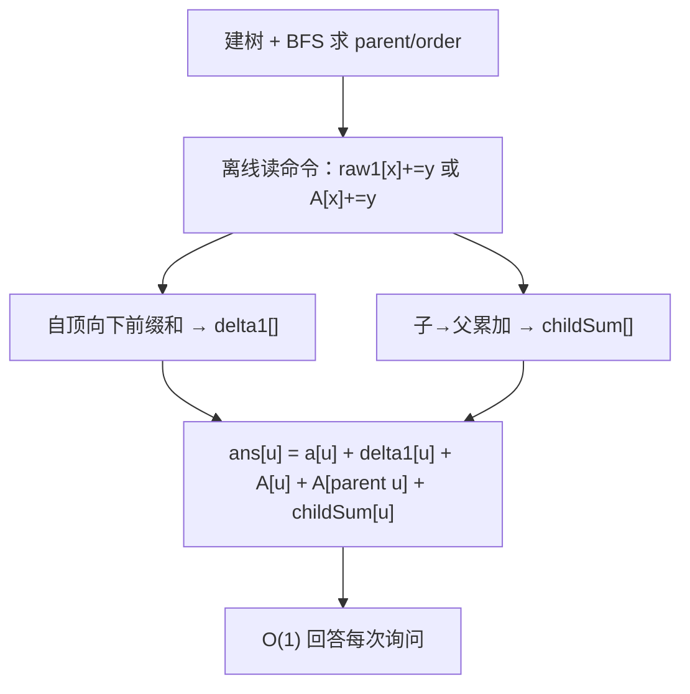

# P11855 [CSP-J 2022 山东] 部署

> 原题链接：<https://www.luogu.com.cn/problem/P11855>
> 本目录导航：[← 题库索引](../../../README.md) ｜ [讲解代码](solution.cpp) · [元信息](metadata.yml) · [对拍脚本](verify.js)

## 元信息

| 项目 | 内容 |
| --- | --- |
| 难度 | 普及+/提高-（洛谷 difficulty=4） |
| 来源 | 洛谷 P11855，CSP-J 2022 山东补赛 |
| 标签 | 树、**离线差分**、前缀和、链式前向星、迭代 BFS |
| 数据范围 | 30%：$n,m\le10^3$；60%：$n,m,q\le10^5$；100%：$1\le n,m,q\le10^6$，$1\le a_i\le10^9$，$1\le x\le n$，$\mathbf{1\le y\le10}$；另有 10% 链、10% 只有操作 1、10% 只有操作 2 |
| 时间 / 空间 | $O(n+m+q)$ / $O(n)$ |
| 时限 / 内存 | 2000 ms / 洛谷默认 |
| 评测状态 | 未本地评测（洛谷提交需登录）；本地 `g++ -static -O2 -std=c++14` 编译，样例 1 输出 `6,7,9,9`、样例 2 输出 `2,2` 逐字一致；与「逐操作暴力」独立实现随机对拍 500 组 0 不一致，编译后 `solution.exe` 另跑 60 组 0 不一致；满约束（$n=m=q=10^6$）随机树 842 ms、深链 543 ms、菊花 556 ms |

## 题目大意

给定一棵以 $1$ 号城市为根的树，每个点有初始兵力 $a_i$。做 $m$ 次操作，两种：

- `1 x y`：给 **$x$ 及其整棵子树** 的所有城市 $+y$；
- `2 x y`：给 **$x$、$x$ 的父亲、$x$ 的所有儿子** $+y$（即 $x$ 的"邻域"）。

所有操作完成后，回答 $q$ 次单点询问：某城市最终的兵力。

- 输入：$n$ / $a_{1\sim n}$ / $n-1$ 条边 / $m$ / $m$ 条命令 / $q$ / $q$ 个询问编号。
- 输出：每次询问一行一个整数。
- 样例 1：树 `1-2, 1-3, 2-4, 3-5`，命令 `1 1 2 / 2 2 3 / 1 3 3 / 2 5 1`，询问 1,2,3,4 ⇒ `6,7,9,9`。

> 与 [P1352 没有上司的舞会](../../dp/p1352-prom-without-boss/README.md) 同属"树上父子关系"家族，但那道是**树形 DP**、这道是**离线差分**。两者都是"树的结构 + 一次遍历"，对照讲能让学生看清"结构相同、套路不同"。

## 思路推导

### 1. 暴力想法与它的瓶颈

最直白的做法：**每来一条命令，就真的把所有该加的点加一遍。**

- 操作 1：从 $x$ 出发 DFS 扫整棵子树，$O(\text{子树大小})$；
- 操作 2：$O(\deg x)$，看着很快。

单看操作 2 确实快（菊花图里根只有 1 个父亲、很多儿子，也就 $O(n)$ 一次）。**但操作 1 会死**：$10^6$ 次操作，每次都 DFS 一遍子树，若数据是"全在一棵 $10^6$ 的链上、每次都操作根"，总代价 $10^6\times10^6=10^{12}$，直接超时。

瓶颈在哪？**我们把"加 $y$"这个动作当成了必须当场执行的事。** 但题目是"全部操作做完，才问 $q$ 个点"——没有任何中间询问。所以完全可以**先只记录，最后一次性算账**。

### 2. 关键观察

#### 观察 1：把"操作"翻译成"覆盖关系"，问题就变成数贡献

因为操作互不影响、最后才问，每个点的答案可以写成

$$\text{ans}[u] = a_u + \sum_{\text{操作 }o} [\,o \text{ 覆盖了 } u\,]\cdot y_o.$$

于是"做加法"变成"数一数每个点被哪些操作覆盖过"。两种操作分别给出一种**简单的覆盖判定**：

#### 观察 2：操作 1 的覆盖关系是"祖先"

操作 $1(x,y)$ 覆盖 $u$ $\iff$ $u$ 在 $x$ 的子树里 $\iff$ **$x$ 是 $u$ 的祖先（含 $u$ 自己）**。

这就把"子树加"翻面成了"点到根的路径统计"：在 $x$ 上打一个标记 `raw1[x] += y`，点 $u$ 的增益就是**根到 $u$ 路径上所有 `raw1` 之和**。一次自顶向下的前缀和即可，$O(n)$。

> 这是本题最重要的一步翻面。本来"一棵子树"是 $O(\text{子树大小})$，翻成"一条路径"后，配合"父亲在前"的遍历序，就变成了 $O(1)$ 的递推 `delta1[u] = raw1[u] + delta1[parent(u)]`。

#### 观察 3：操作 2 的覆盖关系只有三种

操作 $2(x,y)$ 覆盖 $u$ $\iff$ 三者之一：

| 情况 | 含义 | 对 $u$ 的贡献怎么算 |
| --- | --- | --- |
| $u=x$ | $u$ 就是被操作的中心 | $A[u]$ |
| $u=\text{parent}(x)$ | $x$ 是 $u$ 的**儿子**，父亲被"顺带"加了 | $\sum_{c \text{ 是 } u \text{ 的儿子}} A[c]$ |
| $x=\text{parent}(u)$ | $u$ 是 $x$ 的**儿子** | $A[\text{parent}(u)]$ |

其中 $A[x] := \sum_{\text{以 } x \text{ 为中心的操作 }2} y$。

也就是说，先按"中心点"把所有操作 2 归并成 $A[\cdot]$（只有 $O(n)$ 个桶），再写

$$\text{op2}[u] = A[u] \;+\; A[\text{parent}(u)] \;+\; \underbrace{\sum_{c\,\text{儿子}} A[c]}_{\text{记作 childSum}[u]}.$$

第一项直接查表，第二项查一次父亲，第三项用一次"子 → 父"累加预处理（`childSum[parent(v)] += A[v]`）。

### 3. 算法设计

```
读入 n、a[1..n]、n-1 条无向边 → 链式前向星建图
BFS(1) 求 parent[ ] 和 order[ ]（父亲一定排在儿子前面）

读入 m 条命令，不真正加：
    op == 1 → raw1[x] += y
    op == 2 → A[x]    += y

# 操作 1 的贡献：自顶向下前缀和
for u in order[ ]:
    delta1[u] = raw1[u] + (parent[u] ? delta1[parent[u]] : 0)

# 操作 2 的第三项：子 → 父 累加
for v = 1..n:
    if parent[v]: childSum[parent[v]] += A[v]

# 回答
for 每个询问 u:
    输出 a[u] + delta1[u] + A[u] + A[parent[u]] + childSum[u]
```



### 4. 正确性说明

**引理 1（操作 1 的贡献公式）**：操作 $1(x,y)$ 覆盖 $u$ $\iff$ $x$ 是 $u$ 的祖先（含 $u$ 自身）。

*证明*：$x$ 的子树 = $\{x\}\cup\{x$ 的所有后代$\}$。$u$ 属于该集合 $\iff$ $u=x$ 或 $x$ 是 $u$ 的真祖先。$\blacksquare$

**推论 1**：点 $u$ 从全部操作 1 获得的增益 $=\sum_{w\in\text{anc}(u)\cup\{u\}} \text{raw1}[w]=\text{delta1}[u]$，其中 `delta1` 的递推 `delta1[u] = raw1[u] + delta1[parent(u)]` 恰好把"根到 $u$ 路径"逐层累起来。$\blacksquare$

**引理 2（操作 2 的三项分解）**：操作 $2(x,y)$ 覆盖 $u$ $\iff$ $u\in\{x,\ \text{parent}(x)\}\cup\text{children}(x)$。

*证明*：题面定义邻域 = "与 $x$ 直接相连（含父结点和子结点）的城市"，再加上 $x$ 自己。$\blacksquare$

**定理（分解式的完备性与互不遗漏）**：对任意点 $u$，

$$\text{op2}[u]=A[u]+A[\text{parent}(u)]+\sum_{c\in\text{children}(u)}A[c].$$

*证明*：对每条操作 $2(x,y)$ 按 $u$ 与 $x$ 的关系把它的 $y$ 分派到上式唯一的一项：

- $u=x$ ⇒ 计入第一项 $A[u]$；
- $x=\text{parent}(u)$（$u$ 是 $x$ 的儿子）⇒ 计入第二项 $A[\text{parent}(u)]$；
- $u=\text{parent}(x)$（$x$ 是 $u$ 的儿子）⇒ 计入第三项，$x$ 落在求和下标 $c$ 的集合里。

三种关系**互斥且穷尽**（$u$ 与 $x$ 在树上只可能是：同一点、父子、其他），所以每条操作恰好被计一次。反向（右侧每一项都对应一条真实覆盖 $u$ 的操作）由引理 2 立即得到。$\blacksquare$

**定理（主结论）**：$$\text{ans}[u]=a_u+\text{delta1}[u]+\text{op2}[u]$$
覆盖了所有操作，无重复无遗漏。$\blacksquare$

### 5. 复杂度分析

- 时间：建图 $O(n)$，BFS $O(n)$，读命令 $O(m)$，两个预处理各 $O(n)$，回答 $O(q)$ ⇒ 总计 $O(n+m+q)\approx3\times10^6$。本机满约束实测 < 1 s。
- 空间：$O(n)$。链式前向星存 $2(n-1)$ 条弧。
- **数值**：$a_i\le10^9$，`delta1` / `childSum` 在链或菊花上可叠到 $10^{13}$ 量级 ⇒ 一律 `long long`。而 `raw1` / `A` 单个 $\le10^6\times10=10^7$，`int` 即可。

## 板书演示

样例 1：树 `1-2, 1-3, 2-4, 3-5`（根 1），$a=(1,2,3,4,5)$。命令：`1 1 2`、`2 2 3`、`1 3 3`、`2 5 1`。

先归并两个桶：

| 桶 | 内容 |
| --- | --- |
| `raw1`（操作 1 的中心） | `raw1[1]=2`，`raw1[3]=3` |
| `A`（操作 2 的中心） | `A[2]=3`，`A[5]=1` |

`delta1`（根→点前缀和）：

| $u$ | 1 | 2 | 3 | 4 | 5 |
| --- | --- | --- | --- | --- | --- |
| `raw1[u]` | 2 | 0 | 3 | 0 | 0 |
| `delta1[u]` | **2** | **2** | **5** | **2** | **5** |

`childSum`（每个点所有儿子的 $A$ 之和）：`childSum[1]=A[2]+A[3]=3`，`childSum[2]=A[4]=0`，`childSum[3]=A[5]=1`，其余 0。

最终逐点：

| $u$ | $a_u$ | `delta1` | `A[u]` | `A[parent]` | `childSum` | 答案 |
| --- | --- | --- | --- | --- | --- | --- |
| 1 | 1 | 2 | 0 | 0（无父） | 3 | **6** ✅ |
| 2 | 2 | 2 | 3 | `A[1]`=0 | 0 | **7** ✅ |
| 3 | 3 | 5 | 0 | `A[1]`=0 | 1 | **9** ✅ |
| 4 | 4 | 2 | 0 | `A[2]`=3 | 0 | **9** ✅ |
| 5 | 5 | 5 | 1 | `A[3]`=0 | 0 | **11**（未询问） |

与官方输出 `6,7,9,9` 完全一致。

课堂上值得停下来问的三个点：

1. **为什么"加 $y$ 到 $x$"最后变成了"点 $u$ 沿根路径求和"？** 因为"子树"和"点到根的路径"是一对**对偶**概念：$u$ 在 $x$ 的子树里 $\iff$ $x$ 在 $u$ 到根的路径上。把操作打在 $x$ 上，答案从 $u$ 往根读——这是树上差分的思想内核。
2. **操作 2 为什么正好拆成三项？** 画一棵三层树，让一个学生上台把 $x$ 的邻域圈出来，再问"哪些点会把 $u$ 当成它们的父亲"。$u$ 只能以"中心 / 中心的父亲 / 中心的儿子"三种身份被覆盖——穷尽了父子关系的全部可能。
3. **$y\le10$ 这个限制用到了吗？** 没有直接用，但它在暗示"每次加的量很小、但次数极多"，所以不能靠累加值的大小做文章，只能靠**结构**（谁覆盖谁）做文章——这正是本题走向离线差分的理由。

## 讲解代码

`solution.cpp`，按 `g++ -static -O2 -std=c++14` 编译：

```cpp
/* 读命令：不真正做加法，只把贡献记进两个桶 */
if (op == 1) raw1[x] += y;   // 子树加 —— 记在子树的根上
else         A[x]    += y;   // 邻域加 —— 记在中心点上

/* 操作 1 的贡献：自顶向下前缀和 */
for (int i = 0; i < n; ++i) {
    int u = order_[i];
    delta1[u] = raw1[u] + (parent_[u] ? delta1[parent_[u]] : 0LL);
}

/* 操作 2 的第三项：把每个点的 A 累加给它父亲 */
for (int v = 1; v <= n; ++v)
    if (parent_[v]) childSum[parent_[v]] += A[v];

/* 回答 */
ll ans = a[u]
       + delta1[u]                              // 操作 1：u 在 x 的子树里
       + (ll)A[u]                               // 操作 2：u 就是中心 x
       + (parent_[u] ? (ll)A[parent_[u]] : 0LL) // 操作 2：u 是中心的父亲
       + childSum[u];                           // 操作 2：u 是中心的儿子
```

三处实现细节值得单独讲：

- **迭代 BFS 而不是递归 DFS**：$n$ 到 $10^6$，数据可能是一条 $10^6$ 深的链，递归 DFS 会爆栈。BFS 天然给出"父亲在前"的序，正好给前缀和用。
- **链式前向星而不是 `vector<vector<int>>`**：$10^6$ 个 `vector` 对象本身就有不小的开销，前向星只用两个定长数组。
- **手写 `fread` / `fwrite` 快读快写**：$10^6$ 级别的输入，`cin`（即使关同步）和 `scanf` 都容易被卡常数。

## 本机实测记录

```bash
$ g++ -static -O2 -std=c++14 solution.cpp -o solution.exe     # 通过
$ printf '5\n1 2 3 4 5\n1 2\n1 3\n2 4\n3 5\n4\n1 1 2\n2 2 3\n1 3 3\n2 5 1\n4\n1\n2\n3\n4\n' | ./solution.exe
6 7 9 9
$ printf '4\n1 1 1 1\n1 2\n1 3\n1 4\n1\n1 1 1\n2\n1\n2\n' | ./solution.exe
2 2
$ node verify.js --rounds=500
定点用例 7 组，失败 0 组
随机对拍 500 组：正解 vs 独立暴力  不一致 0 组
错版量化 500 组：「操作2 漏掉父亲项」与正解  不一致 418 组
```

| 项目 | 实测 |
| --- | --- |
| 编译 | `g++ -static -O2 -std=c++14 solution.cpp` 通过 |
| 官方样例 | 样例 1 ⇒ `6,7,9,9`；样例 2 ⇒ `2,2`，逐字一致 |
| 对拍（JS 双实现） | 与"逐操作暴力改值"独立实现随机对拍 **500 组 0 不一致** |
| 对拍（真实 exe） | 编译后 `solution.exe` 对 JS 生成的 60 组用例 **0 不一致** |
| 错版量级 | 500 组里 **418 组**「操作 2 漏掉父亲项」的结果与正解不同（系统性偏小） |
| 满约束·随机树 | $n=m=q=10^6$ ⇒ **842 ms**，输出 100 万行 |
| 满约束·深链（1e6 深） | **543 ms**，未爆栈，点 1 = `1000000020`（手算一致） |
| 满约束·菊花 | **556 ms**，根 1 = `1010000000`（= $10^9$ + `childSum` $10^7$ 量级，手算一致） |

## 易错点与坑

1. **操作 2 漏掉"父亲"那一项**：最容易犯的错。写代码时"$u=x$ 加自己、$u$ 是 $x$ 的儿子加儿子"很顺，但"$x$ 的父亲也被加"很容易忘。本机 500 组随机数据里 **418 组**能抓到这个错，且错版结果系统性**偏小**。样例 1 恰好包含 `2 2 3`（$x=2$ 有父亲 1），能抓住一部分。
2. **`delta1` / `childSum` 用 `int`**：链上 `delta1` 可达 $10^6\times10^7=10^{13}$，菊花上 `childSum[1]` 可达 $10^7\times10^6=10^{13}$，`int` 直接溢出。本机菊花满约束实测根的值 `1010000000` 已贴近 `int` 上限（$2.1\times10^9$），再加一个数量级就回绕。
3. **递归 DFS 求父亲**：$n=10^6$ 的链，递归深度 $10^6$，本机（默认 8 MB 栈）直接段错误。**必须迭代 BFS/栈**。本机实测深链 543 ms 正常通过。
4. **忘记"操作 1 也加 $x$ 自己"**：题面写的是"$x$ **和**以它为根的子树"，$x$ 自己也算。漏掉就少一次 `delta1[x]` 的基础项。
5. **操作 2 的 $x$ 没有父亲时（$x=1$）访问 `parent[x]`**：$1$ 号是根，`parent[1]=0`，需要特判跳过，否则数组越界。代码里统一写 `parent_[u] ? ... : 0`。
6. **快读吃掉 EOF**：$1$ 号点 `parent=0`，快读里 `gc()` 返回 0 要做保护，否则第一行读不到数字会死循环。实现里 `while (c && (c<'0'||c>'9'))` 已经挡住。

## 常见变式

| 变式 | 差异 | 对应题号 |
| --- | --- | --- |
| **子树加 + 子树求和**（不是单点问） | 差分后还要再求一次子树和 | [P3178 树上操作](https://www.luogu.com.cn/problem/P3178) |
| 边权版：给路径加、问单点 | 差分打在两个端点 + LCA 上 | [P3258 松鼠的新家](https://www.luogu.com.cn/problem/P3258) |
| 点权版：给路径加、问单点 | $d_u{+}{+}, d_v{+}{+}, d_{\text{lca}}{-}{-}, d_{\text{parent(lca)}}{-}{-}$ | [P3128 Max Flow](https://www.luogu.com.cn/problem/P3128) |
| **邻域加**换成"$k$ 层邻域" | 需要按深度分层，前向星不够用了 | 树上启发式合并 / 长链剖分 |
| 边带权 + 多次子树加后问子树和 | 差分 + 树状数组 | [P3368 树状数组 2](https://www.luogu.com.cn/problem/P3368) 的树上版 |
| 树形 DP 视角（父子关系反过来用） | 同一棵树，套路完全不同 | [P1352 没有上司的舞会](../../dp/p1352-prom-without-boss/README.md) |

## 一句话提炼

**"子树"和"点到根的路径"是树上的一对对偶结构**——把操作打在子树的根上，答案沿路径往根读，$O(n)$ 一趟前缀和就能把 $m$ 次"子树加"全部消化；而"邻域"这类范围，先按"中心点"归并成桶，再拆成"自己 / 父亲 / 儿子"三种身份分别结算，就只剩 $O(1)$ 查表。
