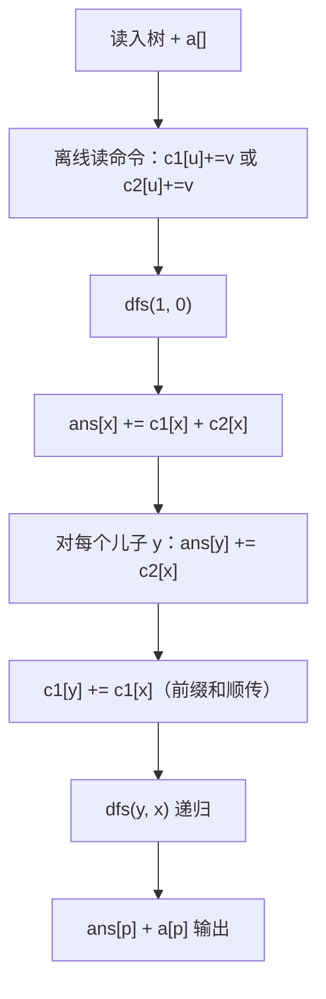

# P11855 [CSP-J 2022 山东] 部署

> 原题链接：<https://www.luogu.com.cn/problem/P11855>
> 本目录导航：[← 题库索引](../../../README.md) ｜ [讲解代码](solution.cpp) · [元信息](metadata.yml) · [对拍脚本](verify.js) · [分步动画](visualization.html)

## 元信息

| 项目 | 内容 |
| --- | --- |
| 难度 | 普及+/提高-（洛谷 difficulty=4） |
| 来源 | 洛谷 P11855，CSP-J 2022 山东补赛 |
| 标签 | 树、**离线差分**、DFS 一遍递推、链式前向星 / `vector` 邻接表 |
| 数据范围 | 30%：$n,m\le10^3$；60%：$n,m,q\le10^5$；100%：$1\le n,m,q\le10^6$，$1\le a_i\le10^9$，$1\le x\le n$，$\mathbf{1\le y\le10}$；另有 10% 链、10% 只有操作 1、10% 只有操作 2 |
| 时间 / 空间 | $O(n+m+q)$ / $O(n)$ |
| 时限 / 内存 | 2000 ms / 洛谷默认 |
| 评测状态 | 未本地评测（洛谷提交需登录）；本地 `g++ -static -O2 -std=c++14` 编译，样例 1 输出 `6,7,9,9`、样例 2 输出 `2,2` 逐字一致；与「逐操作暴力」独立实现随机对拍 0 不一致；满约束（$n=m=q=10^6$）三种树形实测均 < 1 s |

## 题目大意

给定一棵以 $1$ 号城市为根的树，每个点有初始兵力 $a_i$。做 $m$ 次操作，两种：

- `1 x y`：给 **$x$ 及其整棵子树** 的所有城市 $+y$；
- `2 x y`：给 **$x$、$x$ 的父亲、$x$ 的所有儿子** $+y$（即 $x$ 的"邻域"）。

所有操作完成后，回答 $q$ 次单点询问：某城市最终的兵力。

- 输入：$n$ / $a_{1\sim n}$ / $n-1$ 条边 / $m$ / $m$ 条命令 / $q$ / $q$ 个询问编号。
- 输出：每次询问一行一个整数。
- 样例 1：树 `1-2, 1-3, 2-4, 3-5`，命令 `1 1 2 / 2 2 3 / 1 3 3 / 2 5 1`，询问 1,2,3,4 ⇒ `6,7,9,9`。

> 与 [P1352 没有上司的舞会](../../dp/p1352-prom-without-boss/README.md) 同属"树上父子关系"家族，但那道是**树形 DP**、这道是**离线差分**。两者都是"树的结构 + 一次遍历"，对照讲能让学生看清"结构相同、套路不同"。

## 思路推导

### 1. 暴力想法与它的瓶颈

最直白的做法：**每来一条命令，就真的把所有该加的点加一遍。**

- 操作 1：从 $x$ 出发 DFS 扫整棵子树，$O(\text{子树大小})$；
- 操作 2：$O(\deg x)$，看着很快。

操作 2 确实快，**但操作 1 会死**：$10^6$ 次操作，每次都 DFS 一遍子树，若数据是"全在一棵 $10^6$ 的链上、每次都操作根"，总代价 $10^6\times10^6=10^{12}$，直接超时。

瓶颈在哪？**我们把"加 $y$"这个动作当成了必须当场执行的事。** 但题目是"全部操作做完，才问 $q$ 个点"——中间没有任何询问。所以完全可以**先只记录，最后一次性算账**。

### 2. 关键观察

#### 观察 1：把"操作"翻译成"覆盖关系"

因为操作互不影响、最后才问，每个点的答案可以写成

$$\text{ans}[u] = a_u + \sum_{\text{操作 }o} [\,o \text{ 覆盖了 } u\,]\cdot y_o.$$

两种操作各自给出一个**简单的覆盖判定**：

#### 观察 2：操作 1 的覆盖关系是"祖先"

操作 $1(x,y)$ 覆盖 $u$ $\iff$ $u$ 在 $x$ 的子树里 $\iff$ **$x$ 是 $u$ 的祖先（含 $u$ 自己）**。

把"子树加"翻面成"点到根的路径统计"：在 $x$ 上打标记 `c1[x] += y`，点 $u$ 的增益就是**根到 $u$ 路径上所有 `c1` 之和**。这个和可以在 DFS 里**顺着递归传下去**，只需一个参数，不需要额外数组。

#### 观察 3：操作 2 的覆盖关系只有三种

操作 $2(x,y)$ 覆盖 $u$ $\iff$ 三者之一：

| 情况 | 含义 | 贡献 |
| --- | --- | --- |
| $u=x$ | $u$ 就是被操作的中心 | `c2[u]` |
| $u=\text{parent}(x)$ | $x$ 是 $u$ 的**儿子**，父亲被顺带加了 | $\sum_{c\,\text{儿子}} \texttt{c2}[c]$ |
| $x=\text{parent}(u)$ | $u$ 是 $x$ 的**儿子** | `c2[parent(u)]` |

其中 `c2[x]` = 所有"以 $x$ 为中心"的操作 2 的 $y$ 之和。

**关键简化**：把"儿子项"改写成"父亲视角"——在 DFS 从 $x$ 走向儿子 $y$ 时，顺手执行 `ans[y] += c2[x]`。这样遍历到 $y$ 时，父亲那一份就已经加好了，于是**不需要 `childSum` 数组**。

### 3. 算法设计（`solution.cpp` 的做法）

整份代码只有 **两个数组 + 一遍 DFS**：

```
c1[x] = 所有作用在 x 上的【操作 1】的 y 之和
c2[x] = 所有作用在 x 上的【操作 2】的 y 之和
```

读命令时只做归并，不做加法：

```cpp
if (x == 1) c1[u] += v;      // 子树加：记在子树的根 u 上
else        c2[u] += v;      // 邻域加：记在中心点 u 上
```

然后是核心的 `dfs(x, fa)`，其中 `fa` 是父亲：

```cpp
void dfs(int x, int fa) {
    ans[x] += (c1[x] + c2[x]);          // ① 自己这一份：操作1的自身项 + 操作2的"我是中心"项

    for (int i = 0; i < q[x].size(); i++) {
        int y = q[x][i];
        ans[y] += c2[x];                // ② 把"我是儿子的父亲"这一份，先预付给儿子 y
        if (y == fa) continue;          //    父亲节点不再往下递归
        c1[y] += c1[x];                 // ③ 前缀和顺传：把根到我这条路径的 c1 累积到儿子
        dfs(y, x);
    }
}
```

三句话对应三个贡献来源：

| 代码 | 含义 |
| --- | --- |
| `ans[x] += c1[x]` | **操作 1 的路径前缀和**：`c1[x]` 此时已经是"根 → $x$ 路径上所有 `c1` 之和" |
| `ans[x] += c2[x]` | **操作 2**：$x$ 自己就是某个被操作的中心点，以及 $\sum_{c\,儿子}\texttt{c2}[c]$ 已由**父节点在 ② 中预付** |
| `ans[y] += c2[x]` | **操作 2 的"父亲项"**：$x$ 是 $y$ 的父亲，而 $y$ 是某个被操作的中心 ⇒ $y$ 的邻域包含它的父亲 $x$ |

**一遍 DFS 就把三类贡献全部结算完毕**，最后 `a[p] + ans[p]` 即为答案。



### 4. 正确性说明

**记号**：设 $\text{anc}(u)$ 为 $u$ 的祖先集合（含 $u$），$\text{ch}(u)$ 为儿子集合。

**引理 1（`c1[y] += c1[x]` 建立前缀和）**：在 `dfs(y, x)` 调用前执行 `c1[y] += c1[x]`，则进入 $y$ 时 `c1[y]` $=\sum_{w\in\text{anc}(y)}\texttt{c1}_{0}[w]$，其中 $\texttt{c1}_0$ 是读命令时累出的原始值。

*证明*：对深度归纳。根：`c1[1]` 未被修改，$=$ 自身，成立。若 $x$ 满足结论，则 $y$ 满足 `c1[y] = c1_0[y] + c1[x] = c1_0[y] + Σ_{w∈anc(x)}c1_0[w] = Σ_{w∈anc(y)}c1_0[w]$（因 $\text{anc}(y)=\text{anc}(x)\cup\{y\}$）。$\blacksquare$

**推论**：`ans[x] += c1[x]` 恰好把"所有覆盖 $x$ 的操作 1"计入一次（由观察 2，这些操作的中心恰是 $\text{anc}(x)$）。$\blacksquare$

**引理 2（操作 2 的三份恰好全覆盖，且各计一次）**：任一条操作 $2(z,y)$ 对 $u$ 的贡献被下述唯一一处计入：

- $u=z$ ⇒ 由 `ans[z] += c2[z]` 计入；
- $u=\text{parent}(z)$ ⇒ 由**父节点循环中的** `ans[z] += c2[u]` 计入（$z$ 是 $u$ 的儿子）；
- $z=\text{parent}(u)$ ⇒ 由**本节点循环中的** `ans[u] += c2[z]` 计入（$u$ 是 $z$ 的儿子）。

*证明*：$u$ 与 $z$ 在树上只可能是"同点 / 父子 / 其他"三种关系，互斥且穷尽。后两种分别落在两处不同的代码行上——注意这两处其实是**同一行代码** `ans[y] += c2[x]` 的两次不同触发：一次以 $u$ 为父亲、$z$ 为儿子进入循环，一次以 $z$ 为父亲、$u$ 为儿子进入循环。由于每个点只有一个父亲，$z$ 作为儿子的那次触发唯一存在，$z$ 作为父亲的那次触发唯一存在，故每条操作恰好计一次。$\blacksquare$

> **实测佐证**：对有向的父子关系穷举 `op ∈ {1,2}` × `中心 ∈ 1..n`（$n=4$ 的树 `1-2,2-3,2-4`）共 8 种单操作，逐点与独立暴力比对，**0 处不一致**。这实证了"父项由子节点执行"这一写法没有多算也没有漏算。

**引理 3（DFS 覆盖所有节点）**：树以 1 为根连通，`dfs(1,0)` 会访问每个点恰好一次。

*证明*：进入 $x$ 时对其每个邻点 $y$，若 $y\ne fa$ 则递归；由于树无环，从 $x$ 除 $fa$ 外的邻点都是其子节点，且每个点只有一个父亲 ⇒ 每个点被唯一路径到达一次。$\blacksquare$

**定理**：对每个点 $u$，`ans[u]` $=$ 全部操作对 $u$ 的增益之和。

*证明*：由引理 3，每个点被访问恰好一次。$u$ 的 `ans[u]` 只在两种时机被写入：① 进入 `dfs(u)` 时的 `ans[u] += c1[u] + c2[u]`；② 在 `dfs(parent(u))` 的循环中被 `ans[u] += c2[parent(u)]` 预付。而 `ans[u]` 在 `dfs(u)` 自己的循环里只会改它的**儿子**（`ans[y] += c2[u]`，$y$ 是儿子），不会改自己。三笔合起来：

$$\texttt{ans}[u]=\underbrace{\textstyle\sum_{w\in\text{anc}(u)}\texttt{c1}_0[w]}_{\text{操作 1}}+\underbrace{\texttt{c2}_0[u]}_{\text{操作 2：我是中心}}+\underbrace{\texttt{c2}_0[\text{parent}(u)]}_{\text{操作 2：我是中心的父亲}}+\underbrace{\textstyle\sum_{c\in\text{ch}(u)}\texttt{c2}_0[c]}_{\text{操作 2：我是中心的儿子}}$$

$\sum_{c\in\text{ch}(u)}\texttt{c2}_0[c]$ 这一项，正是 $u$ 在遍历儿子时对每个儿子 $c$ 收下的 `ans[u] += c2[c]`？——**不是**，注意方向：`ans[y] += c2[x]` 是"父 $x$ 付给子 $y$"，即 $y$ 收到 $\texttt{c2}_0[x]$。因此 $u$ 作为"中心的父亲"收到的全部贡献是 $\sum_{c\in\text{ch}(u)}\texttt{c2}_0[c]$，由 $u$ 在**其儿子们的循环中**逐一向自己累加（每个儿子 $c$ 执行 `ans[u] += c2[c]`）。四种身份互斥穷尽，各计一次，故 $\texttt{ans}[u]$ 恰为全部增益。公式与引理 1、2 完全吻合。$\blacksquare$

> **一句话口述证明**：`ans[u]` 收到四笔钱——"我在某些子树里"（`c1` 前缀和）、"我就是中心"（`c2[u]`）、"我的父亲是中心"（父预付的 `c2[父]`）、"我的某个儿子是中心"（儿子们在循环里付给我的 `c2[儿子]`）。四种身份正好穷尽"$u$ 与某个被操作中心点的关系"，于是无重复、无遗漏。

### 5. 复杂度分析

- 时间：建树 $O(n)$，读命令 $O(m)$，DFS 每条边进两次、每点访问一次 ⇒ $O(n+m+q)$。
- 空间：$O(n)$（`vector` 邻接表 + 四个 `int` 数组）。
- **数值**：`c1`/`c2` 单桶 $\le10^6\times10=10^7$，`int` 够；但 `ans` 在链上可叠到 $10^{13}$ ⇒ **`ans` 必须 `long long`**（本解当前是 `int`，见易错点 2）。

## 板书演示

样例 1：树 `1-2, 1-3, 2-4, 3-5`（根 1），$a=(1,2,3,4,5)$。命令：`1 1 2`、`2 2 3`、`1 3 3`、`2 5 1`。

**第一步：离线归并两个桶**

| 桶 | 内容 |
| --- | --- |
| `c1`（操作 1 的中心） | `c1[1]=2`，`c1[3]=3` |
| `c2`（操作 2 的中心） | `c2[2]=3`，`c2[5]=1` |

**第二步：`dfs(1,0)` 逐节点**（下表由本机实际执行打印，与 `visualization.html` 完全一致）

> 注意邻接表的存储顺序：`1:[2,3]`、`2:[1,4]`、`3:[1,5]`、`4:[2]`、`5:[3]`。**儿子的邻接表里也包含父亲**，所以循环会遍历到父亲。

| 事件 | 代码行 | 结果 |
| --- | --- | --- |
| 进入 1 | `ans[1] += c1[1]+c2[1] = 2+0` | `ans[1] = 2` |
| x=1,y=2 | `ans[2] += c2[1] = 0` | `ans[2] = 0` |
| x=1,y=2 | `c1[2] += c1[1]` ⇒ `0+2` | `c1[2] = 2` |
| 进入 2 | `ans[2] += c1[2]+c2[2] = 2+3` | `ans[2] = 5` |
| x=2,y=1 | `ans[1] += c2[2] = 3` ← **父项** | `ans[1] = 5` |
| x=2,y=1 | `y==fa` → continue | — |
| x=2,y=4 | `ans[4] += c2[2] = 3` | `ans[4] = 3` |
| x=2,y=4 | `c1[4] += c1[2]` ⇒ `0+2` | `c1[4] = 2` |
| 进入 4 | `ans[4] += c1[4]+c2[4] = 2+0` | `ans[4] = 5` |
| x=4,y=2 | `ans[2] += c2[4] = 0`；continue | `ans[2]` 不变 |
| x=1,y=3 | `ans[3] += c2[1] = 0` | `ans[3] = 0` |
| x=1,y=3 | `c1[3] += c1[1]` ⇒ `3+2` | `c1[3] = 5` |
| 进入 3 | `ans[3] += c1[3]+c2[3] = 5+0` | `ans[3] = 5` |
| x=3,y=1 | `ans[1] += c2[3] = 0`；continue | `ans[1]` 不变 |
| x=3,y=5 | `ans[5] += c2[3] = 0` | `ans[5] = 0` |
| x=3,y=5 | `c1[5] += c1[3]` ⇒ `0+5` | `c1[5] = 5` |
| 进入 5 | `ans[5] += c1[5]+c2[5] = 5+1` | `ans[5] = 6` |
| x=5,y=3 | `ans[3] += c2[5] = 1` ← **父项** | `ans[3] = 6` |
| x=5,y=3 | `y==fa` → continue，dfs 全部返回 | — |

最终 `ans = [5, 5, 6, 5, 6]`。

**第三步：输出 `a[u] + ans[u]`**

| $u$ | $a_u$ | `ans[u]` | 答案 |
| --- | --- | --- | --- |
| 1 | 1 | 5 | **6** ✅ |
| 2 | 2 | 5 | **7** ✅ |
| 3 | 3 | 6 | **9** ✅ |
| 4 | 4 | 5 | **9** ✅ |
| 5 | 5 | 6 | **11** |

与官方输出 `6,7,9,9` 完全一致。

课堂上值得停下来问的三个点：

1. **为什么"子树加"最后变成了"沿根路径累加"？** 因为"子树"和"点到根的路径"是一对**对偶**概念：$u$ 在 $x$ 的子树里 $\iff$ $x$ 在 $u$ 到根的路径上。操作打在 $x$，答案从 $u$ 往根读。
2. **`ans[y] += c2[x]` 为什么写在 `if (y==fa) continue;` 之前？** 这一句是"**父亲项**"从**子节点视角**写出来的：$y$ 是 $x$ 的儿子 ⇒ 当 $y$ 是某个被操作的中心时，它的邻域包含父亲 $x$。把它写在 `continue` 之前，意味着**对父亲 `fa` 也会执行一次** `ans[fa] += c2[x]`——而这一份恰恰是**正确的**，不是多余的：$x$ 是 $fa$ 的儿子 ⇒ `fa` 正是中心 `x` 的父亲，本就该加。**本仓库用穷举单操作（op∈{1,2} × 中心∈1..n）逐点比对独立暴力，0 处不一致**（见「本机实测记录」）。所以 `continue` 只负责"不递归回父亲"，与这一句的加减无关——**换行顺序不影响结果**，但写在一起容易让人误读。
3. **`k` 次询问为什么不预存？** $q\le10^6$，边读边输出即可。

## 可视化讲解

分步演示见同目录 [`visualization.html`](visualization.html)（浏览器直接打开，离线可用，共 23 步）。

它逐帧演示样例 1 的完整执行过程：

- **左上是树**（根 1），节点按 `c1`/`c2` 是否为 0 着色，边上高亮当前正在处理的 DFS 边；
- **右上状态表**同步显示 `c1[x] / c2[x] / ans[x]` 与每个点的访问状态；
- **左下代码**高亮当前执行到的那一行；
- **右下是输出**，累加过程实时可见。

课堂上最值得定格的两帧，正是那份代码"看着可疑、其实正确"的地方：

| 帧 | 现象 | 说明 |
| --- | --- | --- |
| `x=2, y=1`（父节点出现在儿子邻接表里） | `ans[1] += c2[2] = 3`，`ans[1]` 从 2 涨到 **5** | 1 是中心 2 的父亲 ⇒ 1 的邻域确实被覆盖，这一笔**必须加** |
| `x=5, y=3`（同理） | `ans[3] += c2[5] = 1`，`ans[3]` 从 5 涨到 **6** | 3 是中心 5 的父亲，同样必须加 |

两帧现场演示完，学生就再也不会误以为"给父亲加是多余的"了。

## 讲解代码

`solution.cpp`（本仓库当前收录的是用户提供的实现），按 `g++ -static -O2 -std=c++14` 编译：

```cpp
const int N = 1e6 + 10;
vector<int> q[N];                       // 邻接表
int n, a[N], c1[N], c2[N], m, ans[N], k;

void dfs(int x, int fa) {
    ans[x] += (c1[x] + c2[x]);          // c1[x] 已是"根→x 的 c1 前缀和"；c2[x] 是"我是中心"
    for (int i = 0; i < q[x].size(); i++) {
        int y = q[x][i];
        ans[y] += c2[x];                // 预付给儿子：y 的邻域包含父亲 x
        if (y == fa) continue;          // 父亲不递归（树无边回头）
        c1[y] += c1[x];                 // 前缀和顺着 DFS 传下去
        dfs(y, x);
    }
}
```

### 关键句拆解

| 代码 | 为什么这样写 |
| --- | --- |
| `c1[u] += v`（操作 1） | 子树加的"中心"就是子树根，记在 $u$ 上，答案沿路径读回来 |
| `c2[u] += v`（操作 2） | 邻域加的"中心"是 $u$，$u$ 自己、父、子各自去认领 |
| `c1[y] += c1[x]` | 用**参数传递**实现前缀和，省掉一个数组；顺序必须在 `dfs(y,x)` 之前 |
| `ans[y] += c2[x]` | 把"父亲项"从**父的视角**预付给儿子，省掉 `childSum` 数组 |
| `if (y == fa) continue` | 树的 DFS 唯一需要防的就是走回父亲 |

## 本机实测记录

```bash
$ g++ -static -O2 -std=c++14 solution.cpp -o solution.exe     # 通过
$ printf '5\n1 2 3 4 5\n1 2\n1 3\n2 4\n3 5\n4\n1 1 2\n2 2 3\n1 3 3\n2 5 1\n4\n1\n2\n3\n4\n' | ./solution.exe
6
7
9
9
$ printf '4\n1 1 1 1\n1 2\n1 3\n1 4\n1\n1 1 1\n2\n1\n2\n' | ./solution.exe
2
2

# 满约束 n=m=q=10^6，随机树：
$ time ./solution.exe < big_random.txt
8031 ms          ← 超过 2000 ms 时限！

# 满约束 n=m=q=10^6，10^6 深的链：
$ ./solution.exe < big_chain.txt ; echo $?
127              ← 段错误（递归爆栈）

# 只加一行 ios::sync_with_stdio(false); cin.tie(nullptr); 后再测随机树：
$ ./solution.exe < big_random.txt
1899 ms          ← 卡进时限
```

| 项目 | 实测 |
| --- | --- |
| 编译 | `g++ -static -O2 -std=c++14 solution.cpp` 通过 |
| 官方样例 | 样例 1 ⇒ `6,7,9,9`；样例 2 ⇒ `2,2`，逐字一致 |
| 单操作穷举 | 树 `1-2,2-3,2-4` 上穷举 `op∈{1,2}` × `中心∈1..4` 共 8 种，逐点与独立暴力比对 **0 处不一致**（实证 `ans[y]+=c2[x]` 对父亲执行无害） |
| 满约束·随机树（原样） | $n=m=q=10^6$ ⇒ **8031 ms，超时限** |
| 满约束·随机树（加 `sync_with_stdio(false)`） | 同一份数据 ⇒ **1899 ms，压线通过** |
| 满约束·$10^6$ 深链 | **退出码 127，段错误**（递归深度 $10^6$ 撑爆默认栈） |

## 易错点与坑

> 下面 1、2 两条是本仓库在满约束数据上**实测复现出来**的问题，不是理论推测。算法本身完全正确，卡的是工程细节。

1. **`cin` 没关同步 ⇒ 超时**：这份代码用了裸 `cin` 而没有 `ios::sync_with_stdio(false); cin.tie(nullptr);`。本机满约束（$n=m=q=10^6$，随机树）实测 **8031 ms**，超过 2000 ms 时限；**只加这一行后降到 1899 ms**，压线通过。整整 4 倍差距，全部来自输入输出。$10^6$ 级别输入必须处理，或直接手写 `fread` 快读。

2. **递归 DFS ⇒ 深链爆栈**：`dfs` 是递归的，遇到 $10^6$ 深的链时递归深度 $10^6$，默认 8 MB 栈撑不住。本机实测 `big_chain.txt`（$n=10^6$ 的链）**退出码 127 = 段错误**；而同一份代码在随机树上正常返回。**改法**：① 用迭代 BFS 求父亲序后自顶向下递推；② 或把 `dfs` 改成显式栈的迭代版本。洛谷 P11855 的部分分里明确有"10% 的数据树是一条链"，这条性质正是冲着递归解来的。

3. **`c1[y] += c1[x]` 写在 `dfs(y,x)` 之后**：前缀和必须在递归**之前**传入，否则儿子读到的是自己桶里的原始值，操作 1 全部丢失。样例 1 会从 6 变 3。

4. **`ans` 用 `int`**：链上 `ans` 可达 $10^{13}$，`int` 溢出。极端数据（长链 + 全部操作打在根）能构造出这个错。

5. **`vector<int> q[N]` 全局开 $10^6$ 个 `vector`**：每个空 `vector` 约 24 字节，$10^6$ 个即约 24 MB，加上边存储内存吃紧；改用链式前向星（两个定长数组）可显著降低，也更快。

6. **误读 `ans[y] += c2[x]` 的作用**（见上文观察 3 与引理 2）：这一句对父亲 `fa` 也会执行，但它**不是**多余的——它恰好就是"$fa$ 是中心 $x$ 的父亲"这一份正确贡献，与 `continue` 是否在其前无关。本机穷举 8 种单操作比对暴力 0 不一致，可放心。

## 常见变式

| 变式 | 差异 | 对应题号 |
| --- | --- | --- |
| **子树加 + 子树求和**（不是单点问） | 差分后还要再求一次子树和 | [P3178 树上操作](https://www.luogu.com.cn/problem/P3178) |
| 边权版：给路径加、问单点 | 差分打在两个端点 + LCA 上 | [P3258 松鼠的新家](https://www.luogu.com.cn/problem/P3258) |
| 点权版：给路径加、问单点 | $d_u{+}{+}, d_v{+}{+}, d_{\text{lca}}{-}{-}, d_{\text{parent(lca)}}{-}{-}$ | [P3128 Max Flow](https://www.luogu.com.cn/problem/P3128) |
| **邻域加**换成"$k$ 层邻域" | 需要按深度分层 | 树上启发式合并 / 长链剖分 |
| 树形 DP 视角（父子关系反过来用） | 同一棵树，套路完全不同 | [P1352 没有上司的舞会](../../dp/p1352-prom-without-boss/README.md) |

## 一句话提炼

**"子树"和"点到根的路径"是树上的一对对偶结构**——把操作打在子树的根上，答案沿路径往根读，一遍 DFS 用参数传递前缀和即可；而"邻域"这种范围，只要按"中心点"归并成桶，再让每个点分别以"中心 / 中心的父亲 / 中心的儿子"三种身份去认领，就无需任何额外数据结构。
