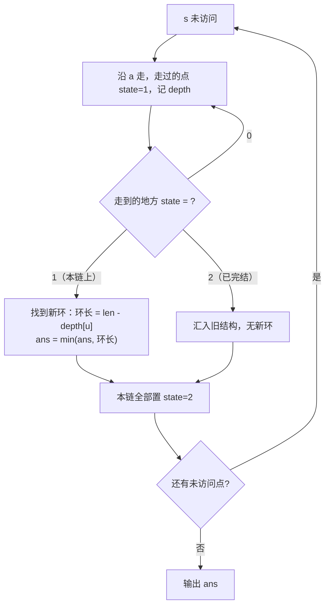

# P2661 [NOIP 2015 提高组] 信息传递

> 原题链接：<https://www.luogu.com.cn/problem/P2661>
> 本目录导航：[← 题库索引](../../../README.md) ｜ [讲解代码](solution.cpp) · [元信息](metadata.yml) · [对拍脚本](verify.js)

## 元信息

| 项目 | 内容 |
| --- | --- |
| 难度 | 普及（洛谷 difficulty=3） |
| 来源 | 洛谷 P2661，NOIP 2015 提高组 Day1 T2 |
| 标签 | 图论、**函数图**、**最小环**、三态标记 / 也可拓扑排序 |
| 数据范围 | 50%：$n\le200$；70%：$n\le2000$；100%：$1\le n\le200000$，$1\le a_i\le n$ |
| 时间 / 空间 | $O(n)$ / $O(n)$ |
| 时限 / 内存 | 1000 ms / 125 MB |
| 评测状态 | 未本地评测（洛谷提交需登录）；本地 `g++ -static -O2 -std=c++14` 编译，样例输出 `3` 逐字正确；与「逐轮模拟整个游戏」独立实现对拍 500 组 0 不一致，编译后 `solution.exe` 另跑 60 组 0 不一致；满约束 $n=2\times10^5$ 实测 642 ms |

## 题目大意

$n$ 个同学，每人有一个**固定的**信息传递对象 $a_i$（第 $i$ 个人只会把消息传给 $a_i$）。第 $0$ 轮每人只知道自己生日；之后每轮**所有人同时**把自己当前掌握的全部生日信息告诉自己的传递对象。问：最少经过多少轮，会有人**从别人口中**听到自己的生日？

- 输入：第一行 $n$，第二行 $a_{1\sim n}$。
- 输出：一个整数——游戏能进行的轮数。
- 样例：`5` / `2 4 2 3 1` ⇒ `3`。

> 与 [P1352 没有上司的舞会](../../dp/p1352-prom-without-boss/README.md)、[P11855 部署](../p11855-deploy/README.md) 同属"树/图上的父子关系"家族。这道题的可爱之处在于：**题面讲的是一个时间流逝的游戏，答案却是一个纯粹的结构量——最短环的长度。**

## 思路推导

### 1. 暴力想法与它的瓶颈

最直白的做法：**真的把游戏一轮一轮跑下去。** 维护每个人手里的"已知生日集合"，每轮同时投递，投完检查有没有人拿到自己的编号。

这个做法本身是**对的**（本仓库的对拍脚本就用它当基准），但复杂度是 $O(n\cdot \text{轮数}\cdot \text{集合大小})$。极端情况：$n=2\times10^5$ 时如果答案接近 $n$（比如整张图就是一个大环），就是 $O(n^2)=4\times10^{10}$，必超时。

瓶颈在哪？**我们把"游戏怎么跑"当成了要模拟的东西。** 但题目只问"跑多少轮结束"——一个**数**，不是某个人某一轮的状态。这个观察是本题的转折点。

### 2. 关键观察

#### 观察 1：把游戏画成一张图

每人只有一个传递对象 ⇒ 从 $i$ 连一条**有向边** $i\to a_i$。每个点出度恰为 $1$。这种图有个专门的名字：**函数图**（functional graph，$n$ 个点、$n$ 条边）。

#### 观察 2：信息每轮沿有向边走一步

第 $t$ 轮时，$i$ 的生日信息恰好传播到"从 $i$ 出发走 $t$ 步能到达"的那些点上。于是：

> 某人在第 $t$ 轮听到自己的生日 $\iff$ 存在一个点，从它出发走 $t$ 步能回到自己 $\iff$ **图中存在长度恰好为 $t$ 的有向环**。

#### 观察 3：函数图的性质——每个连通块恰有一个环

$n$ 个点、$n$ 条边、每个点出度为 $1$。数一数：如果某个弱连通块有 $k$ 个点，它内部恰好有 $k$ 条边（每个点贡献一条），比"$k$ 点连通需 $k-1$ 条边"恰好多 1 ⇒ **恰好成环一次**，且环上的树都是"指向环"的。

> **推论**：不在环上的点，信息最终一定会流进环里；游戏何时结束 **只由图中的环决定**。

#### 观察 4：答案就是最短环的长度

游戏停止的轮数 = 某个环"闭合"所需的轮数 = 该环的长度。所有环里**最短的那个**最先闭合 ⇒

$$\boxed{\text{答案} = \text{图中最短有向环的长度}}$$

于是问题从"模拟 $O(n^2)$ 轮游戏"变成"在函数图上找最短环"，一次线性遍历即可。

### 3. 算法设计

对每个还没访问过的点，沿 $a$ 一直往下走，边走边给点打"三态标记"：

| 状态 | 含义 |
| --- | --- |
| `0` | 从没访问过 |
| `1` | 在**当前这条链**上（本轮走过） |
| `2` | 已处理完结（属于以前某条链） |

```
for s = 1..n:
    if state[s] != 0: continue
    len = 0; u = s
    while state[u] == 0:
        state[u] = 1; depth[u] = len; path[len++] = u
        u = a[u]
    if state[u] == 1:                        # 撞回了本链上的点 → 找到环
        ans = min(ans, len - depth[u])       # 环长 = 当前步数 - 该点在本链的次序
    # 若 state[u] == 2，说明汇入了旧结构，本链无新环
    for v in path: state[v] = 2              # 整条链标记为已完结
```

关键是**区分状态 1 和状态 2**：只有撞回"本链上"的点才构成一个**新**环；撞到"已完结"的点只是接入了旧结构，不产生环。



### 4. 正确性说明

**引理 1（游戏轮数 = 环长）**：若存在长度 $t$ 的有向环 $v_0\to v_1\to\cdots\to v_{t-1}\to v_0$，则恰好第 $t$ 轮时有人听到自己的生日。

*证明*：环上每个点 $v_i$ 的生日信息每轮沿环前进一格，第 $t$ 轮回到 $v_i$ 自己，故 $v_i$ 在第 $t$ 轮听到自己生日。而对 $t'<t$，环上信息走 $t'$ 步落在别的点上，没人听到自己；由引理 3，$t'$ 轮时无环闭合，游戏不结束。$\blacksquare$

**引理 2（三态标记正确性）**：算法中 `state[u]==1` 当且仅当 $u$ 是从当前起点 $s$ 出发、沿 $a$ 走到的点；`state[u]==2` 当且仅当 $u$ 已在之前的遍历中被确认处理完。

*证明*：每轮链遍历开始时只有起点未访问，`while` 循环把链上点依次置 1 并入栈 `path`；退出时 $u$ 或为本链已置 1 的点、或为已置 2 的点、或不存在。退出后整条 `path` 置 2，之后不再被任何链重新访问。归纳即得。$\blacksquare$

**引理 3（每个点只属于一个环，且被唯一确定）**：函数图中，若链遍历从 $s$ 出发撞回本链上的 $u$，则得到的环 $u\to\cdots\to s\cdots\to u$ 恰是链 $s$ 最终汇入的那个环，且该环长度计算无误。

*证明*：由函数图"每点出度 1"，从 $s$ 出发的路径一旦重复经过某点，就必然进入一个环且永不再离开；重复点第一次出现的次序是 `depth[u]`，当前步数是 `len`，故中间这一段 $[depth[u],\,len)$ 就是环，长度 $len-depth[u]$。$\blacksquare$

**定理**：算法输出的 `ans` 等于图中最短有向环的长度，由引理 1 即等于游戏进行的轮数。

*证明*：每个环必被某次链遍历完整走出一遍（取环上任意点作为起点，或从指向环的点出发），此时按引理 3 被准确计入 `ans`；遍历覆盖所有未被访问过的点，故不漏。同时每次 `ans` 更新都对应一个真实存在的环，故不多算。取最小即得最短环。$\blacksquare$

### 5. 复杂度分析

- 时间：每个点至多被 `while` 走一次、被 `for v in path` 标记一次 ⇒ $O(n)$。
- 空间：$O(n)$，四个定长数组。
- **数值**：$n\le2\times10^5$，环长与深度都 $\le n$，`int` 足够，无需 `long long`。

## 板书演示

样例 `n=5`，`a = [2, 4, 2, 3, 1]`（即 $1\to2,\ 2\to4,\ 4\to3,\ 3\to2,\ 5\to1$）。

先画出这张图，让学生看清结构：

```
1 → 2 → 4 → 3
    ↑       │
    └───────┘      ← 2→4→3→2 是一个长度 3 的环
5 → 1 （5 是一条指向环的尾巴）
```

再让算法跑一遍，逐步骤记录：

| 起点 $s$ | 走的链 | `path`（次序） | 出口 | 是否成环 | `ans` |
| --- | --- | --- | --- | --- | --- |
| 1 | 1 → 2 → 4 → 3 → **2** | 1(0), 2(1), 4(2), 3(3) | 撞回本链上的 2 | ✅ 环长 = 4−1 = **3** | **3** |
| — | （链上 1,2,4,3 全部置为已完结） | | | | |
| 2,3,4 | 跳过（已完结） | | | | 3 |
| 5 | 5 → **1** | 5(0) | 撞到已完结的 1 | ❌ 无新环 | 3 |

输出 `3`，与样例一致。

课堂上值得停下来问的三个点：

1. **为什么第 5 号人走的链不算一个环？** 因为 $5\to1$，而 1 是"已完结"的点（状态 2），不是"本链上"的点（状态 1）。**这就是三态标记存在的全部理由**——如果只用布尔 `vis[]`，$5\to1$ 会被误当成一个"长度 2 的环"，得到错误答案 2。
2. **样例解释里说第 3 轮时 4 号、3 号都能听到**——为什么答案还要取最小？ 因为游戏在**第一个**人听到时就结束了，所以取的是**最短**环，不是最长。
3. **如果 $a_i=i$（自己传给自己）呢？** 那就是长度 1 的环，第 1 轮就结束，答案 1。这是最容易被忽略的边界，本仓库对拍脚本专门生成含自环的用例来覆盖它。

## 讲解代码

`solution.cpp`，按 `g++ -static -O2 -std=c++14` 编译：

```cpp
int ans = n + 1;                       // 答案上界：最长环 ≤ n

for (int s = 1; s <= n; ++s) {
    if (state_[s] != 0) continue;      // 已经处理过

    int len = 0;                       // 本条链已走过的点数
    int u = s;
    while (state_[u] == 0) {           // 沿 a 一路走到底
        state_[u] = 1;                 // 标记：在本条链上
        depth_[u] = len;               // 记录次序
        path_[len++] = u;              // 进路径
        u = to_[u];
    }

    if (state_[u] == 1) {              // 撞回本条链上的点 → 找到一个环
        int cycleLen = len - depth_[u];
        if (cycleLen < ans) ans = cycleLen;
    }
    // state_[u] == 2 的情况：汇入旧结构，本链无新环

    for (int i = 0; i < len; ++i) state_[path_[i]] = 2;   // 全链标记为已完结
}
printf("%d\n", ans);
```

实现上最值得强调的是**状态 1 / 2 的区分**，以及"整条链退出时统一置 2"这一步——它保证了每个点只被走一次，从而把复杂度锁死在 $O(n)$。

> **另一种等价做法**：先跑一遍**拓扑排序**，把所有入度为 0 的点（以及被它们"带走"的点）删掉；剩下的点全部在环上。再对剩下的每个连通块数一数环长，取最小。这道题因此也是"拓扑排序找环"的好例题，可以作为课堂上的第二种解法对照讲。

## 本机实测记录

```bash
$ g++ -static -O2 -std=c++14 solution.cpp -o solution.exe     # 通过
$ printf '5\n2 4 2 3 1\n' | ./solution.exe
3
$ node verify.js --rounds=500
定点用例 7 组（正解 + 暴力各验一遍），失败 0 组
随机对拍 500 组：正解 vs 逐轮模拟暴力  不一致 0 组
错版量化 500 组：「不区分在链/已完结 + 链长当环长」与正解  不一致 280 组
```

| 项目 | 实测 |
| --- | --- |
| 编译 | `g++ -static -O2 -std=c++14 solution.cpp` 通过 |
| 官方样例 | `5 / 2 4 2 3 1` ⇒ `3`，逐字一致 |
| 对拍（JS 双实现） | 与"逐轮模拟整个游戏"独立对拍 **500 组 0 不一致** |
| 对拍（真实 exe） | 编译后 `solution.exe` 对 60 组随机用例 **0 不一致** |
| 错版量级 | 500 组里 **280 组**「不区分在链/已完结 + 链长当环长」的结果与正解不同 |
| 满约束·大环 | $n=2\times10^5$ 且整图一个大环 ⇒ 输出 `200000`，**642 ms** |
| 满约束·随机图 | $n=2\times10^5$ 随机函数图 ⇒ 输出 `3`，**629 ms** |
| 满约束·长尾接 3 环 | $n=2\times10^5$，前 $n-3$ 个点串成长尾、末 3 点成环 ⇒ 输出 `3`，**624 ms** |

> 满约束耗时基本由读入 $2\times10^5$ 个整数（`scanf`）主导，核心算法本身是线性的。

## 易错点与坑

1. **只用布尔 `vis[]`，不区分"本链"与"已完结"**：这是本题**最经典**的错。用 `vis` 的话，一条指向已有环的长尾会被误算成环。本机 500 组随机数据里 **280 组**能抓到这个错。样例 `5 / 2 4 2 3 1` **恰好能抓住**：点 5 指向已在链上的点 1，错解会报 2（正解 3）。
2. **环长写成 `len` 而不是 `len - depth[u]`**：`len` 是整条链的长度，含接入环的尾巴；只有 `len - depth[u]` 才是环本身的长度。在"长尾接小环"的数据上会差出好几个数量级（本机满约束 `big_tail3` 正解 3，错法会输出约 $2\times10^5$）。
3. **判据写成"谁手里有自己的编号"**：初始时每个人本来就"知道自己的生日"，所以第一轮检查会误判为 0 轮（或 1 轮）。正确判据是"**从别人那里收到**了含自己编号的消息"——本仓库对拍脚本的第一版就踩了这个坑，被定点用例 `n=1 自环` 当场抓住。
4. **误以为答案取最长环**：游戏在**第一个**人听到自己生日时就结束 ⇒ 取**最短**环。样例里同时存在长度 3 的环（2,4,3）和长度 1 的"消息流"（5→1→…），答案是 3。
5. **忘记自环的情况**：$a_i=i$ 时是长度 1 的环，答案应为 1。若不特判也没有通用地处理，容易在 `n=1` 等边界上出错。本机定点用例专门覆盖 `n=1 自环` 与 `n=2 自环+自环`。
6. **误用递归求环**：$n$ 到 $2\times10^5$，递归深度可能到 $2\times10^5$，本机（默认 8 MB 栈）有爆栈风险。本解全程迭代，不用递归。

## 常见变式

| 变式 | 差异 | 对应题号 |
| --- | --- | --- |
| 求**最长**环 / 环上点数统计 | 取 $\max$ 而非 $\min$，或改数环长 | [P2921 Trick or Treat on the Farm](https://www.luogu.com.cn/problem/P2921) |
| 每个点出发的路径长度（含尾） | 在函数图上做记忆化递推 | [P2921](https://www.luogu.com.cn/problem/P2921) |
| 拓扑排序版本（删入度 0 的点） | 换一种"找环上点"的角度 | [P1113 杂务](https://www.luogu.com.cn/problem/P1113)（拓扑入门） |
| 有向图通用找最小环 | 需要 Floyd / 最短路，函数图性质不再成立 | [P6175 无向图的最小环问题](https://www.luogu.com.cn/problem/P6175) |
| 并查集找环（仅需判环 / 环长） | 带权并查集维护到根距离 | [P1196 银河英雄传说](https://www.luogu.com.cn/problem/P1196)（带权并查集） |
| 树形 DP 视角（把"指向环"当成树上递推） | 与本题结构相同，套路不同 | [P1352 没有上司的舞会](../../dp/p1352-prom-without-boss/README.md) |

## 一句话提炼

**"每人只告诉一个人"是函数图的标志**——一旦认出 $n$ 点 $n$ 边、出度全 1，就该想到"每个连通块恰有一个环"，于是"游戏跑多少轮"这种看似要模拟的问题，塌缩成一个纯粹的结构量：**最短环的长度**；而处理函数图的通用钥匙，是"三态标记"（未访问 / 在本链 / 已完结），它也是拓扑排序找环的孪生兄弟。
