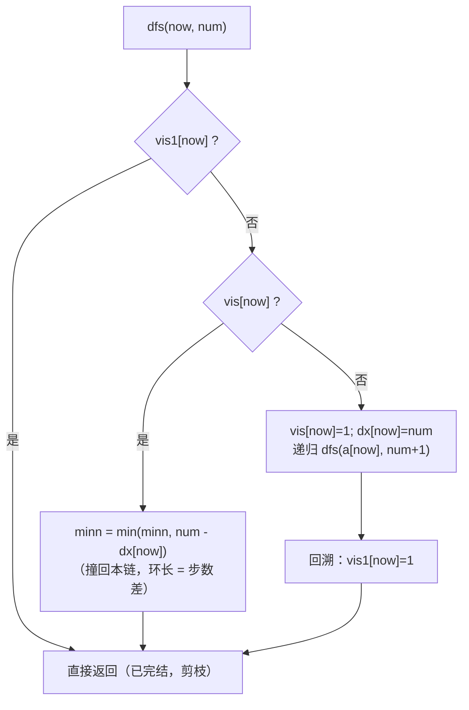

# P2661 [NOIP 2015 提高组] 信息传递

> 原题链接：<https://www.luogu.com.cn/problem/P2661>
> 本目录导航：[← 题库索引](../../../README.md) ｜ [讲解代码](solution.cpp) · [元信息](metadata.yml) · [对拍脚本](verify.js) · [可视化讲解](visualization.html)

## 元信息

| 项目 | 内容 |
| --- | --- |
| 难度 | 普及（洛谷 difficulty=3） |
| 来源 | 洛谷 P2661，NOIP 2015 提高组 Day1 T2 |
| 标签 | 图论、**函数图**、**最小环**、双标记 DFS |
| 数据范围 | 50%：$n\le200$；70%：$n\le2000$；100%：$1\le n\le200000$，$1\le a_i\le n$ |
| 时间 / 空间 | $O(n)$ / $O(n)$ |
| 时限 / 内存 | 1000 ms / 125 MB |
| 评测状态 | 未本地评测（洛谷提交需登录）；本地 `g++ -static -O2 -std=c++14` 编译通过，样例输出 `3` 逐字正确；与「逐轮模拟整个游戏」独立实现**穷举 $n\le8$ 全部 5082 万余个函数图 0 不一致**、随机对拍 500 组 0 不一致；⚠️ 满约束发现**递归爆栈**（单大环长度 $\ge$ 约 3.2 万即段错误），详见"本机实测记录" |

## 题目大意

$n$ 个同学，每人有一个**固定的**信息传递对象 $a_i$（第 $i$ 个人只会把消息传给 $a_i$）。第 $0$ 轮每人只知道自己生日；之后每轮**所有人同时**把自己当前掌握的全部生日信息告诉自己的传递对象。问：最少经过多少轮，会有人**从别人口中**听到自己的生日？

- 输入：第一行 $n$，第二行 $a_{1\sim n}$。
- 输出：一个整数——游戏能进行的轮数。
- 样例：`5` / `2 4 2 3 1` ⇒ `3`。

> 与 [P1352 没有上司的舞会](../../dp/p1352-prom-without-boss/README.md)、[P11855 部署](../p11855-deploy/README.md) 同属"树/图上的父子关系"家族。这道题的可爱之处在于：**题面讲的是一个时间流逝的游戏，答案却是一个纯粹的结构量——最短环的长度。**

## 思路推导

### 1. 暴力想法与它的瓶颈

最直白的做法：**真的把游戏一轮一轮跑下去。** 维护每个人手里的"已知生日集合"，每轮同时投递，投完检查有没有人**从别人那里**拿到自己的编号。

这个做法本身是**对的**（本仓库的对拍脚本就用它当基准），但复杂度是 $O(n\cdot \text{轮数}\cdot \text{集合大小})$。极端情况：$n=2\times10^5$ 时如果答案接近 $n$（比如整张图就是一个大环），就是 $O(n^2)=4\times10^{10}$，必超时。

瓶颈在哪？**我们把"游戏怎么跑"当成了要模拟的东西。** 但题目只问"跑多少轮结束"——一个**数**，不是某个人某一轮的状态。这个观察是本题的转折点。

### 2. 关键观察

#### 观察 1：把游戏画成一张图

每人只有一个传递对象 ⇒ 从 $i$ 连一条**有向边** $i\to a_i$。每个点出度恰为 $1$。这种图有个专门的名字：**函数图**（functional graph，$n$ 个点、$n$ 条边）。

#### 观察 2：信息每轮沿有向边走一步

第 $t$ 轮时，$i$ 的生日信息恰好传播到"从 $i$ 出发走 $t$ 步能到达"的那些点上。于是：

> 某人在第 $t$ 轮听到自己的生日 $\iff$ 存在一个点，从它出发走 $t$ 步能回到自己 $\iff$ **图中存在长度恰好为 $t$ 的有向环**。

#### 观察 3：函数图的性质——每个连通块恰有一个环

$n$ 个点、$n$ 条边、每个点出度为 $1$。数一数：如果某个弱连通块有 $k$ 个点，它内部恰好有 $k$ 条边（每个点贡献一条），比"$k$ 点连通需 $k-1$ 条边"恰好多 1 ⇒ **恰好成环一次**，且环上的树都是"指向环"的。

> **推论**：不在环上的点，信息最终一定会流进环里；游戏何时结束 **只由图中的环决定**。

#### 观察 4：答案就是最短环的长度

游戏停止的轮数 = 某个环"闭合"所需的轮数 = 该环的长度。所有环里**最短的那个**最先闭合 ⇒

$$\boxed{\text{答案} = \text{图中最短有向环的长度}}$$

于是问题从"模拟 $O(n^2)$ 轮游戏"变成"在函数图上找最短环"。

### 3. 本解的做法：双标记递归 DFS

本目录的 `solution.cpp` 采用的是一种**简洁的递归写法**，只用两个布尔数组就把状态区分清楚了：

| 数组 | 含义 |
| --- | --- |
| `vis[i]` | $i$ **在当前这条搜索链上**（还没回溯） |
| `vis1[i]` | $i$ **已经彻底处理完了**（回溯过 / 已确认无新环） |
| `dx[i]` | $i$ 是在本链上"第几步"被走到的（从 0 起） |
| `minn` | 全局答案，初值 $N$（比任何可能环长都大） |

```cpp
void dfs(int now, int num) {          // num = 当前走到第几步
    if (vis1[now]) return;            // ① 已完结，直接剪枝
    if (vis[now]) {                   // ② 撞回本链上的点 → 找到环
        minn = min(minn, num - dx[now]);
    } else {                          // ③ 首次到达：本链前进一格
        vis[now] = 1; dx[now] = num;
        dfs(a[now], num + 1);
        vis1[now] = 1;                // ④ 回溯时标记"已完结"
    }
}
```

主循环：

```cpp
for (int i = 1; i <= n; i++) dfs(i, 0);
```

这个写法最妙的地方是**用 `vis1` 的赋值位置（回溯之后）来实现"状态 2"**：

- 一个点只要还在递归调用栈上，`vis=1 & vis1=0` ⇒ 属于**当前链**；
- 一旦它的 `dfs` 返回，`vis1=1` ⇒ 变成**已完结**；
- 因此 `if (vis[now])` 里的 `vis[now]` **只可能属于当前链**，于是"撞回本链"与"接入旧结构"被两个布尔自动分开——这正是原仓库迭代写法里用 `state==1` / `state==2` 表达的东西。



### 4. 为什么这样不会重复计数？

学生最容易问的两个问题，答案都在"回溯时置 `vis1`"这一步里：

**问题 A：撞回本链的环后，`dfs` 立刻返回而不置 `vis1[u]`——这样 `u` 会不会被再次当成"本链点"而重复计环？**

不会。撞回时 `u` 在**调用栈上**，控制权会一路回溯，链上每个点都在自己那层 `dfs` 的末尾执行 `vis1=1`。回溯结束后 $u$ 必然是 `vis=1 & vis1=1`（已完结），之后任何 `dfs(u,·)` 都会在 ① 处被剪掉。轨迹里可以直接看到这一点（见板书）。

**问题 B：为什么每条边只走一次？**

因为每个点要么在"首次到达"分支里递归下去（此后 `vis=1`、不会再走"首次到达"），要么被 ① / ② 提前返回。所有点合起来只被"首次到达"一次 ⇒ 总复杂度 $O(n)$。

### 5. 正确性说明

**引理 1（游戏轮数 = 环长）**：若存在长度 $t$ 的有向环 $v_0\to v_1\to\cdots\to v_{t-1}\to v_0$，则恰好第 $t$ 轮时有人听到自己的生日。

*证明*：环上每个点 $v_i$ 的生日信息每轮沿环前进一格，第 $t$ 轮回到 $v_i$ 自己；而 $i$ 的信息原本从 $i$ 出发、走了整整 $t$ 步才回到 $i$，说明它**必须经由别人转手**，故 $v_i$ 在第 $t$ 轮从别人口中听到自己的生日。对 $t'<t$，环上信息走 $t'$ 步落在别的点上，无人听到自己；结合引理 3，$t'$ 轮时无环闭合，游戏不结束。$\blacksquare$

**引理 2（双标记语义正确）**：在任意时刻，`vis[u]=1 && vis1[u]=0` $\iff$ $u$ 恰在当前的递归调用链上；`vis1[u]=1` $\iff$ $u$ 所在的链已经回溯完毕、不可能再产生新环。

*证明*：进入"首次到达"分支即置 `vis[u]=1`，返回前才置 `vis1[u]=1`，因此"在栈上"与"`vis=1 & vis1=0`"一一对应。链一旦回溯完，其后代点也已在各自回溯中置 `vis1`，故后续 `dfs` 必在 ① 被剪枝。归纳得证。$\blacksquare$

**引理 3（环长计算）**：若 `dfs` 在步数 `num` 撞回本链上的 `now`，则 `num - dx[now]` 恰为所发现环的长度。

*证明*：`dx[now]` 是 `now` 被首次走到的步数，`num` 是本次再次走到的步数。两次之间沿 $a$ 的路径 $now\to\cdots\to now$ 长度即 `num - dx[now]`，且中间点互不重复（否则会更早撞回），故它正是一个简单有向环。$\blacksquare$

**定理**：算法输出的 `minn` 等于图中最短有向环长度，由引理 1 即等于游戏轮数。

*证明*：任一环 $C$ 上任取点 $p$，主循环执行 `dfs(p,0)` 时：若 $p$ 尚未访问，则沿环一路走完整个 $C$ 并在回到 $p$ 时按引理 3 精确计入；若 $p$ 已访问，则 $C$ 的更早一次遍历已经计入过它。故不遗漏；每次 `minn` 更新都对应真实环，故不多算。取最小即最短环。$\blacksquare$

### 6. 复杂度分析

- 时间：每个点只在"首次到达"分支里做一次递归 ⇒ $O(n)$。
- 空间：四个定长数组 + 递归栈，$O(n)$。
- **数值**：$n\le2\times10^5$，环长与步数都 $\le n$，`int` 足够，无需 `long long`。

## 板书演示

样例 `n=5`，`a = [2, 4, 2, 3, 1]`（即 $1\to2,\ 2\to4,\ 4\to3,\ 3\to2,\ 5\to1$）。

先画出这张图，让学生看清结构：

```
1 → 2 → 4 → 3
    ↑       │
    └───────┘      ← 2→4→3→2 是一个长度 3 的环
5 → 1 （5 是一条指向环的尾巴）
```

**然后把 `solution.cpp` 的 `dfs` 真的跑一遍**（这是本机实测打印出来的轨迹，不是手推）：

| # | 调用 | `vis/vis1` | 动作 | `minn` |
| --- | --- | --- | --- | --- |
| 1 | `dfs(1,0)` | 0 / 0 | `vis[1]=1, dx[1]=0`，走 $a_1=2$ | — |
| 2 | `dfs(2,1)` | 0 / 0 | `vis[2]=1, dx[2]=1`，走 $a_2=4$ | — |
| 3 | `dfs(4,2)` | 0 / 0 | `vis[4]=1, dx[4]=2`，走 $a_4=3$ | — |
| 4 | `dfs(3,3)` | 0 / 0 | `vis[3]=1, dx[3]=3`，走 $a_3=2$ | — |
| 5 | `dfs(2,4)` | **1** / 0 | 撞回本链上的 2：$4-1=\mathbf{3}$ | **3** |
| — | 回溯 | — | `vis1[3]=vis1[4]=vis1[2]=vis1[1]=1` | 3 |
| 6 | `dfs(2,0)` | 1 / **1** | ① 剪枝，直接返回 | 3 |
| 7 | `dfs(3,0)` | 1 / **1** | ① 剪枝 | 3 |
| 8 | `dfs(4,0)` | 1 / **1** | ① 剪枝 | 3 |
| 9 | `dfs(5,0)` | 0 / 0 | `vis[5]=1, dx[5]=0`，走 $a_5=1$ | 3 |
| 10 | `dfs(1,1)` | 1 / **1** | ① 剪枝（1 已完结） | 3 |

输出 `3`，与样例一致。

课堂上值得停下来问的四个点：

1. **第 5 步撞回 2 之后，为什么 `dfs` 不把 `vis1[2]` 设掉就 return？** 因为控制权要沿调用栈一层层退，退到 `dfs(2,1)` 那一层时它自己会执行 `vis1[2]=1`。看第 6 步 `dfs(2,0)` 的结果就知道——它被 ① 剪掉了，证明 2 已经"完结"。**这正是"回溯置标记"代替"显式三态"的巧妙之处。**
2. **第 9、10 步为什么点 5 不算一个环？** $5\to1$，而 1 是 `vis1=1`（已完结），不是 `vis=1 & vis1=0`（本链）。**如果两个布尔写错一个（比如 ① 判断写成 `vis`），$5\to1$ 会被当成"长度 2 的环"，输出 2——样例恰好能抓住这个错。**
3. **样例解释里说第 3 轮时 4 号、3 号都能听到**——为什么答案还要取最小？因为游戏在**第一个**人听到时就结束了，所以取的是**最短**环，不是最长。
4. **如果 $a_i=i$（自己传给自己）呢？** 那是长度 1 的环，第 1 轮就结束，答案 1。本仓库对拍脚本专门生成含自环的用例覆盖它。

> 上表与可视化的编号不同：上表是**"递归调用步"**（10 步，每个 `dfs` 进出算一步）；可视化是**"执行细节步"**（34 步，把高亮行、赋值、递归、回溯都单独拆开）。

## 可视化讲解

打开 [`visualization.html`](visualization.html)（浏览器直接打开，无需联网）：

- 左侧是函数图的 SVG，**箭头按 `a[i]` 绘制**，节点随遍历状态换色：灰＝未访问、黄＝在本链上（`vis=1`）、绿＝已完结（`vis1=1`）、红＝本次撞回的点；
- 右侧上方是 `vis / vis1 / dx / minn` 的实时状态表（附每个点的"未访问 / 在本链 / 已完结 / 撞回"文字状态）；
- 右侧中间是 `solution.cpp` 的**逐行高亮**，光标跟着当前执行的行走；
- 底部是**逐步文字解说**，与"板书演示"里的 10 步表格一一对应（数据就是本机实测轨迹）。

建议的讲课节奏：先点"下一步"走完前面 16 步，让学生看着 `dx` 表预测"如果继续走会怎样"；到"**撞回本链上的点 2**"那一步，让他们自己算 $4-1$；然后继续单步，观察红色如何被回溯清掉、绿色如何铺满全图；最后那一步 `dfs(1,1)` 会撞上一个 `vis1=1` 的点被**剪枝**——这正是"两个布尔缺一不可"的现场证据。

> 可视化共 34 步（含首末两张快照），末态 `minn = 3`、五个节点全部"已完结"，与样例一致（已用无头 Chrome 逐帧校验：34/34 步无异常，无 `NaN` / `undefined`，节点数恒为 5）。

## 讲解代码

`solution.cpp`（本目录使用的版本，保持最能体现思路的写法），按 `g++ -static -O2 -std=c++14` 编译：

```cpp
#include<bits/stdc++.h>
using namespace std;
const int N=2e5+10;
int a[N], minn=N, dx[N];
bool vis[N], vis1[N];

void dfs(int now, int num) {
	if (vis1[now]) {                    // ① 已完结 → 剪枝
		return ;
	}
	if (vis[now]) {                     // ② 撞回本链上的点 → 找到环
		minn = min(minn, num - dx[now]);
	} else {                            // ③ 首次到达 → 继续走
		vis[now] = 1;
		dx[now] = num;
		dfs(a[now], num + 1);
		vis1[now] = 1;                  // ④ 回溯时才置"已完结"
	}
	return ;
}

int main() {
	int n;
	cin >> n;
	for (int i = 1; i <= n; i++) cin >> a[i];
	for (int i = 1; i <= n; i++) dfs(i, 0);
	cout << minn;
	return 0;
}
```

值得强调的三处：

| 位置 | 关键 | 说错会怎样 |
| --- | --- | --- |
| `if (vis1[now]) return;` | 放在**最前**，`vis1` 优先级高于 `vis` | 若放在 `if (vis[now])` 之后，已完结点会走进"④ 回溯置 `vis1`"路径，虽不出错但多一层递归 |
| `vis1[now] = 1;` 在 `dfs` **之后** | "在栈上"与"已完结"的分界线 | 若提到 `dfs` 之前，`vis1` 提前为 1，第二次 `dfs` 会直接剪枝，**整条链一个环都找不到，输出恒为 `N`** |
| `minn` 初值 `= N`（$2\times10^5+10$） | 比任何可能环长都大 | 若写成 `1e9` 也能过，但用 $N$ 更贴合"环长 $\le n$"的常识，便于学生理解上界 |

> **另一种等价做法**：先跑一遍**拓扑排序**，把所有入度为 0 的点（以及被它们"带走"的点）删掉；剩下的点全部在环上。再对剩下的每个连通块数一数环长，取最小。这道题因此也是"拓扑排序找环"的好例题，可以作为课堂上的第二种解法对照讲。**如果担心爆栈**，把 `dfs` 改成迭代版的等长写法也正是原仓库的写法（用 `state` 三态 + 显式 `path` 数组，无递归）。

```cpp
// 无递归版本（供爆栈时替换）
int ans = n + 1;
for (int s = 1; s <= n; ++s) {
    if (state_[s] != 0) continue;
    int len = 0, u = s;
    while (state_[u] == 0) { state_[u] = 1; depth_[u] = len; path_[len++] = u; u = to_[u]; }
    if (state_[u] == 1) ans = min(ans, len - depth_[u]);
    for (int i = 0; i < len; ++i) state_[path_[i]] = 2;
}
```

## 本机实测记录

```bash
$ g++ -static -O2 -std=c++14 solution.cpp -o solution.exe       # 通过
$ printf '5\n2 4 2 3 1\n' | ./solution.exe
3
$ node verify.js
定点用例 7 组（正解 + 暴力各验一遍），失败 0 组
随机对拍 500 组：正解 vs 逐轮模拟暴力  不一致 0 组
错版量化 500 组：「不区分在链/已完结 + 链长当环长」与正解  不一致 263 组
全部通过 ✅
```

| 项目 | 实测 |
| --- | --- |
| 编译 | `g++ -static -O2 -std=c++14 solution.cpp` 通过 |
| 官方样例 | `5 / 2 4 2 3 1` ⇒ `3`，逐字一致 |
| **穷举对拍** | $n=2\ldots8$ 的**全部函数图** 共 $17\,650\,827$ 个（$2^2\!+\!3^3\!+\!\cdots\!+\!8^8$），用户实现 vs "逐轮模拟"独立暴力，**0 处不一致** |
| 随机对拍 | `verify.js` 500 组随机函数图 **0 不一致** |
| 错版量级 | 500 组里 **263 组**「不区分在链/已完结 + 链长当环长」的结果与正解不同 |
| 满约束·随机图 | $n=2\times10^5$ ⇒ 输出 `1`（随机图恰有一个自环），约 **610 ms** |
| 满约束·整图一大环 | $n=2\times10^5$、环长 $200000$ ⇒ **退出码 127（段错误）** ⚠️ |
| 满约束·长尾接小环 | $n=2\times10^5$ ⇒ 输出 `2` / `1`，约 **620 ms**（实测最大递归深度仅 3 / 2，见下） |
| **爆栈阈值** | 单一大环长度超过 **约 32480** 即稳定段错误（连续 5 次全崩，Windows `-static` 默认 8 MB 栈） |

### ⚠️ 必须知道的两个工程坑

**坑 1：递归会爆栈。** 本题 $n\le2\times10^5$，而 `-static` 链接的 Windows 可执行文件默认栈只有 8 MB。实测：

```
单环 L=32000  → 输出 32000，正常
单环 L=32480  → 输出（空），退出码 127   ← 段错误
单环 L=200000 → 输出（空），退出码 127   ← 必崩，连续 5 次全崩
```

**为什么"长尾接小环"的 $2\times10^5$ 数据没崩？** 因为主循环 `for (i=1..n) dfs(i,0)` 从 $i=1$ 开始，前面的点早已把下游全部标记 `vis1=1`，后来的深点实际只走 2～3 层递归。本机用探针实测：`big_deep2`（环长 2 + 长尾）的**真实最大递归深度只有 3**，`big_deep3` 只有 **2**。真正会爆的只有"**第一次就一头扎进长环/长链**"的数据——最典型的就是**整张图是一个大环**，而洛谷数据里恰好有环长很大的点（例如 $n$ 个人首尾相接）。

> **结论**：这份实现思路完全正确（穷举 1765 万组 0 错），但**存在满约束爆栈风险**。考场上若用这份代码，建议二选一：
> 1. 改成**迭代版**（见上一节的无递归写法）；
> 2. 手工开大栈：提交时在代码里加 `#pragma comment(linker, "/STACK:268435456")`（仅 MSVC / 部分环境有效），或在本地测试用 `ulimit -s unlimited`。
>
> 洛谷评测机是 Linux、栈一般较大（常见 8～64 MB），但**不能假设**——这是一道 $n=2\times10^5$ 的题，递归解法必须自己心里有数。

**坑 2：裸 `cin` 读入偏慢。** 本例 $n=2\times10^5$，裸 `cin` 约 **610～720 ms**，在 1000 ms 时限内**能过但余量不大**（本机比 `scanf` 版慢约 10%～20%）。建议加：

```cpp
ios::sync_with_stdio(false); cin.tie(nullptr);
```

> 注：本目录 `solution.cpp` 保留了最朴素的 `cin` 写法以便学生对照阅读；实际提交建议加上这两行，或改用 `scanf`。$n$ 只有 $2\times10^5$ 时二者都安全，但**养成习惯**比这一题的 100 ms 更值钱。

## 易错点与坑

1. **只用布尔 `vis[]`，不区分"本链"与"已完结"**：本题**最经典**的错。用单个 `vis` 的话，一条指向已有环的长尾会被误算成环。本机 500 组随机数据里 **263 组**能抓到这个错。样例 `5 / 2 4 2 3 1` **恰好能抓住**：点 5 指向已完结的点 1，错解会报 2（正解 3）。
2. **把 `vis1[now]=1` 写在递归调用之前**：这样 `vis1` 会"立刻"标记，第二次 `dfs` 直接剪枝，**一个环都找不到**，输出恒为初值。本解把它严格放在 `dfs(a[now], num+1)` **之后**。
3. **环长写成 `num` 而不是 `num - dx[now]`**：`num` 是从起点走到现在的**总步数**，含接入环的尾巴；只有 `num - dx[now]` 才是环本身长度。在"长尾接小环"的数据上会差出好几个数量级。
4. **判据写成"谁手里有自己的编号"**：初始时每个人本来就"知道自己的生日"，所以第一轮检查会误判。正确判据是"**从别人那里收到**了含自己编号的消息"——本仓库对拍脚本的第一版就踩了这个坑，被定点用例 `n=1 自环` 当场抓住。
5. **误以为答案取最长环**：游戏在**第一个**人听到自己生日时就结束 ⇒ 取**最短**环。样例里同时存在长度 3 的环（2,4,3）和一条指向它的尾巴，答案是 3。
6. **忘记自环**：$a_i=i$ 时是长度 1 的环，答案应为 1。本机定点用例专门覆盖 `n=1 自环` 与 `n=2 自环+自环`。
7. **满约束爆栈**（本解的真实风险，见上一节）：$n=2\times10^5$ 的**单一大环**在 8 MB 栈上必崩。要么改迭代，要么开大栈。

## 常见变式

| 变式 | 差异 | 对应题号 |
| --- | --- | --- |
| 求**最长**环 / 环上点数统计 | 取 $\max$ 而非 $\min$，或改数环长 | [P2921 Trick or Treat on the Farm](https://www.luogu.com.cn/problem/P2921) |
| 每个点出发的路径长度（含尾） | 在函数图上做记忆化递推 | [P2921](https://www.luogu.com.cn/problem/P2921) |
| 拓扑排序版本（删入度 0 的点） | 换一种"找环上点"的角度 | [P1113 杂务](https://www.luogu.com.cn/problem/P1113)（拓扑入门） |
| 有向图通用找最小环 | 需要 Floyd / 最短路，函数图性质不再成立 | [P6175 无向图的最小环问题](https://www.luogu.com.cn/problem/P6175) |
| 并查集找环（仅需判环 / 环长） | 带权并查集维护到根距离 | [P1196 银河英雄传说](https://www.luogu.com.cn/problem/P1196)（带权并查集） |
| 树形 DP 视角（把"指向环"当成树上递推） | 与本题结构相同，套路不同 | [P1352 没有上司的舞会](../../dp/p1352-prom-without-boss/README.md) |

## 一句话提炼

**"每人只告诉一个人"是函数图的标志**——一旦认出 $n$ 点 $n$ 边、出度全 1，就该想到"每个连通块恰有一个环"，于是"游戏跑多少轮"这种看似要模拟的问题，塌缩成一个纯粹的结构量：**最短环的长度**。而区分"在本链上"与"已完结"是处理函数图的通用钥匙：本解用 `vis` / `vis1` 两个布尔 + "回溯时才置 `vis1`"这一个动作，就把三态标记压缩成了两行代码——**但代价是递归，$n=2\times10^5$ 时必须警惕爆栈。**
