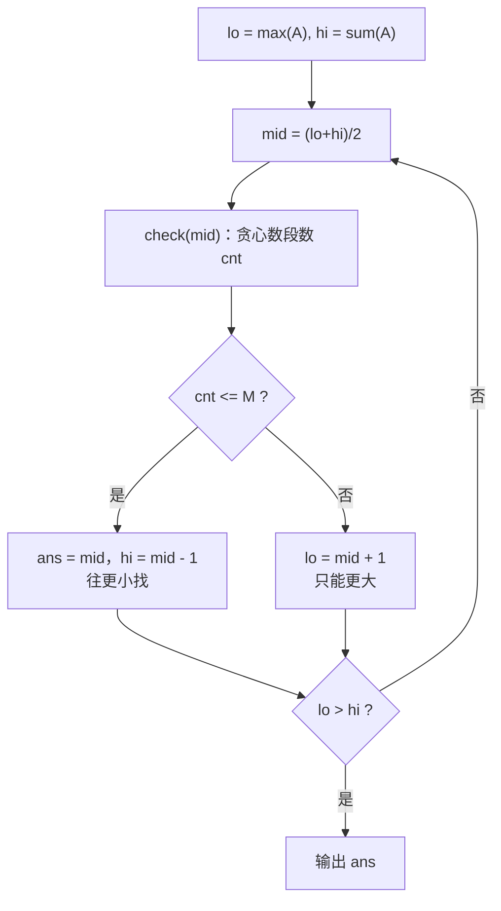

# P1182 数列分段 Section II

> 原题链接：<https://www.luogu.com.cn/problem/P1182>
> 本目录导航：[← 题库索引](../../../README.md) ｜ [讲解代码](solution.cpp) · [元信息](metadata.yml) · [对拍脚本](verify.js) · [分步动画](visualization.html)

## 元信息

| 项目 | 内容 |
| --- | --- |
| 难度 | 普及（洛谷 difficulty=3） |
| 来源 | 洛谷 P1182 |
| 标签 | 二分答案、贪心、**最小化最大值**、数列分段 |
| 数据范围 | 20%：$N\le10$；40%：$N\le1000$；100%：$1\le N\le10^5$，$M\le N$，$0\le A_i<10^8$，答案不超过 $10^9$ |
| 时间 / 空间 | $O(N\log S)$ / $O(N)$ |
| 时限 / 内存 | 1000 ms / 128 MB |
| 评测状态 | 未本地评测（洛谷提交需登录）；本地 `g++ -static -O2 -std=c++14` 编译，样例输出 `6` 逐字正确；与「$O(N^2M)$ 区间 DP」独立暴力随机对拍共 3100 组（JS 双实现 3000 组 + 编译后 `solution.exe` 100 组）0 不一致 |

## 题目大意

长度 $N$ 的数列 $A_{1\sim N}$，切成 $M$ 段（每段必须连续），使**每段和的最大值最小**，输出这个最小值。

- 输入：第一行 `N M`，第二行 $N$ 个非负整数。
- 输出：一个整数——每段和最大值的最小可能值。
- 样例：`5 3` / `4 2 4 5 1` ⇒ `6`（切法 $[4\,2][4][5\,1]$，三段和 $6,4,6$，最大 $6$）。

> 这是**二分答案的入门模板题**，也是"看到『最大（小）值最小（大）』就二分"这条口诀的第一个例子。它与 [P2678 跳石头](../p2678-jump-stone/README.md) 是同一套框架的两个方向，建议连堂讲。

## 思路推导

### 1. 暴力想法与它的瓶颈

直接枚举切法：在 $N-1$ 个空隙里选 $M-1$ 个切点，方案数 $\binom{N-1}{M-1}$。$N=10^5$ 时这是天文数字，连 $N=20$ 都跑不完。

暴力慢在哪？**它把"怎么切"当成要枚举的东西**。但我们真正要的不是某个切法，而是那个"最大值"——一个**数**。这个观察是本题的全部转折。

### 2. 关键观察

#### 观察 1：把"求最优值"换成"判定可行性"

不要问"最大段和最小能到多少"，改问：

> **给定 $X$，能不能切成至多 $M$ 段，使每段和都不超过 $X$？**

"最优"两个字一去掉，问题立刻变简单——因为判定不用挑方案，只要**尽量少切**就行。

#### 观察 2：判定可以一趟贪心做完

要让段数尽量少，就该让每段尽量长。于是从左往右扫，能塞就塞，塞不下（`cur + A[i] > X`）才开新段。这一趟 $O(N)$ 得到的段数 $cnt$ 就是**所有切法里最少的段数**（§4 引理 1 给证明）。

`check(X) = (cnt <= M)`。

#### 观察 3：可行性对 $X$ 单调 ⇒ 二分

$X$ 越大，每段能装越多，段数只会更少。所以"可行"的 $X$ 构成一段后缀 $[\text{ans}, +\infty)$，二分找**最小的可行 $X$** 即可。

### 3. 算法设计

**二分区间**：
- 下界 $lo=\max_i A_i$：每段至少含一个数，所以答案不可能比最大的单个数更小；
- 上界 $hi=\sum_i A_i$：只切一段时，最大段和就是总和。

**判定**：

```
cnt = 1, cur = 0
for i = 1..N:
    if cur + A[i] > X:  cnt++, cur = A[i]      # 塞不下 -> 开新段
    else:               cur += A[i]            # 塞得下 -> 继续塞
return cnt <= M
```

**二分**（找最小可行值）：



### 4. 正确性说明

**引理 1（贪心段数最少）**：固定 $X$，贪心得到的段数 $cnt$ 是所有合法分段方案中最少的。

*证明（交换论证）*：设贪心第一段结束于 $p$，即 $p$ 是最大的满足 $\sum_{1}^{p}A_i\le X$ 的下标。任一合法方案第一段结束于 $q$，由合法性 $\sum_1^q A_i\le X$，故 $q\le p$。把该方案的第一段从 $[1..q]$ 延长到 $[1..p]$：和仍 $\le X$（$p$ 的定义），而剩余部分是原来的**后缀**，切法照搬即可，段数不变。于是"存在一个最优方案，其第一段结束于 $p$"。固定第一段后，剩余问题是同型的更小实例，归纳即得贪心段数 $\le$ 任意方案的段数。$\blacksquare$

**引理 2（"$\le M$ 段"与"恰好 $M$ 段"等价）**：若能把数列切成 $cnt\le M$ 段且每段和 $\le X$，则一定能切成**恰好** $M$ 段且每段和仍 $\le X$。

*证明*：若 $cnt<M\le N$，则 $N=\sum(\text{段长})>cnt$，故存在某段长 $\ge2$，把它从中间切成两段（两段和都不超过原段和 $\le X$），段数 $+1$。重复直到段数 $=M$。$\blacksquare$

所以判据写 `cnt <= M` 是对的，写成 `cnt == M` 会漏掉"切得更粗再拆细"的方案。

**引理 3（单调性）**：若 $check(X)$ 真，则对任意 $X'>X$，同一套分段每段和都 $\le X<X'$，$check(X')$ 亦真。故可行 $X$ 构成后缀，二分合法。

**定理**：二分的答案就是题目所求。设二分结果为 $X^\star$。`check(X^\star)` 真 $\Rightarrow$ 存在 $\le M$ 段的切法每段和 $\le X^\star$，由引理 2 可凑成恰好 $M$ 段，其"最大段和"$\le X^\star$；而 `check(X^\star-1)` 假 $\Rightarrow$ 任何 $M$ 段切法的最大段和都 $>X^\star-1$，即 $\ge X^\star$。两侧夹住同一值。$\blacksquare$

### 5. 复杂度分析

- 时间：二分 $O(\log S)$ 次（$S=\sum A_i\le10^{13}$，约 44 次），每次 `check` 是 $O(N)$ ⇒ $O(N\log S)\approx4.4\times10^6$。
- 空间：$O(N)$，存数列。
- **数值**：$A_i<10^8$、$N\le10^5$ ⇒ 总和可达 $10^{13}$，`hi`、`cur`、前缀和一律 `long long`。

## 板书演示

样例 `N=5, M=3, A = 4 2 4 5 1`，总和 $16$，$\max A_i=5$，故 $lo=5, hi=16$。下表由参考实现打印：

| 轮次 | $lo$ | $hi$ | $mid$ | `check(mid)` 的贪心过程 | $cnt$ | $\le3$? | 更新 |
| --- | --- | --- | --- | --- | --- | --- | --- |
| 1 | 5 | 16 | 10 | $4{+}2{+}4{=}10$｜$5{+}1{=}6$ | 2 | ✅ | $ans{=}10, hi{=}9$ |
| 2 | 5 | 9 | 7 | $4{+}2{=}6$｜$4$｜$5{+}1{=}6$ | 3 | ✅ | $ans{=}7, hi{=}6$ |
| 3 | 5 | 6 | 5 | $4$｜$2$｜$4$｜$5$｜$1$ | 5 | ❌ | $lo{=}6$ |
| 4 | 6 | 6 | 6 | $4{+}2{=}6$｜$4$｜$5{+}1{=}6$ | 3 | ✅ | $ans{=}6, hi{=}5$ |
| — | 6 | 5 | — | $lo>hi$，结束 | — | — | 输出 **6** |

课堂上值得停下来问的三个点：

1. **为什么第 1 轮 $X=10$ 就可行，最后答案却是 6？** 因为我们在找**最小的**可行值，可行不等于最优。这正是"二分答案"和"贪心直接求最优"的区别。
2. **第 3 轮 $X=5$ 为什么不行？** $X=5$ 时连 $4+2$ 都塞不进一段，只能一段一个数，得到 5 段 $>3$。而下界 $lo=\max A_i=5$ 已经是最紧的下界了——这解释了为什么 $lo$ 要取 $\max A_i$ 而不是 $1$。
3. **$X=6$ 的切法不止一种**：$[4\,2][4][5\,1]$ 与 $[4][2\,4][5\,1]$ 都行（后者和 $4,6,6$）。贪心给出的是前者，但只要段数 $\le M$ 就够，不必唯一。

## 可视化讲解

分步演示（二分区间 $[lo,hi]$ 的收缩、每一步 `check` 的贪心指针与 `cur`/`cnt` 变化）见同目录 [`visualization.html`](visualization.html)，浏览器直接打开即可离线逐帧播放。

## 讲解代码

`solution.cpp`，按 `g++ -static -O2 -std=c++14` 编译：

```cpp
bool check(long long X) {
    long long cur = 0;   // 当前段已累加的和
    int cnt = 1;         // 段数至少为 1
    for (int i = 1; i <= n; ++i) {
        if (cur + a[i] > X) { ++cnt; cur = a[i]; }   // 塞不下 -> 开新段
        else                  cur += a[i];           // 塞得下 -> 继续塞
    }
    return cnt <= m;
}

int main() {
    scanf("%d%d", &n, &m);
    long long lo = 0, hi = 0;
    for (int i = 1; i <= n; ++i) {
        scanf("%lld", &a[i]);
        hi += a[i];
        if (a[i] > lo) lo = a[i];        // 下界：每段至少含一个数
    }
    long long ans = hi;
    while (lo <= hi) {                   // 闭区间模板，找【最小可行值】
        long long mid = lo + (hi - lo) / 2;
        if (check(mid)) { ans = mid; hi = mid - 1; }   // 可行 -> 往更小探
        else              lo = mid + 1;                // 不可行 -> 只能更大
    }
    printf("%lld\n", ans);
}
```

### 本机实测记录

```bash
$ g++ -static -O2 -std=c++14 solution.cpp -o solution.exe
$ printf '5 3\n4 2 4 5 1\n' | ./solution.exe
6
$ node verify.js --rounds=3000
其中 1128 组里"收口写成 >= "的错版结果与正解不同 —— 它求的是"段和严格小于 X"，答案系统性 +1
```

| 项目 | 实测 |
| --- | --- |
| 编译 | `g++ -static -O2 -std=c++14 solution.cpp` 通过 |
| 官方样例 | `5 3 / 4 2 4 5 1` ⇒ `6`，逐字一致 |
| 对拍（JS 双实现） | 与 $O(N^2M)$ 区间 DP 暴力随机对拍 **3000 组**（$N\le9$，含 $A_i=0$）**0 不一致** |
| 对拍（真实 exe） | 编译后的 `solution.exe` 对同一暴力另跑 **100 组 0 不一致** |
| 错版量级 | 3000 组里 **1128 组**「收口写成 `>=`」的结果与正解不同，答案系统性 $+1$ |
| 满约束 | $N=10^5$、$M=5\times10^4$、$A_i$ 随机 $<10^8$ ⇒ 输出 `134544096`，实测 **0.287 s**（含读入） |

## 易错点与坑

1. **收口条件写成 `>=`**：`if (cur + a[i] > X)` 才对。写成 `>=` 等于求"每段和**严格小于** $X$"，答案系统性 $+1$（样例上从 6 变 7）。本机 3000 组随机数据里 1128 组能抓到这个错。
2. **`cnt` 初值写成 0**：段数至少是 1。写 0 会让 `check` 整体偏松，在部分数据上把不可行的 $X$ 判成可行。**样例抓不到这个错**，必须靠对拍或边界数据。
3. **下界取 1 或 0 而不是 $\max A_i$**：本题用闭区间模板找"最小可行值"时，$lo$ 取 1 也能收敛到同一答案；但一旦数据里出现 $A_i=0$、或改用"$l$ 必须不可行"的开区间模板，就会踩边界。**统一取 $\max A_i$** 既是最紧下界，也天然安全。
4. **`sum` 与 `hi` 用 `int`**：$A_i$ 可以到 $10^8$，$N$ 到 $10^5$，总和 $10^{13}$，`int` 直接溢出。`hi`、`cur`、以及任何前缀和一律 `long long`；`a[i]` 本身用 `long long` 存最省心。
5. **判据写成 `cnt == m`**：由引理 2，"$\le M$ 段"可以拆成"恰好 $M$ 段"，写成 `==` 会漏掉合法方案。
6. **题目里"正整数"与"非负整数"不一致**：题目描述说"正整数数列"，输入格式说"非负整数"。按**非负**处理（下界取 $\max A_i$），出现 0 也不会错。

## 常见变式

| 变式 | 差异 | 对应题号 |
| --- | --- | --- |
| **最大化最小值**（方向反过来） | `check(X)` 变成"能不能让所有间隔 $\ge X$" | [P2678 跳石头](../p2678-jump-stone/README.md) |
| 判定不是"数段数"而是"移走几块" | 贪心从"合并"变成"删掉" | [P2678 跳石头](../p2678-jump-stone/README.md) |
| 判定里要累加代价而非计数 | `check` 改成累加代价与预算比较 | [P1873 砍树](https://www.luogu.com.cn/problem/P1873) |
| 二维版本（先横切带、带内再竖切） | 判定拆成"带内贪心 + 带间 DP" | [P3017 布朗尼切片](../../dp/p3017-brownie/README.md) |
| 分段 + 每段代价与段长有关（非纯计数） | 贪心不再够用，`check` 里要放 DP | [P1281 书的复制](https://www.luogu.com.cn/problem/P1281) |
| 判定换成"区间加 + 差分校验" | 二分套差分 | [P1083 借教室](https://www.luogu.com.cn/problem/P1083) |

## 一句话提炼

**看到"最大值最小 / 最小值最大"，先把它变成判定问题再二分**——判定里凡是"分段且段与段互不影响"的结构，一趟"能塞就塞"的贪心就是最优，$O(N\log S)$ 直接落地。
