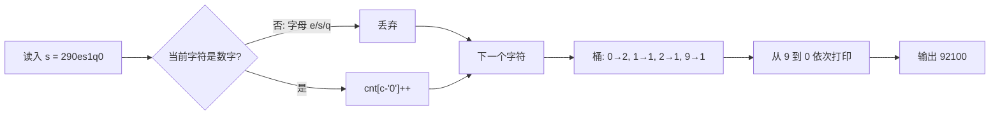

# P14357 [CSP-J 2025] 拼数 / number

> 原题链接：<https://www.luogu.com.cn/problem/P14357>
> 本目录导航：[← 题库索引](../../../README.md) ｜ [讲解代码](solution.cpp) · [元信息](metadata.yml) · [分步动画](visualization.html)

## 元信息

| 项目 | 内容 |
| --- | --- |
| 难度 | 入门（CSP-J 2025 T1，橙题） |
| 来源 | 洛谷 P14357 / 一本通 2129 |
| 标签 | 贪心、计数排序、字符串处理 |
| 时间复杂度 | O(n + 10) |
| 空间复杂度 | O(1)（不计输入串，仅 10 格计数桶） |
| 评测状态 | 未在洛谷提交；本机 `g++ -static -O2 -std=c++14 -Wall` 编译无警告，2 组官方样例实跑输出 `5` / `92100` 正确；算法另经 2957 组随机数据暴力对拍验证 |

## 题目大意

给一个字符串 $s$，只含小写英文字母和数字，**至少含一个 `1~9` 的数字**。从中任选若干个数字字符（每个字符最多用一次），任意排列拼成一个正整数，求能拼出的**最大值**。

- 输入：一行字符串 $s$，$1 \le |s| \le 10^6$
- 输出：一行一个正整数，即最大可拼出的值
- 样例：`290es1q0` → 数字为 `2,9,0,1,0` → `92100`

本质是把题面翻译成人话：**丢掉字母，剩下的数字从大到小排一排输出**。

## 思路推导

### 1. 暴力想法与它的瓶颈

最直接的想法是枚举"选哪些数字 × 怎么排列"——$|s|$ 可达 $10^6$，排列数是阶乘级，完全不可行。即便只考虑全排列也是 $O(n!)$。

瓶颈在于把问题当成了"搜索/排列"，而它其实有极强的单调结构。

### 2. 关键观察

比较两个正整数大小的第一条铁律：**位数多的更大**（无前导零前提下）。由此推出两条贪心策略。

- **观察 A：应当使用全部数字。** 每多用一个数字，结果就多一位。设已拼出的数为 $x \ge 1$，在末尾追加数字 $d$ 得到 $10x + d > x$。所以只要不受"前导零"限制，多一位永远更优。而题目保证至少存在一个 `1~9` 的数字，把它放首位即可避开前导零，因此"用全部数字"总是合法且最优。
- **观察 B：给定的多重集合下，降序排列最大。** 若相邻两位存在"小在前、大在后"（即 $a$ 在 $b$ 前面且 $a<b$），交换这两位：原来这一段的值是 $10a+b$，交换后是 $10b+a$，差为 $9(b-a)>0$，其余位权不变，所以交换后更大。反复消除逆序对即得降序。

### 3. 算法设计

观察 A + B 合起来就是**计数排序**：只需统计每个数字 $0\sim 9$ 出现几次，再从 $9$ 到 $0$ 依次打印对应次数。

1. 按字符串读入 $s$（绝不能试图存成整数，$10^6$ 位远超任何整型）。
2. 遍历一次，跳过非数字字符，`cnt[c-'0']++`。
3. 从 $d=9$ 递减到 $0$，各打印 `cnt[d]` 次字符 $d$。

$0\sim 9$ 只有 10 个桶，所以不需要真正排序，$O(n)$ 一遍扫描即可。

### 4. 正确性说明

**引理 1（位数最优）**：任一不使用全部数字的方案，都存在位数更多且合法（首位非零）的方案，其值更大。故最优解必使用所有数字。*证明*：见观察 A；首位可由题目保证存在的非零数字充当，追加操作 $x \mapsto 10x+d$ 严格递增。

**引理 2（顺序最优）**：固定数字多重集合后，降序序列是所有排列中数值最大者。*证明*：交换论证。若非降序，则存在相邻逆序对 $(a,b)$，$a<b$。两位所在权重设为 $10^{k+1}, 10^{k}$，交换使总值增加 $(10b+a)-(10a+b)=9(b-a)>0$，其余位贡献不变。反复交换使逆序对数（严格递减的非负整数）有限步内归零，终态即降序，且每步不减小。$\blacksquare$

由引理 1、2，算法输出的"全部数字降序串"即为答案。

### 5. 复杂度分析

- 时间：扫描 $O(n)$，输出 $O(n)$，共 $O(n)$；$n=10^6$ 远低于时限。
- 空间：`cnt[10]` 常量级，输入串 $O(n)$。

## 可视化讲解

计数桶的工作过程：



交互式分步演示见同目录 [`visualization.html`](visualization.html)，用浏览器打开可逐字符观察桶的变化与输出构造过程。

## 讲解代码

完整逐段注释版见 [`solution.cpp`](solution.cpp)。关键片段：

```cpp
for (char c : s) {
    if (c >= '0' && c <= '9') {   // 必须是数字才计数
        ++cnt[c - '0'];
    }
}
for (int d = 9; d >= 0; --d) {
    while (cnt[d] > 0) {          // 打印 cnt[d] 个字符 d
        cout << d;
        --cnt[d];
    }
}
```

### 原稿的问题：越界写

原代码为：

```cpp
int ar[20];
for (int i = 0; i < s.size(); i++) ar[s[i] - '0']++;   // ← 没有数字判定
```

题面说 $s$ **含小写字母**，而字母的 ASCII 也参与运算：`'e'-'0'=53`、`'q'-'0'=65`、`'s'-'0'=67`、`'z'-'0'=74`。数组只有 20 格，这些下标全部越界，属于未定义行为——它可能"碰巧"通过（越界写进了 BSS 段的其他全局变量，恰好没人读），也可能在某些评测环境下 RE 或输出错乱。**必须加 `isdigit` 判断**，或把数组开到 128 并显式过滤。

顺带两个小坑：

- `while(ar[i]--)` 会把计数一路减到 `-1`。本例不影响输出，但语义很脏，写成 `while(cnt[d] > 0) { cout << d; --cnt[d]; }` 更清楚。
- 少了 `ios::sync_with_stdio(false); cin.tie(nullptr);`。$n=10^6$ 时 `cin/cout` 默认同步会拖慢，本题不致 TLE，但属于好习惯。

## 易错点与坑

- **忘记过滤字母**：本题唯一陷阱，即上述越界。
- **试图用整数存**：$10^6$ 位，`long long` 只有 19 位，必须按字符串处理。
- **前导零担忧是多余的**：题目保证至少一个 `1~9`，降序输出时零必然排在末尾，不会成为首位。
- **输出用 `endl`**：$10^6$ 次 flush 可能拖到 TLE，统一用 `\n`。
- **反向思考的变式**：若题目改成"拼最小的正整数"，则需把最小非零数字放首位、零紧跟其后、其余升序——注意这一手"首位特殊处理"。

## 常见变式

| 变式 | 差异 | 对应题号 |
| --- | --- | --- |
| 最大数 | 元素是多位数，按 $a+b$ 与 $b+a$ 字典序比较拼接 | [LeetCode 179](https://leetcode.cn/problems/largest-number/) |
| 拼数最小值 | 首位取最小非零数字，其余升序 | 同型改动 |
| 计数排序模板 | 把 10 个桶换成 $k$ 个桶，注意值域 | 洛谷 P1177 |

## 小结

题面包装成"拼数"，实质是**计数排序 + 两条贪心引理（位数优先、高位优先）**。识别信号：值域极小（仅 10 个数字）时，用计数代替排序；而"越大越靠前"这类极值拼接题，一律先想交换论证。
