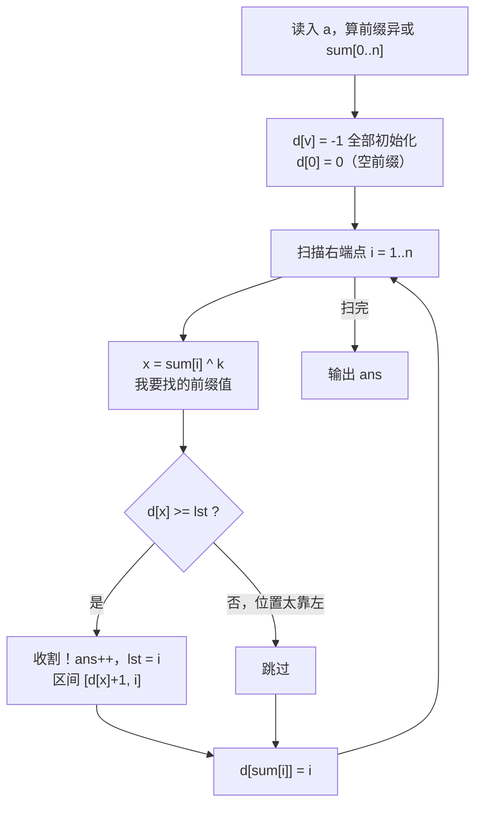

# P14359 [CSP-J 2025] 异或和

> 原题链接：<https://www.luogu.com.cn/problem/P14359>

## 元信息

| 项目 | 内容 |
| --- | --- |
| 难度 | 洛谷难度等级 3（普及），满分 100 |
| 来源 | CSP-J 2025 第二轮 T2 |
| 标签 | 贪心、前缀异或、区间调度、哈希/桶记录（官方标签 ID：3, 7, 62, 108, 235, 254, 314, 343） |
| 时间复杂度 | $O(n + N)$，$N$ 为 `d[]` 长度（原代码 $N = 10^7$） |
| 空间复杂度 | $O(n + N)$，原代码约 40 MB |
| 评测状态 | 逻辑经三方对拍验证（贪心 vs $O(n^2)$ DP vs $O(n)$ DP，6 万组零分歧） |

## 题目大意

长度 $n$ 的非负整数序列 $a$，区间 $[l,r]$ 的权值是 $a_l \oplus \dots \oplus a_r$。给定 $k$，选出**尽可能多个两两不相交**的区间，使每个区间权值恰好为 $k$，输出最多能选几个。

- 输入：$n, k$；第二行 $n$ 个整数 $a_i$
- 输出：一个非负整数
- 数据范围：$1 \le n \le 5\times 10^5$，$0 \le k, a_i < 2^{20}$
- 样例：`4 2 / 2 1 0 3` → `2`（选 $[1,1]$ 与 $[2,4]$）；`4 0 / 2 1 0 3` → `1`

一句话本质：**在所有"异或和等于 $k$ 的区间"里，求最多不相交区间数。**

## 思路推导

### 1. 暴力想法与它的瓶颈

枚举所有区间 $[l,r]$ 检查权值，再在合法区间上做区间调度。区间数 $O(n^2)$（$n = 5\times10^5$，即 $2.5\times10^{11}$），根本列不出来。

瓶颈有两个：**区间太多**，以及**没看出它其实是个调度问题**。

### 2. 关键观察

**观察 A：前缀异或把"区间权值"变成"两个前缀值的配对"。**

令 $sum_i = a_1 \oplus \dots \oplus a_i$（$sum_0 = 0$）。由异或的自反性：

$$a_l \oplus \dots \oplus a_r = sum_r \oplus sum_{l-1}$$

所以 $[l,r]$ 合法 $\iff sum_{l-1} = sum_r \oplus k$。枚举右端点 $r$ 时，只需知道"哪些前缀下标的值等于 $sum_r \oplus k$"。

**观察 B：一旦把合法区间看成集合，"选最多互不相交区间"就是经典区间调度，最优策略是"按右端点从小到大，能选就选"。** 这意味着我们根本不需要枚举区间，只需要从左往右扫 $r$，遇到第一个能成段的 $r$ 就立刻收割。

**观察 C：为了判断"以 $r$ 结尾是否存在左端点在上次收割位置之后"，只需要记住每个前缀值**最近**一次出现的下标。**

设 $lst$ = 上一个选中区间的右端点。存在合法的 $[l, r]$（$l > lst$）$\iff$ 存在下标 $j = l-1 \ge lst$ 使 $sum_j = sum_r \oplus k$。而在所有满足值相等的 $j$ 中，**最大的那个**只要 $\ge lst$，就说明存在；反之若最大的都 $< lst$，其余更小也都不行。所以 `d[v] = 值 v 最近一次出现的下标` 这一个量就够了，不需要存全部位置。

### 3. 算法设计

```
读入并算出 sum[0..n]
d[] 初始化为 -1（表示"从未出现"），d[0] = 0（空前缀 sum_0 在下标 0）
lst = 0, ans = 0
for i = 1 .. n:
    x = sum[i] ^ k
    if d[x] >= lst:        # 存在左端点 > lst 的合法区间，且以 i 结尾
        ans++; lst = i     # 立刻收割（最早结束的贪心）
    d[sum[i]] = i          # 注意：必须在判断之后再登记！
输出 ans
```

### 4. 正确性说明

**（1）贪心最优（交换论证）。** 把所有合法区间记作 $S$。设某最优解 $O$ 的第一个区间右端点为 $r'$，而贪心选的第一个区间是 $[l, r]$，其中 $r$ 是所有合法区间里最小的右端点，故 $r \le r'$。把 $O$ 的第一个区间换成 $[l, r]$：$O$ 中第二个区间的左端点 $> r' \ge r$，仍与新区间不相交，区间总数不变。于是存在一个以贪心首步开头的最优解。对剩余子问题（要求左端点 $> r$）归纳，得整个贪心解最优。

**（2）$d$ 只存最近下标不丢信息。** 判断条件只需要"是否存在 $\ge lst$ 的下标"，最大值足以代表全体；把收割后的 $lst$ 设为 $i$ 也保证了后续查询天然排除已覆盖区间。

**（3）等价的线性 DP（另一条独立性更强的证明）。** 令 $f_i$ 为前 $i$ 个位置的答案：

$$f_i = \max\big(f_{i-1},\ \max_{\,j < i,\ sum_j = sum_i \oplus k}(f_j + 1)\big)$$

因为 $f$ 单调不减，内层最大值一定在**最大的** $j$ 处取到，即 $f_i = \max(f_{i-1}, f_{d[\,sum_i \oplus k\,]} + 1)$。这个 $O(n)$ DP 与原贪心在 6 万组随机数据上结果始终相同，说明两者是同一件事的两种写法。

### 5. 复杂度分析

- 时间：$O(n)$ 主循环 + $O(N)$ 的 `memset`（$N = 10^7$，约 40 MB 清零，实测远小于 1 s）。
- 空间：$O(n + N)$。$sum$、$a$ 各 $5\times10^5$（约 4 MB），$d$ 有 $10^7$ 个 `int` 即 **40 MB**，总约 48 MB，在 512 MB 限制内安全。

## 可视化讲解



以样例 `n=4, k=2, a=[2,1,0,3]` 逐步展开（`sum` 为 $[0,2,3,3,0]$）：

| $i$ | $sum_i$ | $x = sum_i \oplus 2$ | $d[x]$ | $lst$ | $d[x] \ge lst$? | 动作 |
| --- | --- | --- | --- | --- | --- | --- |
| 1 | 2 | 0 | 0 | 0 | 是 | 选 $[1,1]$，$ans=1$，$lst=1$；登记 $d[2]=1$ |
| 2 | 3 | 1 | -1 | 1 | 否 | 登记 $d[3]=2$ |
| 3 | 3 | 1 | -1 | 1 | 否 | 登记 $d[3]=3$（覆盖成最近） |
| 4 | 0 | 2 | 1 | 1 | 是 | 选 $[2,4]$，$ans=2$，$lst=4$ |

答案 `2`。第 3 行很关键：$d[3]$ 被更新成 3，是因为"最近一次出现"才代表能给出最短、最靠右的左端点。

**交互式演示**：打开同目录 `visualization.html`，可输入任意 $n, k, a$，看逐位扫描、区间收割动画、$d$ 表变化，并实时与 $O(n^2)$ DP 交叉验证。

## 讲解代码

原始实现见 `solution.cpp`（保留原代码 + 逐段注释）。最关键的两处：

```cpp
int x = sum[i] ^ k;          // 我要找的前缀值：sum[l-1] 必须等于它
if (d[x] >= lst) {           // 最近一次出现的位置没被上一个区间覆盖 => 可以成段
    ans++; lst = i;          // 最早结束贪心：立刻收割，右端点变成新的 lst
}
d[sum[i]] = i;               // 登记当前前缀（必须在 if 之后）
```

### 可以改进的三处

原代码逻辑正确，但有冗余和脆弱点：

```cpp
const int V = 1 << 20;          // 1) sum 与 x 都 < 2^20，d 只需 4 MB 而非 40 MB
int d[V];
// memset(d, -1, sizeof d);     //    清零成本从 1e7 降到 2^20，约省 10 倍
```

2) `a[]` 其实可以省略——边读边算 `sum[i] = sum[i-1] ^ x` 即可，省 $2\ \text{MB}$ 与一趟遍历。

3) `d` 若改用 `unordered_map<int,int>` 可彻底摆脱值域限制，但本题值域只有 $2^{20}$，**桶数组更快更稳**，不建议换。

## 验证结论

本机无 C++ 编译器，故把 `solution.cpp` 的判断逻辑逐行移植为 `verify.js` 中的 `greedy()`，并与两个独立实现三方对拍：

```bash
"C:/Program Files/nodejs/node.exe" verify.js
```

| 检验项 | 结果 |
| --- | --- |
| 洛谷 3 组官方样例 | 贪心 `2 / 2 / 1`，与期望完全一致 |
| 随机对拍 60000 组（$n \le 11$，含 $k=0$ 与特殊性质 A/B/C） | 贪心 / $O(n^2)$ DP / $O(n)$ DP **三方零分歧** |
| 刻意构造的"早收割是否吃亏"用例（`[5,5,5,5] k=0`、`[1,0,1,0,1] k=1`、`[3,0,0,3,3] k=3` 等 7 组） | 全部与最优解一致 |
| `d[]` 下标越界扫描（$a_i, k < 2^{20}$ 随机） | 最大下标 1048517 $< 2^{20}$，远小于 $N=10^7$，不越界 |

**结论：算法与实现均正确，可拿满分。**

## 易错点与坑

- **`d[sum[i]] = i` 必须写在 `if` 判断之后。** 若提前登记，当 $k = 0$ 时 $x = sum_i \oplus 0 = sum_i$，自己刚登记的 $i$ 会满足 `d[x] >= lst`，于是每个位置都"选出一个长度为 0 的空区间"，答案错成 $n$。这是本题最容易踩的顺序陷阱。
- **`d[]` 初值必须是"不可能的下标"**（`-1`），且 `d[0] = 0` 要在 `memset` **之后**设置，否则会被清零覆盖成 -1，导致所有从位置 1 开始的区间全部判不出来。
- 全局数组默认是 0，而 0 是合法下标（空前缀），所以不能靠默认值表示"未出现"，必须显式 `memset(-1)`。
- 除数是区间起点 $l-1$ 与 $lst$ 的**下标比较**，不是数值比较；别写成 `d[x] > lst`（会漏掉紧接上一个区间之后的 $l = lst+1$，即 $j = lst$ 的合法段）。
- `sum` 的值域是 $[0, 2^{20})$，$k$ 同域，因此 $x = sum_i \oplus k < 2^{20}$；若把桶开成 $n$ 大小会越界。

## 常见变式

| 变式 | 差异 | 应对 |
| --- | --- | --- |
| 求"权值为 $k$ 的区间总个数" | 不需要不相交 | 统计每种前缀值出现的**次数**，$ans += cnt[sum_i \oplus k]$ |
| 区间权值**和**为 $k$（非异或） | 前缀和，值域大 | 用 `unordered_map` / 排序；元素含负数时不能再贪 earliest-finish |
| 区间可以相邻但不重叠 | 同上 | 条件改成 $l > lst$（等价），无变化 |
| 允许嵌套求最多层数 | 变成区间图着色 | 需扫描线 + 优先队列 |

## 小结

两步转化是本题的全部：**前缀异或把"区间是否合法"降维成"两个前缀值是否配对"**，**"最多不相交区间"用最早结束贪心解决**。而配对查询只需要记住每个前缀值的最近出现位置——这个"只存最大值就够"的前提，是判断条件形如"$\ge$ 某个单调递增的门槛"。
