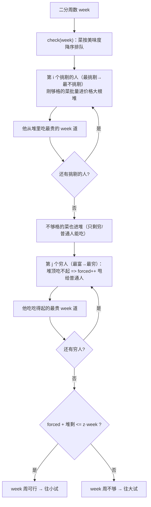

# P1752 点菜

> 原题链接：<https://www.luogu.com.cn/problem/P1752>
> 本目录导航：[← 题库索引](../../../README.md) ｜ [讲解代码](solution.cpp) · [元信息](metadata.yml) · [分步动画](visualization.html) · [对拍记录](verify/RESULTS.md)

## 元信息

| 项目 | 内容 |
| --- | --- |
| 难度 | 洛谷 省选/NOI−（难度 7），改编自 IOI 2013 Day 2 T2（出题人说明：见过许昊然题解的一眼能认出来，许版题解在 NOI 官网） |
| 来源 | 洛谷 P1752 |
| 标签 | 二分答案、贪心（交换论证）、二叉堆（优先队列） |
| 时间复杂度 | $O(m\log^2 m)$（每次 check $O(m\log m)$，二分 $\log m$ 次；实测 $m=2\times10^5$ 最慢 0.654 s） |
| 空间复杂度 | $O(n + m)$ |
| 算法验证 | ✅ 与独立网络流暴力随机对拍 **6800 组 0 不一致**（5000 组小 + 1500 组中 + 300 组较大）；官方样例本地输出 3 |
| 评测状态 | 未本地评测（无洛谷登录，仅本地自测）；官方样例实测输出 `3`；满约束（$n=5\times10^4,m=2\times10^5$）四组实测 0.30~0.65 s |

## 题目大意

题面里决定生死的两句话（**原文照抄**）：

> 这 $n$ 个人每周都会来一次，每次只会点一道菜或不点。在这 $n$ 个人中，有 $p$ 个人比较挑剔，他们只能接受美味度大于等于一定值的菜；有 $q$ 个人比较贫穷，他们只能点价格小于等于一定值的菜。**挑剔的人绝对不是贫穷的人。**

压成一句：$n$ 个人去吃 $m$ 道菜，每人**每周至多点一道**；$p$ 个挑剔的人只点"美味度 $\ge$ 下限"的菜，$q$ 个贫穷的人只点"价格 $\le$ 上限"的菜（两类人不重叠），**剩下 $n-p-q$ 个普通人什么都吃**。问最少几周能把 $m$ 道菜全部点过一遍；永远做不到输出 $-1$。

- 输入：第一行 $n,m,p,q$；接下来 $m$ 行每行"美味度 价格"；然后一行 $p$ 个挑剔下限；一行 $q$ 个贫穷上限
- 输出：最少周数，或 $-1$
- 数据范围：$p+q \le n \le 50000$，$m \le 200000$；菜和阈值的数值范围题面没给，**一律按 `long long` 读**
- **官方样例**：

  ```
  2 3 1 1     <- n=2 人, m=3 道菜, p=1 挑剔, q=1 贫穷
  5 2         <- 菜：美味度 5，价格 2
  5 3         <- 菜：美味度 5，价格 3
  6 4         <- 菜：美味度 6，价格 4
  5           <- 挑剔的人：只吃美味度 >= 5
  1           <- 贫穷的人：只点价格 <= 1
  ```

  输出 `3`。先把样例吃透，本题全部要点都藏在它里面：

  | 菜 | 挑剔的人（美 ≥ 5）能吃？ | 贫穷的人（价 ≤ 1）能吃？ |
  | --- | --- | --- |
  | (5, 2) | ✅ | ❌ 2 > 1 |
  | (5, 3) | ✅ | ❌ |
  | (6, 4) | ✅ | ❌ |

  三道菜**只有挑剔的人一个人吃得着**，他每周至多一道 ⇒ 至少 3 周。注意两件事：答案 $3$ **大于** $\lceil m/n\rceil = \lceil 3/2\rceil = 2$（容量不是瓶颈，约束才是）；而只要给到 3 周，挑剔的人自己全吃完，贫穷的人一口不吃也合法（"或不点"）。

## 思路推导

### 1. 暴力想法与它的瓶颈

初三同学的第一反应大概率是**逐周模拟**：每周给每个人安排一道菜（或不点），搜索所有排法。或者退一步，枚举"每道菜分给谁"：

```
每道菜有 n 种去向（也可以没人点？不行，必须全点完）=> n^m 种分配
```

$n=2,m=3$ 时才 8 种，$n=5\times10^4$ 时是 $50000^{200000}$ —— 宇宙热寂也跑不完。就算只问判定"$k$ 周行不行"，"每周谁点哪道"的**时间顺序**本身就是个巨大的搜索空间。

瓶颈的本质：我们想知道的是"够不够"，却把"怎么排"也一起枚举了。暴力可以使用 `verify/brute.cpp` 的做法——二分周数 + 网络流判定（源点→人容量 $k$，人→菜连可达边，菜→汇容量 1，满流即可行）。它是对的，也是本仓库的对拍基准，但考场上写网络流又长又容易错；本题的贪心结构足以把网络流整个省掉。

### 2. 关键观察

#### 观察 1：答案单调，"至少几周"可以二分

$k$ 周能点完，$k+1$ 周用**同一个分配**当然也能（每人限额只会变宽）。所以可行的周数是一段前缀 $[k^\star, +\infty)$，"最少几周"就是找左端点——二分。判定函数 `check(week)` 只需回答"week 周够不够"，比"最少几周"少了一层最优化。

#### 观察 2：时间轴塌缩成容量——"排周次"根本不用管

每人每周至多一道 ⇒ 每人 week 周至多 **week 道**。反过来，只要每人分到的菜不超过 week 道，就一定能排出周次（任意铺开即可，人和人之间互不干扰，同一个人的菜也没有先后约束）。于是：

$$\text{check(week)} \iff \text{能否把 } m \text{ 道菜全部分掉，每人不超过 week 道}$$

"逐周模拟"塌缩成"一次性分配"。这一步是本题第一道分水岭：想不通它就会去写搜索。

#### 观察 3：谁能吃什么，全由两类阈值说了算

把菜摊开看"谁吃得起/吃得着"：

- **贵菜**（价格高过某些穷人的上限）：贫穷的人无缘，只能指望**挑剔的人和普通人**；
- **不够美味的菜**（美味度低于某个挑剔者的下限）：越挑剔的人越无缘，最后落到**穷人和普通人**头上；
- **普通人**（$n-p-q$ 个）什么都吃——他们是最后的兜底容量。

所以分配的矛盾只有一对：**挑剔的人的胃口有限**（每人 week 道），**穷人的钱包有限**（每人 week 道），而普通人只看总量。判定就是让前两类人把"只有他们能消化"的菜扛掉，剩下的看普通人容量装不装得下。

#### 观察 4：挑剔的人应该吃"够格菜里最贵的"——而且最挑剔的先挑

挑剔的人 $\ge$ 下限就合法，美味度再高不加分；但对全局来说，**贵菜是穷人消化不了的**。让挑剔的人把"自己吃得起的里面最贵的"扛走，等于用最缺的胃口去消化最缺人吃的菜，给穷人留下一摊最便宜的。

顺序上**从最挑剔到最不挑剔**：最挑剔的人能吃的菜最少，先让他从自己的小池子里挑；轮到后面的挑剔者时，池子只扩不小（美味度下限更低 ⇒ 前面人能吃的他都能吃），前面人没吃完的贵菜还躺在池子里等他。实现上这就是一个**价格大根堆**：菜按美味度从大到小、分 $p$ 批进堆（第 $i$ 批 = 刚够第 $i$ 挑剔的人吃的），每人轮到时从堆里取最贵的 week 道。

#### 观察 5：穷人从最富的开始，吃不起的直接甩给普通人

贫穷的人按上限**从大到小**处理。当前最富的穷人：

- 堆顶比他上限还贵 ⇒ 比他更穷的人更吃不起，这菜**只能**普通人消化，记一笔 `forced` 甩出去；
- 然后他从堆里吃最贵的 week 道（吃得起的部分里挑最贵的，还是"把难消化的扛走"）。

全部穷人处理完，`forced + 堆里剩的` 就是普通人必须消化的总量，和普通人容量 $z\cdot \text{week}$（$z=n-p-q$）比一下，判定结束。

### 3. 算法设计

```
读入，菜按美味度降序、挑剔下限降序、贫穷上限降序排序，z = n - p - q

check(week):                          # 大根堆按价格
    堆 = 空；idx = 0
    for i = 1..p:                     # 挑剔的人，从最挑剔到最不挑剔
        while idx < m 且 dish[idx].美 >= 下限[i]: 堆.push(价格[idx++])
        从堆里弹 week 道（不足则全弹）  # 第 i 个挑剔的人吃掉
    while idx < m: 堆.push(价格[idx++])   # 谁都不够格吃的菜，只能给穷/普通人
    forced = 0
    for j = 1..q:                     # 贫穷的人，从最富到最穷
        while 堆顶 > 上限[j]: 堆.pop()，forced++
        从堆里弹 week 道（不足则全弹）
    return forced + 堆.size() <= z * week

若 check(m) 为假：输出 -1             # 人人放开吃都不够 => 有菜谁都不接受
否则二分最小 week ∈ [1, m] 使 check(week) 为真，输出它
```

**二分上界为什么是 $m$ 而不是 $\lceil m/n\rceil$**：$\lceil m/n\rceil$ 只是"容量够"的下限，约束可能逼着一个人吃很多——官方样例 $n=2,m=3$ 答案就是 $3$。取 $\text{hi}=m$ 一定够：week $=m$ 时每人可吃 $m$ 道，一个人就能吃完全部菜，此时可行 $\iff$ 每道菜都有人能接受。

### 4. 正确性说明

下面三个引理合起来：**贪心判定 ⟺ 真实可行**，再由观察 1 的单调性，二分成立。

**引理 1（挑剔阶段：轮到你，就该拿最贵的）**。设挑剔下限降序 $a_1\ge a_2\ge\cdots\ge a_p$。若原问题可行，则存在一个可行分配，使得第 $i$ 个挑剔的人拿的恰是"轮到他时（前 $i-1$ 人已按此规则拿完）他够格的菜里最贵的 week 道，不足则全拿"。

*证明*（交换论证 + 归纳）：任取可行分配 $F$，逐步把它扳成贪心形状。设正在扳第 $i$ 人，目标集 $W$ = 当前够格池里最贵的 week 道菜。若 $F$ 中第 $i$ 人拿的某道菜 $d'$ 不在 $W$ 里而 $W$ 中某道菜 $d$ 在别人手里，就交换 $d\leftrightarrow d'$，其中 $d'$ 取第 $i$ 人手里**最便宜**的一道：

- $d'$ 在 $F$ 里属于谁，决定了交换是否合法：属于**穷人** $y$ —— $d$ 本来就是 $y$ 的，$\text{price}(d)\le b_y$，而 $\text{price}(d')\le \text{price}(d)$（$W$ 是最贵 week 道，$d'$ 不在 $W$ 里），所以 $y$ 改吃 $d'$ 依然吃得起；属于**普通人** —— 什么都吃，合法；属于**更不挑剔的自己人** $x_j(j>i)$ —— 池子嵌套（$a_j\le a_i$），第 $i$ 人够格的菜 $d'$ 他必然够格；
- 交换后第 $i$ 人吃进的 $d$ 比吐出的 $d'$ 贵，挑剔的人吃掉的菜按价格**逐位不降**；每人菜数不变，全部菜仍被吃光，可行性保持。

反复交换直到第 $i$ 人拿满 $W$，归纳即得。$\blacksquare$

推论：贪心的挑剔阶段吃掉的菜，**道数**达到上限、**价格**逐位不劣于任何可行分配——于是留给后面的菜集合 $R_{\text{贪心}}$，按价格降序逐位 $\le$ 任何可行分配留下的 $R_F$，且元素更少。

**引理 2（穷人阶段：甩给普通人的账目不多不少）**。贪心的穷人阶段结束后，`forced + 堆剩` 恰是"必须由普通人消化"的最少菜数。

*证明*：必要性：在穷人 $j$ 轮次被甩出的菜，价格 $> b_j$，比他穷的人更吃不起，而更富的穷人已吃满 week 道——只能普通人吃；收尾时堆里剩的菜是穷人容量耗尽后的残余，同样只能普通人吃。充分性：穷人们按"最富先挑、挑吃得起的最贵"进行，与引理 1 同款交换论证可扳成任意可行分配的形状而不增加残余；若最终 `forced + 堆剩 ≤ z·week`，把剩余菜任意铺给普通人（每人 ≤ week 道）即完成分配。$\blacksquare$

**引理 3（check 与真实可行等价 + 单调）**。引理 1、2 说明 `check(week)` 为真 ⟺ 存在把 $m$ 道菜分完、每人 ≤ week 道的分配 ⟺ week 周真的够用（观察 2）。而"week 周够用 ⇒ week+1 周够用"是显然的（同一分配），故 `check` 关于 week 单调，二分求最小真值合法。$\blacksquare$

**定理（-1 判定）**。`check(m)` 为假 ⟺ 有人人都接受不了的菜。普通人存在（$z\ge1$）时一切菜都有人吃、check(m) 必真；$z=0$ 时，一道"美味度低于所有挑剔下限、价格高于所有贫穷上限"的菜永远没人吃，任何 week 都判假。$\blacksquare$

> 课堂追问"凭什么这是贪心而不是凑巧"：因为每一处"挑最贵/最富优先"都能用上面的交换论证扳出来——**交换面前人人平等**。另外，纯理论之外本仓库用独立写的网络流暴力（`verify/brute.cpp`）对拍 6800 组，0 不一致。

### 5. 复杂度分析

每次 `check`：每道菜至多进堆一次、出堆一次，堆操作 $O(\log m)$ ⇒ $O(m\log m)$；二分 $\log m$ 轮 ⇒ 总计 $O(m\log^2 m)$。

| 规模 | 量级 |
| --- | --- |
| $m=2\times10^5$，$p+q=5\times10^4$ | $2\times10^5\times18\times18\approx6.5\times10^7$ 堆操作 |

实测（本机 g++ `-static -O2`，完整表见 [`verify/RESULTS.md`](verify/RESULTS.md)）：满约束四组 0.30~0.65 s，洛谷 1.00 s 时限内有余量；空间 $O(n+m)$。

## 可视化讲解



分步演示（官方样例 $n=2,m=3,p=1,q=1$：菜的排序、进堆/弹出逐道高亮、穷人甩账、普通人容量判定，以及任意手输数据的完整 check 过程）见同目录 [`visualization.html`](visualization.html)，浏览器直接打开、离线可播。

## 讲解代码

完整逐段注释版见 [`solution.cpp`](solution.cpp)；下面是板书级别的骨架。

**① check(week) 的堆贪心（本题心脏）**

```cpp
bool check(ll week) {
    priority_queue<ll> heap;                    // 价格大根堆：挑剔的人还能选的菜
    int idx = 0;
    for (int i = 0; i < p; i++) {               // 挑剔的人：最挑剔的先挑
        while (idx < m && dish[idx].del >= pickyMin[i])
            heap.push(dish[idx++].pri);         // 刚够格的菜进堆
        for (ll t = 0; t < week && !heap.empty(); t++)
            heap.pop();                         // 吃最贵的 week 道，不足则全吃
    }
    while (idx < m) heap.push(dish[idx++].pri); // 谁都不够格的菜，丢给后面的人
    ll forced = 0;
    for (int j = 0; j < q; j++) {               // 穷人：最富的先挑
        while (!heap.empty() && heap.top() > poorMax[j]) {
            heap.pop(); forced++;               // 吃不起 => 更穷的更吃不起，甩给普通人
        }
        for (ll t = 0; t < week && !heap.empty(); t++)
            heap.pop();                         // 吃得起的最贵 week 道
    }
    return forced + (ll)heap.size() <= z * week; // 普通人容量兜底
}
```

**② -1 判定 + 二分（上界是 m，不是 ⌈m/n⌉）**

```cpp
if (!check(m)) {                 // 人人都放开吃还不够 => 有菜谁都不接受
    printf("-1\n");
    return 0;
}
int lo = 1, hi = m;
while (lo < hi) {
    int mid = lo + (hi - lo) / 2;
    if (check(mid)) hi = mid;    // mid 周够 => 试更小
    else lo = mid + 1;           // 不够 => 只能更多周
}
printf("%d\n", lo);
```

**③ 读入与排序——菜必须捆绑排序**

```cpp
struct Dish { ll del, pri; };                    // 美味度、价格绑在一个结构体里
sort(dish, dish + m, [](const Dish &x, const Dish &y) { return x.del > y.del; });
sort(pickyMin, pickyMin + p, greater<ll>());     // 挑剔下限：大 → 小
sort(poorMax, poorMax + q, greater<ll>());       // 贫穷上限：大 → 小
```

### 机器实测记录

逐字照抄终端结果（exe 与临时数据不进仓库）：

```bash
$ g++ -static -O2 -std=c++14 solution.cpp -o sol.exe
$ g++ -static -O2 -std=c++14 verify/brute.cpp -o brute.exe

$ printf '2 3 1 1\n5 2\n5 3\n6 4\n5\n1\n' | ./sol.exe      # 官方样例
3

$ node verify/stress.js ./sol.exe ./verify/brute.exe 5000 6 8
共 5000 组，不一致 0 组
$ node verify/stress.js ./sol.exe ./verify/brute.exe 1500 15 25
共 1500 组，不一致 0 组
$ node verify/stress.js ./sol.exe ./verify/brute.exe 300 30 40
共 300 组，不一致 0 组

# 满约束性能（n=5e4, m=2e5，四组不同人数配比/值域，计时 time）
$ ./sol.exe < big_a.txt    # 输出 4    real 0m0.436s
$ ./sol.exe < big_b.txt    # 输出 4    real 0m0.654s
$ ./sol.exe < big_c.txt    # 输出 -1   real 0m0.295s
$ ./sol.exe < big_d.txt    # 输出 4    real 0m0.344s
```

中间还有一段真实插曲：第一版把美味度、价格拆在两个数组里**各自排序**，配对全被打乱，对拍第 10 组立刻报不一致（暴力 2、正解 1）——见易错点 1。修成结构体捆绑排序后 6800 组 0 不一致。

## 易错点与坑

1. **菜必须捆绑排序**。把 `del[]`、`pri[]` 拆成两个数组各 `sort` 各的，排序后"美味度 5 配价格 3"会变成"美味度 5 配别的价格"，整个输入语义就毁了。这是本目录第一版**实测踩中**的坑（对拍第 10 组抓出）。菜是二元组，用 `struct` 或 `pair` 整体排序。
2. **`long long`**。判定式里的 $z\cdot \text{week}$ 最大 $5\times10^4\times2\times10^5=10^{10}$，`int` 直接溢出；菜的美味度/价格、两类阈值题面没给范围，读入也全用 `ll`。洛谷讨论区题解作者点名"不开 long long 见 80 分"。
3. **二分上界是 $m$**。写成 $\lceil m/n\rceil$ 会在"少数人被迫吃很多"的数据上把可行判成不可行——官方样例就是这样的反例（$n=2,m=3$，答案 3）。
4. **等号方向**。挑剔是"美味度 $\ge$ 下限"、贫穷是"价格 $\le$ 上限"，**两处都含等号**。写成严格不等号，在阈值与菜值大量相等的数据上必挂（对拍生成器把值域压到 0..2 就是为了轰炸这个点）。
5. **别丢掉普通人**。$n-p-q$ 个"什么都吃"的人：判定式容量是 $z\cdot\text{week}$；他们的存在还保证 $z\ge1$ 时永远不会输出 $-1$。
6. **"不足则全取"**。挑剔/贫穷的人吃不满 week 道是合法的（题面说"或不点"），堆空了就停，不要强行凑满。
7. **堆每次 check 新建**。`check` 会被二分调用几十次，堆必须定义在 `check` 内部（或每次 `clear`），残留堆会让第二轮判定全错。
8. **-1 要先于二分判**。先 `check(m)`，假则直接 `-1`；否则二分区间 $[1,m]$ 内必有真值，输出最小真值即可。

## 常见变式

| 变式 | 差异 | 对应题号 |
| --- | --- | --- |
| 本题原型 | IOI 2013 Day 2 T2（娃娃与机器人），许昊然题解见 NOI 官网；同款"二分 + 堆贪心"骨架 | IOI 2013 Robots |
| 二分答案 + 贪心判定（最大化最小块） | 判定对象从"分配可行性"换成"切割可行性"，贪心同样靠交换论证撑腰 | [P3017](../../dp/p3017-brownie/README.md) 布朗尼切片 |
| 二分答案 + 最小跳距最大化 | "最大化最小值"族入门题，判定是线性扫 | P2678 跳石头 |
| 同名警告 | "点菜"是**计数 DP**（方案数），和本题毫无算法血缘，检索时别混 | P1164 小A点菜 |

## 小结

一句话提炼（板书用，可独立引用）：

> **问"至少几次"先二分答案，把最优化压成判定；判定时让最受约束的人先挑、去消化"只有他能消化"的菜（挑剔的人吃够格里最贵的，穷人从最富的开始吃吃得起的最贵的），吃不动的一切给最自由的人兜底——容量装得下就可行。**
