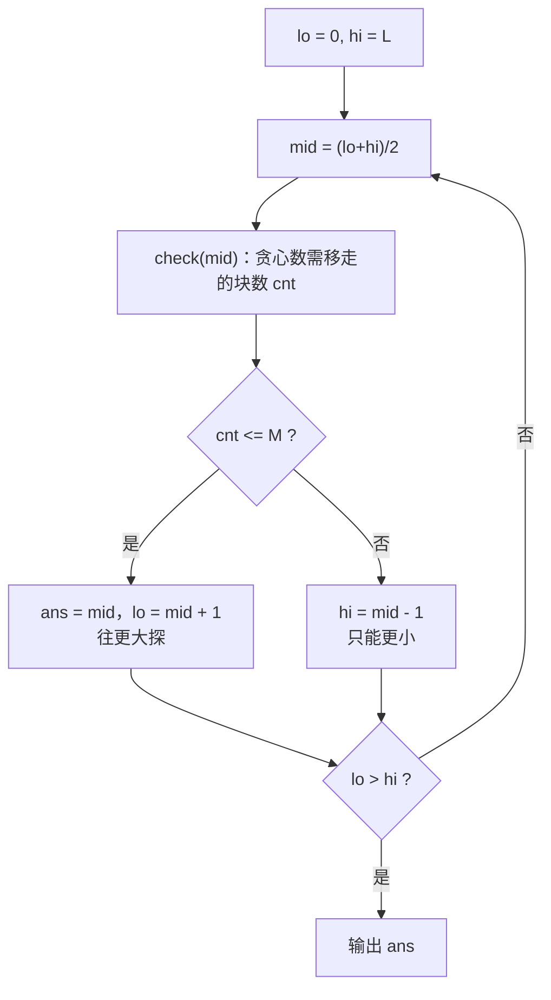

# P2678 [NOIP 2015 提高组] 跳石头

> 原题链接：<https://www.luogu.com.cn/problem/P2678>
> 本目录导航：[← 题库索引](../../../README.md) ｜ [讲解代码](solution.cpp) · [元信息](metadata.yml) · [对拍脚本](verify.js) · [分步动画](visualization.html)

## 元信息

| 项目 | 内容 |
| --- | --- |
| 难度 | 普及（洛谷 difficulty=3，NOIP 2015 提高组 Day2 T1） |
| 来源 | NOIP 2015 提高组 Day 2 第一题 |
| 标签 | 二分答案、贪心、**最大化最小值**、NOIP 真题 |
| 数据范围 | $1\le L\le10^9$，$0\le M\le N\le50000$，$0<D_i<L$ 且严格递增 |
| 时间 / 空间 | $O(N\log L)$ / $O(N)$ |
| 时限 / 内存 | 1000 ms / 128 MB |
| 评测状态 | 未本地评测（洛谷提交需登录）；本地 `g++ -static -O2 -std=c++14` 编译，样例输出 `4` 逐字正确；与「枚举 $2^N$ 种保留集合」独立暴力随机对拍共 3100 组（JS 双实现 3000 组 + 编译后 `solution.exe` 100 组）0 不一致，另 5 项定向边界/hack 全通过 |

## 题目大意

河道长 $L$，起点在 $0$、终点在 $L$。中间有 $N$ 块石头，第 $i$ 块距起点 $D_i$（严格递增）。至多移走 $M$ 块石头（起点终点不能移），让选手每一步跳的**最小距离尽可能大**，求这个最大值。

- 输入：第一行 `L N M`，随后 $N$ 行每行一个整数 $D_i$。
- 输出：一个整数——最短跳跃距离的最大值。
- 样例：`25 5 2` / `2 11 14 17 21` ⇒ `4`（移走 2 和 14，落点 $0,11,17,21,25$，间距 $11,6,4,4$，最小 $4$）。

> 与 [P1182 数列分段](../p1182-segment/README.md) 是同一套二分答案框架的两个方向：那题"最小化最大值"，本题"最大化最小值"。建议连堂讲，学生会立刻发现"判定函数长得不一样，但骨架一模一样"。

## 思路推导

### 1. 暴力想法与它的瓶颈

枚举移走哪 $M$ 块石头（或更少），方案数 $\sum_{k\le M}\binom{N}{k}$。$N=50000$ 时完全不可行——连 $N=20$ 都跑不完。

和 P1182 一样，突破口是**换个问法**。

### 2. 关键观察

#### 观察 1：把"求最大"换成"判定能不能"

> **给定 $X$，能不能移走至多 $M$ 块石头，使所有相邻落点距离都 $\ge X$？**

#### 观察 2：判定可以一趟贪心做完

从左往右走，维护上一个**保留**的落点 `last`（初始是起点 $0$）：遇到一块石头，如果它离 `last` 太近（$<X$），那它**必须**移走；否则保留它，`last` 前移。

为什么"太近就移走"一定最优？因为**移走当前这块，会把它的距离并给后面**，让后续更好安排；而保留它只会把落脚点钉死在这里。这正是交换论证的场景（§4 引理 1）。

#### 观察 3：可行性对 $X$ 单调 ⇒ 二分

$X$ 越小越容易满足。所以"可行"的 $X$ 构成一段前缀 $[0,\text{ans}]$，二分**最大的可行 $X$**。

### 3. 算法设计

**二分区间**：$lo=0$，$hi=L$（把石头全移走时，一次从起点跳到终点，答案是 $L$）。

**判定 `check(X)`**：

```
cnt = 0, last = 0                      # last 是下标，a[0] = 0 是起点
for i = 1..N:
    if a[i] - a[last] < X:  cnt++       # 太近 -> 这块石头必须移走
    else:                   last = i    # 够远 -> 保留，落脚点前移
if L - a[last] < X:  cnt++              # 终点前最后一段也不够 -> 再移走一块
return cnt <= M
```

最后那一行是本题**唯一的证明难点**，见 §4 引理 2/3。它"移走"的其实是刚保留的 `last`，不是终点。

**二分**（找最大可行值）：



### 4. 正确性说明

**引理 1（贪心移走数最少）**：固定 $X$，设贪心保留的石头位置为 $g_1<g_2<\dots<g_k$（另记 $g_0=0$ 为起点），任一合法方案保留的位置为 $o_1<o_2<\dots<o_j$（$o_0=0$，且 $o_{t+1}-o_t\ge X$）。则对每个 $t\le\min(k,j)$ 有 $g_t\le o_t$。

*证明（归纳）*：$g_0=0=o_0$。设 $g_t\le o_t$。贪心取 $g_{t+1}$ 为**第一个**满足 $D\ge g_t+X$ 的石头；而合法方案中 $o_{t+1}\ge o_t+X\ge g_t+X$，所以 $o_{t+1}$ 本身就是贪心的一个候选位置，贪心取最早的候选 ⇒ $g_{t+1}\le o_{t+1}$。$\blacksquare$

由 $g_t\le o_t$ 得 $k\ge j$，即贪心保留的石头最多、移走的最少。

**引理 2（终点处理，构造）**：设贪心在 $d_1..d_N$ 上保留 $g_1<\dots<g_k$、移走 $r=N-k$ 块。
- 若 $L-g_k\ge X$：这套方案合法，移走数 $r$。
- 若 $L-g_k<X$：把 $g_k$ **也移走**（共 $r+1$ 块），剩下的最后一段是 $g_{k-1}\to L$，而
  $$L-g_{k-1}=(L-g_k)+(g_k-g_{k-1})\ \ge\ 1+X\ >\ X,$$
  合法。所以 $r+1$ 块足够。

**引理 3（$r+1$ 也是下界）**：把终点 $L$ 也当成"可移走的元素"，对序列 $0,d_1,\dots,d_N,L$ 跑同一套贪心。因为此时 $L-g_k<X$，$L$ 会被移走，保留数仍是 $k$；由引理 1（同型）该保留数是所有方案中最多的。而任何**合法**方案（终点必须保留）对应的集合 $\{0\}\cup S\cup\{L\}$ 在同一个序列上也是合法的，含 $2+|S|$ 个元素，于是 $2+|S|\le 1+k$，即 $|S|\le k-1$，移走数 $\ge N-(k-1)=r+1$。

引理 2、3 合起来：$L-g_k<X$ 时最少移走数**恰好是** $r+1$。所以 `if (L - a[last] < X) cnt++;` 这一行不是"随手加一"，它的数值是精确的。

**引理 4（单调性）**：若 $check(X)$ 真，则对 $X'<X$，同一套移法使所有间距 $\ge X>X'$，$check(X')$ 亦真。故可行 $X$ 构成前缀，二分合法。

**定理**：二分结果是 $\max\{X:check(X)\}$。`check(X)` 真 ⇔ 存在 $\le M$ 块石头的移法使最短跳跃距离 $\ge X$。故该最大值就是题目所求。$\blacksquare$

### 5. 复杂度分析

- 时间：二分 $O(\log L)\le30$ 次，每次 `check` 是 $O(N)$ ⇒ $O(N\log L)\approx1.5\times10^6$。
- 空间：$O(N)$，存石头位置。
- **数值**：$L\le10^9$ 用 `int` 够（`INT_MAX`≈$2.147\times10^9$），但 `lo+hi` 最大约 $2\times10^9$ **贴着上限**，所以中点写成 `lo + (hi - lo) / 2` 更稳。

## 板书演示

样例 `L=25, N=5, M=2`，石头 `2 11 14 17 21`。$lo=0, hi=25$。下表由参考实现打印：

| 轮次 | $lo$ | $hi$ | $mid$ | `check(mid)` 的贪心过程（保留的用 ✓） | $cnt$ | $\le2$? | 更新 |
| --- | --- | --- | --- | --- | --- | --- | --- |
| 1 | 0 | 25 | 12 | ✗2 ✗11 ✓14 ✗17 ✗21，终点前 $25{-}14{=}11{<}12$ 再 $+1$ | 5 | ❌ | $hi{=}11$ |
| 2 | 0 | 11 | 5 | ✗2 ✓11 ✗14 ✓17 ✗21 | 3 | ❌ | $hi{=}4$ |
| 3 | 0 | 4 | 2 | 全部保留（间距 $2,9,3,3,4,4$ 都 $\ge2$） | 0 | ✅ | $ans{=}2, lo{=}3$ |
| 4 | 3 | 4 | 3 | ✗2 ✓11 ✓14 ✓17 ✓21 | 1 | ✅ | $ans{=}3, lo{=}4$ |
| 5 | 4 | 4 | 4 | ✗2 ✓11 ✗14 ✓17 ✓21 | 2 | ✅ | $ans{=}4, lo{=}5$ |
| — | 5 | 4 | — | $lo>hi$，结束 | — | — | 输出 **4** |

课堂上值得停下来问的三个点：

1. **第 1 轮那个"再 $+1$"是什么？** $X=12$ 时保留到 14，最后一段 $25-14=11<12$。此时不是"无解"，而是"还得再移走一块"——移走 14 之后，最后一段变成 $25-11=14\ge12$。**这一步是本题唯一容易写错的地方**。
2. **为什么 $X=4$ 时移走 2 和 14 就够了？** 注意贪心实际移走的是 2 和 14，与题面样例说明完全一致（题面给的正是"移走距离为 2 和 14 的两块"）。
3. **$lo=0$ 可行吗？** 可行，$X=0$ 时"距离 $\ge0$"恒成立，一块都不用移。所以二分一定能找到答案，不会出现"无解"分支。

## 可视化讲解

分步演示（落点序列与间距条、`last` 指针、二分区间 $[lo,hi]$ 的收缩）见同目录 [`visualization.html`](visualization.html)，浏览器直接打开即可离线逐帧播放。

## 讲解代码

`solution.cpp`，按 `g++ -static -O2 -std=c++14` 编译：

```cpp
const int MAXN = 50005;      // N <= 50000
int L, n, m;
int a[MAXN];                 // a[0] = 0（起点），a[1..n] = 各石头到起点的距离

bool check(int X) {
    int cnt = 0;             // 需要移走的石头数
    int last = 0;            // 上一个被保留的落点（下标）
    for (int i = 1; i <= n; ++i) {
        if (a[i] - a[last] < X) ++cnt;   // 太近 -> 这块必须移走
        else                    last = i; // 够远 -> 保留
    }
    if (L - a[last] < X) ++cnt;          // 终点前最后一段也不够：移走刚保留的那块
    return cnt <= m;
}

int main() {
    scanf("%d%d%d", &L, &n, &m);
    a[0] = 0;
    for (int i = 1; i <= n; ++i) scanf("%d", &a[i]);
    int lo = 0, hi = L, ans = 0;
    while (lo <= hi) {
        int mid = lo + (hi - lo) / 2;    // 不写 (lo+hi)/2：lo+hi 最大 2e9，贴着 int 上限
        if (check(mid)) { ans = mid; lo = mid + 1; }   // 可行 -> 往更大探
        else              hi = mid - 1;
    }
    printf("%d\n", ans);
}
```

### 本机实测记录

```bash
$ g++ -static -O2 -std=c++14 solution.cpp -o solution.exe
$ printf '25 5 2\n2\n11\n14\n17\n21\n' | ./solution.exe
4
$ node verify.js --rounds=3000
--- 定向边界 / hack ---
  [OK] Hack1：单块石头同时贴近起点与终点  期望 4 实得 4
  [OK] Hack2：靠近终点的石头与前面保留的石头同时过近  期望 4 实得 4
  [OK] N=0：中间没有石头，答案就是 L  期望 1 实得 1
  [OK] M=N：可以全移走，答案就是 L  期望 100 实得 100
  [OK] M=0：一块都不能移，答案是最小原始间距  期望 1 实得 1
共 3000 组（L<=25, N<=10），不一致 0 组；定向边界失败 0 项
```

| 项目 | 实测 |
| --- | --- |
| 编译 | `g++ -static -O2 -std=c++14 solution.cpp` 通过 |
| 官方样例 | `25 5 2 / 2 11 14 17 21` ⇒ `4`，逐字一致 |
| 对拍（JS 双实现） | 与 $2^N$ 枚举保留集合的独立暴力随机对拍 **3000 组**（$L\le25$，$N\le10$）**0 不一致** |
| 对拍（真实 exe） | 编译后的 `solution.exe` 对同一暴力另跑 **100 组 0 不一致** |
| 定向边界 | 5 项全过：Hack1、Hack2、$N=0$、$M=N$、$M=0$ |
| 错版量级 | 3000 组里 **3000 组**「太近写成 `<=`」的结果与正解不同，答案系统性 $-1$ |
| 满约束 | $L=10^9$、$N=5\times10^4$、$M=2.5\times10^4$ ⇒ 输出 `19982`，实测 **0.193 s** |

## 易错点与坑

1. **忘记终点**：只在 $d_1..d_N$ 上贪心，不检查 `L - a[last]`。这会让答案偏大。本机 3000 组随机数据里必错，是最常见的丢分点。
2. **太近的判据写成 `<=`**：必须写 `a[i] - a[last] < X`。写成 `<=` 等价于求"距离**严格大于** $X$"，答案系统性 $-1$（本机 3000 组全部与正解不同）。
3. **多趟扫描导致同一块石头被重复计数**（本题最阴的坑）：有人把判定拆成"起点侧一趟 + 终点侧一趟 + 中间一趟"，每趟里 `cnt++` 却**不检查这块石头是否已经被标记过**。这种写法能 AC 官方数据，但两组 hack 能打穿它：
   - `4 1 1` / `2` ⇒ 正解 `4`，错解 `2`（石头 2 同时贴近起点和终点，被数了两遍）；
   - `10 2 1` / `4 7` ⇒ 正解 `4`，错解 `3`（石头 7 贴近终点，又和石头 4 过近，被数了两遍）。

   正确做法就是**单趟贪心**（本目录 `solution.cpp`），从根上避免重复计数。
4. **`last` 初值写成 1**：`last` 是**下标**，起点是 `a[0] = 0`，初值必须是 0。写 1 等于把第一块石头当起点，间距全错。
5. **`lo + hi` 溢出**：$lo,hi\le10^9$，`lo+hi` 最大 $2\times10^9$，`INT_MAX` 是 $2147483647$，只剩 7% 余量。写 `lo + (hi - lo) / 2` 一劳永逸。
6. **`N=0` / `M=N` 的边界**：$N=0$ 时答案是 $L$；$M=N$ 时答案也是 $L$。单趟贪心天然处理，但值得在课上点一句"边界不用特判，是好事"。

## 常见变式

| 变式 | 差异 | 对应题号 |
| --- | --- | --- |
| **最小化最大值**（方向反过来） | `check(X)` 变成"每段和 $\le X$ 时段数 $\le M$" | [P1182 数列分段](../p1182-segment/README.md) |
| 把"移走"换成"增设" | 判定里改成"间距 $>X$ 就插一个路标"，看插的总数 | [P3853 路标设置](https://www.luogu.com.cn/problem/P3853) |
| 判定里累加代价而非计数 | `check` 改成累加砍掉的木料长度 | [P1873 砍树](https://www.luogu.com.cn/problem/P1873) |
| 判定要跑最短路 | 二分套 Dijkstra | [P1462 通往奥格瑞玛的道路](https://www.luogu.com.cn/problem/P1462) |
| 判定要判二分图 | 二分套染色 | [P1525 关押罪犯](https://www.luogu.com.cn/problem/P1525) |
| 二维切法 + 带内带间两级贪心 | 判定拆成"带内贪心 + 带间选带" | [P3017 布朗尼切片](../../dp/p3017-brownie/README.md) |

## 一句话提炼

**"最大化最小值"就二分那个最小值**：判定里一路贪心地"太近就拆掉"，而终点前那一段要单独补一刀——补的这一刀数得清、证得明，本题才算真的过了。
